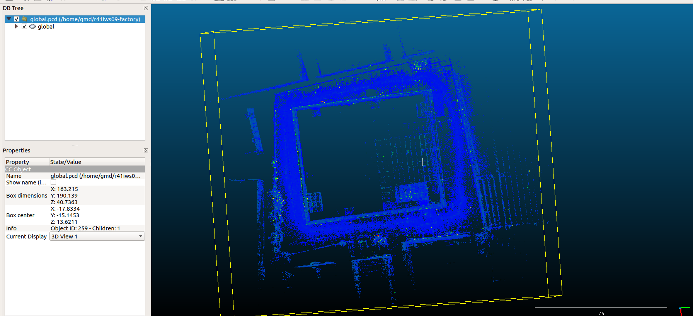

# 1. 3D建图
```
# 默认存放在/home/$user/rcs/maps
ros2 launch lightning r41_online_slam.launch.py

# 或显式指定 ros参数优先级 > yaml 参数优先级
ros2 launch lightning r41_online_slam.launch.py map_root:=/data/maps

```
## 1.1 保存3D地图和2d栅格地图
默认保存的目录为~/rcs/maps , 地图名称为传入的map_id
```
ros2 service call /lightning/save_map lightning/srv/SaveMap "{map_id: r41iws0904}"

```


# 2. 建图效果


# 3. 定位

```
# 显式指定 ros参数优先级 > yaml 参数优先级
ros2 launch lightning r41_online_loc.launch.py map_path:=/home/gmd/rcs/maps/factory_0917
```
# 依赖
apt install libspdlog-dev