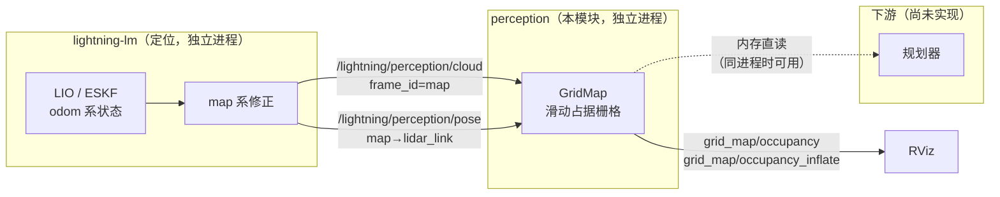
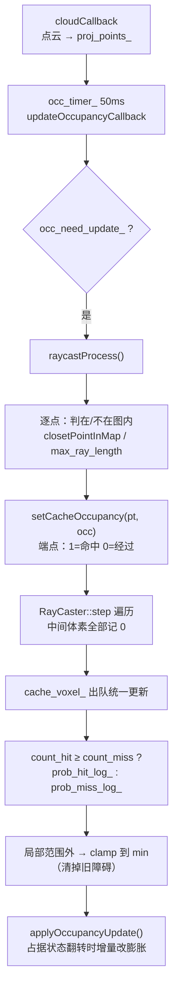

# 感知模块：GridMap 局部占据栅格

本文说明 `src/pnc/perception` 这个独立感知包的原理、接口、参数与已知坑。

- 代码来源：SCAN-Planner-Ros2 的 `plan_env`（ZJU-FAST-Lab）
- 抽取位置：`src/pnc/perception/`（**包名仍为 `plan_env`**，include 路径 `plan_env/...` 不变）
- 原位置 `src/pnc/SCAN-Planner-Ros2/src/planner/plan_env/` 已加 `COLCON_IGNORE`，源码保留作参考
- `grid_map.cpp` / `raycast.cpp` **零改动**，只新增了 `perception_node.cpp`（入口）、配置和 launch

抽取的动机：规划算法还没写，需要先把感知单独跑起来验证。

---

## 1. 系统结构与数据流



感知与定位是**两个独立进程**，只通过 ROS 话题耦合。这样在没有规划器的情况下也能单独验证感知。

---

## 2. 输入接口契约

GridMap 需要**两个**输入，缺一不可。

| 上游话题 | 类型 | 坐标系 | 下游 GridMap 参数 | GridMap 内部订阅名 |
|---|---|---|---|---|
| `/lightning/perception/cloud` | `sensor_msgs/PointCloud2` | `map` | `cloud_is_world: true` | `cloud` |
| `/lightning/perception/pose` | `nav_msgs/Odometry` | `map` → `lidar_link` | `need_extrinsic: false` | `sensor_pose` |

`grid_map.cpp` 里订阅名是**硬编码的相对名**（`"cloud"` / `"sensor_pose"`），由 launch remap 注入，所以双方代码都不用改：

```python
remappings=[('cloud', '/lightning/perception/cloud'),
            ('sensor_pose', '/lightning/perception/pose')]
```

### 2.1 为什么是两个话题而不是一个

GridMap 用 `sensor_pose` 的 `Odometry.pose` 当作**射线原点**（`ray_pos_`），用 `cloud` 当作**射线端点**。而且它有硬性门控——**没收到 pose 之前会丢弃所有点云**：

```cpp
// grid_map.cpp:877  cloudCallback
if (!md_.has_ray_pose_)
{
  RCLCPP_WARN_THROTTLE(node_->get_logger(), *node_->get_clock(), 1000,
                       "[GridMap] no sensor_pose received for lidar cloud update");
  return;
}
```

lightning 原有的 `/lightning/current_scan` 是 **odom 系**，不能直接用；`/lightning/nav_state` 虽然是 map 系但是自定义消息类型（`lightning/msg/NavState`），GridMap 消费不了。所以在 lightning 侧新加了这两个话题。

### 2.2 坐标系是怎么自洽的

lightning 侧（`loc_system.cc:419-462`）：

```cpp
const SE3 T_map_odom  = T_map_base * T_odom_base.inverse();          // map→odom
const SE3 T_map_lidar = T_map_base * T_base_imu_ * T_imu_lidar_;     // map→lidar

// 点云：GetScanDownWorld() 是 ESKF(odom) 世界系 → 搬到 map
pcl::transformPointCloud(*scan_world, *scan_map, T_map_odom.matrix().cast<float>());
```

- **点云**发 `map` 系 → 配 `cloud_is_world: true`，GridMap 直接把坐标当世界系用
- **位姿**发 `map → lidar_link` → 配 `need_extrinsic: false`，GridMap 直接把 `pose` 当射线原点

两者用同一个 `T_map_*`、同一帧 stamp、成对发布，所以下游不需要再做任何换算。

### 2.3 外参折算放在哪一侧（设计取舍）

GridMap 支持另一种用法：发 `map → base_link`，然后在 GridMap 里配 `need_extrinsic: true` + `lidar_extrinsic_ = T_base_lidar`：

$$\mathbf{p}_{ray} = \mathbf{p}_{published} + R_{published}\,\mathbf{t}_{ext}$$

两种方案数学上等价（`grid_map.cpp:849-855`）。**这里选了前者**，因为在 lightning 侧折算外参可以：

- 下游零外参配置，杜绝配错
- `extrinsic_base_imu_` 在 R41 上是 `[0.26, 0, 0]` + `Rx(150°)`，配错时 raycast 起点会静默偏 0.26 m，**不会有任何报错**

代价是感知包不能脱离 lightning 复用（如果以后换个只发 body pose 的里程计源，需要改回后者）。

---

## 3. 算法原理

### 3.1 数据结构

| 成员 | 类型 | 作用 |
|---|---|---|
| `occupancy_buffer_` | `vector<double>` | 每个体素的**对数几率（log-odds）**占据概率 |
| `occupancy_buffer_inflate_` | `vector<char>` | 膨胀后的占据标志（`isKnownOccupied` 查这个） |
| `occupancy_buffer_inflate_cnt_` | `vector<int>` | 膨胀**引用计数**，支持增量增删 |
| `count_hit_` / `count_hit_and_miss_` | `vector<short>` | 单帧内每个体素被命中的次数 |
| `flag_traverse_` / `flag_rayend_` | `vector<char>` | 记录"本帧已处理"的 `raycast_num_` 戳，避免重复射线 |
| `cache_voxel_` | `queue<Vector3i>` | 本帧触碰到的体素队列，行末统一更新 |

**索引是环形哈希**，不搬数据：

```cpp
inline int GridMap::getLocalIndex(int id, int dim) const {
  int local_id = id % mp_.map_voxel_num_(dim);
  if (local_id < 0) local_id += mp_.map_voxel_num_(dim);
  return local_id;
}
```

全局体素坐标 → `toAddress()` 取模落到固定大小的 buffer；地图滑动时只需改 `map_origin_idx_`，**不用移动任何数据**。

### 3.2 概率模型（log-odds）

$$\text{logit}(p) = \ln\frac{p}{1-p}$$

| 参数 | 值 | 含义 |
|---|---|---|
| `p_hit` | 0.85 | 命中一次的概率 → `prob_hit_log_ = 1.7346` |
| `p_miss` | 0.30 | 未命中一次的概率 → `prob_miss_log_ = -0.8473` |
| `p_min` | 0.12 | 下界 → `clamp_min_log_ = -1.9924` |
| `p_max` | 0.98 | 上界 → `clamp_max_log_ = 3.8918` |
| `p_occ` | 0.80 | 判定占据的阈值 → `min_occupancy_log_ = 1.3863` |

更新公式（`applyOccupancyUpdate`）：

$$b_{new} = \mathrm{clamp}\left(b_{old} + \Delta,\ b_{min},\ b_{max}\right)$$

**未知区域**用 `b = clamp_min_log_ - 0.01` 初始化（`unknown_flag_ = 0.01`），比"已知空闲"（恰好等于 `clamp_min_log_`）**低一点点**，从而能区分：

```cpp
inline bool GridMap::isUnknown(const Eigen::Vector3i& id) {
  Eigen::Vector3i id1 = id;
  boundIndex(id1);
  return md_.occupancy_buffer_[toAddress(id1)] < mp_.clamp_min_log_ - 1e-3;
}
```

### 3.3 单帧更新流程（`raycastProcess`）



关键步骤说明：

1. **局部范围过滤**（`cloudCallback`）：只处理 `|Δ| ≤ local_update_range` 或者在 `max_ray_length` 内的点。
2. **端点判定**：距离 > `max_ray_length` 的点被截断并按"未命中"处理，避免把远处墙面当成障碍。
3. **射线遍历**：用 `raycast.h` 的 3D Bresenham 从传感器到端点走一遍，途经体素全部记"未命中"。`flag_traverse_` / `flag_rayend_` 用 `raycast_num_` 打戳，保证同一帧内每个体素只走一次。
4. **批处理**：本帧累计的命中/未命中次数决定净更新方向 —— 命中数 ≥ 未命中数就加 `prob_hit_log_`，否则加 `prob_miss_log_`。这比逐点更新快很多。
5. **局部范围外的体素直接 clamp 到最小**：机器人在局部窗口里看不到的历史障碍会被清除，防止残留。
6. **膨胀增量维护**：只有 `occupancy_buffer_` 跨越 `min_occupancy_log_` 时才 `updateInflation(±1)`，避免每帧全图重算。

### 3.4 滑动地图

```cpp
void GridMap::updateSlidingMap(const Eigen::Vector3d& center)
{
  if (!mp_.map_sliding_en_) return;
  Eigen::Vector3i new_origin_idx;
  posToIndex(center, new_origin_idx);
  const Eigen::Vector3i shift_num = new_origin_idx - mp_.map_origin_idx_;
  if (shift_num.cwiseAbs().maxCoeff() < mp_.map_sliding_thresh_vox_) return;
  ...
}
```

- 移动阈值 `map_sliding_thresh_vox_ = ceil(map_sliding_thresh / resolution)` 个体素，避免抖动
- 平移时用环形索引 `toAddressLocal` 逐层清空被"卷出"的一侧
- 位移超过整张地图尺寸 → `resetAllMapData()` 整图重置

**重要：中心用的是 `ray_pos_`（传感器位置）**，不是 `body_pose`。

```cpp
// sensorPoseCallback 末尾
md_.ray_pos_ = ray_pos;
md_.ray_q_ = ray_q;
md_.has_ray_pose_ = true;
updateSlidingMap(md_.ray_pos_);     // ← 用传感器位置
```

`body_pose` 只用于广播 `sliding_map` TF 帧（`publishSlidingMapFrame`），所以**本模块不订阅它也不影响栅格正确性**。

### 3.5 障碍膨胀

在 `rebuildInflationOffsets()` 里预计算以原点为中心的一组体素偏移：

```cpp
for (int x = -inf_step_xy; x <= inf_step_xy; ++x)
  for (int y = -inf_step_xy; y <= inf_step_xy; ++y) {
    Eigen::Vector2d offset_xy(x * resolution, y * resolution);
    if (offset_xy.norm() >= double_radius) continue;   // 圆柱体投影
    for (int z = -inf_step_z_down; z <= inf_step_z_up; ++z)
      md_.inflate_offsets_.push_back(Eigen::Vector3i(x, y, z));
  }
```

- **水平方向**是半径 `double_cylinder_radius` 的**圆柱**（不是立方体）
- **垂直方向**上下不对称，由 `obstacles_inflation_z_up` / `_z_down` 控制
- 用 `occupancy_buffer_inflate_cnt_` 引用计数，多个障碍重叠时不会重复计数

注意 `double_cylinder_offset` **不参与这里的膨胀**，它用在查询侧（`grid_map.h:371`）：把机器人本体建模为沿朝向前后偏移的两个圆，任一圆落在膨胀体内即判定碰撞。

```cpp
inline int GridMap::getInflateOccupancy(Eigen::Vector3d pos, double yaw) {
  Eigen::Vector3d heading(std::cos(yaw), std::sin(yaw), 0.0);
  Eigen::Vector3d front = pos + mp_.double_cylinder_offset_ * heading;
  Eigen::Vector3d rear  = pos - mp_.double_cylinder_offset_ * heading;
  int front_occ = getInflateOccupancyFromBuffer(front, md_.occupancy_buffer_inflate_);
  if (front_occ != 0) return front_occ;
  return getInflateOccupancyFromBuffer(rear, md_.occupancy_buffer_inflate_);
}
```

感知验证阶段用不到它，将来接规划器时才会用到。

---

## 4. 参数说明

`config/perception.yaml`，节点名 `perception_node`。

### 4.1 接入 lightning 的关键项

| 参数 | 值 | 说明 |
|---|---|---|
| `grid_map.frame_id` | `map` | 输出点云的 `header.frame_id`，也是滑动地图 TF 的父帧 |
| `grid_map.sensor_type` | `lidar` | 走 lidar 分支（另一分支是 depth 相机） |
| `grid_map.cloud_is_world` | `true` | 点云坐标直接当世界系 |
| `grid_map.need_extrinsic` | `false` | 不再叠加 `lidar_extrinsic_` |

> ⚠️ 后两个参数配错**不会报错**，只会让栅格静默偏掉。`perception_node.cpp` 启动时会做契约自检并打 `ERROR`。

### 4.2 地图几何

| 参数 | 值 | 内存影响 |
|---|---|---|
| `grid_map.resolution` | 0.05 | 体素数 = size / res³ |
| `grid_map.sliding_map_size_x/y/z` | 10 / 10 / **10** | 10×10×10 → **800 万体素** |
| `grid_map.local_update_range_x/y/z` | 5 / 5 / 2.5 | 传感器上下各 2.5 m 内才写占据 |
| `grid_map.map_sliding_en` | true | |
| `grid_map.map_sliding_thresh` | 0.2 | 位移超过 0.2 m 才滑动 |

`local_update_range` 必须 ≤ `size/2`，否则局部窗口会被地图边界截断。

### 4.3 可视化

| 参数 | 值 | 说明 |
|---|---|---|
| `grid_map.vis_height` | **2.0** | **只显示传感器上方 2 m 以内的体素**（详见第 6 节） |
| `grid_map.ground_height` | 0.0 | 仅作 `map_origin_` 的 z 初值，后续会被滑动地图重新居中 |
| `grid_map.show_occ_time` | false | |

---

## 5. 输出话题

| 话题 | 类型 | QoS | 说明 |
|---|---|---|---|
| `grid_map/occupancy` | PointCloud2 | BEST_EFFORT | 占据栅格（膨胀前） |
| `grid_map/occupancy_inflate` | PointCloud2 | BEST_EFFORT | 占据栅格（膨胀后） |
| `grid_map/unknown` | PointCloud2 | BEST_EFFORT | 未知区域 |
| `grid_map/depth_cloud` | PointCloud2 | BEST_EFFORT | 本帧参与更新的点（即 `proj_points_`，lidar 路径下就是地图范围内的输入点） |
| `grid_map/sensor_pose_extrinsic` | Odometry | Reliable | **实际用于 raycast 的传感器位姿**，可做外参自检 |
| `grid_map/sliding_map_bbox` | Marker | Reliable | 滑动地图外框 |

发布时间由 `vis_timer_`（50 ms）驱动。**没有订阅者时 `publishMap()` 会直接返回**（省 CPU），所以 RViz 必须先把 topic 加上，否则看不到任何输出。

---

## 6. 已知坑

### 6.1 QoS：RViz 默认收不到（最容易踩）

GridMap 的输出用 `rclcpp::SensorDataQoS()` = **BEST_EFFORT**，而 **RViz 的 PointCloud2 显示默认 Reliability = Reliable**，DDS 判定不兼容 → **一条都收不到，且不报任何错**。

实测：

```
[WARN] probe_cloud_RELIABLE: offering incompatible QoS. No messages will be received.
       Last incompatible policy: RELIABILITY

cloud_RELIABLE      收到  0 条
cloud_BEST_EFFORT   收到 50 条
```

**修法**：RViz 显示项 → 展开 **QoS** → **Reliability Policy 改成 Best Effort**。

**不要**为了 RViz 方便把发布端改成 RELIABLE —— RViz 是慢消费者，会反压回发布端。lightning 的 `/lightning/perception/*` 是在**定位回调里**发的，一旦被反压就会拖慢定位，这正是 rslidar_sdk 出现 10 Hz→5 Hz 的同一个机理。

已处理的 RViz 配置：

| 文件 | 说明 |
|---|---|
| `src/slam/lightning-lm/config/showbodypc.rviz` | 已加 3 个 Best Effort 显示项（`.bak` 备份） |
| `src/slam/lightning-lm/config/showglobalmap.rviz` | 同上 |
| `src/pnc/perception/config/perception.rviz` | 感知专用视图 |

用 `rviz2 -d <源码路径>` 启动的话，改完**不用重新 colcon build**。

### 6.2 `vis_height` 会让人误以为感知只有一层

`publishMap()` / `publishMapInflate()` / `publishUnknown()` 三处都有同一段过滤（`grid_map.cpp:961/1002/1115`）：

```cpp
if (md_.has_ray_pose_ && pos(2) > md_.ray_pos_(2) + mp_.vis_height_)
  continue;
```

`ray_pos_` 是**雷达在 map 系的位置**，不是地图原点 —— 所以 `vis_height` 的语义是"传感器上方多少米以内才画"。默认 0.3 时看起来又扁又贴地。

**这只影响给人看的输出点云**，`occupancy_buffer_` 里完整保留了 `local_update_range` 内的全部高度，不影响后续规划。

### 6.3 `GridMap::getVoxelNum()` 声明了但没定义

`grid_map.cpp:1142` 处定义被注释掉了，引用它会**链接失败**。需要体素数时用 `getRegion()` + `getResolution()` 自己算。

### 6.4 内存占用

按体素数分配，800 万体素（10×10×10 @ 0.05 m）约 **160 MB**：

| buffer | 类型 | 8M 体素 |
|---|---|---|
| `occupancy_buffer_` | `double` | 64 MB |
| `occupancy_buffer_inflate_cnt_` | `int` | 32 MB |
| `count_hit_` / `count_hit_and_miss_` | `short`×2 | 32 MB |
| `flag_traverse_` / `flag_rayend_` | `char`×2 | 16 MB |
| `occupancy_buffer_inflate_` | `char` | 8 MB |

如果部署到 RK3588，`sliding_map_size_z` 从 5 改成 10 会让内存直接翻倍，需要注意。

### 6.5 其他

- `body_pose` 可以不订阅，不影响栅格（见 3.4）
- `grid_map/depth_cloud` 的 `header.stamp` 用的是 `node_->now()` 而不是点云自带的时间戳，做时间对齐时要注意
- `showglobalmap.rviz` 里写的 `/lightning/current_scan_cloud` 是**错的话题名**，实际是 `/lightning/current_scan`
- 移动包路径后必须先 `rm -rf build/plan_env install/plan_env`，否则 CMake 报 `source ... does not match the source used to generate cache`

---

## 7. 运行与验证

### 7.1 启动

```bash
# 终端 1：定位（需开启 lightning 配置里的 system.enable_perception_pub）
ros2 launch lightning r41_online_loc.launch.py

# 终端 2：感知
ros2 launch plan_env perception.launch.py

# 终端 3：RViz（用自己的视图）
rviz2 -d ~/r41_ws/src/slam/lightning-lm/config/showbodypc.rviz
```

`perception.launch.py` 的 `rviz` 参数默认 `false`；`rviz:=true` 会启动感知专用的 `perception.rviz`。

可覆盖的参数：

```bash
ros2 launch plan_env perception.launch.py \
    config:=/path/to/perception.yaml \
    cloud_topic:=/lightning/perception/cloud \
    pose_topic:=/lightning/perception/pose
```

### 7.2 验证清单

| 检查项 | 命令 | 期望 |
|---|---|---|
| 上游点云在流动 | `ros2 topic hz /lightning/perception/cloud` | ≈ 10 Hz |
| 上游位姿在流动 | `ros2 topic hz /lightning/perception/pose` | ≈ 10 Hz |
| 感知输出在流动 | `ros2 topic hz /grid_map/occupancy` | ≈ 20 Hz |
| 点云非空 | `ros2 topic echo --once /grid_map/occupancy --field width` | > 0 |
| 坐标系正确 | `ros2 topic echo --once /grid_map/occupancy --field header` | `frame_id: map` |
| 外参自检 | 对比 `grid_map/sensor_pose_extrinsic` 与真实雷达位置 | 一致 |

### 7.3 用 QoS 探针确认话题是否可用

`ros2 topic hz` 和 `ros2 topic echo` 会因 QoS 不匹配而收不到数据，容易误判。用显式指定 QoS 的订阅者验证：

```python
from rclpy.qos import QoSProfile, ReliabilityPolicy, HistoryPolicy
qos = QoSProfile(depth=5, history=HistoryPolicy.KEEP_LAST,
                 reliability=ReliabilityPolicy.BEST_EFFORT)
```

另外注意：`ros2 topic hz` **自己会创建一个订阅者**，所以它会干扰 `get_subscription_count()` 的判断 —— 查订阅数要用 `ros2 topic info`。

---

## 8. 后续工作

- [ ] 规划器接入：读 `occupancy_buffer_inflate_`（内存直读，或另开话题）
- [ ] 感知精度评估：把 `grid_map/occupancy` 与离线建图结果对比
- [ ] RK3588 部署：实测 CPU / 内存占用（参考 `lightning-lm/doc/mapping_threading_refactor.md` 的统计方法）
- [ ] 决定是否与 SCAN-Planner 合流：目前 `plan_manage` / `path_searching` / `bspline_opt` 通过 `find_package(plan_env)` 仍指向本包，写规划算法时可直接复用

---

## 附：文件清单

```
src/pnc/perception/                # 包名 plan_env
├── package.xml                    # 原样 + launch / launch_ros exec_depend
├── CMakeLists.txt                 # 原样 + perception_node 目标 + install config/launch
├── include/plan_env/
│   ├── grid_map.h                 # 原样
│   └── raycast.h                  # 原样
├── src/
│   ├── grid_map.cpp               # 原样，零改动
│   ├── raycast.cpp                # 原样，零改动
│   └── perception_node.cpp        # 新增：入口 + 接口契约自检
├── config/
│   ├── perception.yaml            # 新增：由 planner.yaml 的 grid_map 段派生
│   └── perception.rviz            # 新增：QoS 已修正的感知专用视图
└── launch/
    └── perception.launch.py       # 新增：remap cloud / sensor_pose
```

lightning 侧改动（`src/slam/lightning-lm/`）：

| 文件 | 改动 |
|---|---|
| `src/core/system/loc_system.h` | 新增 `perception_cloud_pub_` / `perception_pose_pub_` |
| `src/core/system/loc_system.cc` | 新增发布逻辑（`PublishDebugAndRviz` 内） + `#include <pcl/common/transforms.h>` |
| `config/r41_rk_slam.yaml` | 新增 `system.enable_perception_pub: true` |
