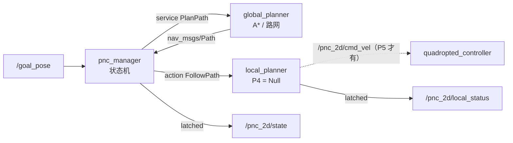

# pnc_2d —— 二维规划（全局规划 + 路网 + 区域层）

可插拔的 2D 全局规划包：**ROS-free 规划库 + 薄 ROS 节点**。
当前进度与后续阶段见 `doc/pnc2d_restructure_plan.md`（P1 目录分层 ✅、P2 路网 ✅）。
架构与算法细节见 `doc/pnc2d_dev_plan.md`，MPC/NMPC 原理见 `doc/mpc_nmpc_guide.md`。

```
include/pnc_2d/core/     types / cost_map_2d / clearance_field / footprint_collision
                         route_graph（路网）/ map_zones（禁行·限速区）/ global_planner（抽象基类）/ factory
include/pnc_2d/global/   astar_planner（自由空间 A*）/ route_network_planner（沿路网走）
src/nodes/               global_planner_node（ROS 薄壳：只做 IO/参数/frame 校验）
scripts/                 MPC/NMPC 离线原型（本包的算法验证工具）
test/                    无 ROS 单测（A* / 路网 / 区域层，共 32 个用例）
```

> **画线器在 `map_server`**：`src/map_server/scripts/route_editor.py`
> （`routes.yaml` 是站点资产，加载/校验/发布/编辑都归 map_server；本包只消费）。
> 操作手册见 `src/map_server/README.md`。

---

## 1. 快速开始

```bash
# 0) 每个新终端都要先设 DDS 环境（本仓库约定）
export CYCLONEDDS_URI=/home/gmd/r41_ws/src/bringup/cyclonedds.xml \
       ROS_DOMAIN_ID=30 RMW_IMPLEMENTATION=rmw_cyclonedds_cpp
cd ~/r41_ws && colcon build --packages-select pnc_2d --cmake-args -DCMAKE_BUILD_TYPE=Release
source install/setup.bash

# 1) 自由空间 A*（默认）
ros2 launch pnc_2d global_planner.launch.py

# 2) 沿路网走
ros2 launch pnc_2d global_planner.launch.py planner_type:=route_network

# 3) ★ 三节点一键起（P4 起的推荐入口：manager + global + local）
ros2 launch pnc_2d pnc_2d.launch.py
ros2 launch pnc_2d pnc_2d.launch.py planner_type:=route_network
```

```bash
# 4) 单测（不需要 ROS 环境）
colcon test --packages-select pnc_2d --event-handlers console_direct+
```

**节点拓扑（P4）**



| 节点 | 职责 | 不做什么 |
|---|---|---|
| `pnc_manager_node` | 任务状态机（`Idle→Planning→Following→GoalReached`，异常 → `Recovering`/`Failed`）；订 `/goal_pose`，调全局 service、调局部 action | **不发 cmd_vel**（不控车），不做几何计算 |
| `global_planner_node` | 几何规划（A* / 路网）；对外提供 `~/plan_path` service | 不跟路径、不管任务生命周期 |
| `local_planner_node` | 跟踪路径 → 出速度；`/pnc_2d/cmd_vel` 的**唯一 owner** | P4 只有空实现，**不发任何速度** |

⚠ **`/goal_pose` 由 manager 独占**：三节点 launch 会把全局节点的话题入口重映射到
`/pnc_2d/manual_goal`（调试时仍可用 `ros2 topic pub` 直接指挥全局节点）。否则点一次目标会**规划两次**
（一次直接发路径、一次经状态机），出现"路径被清掉又冒出来"这种难查的现象。

**状态机（`sm/`，纯库 + ROS 薄壳）**

状态转移表全在 `src/sm/manager_sm.cpp` 的一张表里，单测**穷举 6 状态 × 11 事件 = 66 组**
（每条要么有条规则、要么明确拒绝并给原因——静默忽略事件是状态机最难查的问题）。

| 关键语义 | 说明 |
|---|---|
| `Following --Blocked/Stuck--> Recovering` | 入口先**停车**，再跑恢复行为 |
| 恢复次数上限 `sm.max_recoveries`（默认 2） | **恢复成功也不清零**——这就是"挡住→恢复→再挡→再恢复…"无限循环的防线 |
| `Recovering --RecoveryFail-->` | 未超限则再试一次，超限 → `Failed` |
| `Following --OdomJump--> Planning` | 定位跳变 ⇒ 基于旧位姿的路径不可信 ⇒ 重规划 |
| `Following --GoalReceived--> Planning` | 新目标打断旧任务（并复位恢复计数） |
| 卡住判据 | 用**自车位移**判（不依赖局部反馈）：`stuck_timeout`（默认 10 s）内位移 < `stuck_min_progress`（0.20 m）→ `Stuck` |
| 跳变冷却 `sm.odom_jump_cooldown`（2 s） | 跳变可能**连续**发生（两条定位源同时喂、重定位恢复期）→ 没冷却就是重规划风暴（实测踩过） |
| `Cancel` | 从**任何**状态都能回 `Idle` |

```bash
ros2 topic echo /pnc_2d/state                 # 状态机状态（latched）
ros2 service call /pnc_manager/cancel std_srvs/srv/Trigger
ros2 service call /local_planner/stop std_srvs/srv/Trigger
```

**P4 的局部规划 = 空实现（重要）**

`local.type: none` 时 `NullLocalPlanner::producesCmdVel() == false`：
节点**连 cmd_vel 发布者都不创建**（否则 `ros2 topic info` 会看到一个恒零的发布端，
而恒零会被下游误读成"停车指令"而**不是**"我不管"）。所以 `local_type:=none` 起栈后
**不要期待车会动**。

**MPC（P5.1 库层 + P5.3 节点接线已完成，可用）**

```bash
./build/pnc_2d/test_mpc_local_planner    # 33 用例：跟踪/走廊/避障/耗时/到点朝向/自由顺滑
./build/pnc_2d/test_mpc_qp_reference     #  8 用例：QP 矩阵/KKT 一致性
```

| 指标 | 实测（Go2 参数） |
|---|---|
| 直线跟踪 | 稳态 RMSE **0.0002 m**（含 0.30 m 初始偏差的全局 RMSE 0.0484 m） |
| 圆弧跟踪 | 径向偏差 RMSE **0.0099 m**（R=3 m） |
| **走廊硬约束** | 1000 组扰动：**出解 1000 / 越界 0**，预测横向最大 0.337 m（限 0.50） |
| 求解耗时 | **P50 0.13 ms / P99 2.1 ms**（94 变量 / 182 约束 / 25 次迭代） |
| 障碍 | 软代价方向正确；硬下界 0.25 m 实测最小 0.2490 m |
| 端到端 | 空场巡航 max\|v\|=1.0 m/s、闭环前进正常；墙横在路上 → `BLOCKED` |

算法结构参考 **`SLAM-PNC/PNC` 的 `MpcController`**（阿克曼 `(a,δ)` → 差速 `(a,ω)`），
新增走廊硬约束与 ESDF 避障。

```bash
ros2 launch pnc_2d pnc_2d.launch.py planner_type:=route_network local_type:=mpc
```

接线要点（详见 `doc/mpc_local_planner_plan.md` §5.3）：

- 局部节点订阅 `grid_map/occupancy_inflate_2d`（硬判定）与 `grid_map/esdf_2d`
  （避障软代价）。**感知的 ESDF 只在有订阅者时才计算**，所以这两个订阅就是"让感知
  开算"的开关。
- 点云按**字段名**解析（不能硬编码偏移：PCL 的 `PointXYZI` 实测 `intensity` 在
  偏移 **16**、`point_step=32**）。
- **空点云 = 这一片很开阔**（感知只发 `0<d≤3 m` 的格），不是"拿不到距离场"；
  当成后者会让车在空旷处以 0.3 m/s 爬行。
- 距离场 `local.esdf_timeout`（0.3 s）过期 → 降级限速，**不用过期场做硬约束**。
- route 模式下全局规划把走廊宽度通过 `PlanPath.srv` → `FollowPath.action` 透传给
  局部（**path 即中心线**，允许横向偏离 ±半宽）；没接通时"贴线走"会静默失效。
  ★ **逐点生效**：hybrid 路径 = [自由入口段, 路网段, 自由出口段]，走廊只对路网段
  生效（入口/出口段填 -1 = 无走廊），且局部只在"车已回到走廊里"时才启用硬约束
  —— 否则车会在车道外几厘米处被硬约束判死（实测横向偏差 ≥0.055 m 就一步不动）。
  语义：`>0` 允许偏离、`==0` **严格贴线**、`<0` **无走廊**。


**到点朝向与“顺滑优先”（2026-09-23，用户实测驱动）**

两个都是**行为**问题，不是接线问题，但都定位到了机制层：

1. **到点要保证朝向**。原来的到点判定只看位置（目标天生带 yaw：面向充电桩/通道口），
   现在：位置到了而朝向还差 > `goal_yaw_tolerance_deg` ⇒ 原地对正（v=0），进容差才算到达。
   - 容差经 `LocalPlanner::goalYawTolerance()` 给节点（**单一来源**，别在节点侧再配一份）。
   - 对正要**打破底盘低速死区**：`ω = gain·e` 在 e 小时指令小到车不动 ⇒
     永远收敛不了。所以有 `align_w_min` 下限（Go2 标定 0.20 rad/s，放在 `go2_run.yaml`）。
   - `goal_yaw_align_timeout` 兜底：转不出来就报失败并说清还差几度、该查哪个参数。
   - 阿克曼底盘不能原地转 ⇒ 这种底盘把 `goal_yaw_tolerance_deg` 置 0。
2. **自由模式顺滑优先**。自由段参考只是“大致往那儿走”的折线，不该像走廊那样严格贴线
   （否则几 cm/几度偏差就被当成大误差追，`ω` 顶满来回打 ⇒ 摇摇摆摆）。
   自由模式单独表达代价：`free_lat_scale`/`free_yaw_scale`（权重缩放）、
   `free_lat_deadband`（横向死区，带内不纠）、`free_w_max`（ω 上限）；
   **走廊模式完全不受影响**（严格贴线照旧）。库层默认全部中立 = 严格，产品策略写在
   `config/local_mpc.yaml`。

⚠ **跨层判据必须留正余量**（2026-09-23 实测死锁）：地图/区域的"膨胀层"只能加一次。
全局图负责多留几 cm（真障碍 `map_server.inflate`、禁行区 `zones.inflate`），
**局部按原几何判**（`topics.local_map` 用未膨胀图 + `zones.local_inflate: 0`）。
两边配成同一个值（例如局部也按 0.05 融一遍区域）会让判据**完全相等 = 零余量**，
±半格（2.5 cm）的离散化就足以造成"全局给路、局部说在障碍里" ⇒ BLOCKED ⇒
恢复重规划又因起点余量重叠失败 ⇒ 任务永久 FAILED。局部节点启动时若发现两边相等会 WARN。

⚠ **“让路径离障碍远一点”要用偏好，不要用硬膨胀**（2026-09-23 用户定的规则：
机体 0.40 m + **左右各 10 cm** = 最窄可通 **0.60 m**）：
- 硬判据已经刚好用满这个预算（半宽 0.20 + `footprint.safe_margin` 0.05 +
  `map_server.inflate` 0.05 = 0.30 = 各 10 cm）⇒ **硬层再加就会把 0.60 m 通道直接判死**；
- 所以“走远一点”改用 **`planner.clearance_prefer_dist` / `planner.clearance_cost_weight`**
  （全局 A* 的净距偏好，直接用精确距离场算，与地图里有没有“软格”无关）：
  0.4×0.4 柱子实测 —— 关：贴角过 **0.275 m**；开：**1.74 m**、路径只长 **0.06 m**；
  0.60 m 窄通道仍可通（偏好是软的）。
- ⚠ 测这个行为时几何要选对：**窄而浅的走廊测不出偏好** —— 车长 0.70 在离墙 0.30 时
  根本转不了身（任何朝向变化都把 y 向尺度抬到 0.46），栅格 A* 的节点朝向 = 运动方向
  ⇒ 只能直着走；要留“能绕”的空间（柱子）。同理，指标不能把首末点（车自己/目标）
  算进去，否则会把差异掩盖掉。

**参数与片段（`config/` + `launch/`）**

launch 会把**三份 yaml 按顺序合并**，**后面的覆盖前面的**：

| 顺序 | 文件 | 内容 |
|---|---|---|
| 1 | `config/pnc_2d.yaml` | **总入口**：三个节点的公共参数——话题名、坐标系、代价语义（`common.*`）、车体轮廓（`footprint.*`）、路径有效期（`clear.*`）、局部控制参数（`local.*`）、区域在局部侧的额外膨胀（`zones.local_inflate`，**默认 0**）、状态机参数（`sm.*`），以及各类型的**默认值** |
| 2 | `config/global_<算法>.yaml` | **全局算法片段**：自述 `planner.type` + 该算法私有参数（`astar` → `global_astar.yaml`，`route_network` → `route_network.yaml`） |
| 3 | `config/local_<局部>.yaml` | **局部算法片段**：自述 `local.type`（`local_null.yaml` / `local_mpc.yaml`） |
| 4 | `extra_config:=<路径>` | 追加的自定义片段，优先级最高 |
| 5 | `planner_type` / `local_type` | launch 参数，最终强制覆盖类型 |

```bash
ros2 launch pnc_2d pnc_2d.launch.py planner_type:=route_network
ros2 launch pnc_2d pnc_2d.launch.py ns:=/e2e extra_config:=/tmp/isolate.yaml
```

**三条硬规则（都实测过，踩过坑）**

1. **段落必须写 `/**:`，不能写节点名**。节点 FQN 带命名空间时（`ns:=/e2e` → `/e2e/global_planner`），
   按节点名写的段落**完全不匹配**，整份文件的参数**静默失效**（只有 `/**` 或 `/e2e/global_planner` 才匹配）。
   实测：同一文件在根命名空间下生效 4 项，加 `ns` 后只剩 `/**` 那 2 项。
   ⚠ 一个文件里只能有**一个** `/**` 段：YAML 顶层重复键会互相覆盖（只留最后一个）。
2. **外部的绝对、自己的相对**。别人的话题（`/global_map/occupancy`、`/lightning/perception/pose`、
   `/goal_pose`）写绝对名；本包自己的（`pnc_2d/state`、`pnc_2d/cmd_vel`、IPC 服务名）写**相对**名。
   根命名空间下两者完全等价，但加上 `ns` 就能整套搬走——仿真/实车双栈共存、E2E 隔离都靠它。
3. **`install/` 只拷不删**：重命名/删除 `config/` 下的文件后，`install/pnc_2d/share/pnc_2d/config/`
   里的旧副本会留下来误导排查——先看一眼那里。

改错类型不会静默生效：`planner_type:=xxx` 找不到对应片段时 launch **直接报错并列出可用片段**。
⚠ 新增算法时要**同时**加 `config/global_<类型>.yaml` 并在 launch 的映射表里登记（局部同理）。

前置输入（本节点不做 TF 变换，三者必须已在同一坐标系）：

| 话题 | 类型 | 来源 |
|---|---|---|
| `/global_map/occupancy` | `nav_msgs/OccupancyGrid`（latched） | `map_server` |
| `/lightning/perception/pose` | `nav_msgs/Odometry`（**best_effort**！） | `lightning` 定位 |
| `/goal_pose` | `geometry_msgs/PoseStamped` | RViz "2D Goal Pose" |

输出：

| 话题 | 类型 | 说明 |
|---|---|---|
| `/pnc_2d/global_path` | `nav_msgs/Path`（**latched**） | 当前路径。**没有有效路径时发空 Path**（见下"路径有效期"） |
| `/pnc_2d/plan_markers` | `MarkerArray`（latched） | 起终点箭头 + 起点车体轮廓 + **当前通路高亮**（路网模式） |
| `/pnc_2d/global_status` | `pnc_2d/PlannerStatus`（latched） | 每次规划的状态（`status`/`status_name`/`message` + 点数/长度/耗时/扩展节点）——**给状态机与上层错误上报用** |
| `/global_planner/clear_path` | `std_srvs/Trigger` | 显式清空当前路径与规划标记 |

**路径有效期（latched 话题的三条规则）**

1. **失败 → 自动清空**：发一条空 `Path`（否则 RViz / 上层会继续显示上一条已过期的成功路径，把"规划失败"误当成"路径有效"）；
2. **到达目标 → 自动清空（默认关）**：`clear.auto_on_goal_reached: false`、容差 `clear.goal_tolerance: 0.30` m。"任务是否结束"由状态机判断（P4），规划器不替它决定；打开后会在车进入容差内时清空，且只在"规划时车离目标超过容差"时生效（避免目标就在车边时刚发就清）；
3. **重启节点 → 启动即清场**：新进程启动时先发一次空路径 + 对残留的 `route_active` 高亮发 `DELETE`（id 0..63）。因为**旧进程发过几条高亮新进程并不知道**，不清就会出现"杀掉路网节点、换成 A* 重启，RViz 里路网路径还挂着"。
   ⚠ 这个清场会**重复发几拍**（0.5 s × 6，一旦有规划结果就停）：RViz 的 MarkerArray 订阅是 **VOLATILE**，只收"匹配完成之后"发布的消息，启动瞬间只发一次会早于 DDS discovery 被丢掉。

> **换算法不用重启（支持热切换）**：`planner.type` 可以在运行时改，节点会真的重建规划器；
> 详见下面"运行时热切换与热重载"。

**运行时热切换与热重载**

| 接口 | 用法 | 说明 |
|---|---|---|
| 参数 | `ros2 param set /global_planner planner.type route_network` | 立即重建规划器；**失败会拒绝这次参数修改**（`successful=false` + 原因），保证"参数值 = 实际生效值" |
| 服务 | `ros2 service call /global_planner/switch_planner pnc_2d/srv/SwitchPlanner "{type: 'astar'}"` | 显式命令语义，返回 `success + message`；P4 状态机切模式用它 |
| 服务 | `ros2 service call /global_planner/reload_params std_srvs/srv/Trigger` | 用**当前参数**重新装载**同类**算法：改了 `footprint.*` / `path_prune_*` / `route_network.routes_file` 不用重启 |
| 服务 | `ros2 service call /global_planner/clear_path std_srvs/srv/Trigger` | 清空当前路径与规划标记 |

热切换的语义（实测见下）：

- 新算法按**当前**参数值 configure（yaml 值 + 运行时 `param set` 过的值都算）；
- 若已收到地图，立刻把它交给新算法 → **路网模式会马上重跑可行性校验**并打印"过不去的通道"；
- 切换/重载成功后**清空当前路径与规划标记**（旧算法算出的路径对新算法无意义）；
- 构建或 configure 失败时**保留旧算法**，不会把节点搞成"没规划器"状态；
- 线程前提：节点用默认**单线程** executor，goal / 参数 / 服务回调互相串行，不存在"规划到一半换掉 planner_"。若改用 `MultiThreadedExecutor`，`switchPlanner()` 与 `planner_` 的访问都要加锁（代码里有注释标记）。

实测（隔离实例，`go2_sim_factory`）：

```
[1] astar         → 路径与通道最大偏离 5.00 m（直连，不贴路网）
[2] param set planner.type=route_network → 接受；切换瞬间路径被清空
[3] 同一目标重规划 → 中间点与通道偏离 < 0.1 m（贴线走），起点离网那段仍偏离 5 m（hybrid 补段）
[4] param set planner.type=nonsense → 被拒绝：热切换失败：未知 planner.type='nonsense'
    （可用：astar, route_network）（仍在使用 route_network）；参数值确认未变
[5] 服务 switch_planner：astar → success；nonsense → success=false + 原因
[6] param set footprint.length=0.99 + reload_params → 日志 footprint 开: 0.99x0.40（外接半径 0.600）
```

---

## 2. 路网与区域层

### 2.1 文件位置

```text
~/rcs/maps/<站点>/
├── map.yaml + map.pgm        # 2D 栅格（map_server 发布）
├── routes.yaml               # ★路网 + 区域层（本文件由画线器生成，可选）
└── global.pcd                # 3D 点云（未实现）
```

**可选资产**：站点没有 `routes.yaml` 时，`map_server` 只打一句 INFO，不报错；
路网模式下规划器会返回 `NOT_INITIALIZED` 并说明原因。

### 2.2 格式

```yaml
frame_id: map
nodes:
  - {name: P1, x: 6.550, y: -4.920, type: waypoint}
  - {name: C1, x: 8.200, y: 2.050,  type: charge}
edges:
  - {from: P1, to: P2, speed_limit: 1.00, corridor_width: 0.50,
     polyline: [[6.550,-4.920], [13.850,-4.920], [21.500,-5.670]]}
zones:                                            # 区域层（可选）
  - {name: Z1, type: forbidden,   polygon: [[10,-6], [12,-6], [12,-4], [10,-4]]}
  - {name: Z2, type: speed_limit, value: 0.30, polygon: [[2,1], [4,1], [4,3], [2,3]]}
```

| 字段 | 默认 | 说明 |
|---|---|---|
| `nodes[].type` | `waypoint` | `waypoint` / `station` / `charge` / `park`（只影响 RViz 配色与标签；语义站点，目标仍按坐标给） |
| `edges[].one_way` | **`false`（双向）** | 本仓库路网**默认全部双向**，没有单向通道；需要单向才写 `one_way: true` |
| `edges[].speed_limit` | `1.0` | 参与路由代价（代价 = 弧长 / speed_limit） |
| `edges[].corridor_width` | `0.6` | 允许横向偏离的半宽 [m]；**`0.0` = 严格贴线，遇障即停**（P5 局部规划消费） |
| `edges[].polyline` | 必填 | 折线，≥2 点；中间点用来画弧线/绕障。**首尾会自动吸附到节点坐标** |
| `zones[].type` | `forbidden` | `forbidden`（禁行）/ `speed_limit`（限速） |

> ⚠ 路网模式下**禁止视线剪枝**（通道是人画的，切角会破坏原设计的绕行），代码强制只做共线合并。

**可行性是"按边"判的：一条通道 = 一个不可分割的整体**

| 行为 | 说明 |
|---|---|
| 判据 | 车体（含 margin）沿该边**每一段折线**扫掠，**任一段**过不去 → 整条边 `feasible=false` |
| 后果 | `reject_infeasible: true`（默认）时这条边**不参与路由**，其余边照走 → 所以"拆成多段"很关键：一段被挡不会让整个路网报废 |
| 诊断 | 失败时**点名**：`路网内连不通：唯一通路必须经过车体过不去的通道 B->C`；成功但绕开了也会提示：`⚠ 路网里有车体过不去的通道（已绕开：B->C）` |
| 可视化 | RViz 里不可行的通道画成**红色**（`map_server`），走过的通道黄色高亮（`global_planner`） |
| 怎么拆 | 画线器里按 **`v`**：把最后一条通道在每个点处切开 |

### 2.3 区域层怎么生效

| 类型 | 生效方式 | 谁遵守 |
|---|---|---|
| `forbidden` 禁行 | `map_server` 按车体**外接圆半径**膨胀后**烧进发布的全局图**（占据数会变大，日志会报告烧了多少格） | **全栈**：全局规划 / 路网路由 / 局部规划(P5) / RViz / 将来 nav2 |
| `speed_limit` 限速 | 不烧入栅格（软约束）：解析 + 可视化 + `ZoneSet::inSpeedZone()` 查询 | 速度规划 / 局部规划（P5） |

禁行区**不是"只给全局规划器"**：局部规划若不知道就会出现"全局绕开了、局部冲进去"，
所以统一在地图层注入，任何订阅这张图的模块自动遵守。开关：`zones.burn_into_map`、`zones.inflate`。

#### 2.3.1 下游到底怎么消费（P5.4 落地，2026-09-23）

区域**不止在** `map_server` 烧图那一处生效 —— 规划侧另有一条 latched 通道：

```text
map_server ──/global_map/zones (ZoneArray, transient_local, 带 inflate)──┬→ global_planner
                                                                        ├→ local_planner
                                                                        └→ pnc_manager
```

⚠ `inflate` 由**消息**携带，消费者必须用它（不能用自己配的值）：它等于 `map_server`
烧全局图时用的那个，两边不一致就会出现"编辑/全局说通得过、局部说过不去"。
（latched 话题 `ros2 topic echo` 读不到，要用 `test/sim/topic_probe.py`。）

| 位置 | 禁行区 | 限速区 |
|---|---|---|
| `global_planner` | 不绕行（等上游报错/人工处理）；起点/终点落在区内时在消息里点名 | **只有"起点与终点都在限速区内"才给任务限速**（整趟都该慢）；只是路过一小段则不设任务限速，交给局部 |
| `local_planner` | ① 每帧把区域按 `inflate` **烧进局部栅格**（footprint 检查判死）② 每帧把区域**并进 ESDF**（`d = max(0, d_poly − inflate)`，区内 = 0）③ 车已在区内 ⇒ 立刻停车报 `BLOCKED` 并**点名区域**（不做绕行） | 每周期按**几何前瞻**压速度帽：前瞻距离 = 从 **`v_max`** 减速所需的距离（不是从当前速度！见下），帽 = 前方最严限速值，出区即摘。`v_max`/减速度都**取算法自报值**（`LocalPlanner::maxSpeed()/brakeAcc()`），不是节点参数 —— 减速度必须与终点剖面同一个量 |
| `pnc_manager` | 把局部/全局的失败原因原样上报（`pnc_2d/state`） | 把任务限速折进 `goal.speed_limit` |

**为什么是"融合"而不是"绕过"**：感知的滑动窗与 ESDF 里**没有任何区域语义**，
不融合的话车会贴着/开进禁行区 —— 今天只有订阅全局图的模块才遵守它。

**限速前瞻为什么必须用 `v_max` 算（踩过）**：前瞻 = $v^2/(2a) + 0.3$，若用*当前*速度，
车越慢前瞻越短、越晚减速，形成自锁（"因为开得慢，所以从不减速"）。实测：车以
0.26 m/s 爬向 0.7 m 外的 0.15 m/s 限速区 ⇒ 前瞻 0.53 m 永远够不到 ⇒ 0.30 m/s 穿区。
用 `v_max=0.42` 算 ⇒ 0.89 m ⇒ 距离 0.7 m 时就触发。同理前瞻**不能从"路点下标"开始**：
自由空间路径只有 2 个点，下标在车走到终点附近前一直是 0，扫描窗口会固定在"路径起点
往后 look 米"，帽戴上就摘不掉（实测：出区 1 m 后仍限 0.15，31 s 爬完全程）。
两处都写成了单测（`MapZones.SpeedLimitAhead*`）。

**验收**：`test/sim/test_zones.py`（自画区域、三段：禁行带挡路 / 挪开后能到 / 限速）
**7/7 通过**，见 `test/sim/README.md`。

**膨胀量怎么定（`zones.inflate`）**

| 取值 | 含义 | 感受 |
|---|---|---|
| `-1`（默认） | 自动 = 车体**外接圆半径** = $\sqrt{(L/2+m)^2+(W/2+m)^2}$；Go2 的 `0.70×0.40 + 0.05` → **0.472 m** | 保守：**点判定**（只看中心格）的消费者也安全，任何朝向都不侵入；代价是每个区域外扩将近半个车身，走廊会被吃掉很多 |
| 显式数值（如 `0.25`） | 手动给一个值；`0.25` = 车体**内切半径** | 宽松：区域的"硬约束"变小。**我们的规划器/画线器本身都做朝向感知的车体扫掠检查**（真障碍仍在图里），所以安全性由 footprint 保证，不会因为膨胀小就撞 |

实测（本仓库 `go2_sim_factory` 的 3 个区域）：`0.472` 让一条贴着柱子的通道判为"过不去"，
改成 `0.25` 后同一条通道通过 —— 膨胀量直接决定路网可用性，**改的时候必须两边一起改**：

```yaml
# map_server 侧
zones.inflate: 0.25
```
```bash
# 画线器侧（同一个值，否则编辑器说"通得过"、map_server 说"过不去"）
.venv/bin/python3 src/map_server/scripts/route_editor.py --zone-inflate 0.25
```

---

## 3. 路网画线器（脚本在 `map_server`）

画线器位于 **`src/map_server/scripts/route_editor.py`** —— `routes.yaml` 与 `zones` 是
站点资产，加载/校验/发布在 `map_server`，编辑工具跟着资产走；本包只负责消费。

```bash
cd ~/r41_ws && .venv/bin/python3 src/map_server/scripts/route_editor.py
# 默认站点 go2_sim_factory；换站点加 --map-dir /home/gmd/rcs/maps/<站点>
# 左键加点 / 右键结束通道；z 进区域模式；s 保存 / q 退出
```

**完整操作手册（按键表、参数、三项自动校验、常见问题）见 `src/map_server/README.md`。**

---

## 4. RViz 显示清单

| 显示项 | 话题 | 说明 |
|---|---|---|
| Map | `/global_map/occupancy` | Durability 建议 `Transient Local`（缺失时会由 map_server 按需补发一次） |
| Path | `/pnc_2d/global_path` | 规划结果 |
| MarkerArray | `global_map/routes` | **全网**（节点/通道/单向箭头）+ **禁行·限速区** ← 由 map_server 发布 |
| MarkerArray | `/pnc_2d/plan_markers` | 起终点箭头、车体轮廓、**当前通路高亮** ← 由规划节点发布 |

---

## 5. 测试

**① 纯算法单测（不需要 ROS 环境，毫秒级）**

```bash
colcon test --packages-select pnc_2d --event-handlers console_direct+
colcon test-result --test-result-base build/pnc_2d     # 期望 0 failures
./build/pnc_2d/test_astar_planner                      # A*：15 用例
./build/pnc_2d/test_route_network                      # 路网：16 用例
./build/pnc_2d/test_map_zones                          # 区域层：10 用例
./build/pnc_2d/test_clearance_field                    # 距离场(EDT)：5 用例
./build/pnc_2d/test_distance_field                     # 局部 ESDF：8 用例
./build/pnc_2d/test_mpc_local_planner                  # MPC：33 用例（含 1000 组走廊验收）
./build/pnc_2d/test_mpc_qp_reference                   # QP 参考/KKT：8 用例
./build/pnc_2d/test_factory                            # 工厂/局部接口/恢复行为：18 用例
./build/pnc_2d/test_state_machine                      # 状态机：19 用例（穷举 66 组状态×事件）
```

合计 **132 个 gtest 用例**（9 个可执行文件）；`colcon test-result` 汇总为
**142 tests, 0 errors, 0 failures**（132 个用例 + 9 个程序级记录 + 命令行参数记录）。

**② 端到端测试（ROS 图级别，`test/e2e/`）**

覆盖单测碰不到的东西：latched 话题的路径有效期、清场时机、换算法重启、运行时热切换、
**launch 与多份 yaml 的合并顺序**、**三节点状态机全链路**、**感知输入到 cmd_vel 的接线**
（其它脚本用 `-p` 传参，绕过了配置文件，所以 4/5/6 三项必须单独测）。

```bash
colcon build --packages-select pnc_2d
bash src/pnc_2d/test/e2e/run_all.sh
```

| 脚本 | 覆盖 | 实测 |
|---|---|---|
| `test_clear_semantics.py` | 失败清空 / 成功发布 / 到达目标（按参数）/ `~/clear_path` | 11 + 11 项 |
| `test_restart_cleanup.py` | 换算法重启后旧路径与通路高亮被清掉 | 6 项 |
| `test_hot_switch.py` | `param set planner.type` 热切换 / 非法被拒 / `~/switch_planner` / `~/reload_params` | 14 项 |
| `test_launch_config.py` | **launch + yaml 合并**：片段路由、公共参数落地、`extra_config` 覆盖顺序、类型写错要报错、相对名解析正确 | 17 项 |
| `test_three_node_smoke.py` | **三节点空跑（P4 验收）**：`Idle→Planning→Following→GoalReached` 全链路、不可达 → `FAILED`、`~/cancel`，以及**绝不能有 cmd_vel 发布者** | 15 项 |
| `test_mpc_wiring.py` | **MPC 接线（P5.3 验收）**：降级→恢复、空点云≠缺距离场、真发 cmd_vel、闭环前进、墙真的进规划器、`route` 走廊一路传到局部、`none` 反例 | 22 项 |

要点：**不需要 map_server**（脚本自带地图，语义一致）、话题全部重映射到 `/t/*`（不干扰运行中的系统）、
节点日志在 `/tmp/pnc2d_e2e_<pid>.log`。细节与踩过的坑见 `test/e2e/README.md`。

**③ 仿真闭环验收（`test/sim/`，P5.4）**

在**已经跑着的仿真栈**上跑（gazebo + lightning 定位 + perception + map_server 都由你自己起），
脚本只起 pnc_2d 三节点、选目标、进程内高频采样、算指标：

```bash
export CYCLONEDDS_URI=$PWD/src/bringup/cyclonedds.xml ROS_DOMAIN_ID=30 RMW_IMPLEMENTATION=rmw_cyclonedds_cpp
source install/setup.bash
python3 src/pnc_2d/test/sim/test_drive_goal.py      # 自由空间（astar + mpc）
python3 src/pnc_2d/test/sim/test_route_lane.py      # 严格贴线（route_network + mpc）
```

| 脚本 | 覆盖 | 实测 |
|---|---|---|
| `test_drive_goal.py` | 到点误差、末速、**末朝向**、横向误差（全程/稳态）、无碰撞、指令不越界、**被控对象保真度** | 6/6（+ 末朝向一项）：到点 **0.009~0.043 m**、末速 0.012~0.013 m/s、横向 0.016~0.026（稳态）/0.051~0.058（全程）m、保真度 0.93~0.96 |
| `test_route_lane.py` | 严格贴线（自带 `corridor_width=0` 临时通道）、**走廊逐点生效**、到点、无碰撞；`--turn <deg>` 强制通道与车头夹角 | **8/8**（含 60°/90° 角度差，以前一步不动）：**走廊生效期间贴线 0.048~0.049 m**、到点 0.015~0.019 m |
| `test_zones.py` | **区域层三段验收**：① 禁行带横在路中间 ⇒ 不得进入且失败原因可诊断 ② **反证**：把带子挪到 8 m 外 ⇒ 同一目标要能到 ③ 限速区：进区前已 ≤ 限速 / 区内 ≤ 限速 / 出区后恢复 | **7/7**：净距 +0.46 m（没进区）、反证到点 0.011~0.037 m、进区前 0.161~0.174 / 区内 0.166 / 出区后 0.277（限速 0.15） |
| `park_open.py` | 工具（不是用例）：把车开到全局图里**离障碍最远**的地方停下 —— 贴线验收要求车前有 3~6 m 净距 ≥0.55 m 的直线，而车常停在墙边 0.5 m 处 | 需要时先跑它，再跑 `test_route_lane.py` |

指标一律用**高频位姿轨迹**自己算（不用 `local_status`、更不用 `twist`：低速噪声大、均值偏低），
并用**独立重算的几何量**与控制器自报的 `cross_track` 对照。三点要知道：

- **到点误差只有在 `local.goal_tolerance` 严格小于验收阈值时才可信**（`go2_run.yaml` 里
  设 0.01，另有 `local_mpc.stop_coast: 0.035` 做“停车惯性”提前量；要求 ≤ 3 cm）。
  容差等于验收阈值时，量到的就是管理器自己的停机条件（同义反复）。
- **贴线误差只能按“走廊生效期间”统计**（`route_mode=true` 的样本）：hybrid 路径的前段
  是自由入口段（先把车带到车道上并对正），那段的外摆是必然的 —— 走廊是硬约束，
  而硬约束下“从车道外收敛”实测不可行（详情见 §5.4 与 `test/sim/README.md`）。
- 局部节点每 1 Hz 打一行 MPC 内部量（`v_ref/v_now/e_v0/curv/e_yaw0/lat0/走廊行/障碍行/`
  最小距/求解状态`）—— 出问题先看这行，比加 printf 快。字段含义见 `test/sim/README.md`。

细节（参数陷阱、指标踩坑、诊断三步骤）见 `test/sim/README.md`；
仿真里定位到的 5 个真问题（含“硬状态约束没考虑可达集”“参考切线在 mm 基线上算成噪声”）
见 `doc/mpc_local_planner_plan.md` §5.4。

**区域层与恢复行为（P5.4）的实测结论**（同样记在 `doc/mpc_local_planner_plan.md`）：

| 症状 | 真因 | 修法 |
|---|---|---|
| 区域挡住一次后，**把区域挪走车也不动**（每个周期都 `maximum iterations reached`，`障碍行0`） | 热启动喂的是上一次**失败**的解（已发散）⇒ OSQP 被毒化，一次不可行即永久不可行 | 只把**可行解**存下来热启动，失败则回零（`SolverRecoversAfterInfeasibleCycle`） |
| 被挡之后**再也不接受新目标**（任务既不完成也不失败，只能重启） | 进入 `RECOVERING` 的副作用是 `kStopRobot` ⇒ 恢复行为**从未被调用**，也没有事件把它推出去 | 改 `kRunRecovery`；并新增 `ReplanRecoveryBehavior`（`sm.recovery.type: replan`），恢复成功后**先重规划再跟随** |
| 限速区**完全没生效**（日志 `区域限速0.00`，0.30 m/s 穿区） | ① 前瞻距离用**当前**速度算 ⇒ 越慢看得越近（自锁）② 前瞻从**路点下标**开始 ⇒ 2 点路径下标恒为 0，帽戴上摘不掉 | 前瞻用 `v_max` 算 + 从**车在路径上的投影点**前瞻（两者各有单测） |
| 验证“区域真的生效”时指标全是 `None` | 三段测试必须**各自从当前位置重新选路**：前一段修好后车会真的开到终点，再沿用“起点+距离”会把区域放在车屁股后面 | 每段重新 `pick_goal`；这个坑写在 `test_zones.py` 里 |

---

## 6. 边界

- **不碰** `nav2d`（官方 nav2 栈，与本包互不依赖）、`perception`、`lightning`、`map_server`（本包只订阅它的话题）。
- `quadropted_controller`（步态/关节）是下游消费者，将在 P5 通过 `/pnc_2d/cmd_vel` 对接。
- 路网文件与区域层由 `map_server` 加载/校验/发布；本包只消费。
- **局部规划**：接口层（`LocalPlanner` / `RecoveryBehavior` / 三套工厂）、`NullLocalPlanner`
  与 **MPC（`local_type:=mpc`，已接线可用）** 就位。`none` 声明 `producesCmdVel() == false`，
  **不产生任何 `cmd_vel`**（起栈后不要期待车会动）；`mpc` 会真的发速度。
  恢复行为（清图/后退/重规划）在 P6。
- **恢复行为（P4 现状）**：`availableRecoveries()` 是**空的**。被挡/卡住会进 `Recovering` 并
  如实报告“没有可用行为”→“失败”，但会顺手清掉局部跟随与全局旧路径。
  这是刻意的：P6 之前不做恢复。
