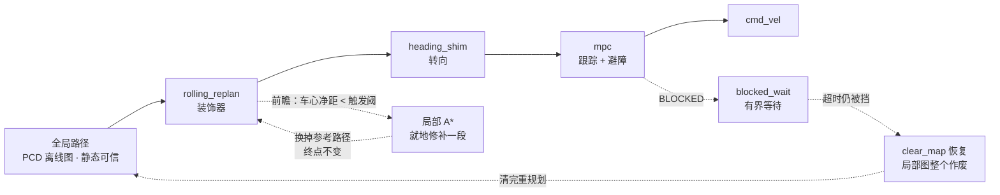

# 局部柔性避障与恢复实施方案（pnc_2d）

> 状态：**已落地并验证**（2026-09-29）
>
> · 单测：`ctest --test-dir build/pnc_2d` → **18/18 通过**（18 个可执行 / **222 个用例**）
> · 仿真：S1 闭环验收通过（**轮廓穿透 0.0 cm**、最小净距 0.274 m、到点 3.8 cm、`BLOCKED` 0 拍）
> · S2（动态横穿）**尚未复测**，见 §9
>
> 相关：`mpc_local_planner_plan.md`（MPC 本体与 P5.4 结论）、`mpc_nmpc_guide.md`（原理）、
> `pnc2d_restructure_plan.md`（总计划）。
> 范围：主体在 `src/pnc_2d`；`src/perception` **只新增了一个清图服务**；**不改 `lightning`**。

---

## 0. 一句话

全局图是**离线 PCD**，`map_server` 只发布不更新 ⇒ **它永远不包含后来出现的障碍**。
于是"被挡 → 重规划"拿回的还是同一条路，恢复额度（`sm.max_recoveries`）烧光后任务判死。
本方案在**执行链路**上加三层柔性处置：

**① 绕（`rolling_replan`）→ ② 等（`blocked_wait`）→ ③ 清（`clear_map` 恢复）**

外加一个必须先修的前置缺陷：`/lightning/perception/pose` 是 **lidar** 位姿而不是车体位姿
（§3）—— 不修它，后面所有"净距/轮廓碰撞"判据都是错的（实测差 0.22 m，正好是让人
以为"感知能看见"的量级）。

---

## 1. 起点：三个实测症状

| # | 症状（仿真复现） | 真因 | 本方案的第几章 |
|---|---|---|---|
| A | 障碍消失后车仍对着空处报 `BLOCKED`；重规划出来还是同一条路；障碍事后走了车也不走 | ① 全局图（PCD）不含该障碍，重规划无用 ② 感知图里残留**幽灵障碍**（没有射线穿过的位置不会被清） ③ `blocked_abort_s=1.0` 一到就结束 action，恢复行为又是空的 | §4 §5 §6 |
| B | 动态障碍横穿时"盒子上来撞车"：车不绕，贴上去才停 | ① 近场盲区——判据按 lidar 系算却当成车体中心，车头真实余量只剩 **1.8 cm** ② 注入速度 0.8 m/s 快于规划反应 | §3 §4 |
| C | 绕行"感觉离太近，才开始绕" | 触发阈被设成 MPC 的**硬下界**（0.25 m）= "已经贴上才绕" | §4.2 §8 |

---

## 2. 分层设计



**责任划分（谁管什么、绝不越界）**

| 层 | 实现 | 什么时候动作 | 明确不做 |
|---|---|---|---|
| ① 绕 | `RollingReplanShimPlanner`<br/>（装饰器，包住 `heading_shim`→`mpc`） | 沿参考路径前瞻发现净距 < `rolling.trigger_clearance_m` | 不改终点、不碰全局路径、**不产生速度**（`producesCmdVel()` 转发主控制器） |
| ② 等 | `local_planner_node` 的 `kBlocked` 分支 | 连续 `BLOCKED` 但未超 `local.blocked_wait_s` | 不结束 action、不触发恢复；等待期间**一律发零速** |
| ③ 清 | `ClearMapRecoveryBehavior` → 感知 `std_srvs/Trigger` | 进 `Recovering` 且 `sm.recovery.type: clear_map` | 不清全局图（静态障碍由全局图兜底） |

三层是**串联降级**关系：能绕就绕（代价最小、任务不停），绕不了就等一等（感知看到的障碍
多半会自己走），等不到才清图（清图是"承认局部图不可信"的重手段）。

---

## 3. 前置修正：位姿口径（决定了后面所有阈值）

**事实**（`lightning` 侧 `loc_system.cc:691/698`）：`/lightning/perception/pose` 的
`child_frame_id = lidar_link`，即它是**雷达位姿**，不是车体中心位姿：

$$\text{lidar} = \text{base\_link} + (0.22,\ 0,\ 0.09)\ \text{m}$$

而消费端（全局规划、局部规划、感知、验收脚本）**一律当成车心**在用。

**后果（实测）**：判据整体前偏 0.22 m ⇒ 车头方向的真实余量比以为的少 0.22 m
（"footprint 以为有 0.238 m，实际只剩 1.8 cm"）；近场盲区也是这么来的：
`footprint_clear` 按雷达原点判碰，车头前方 0.22 m 那一圈**在判据之外**。

**修法（约束：不动 `lightning` ⇒ 消费端补偿）**：

| 处 | 参数 | 值 |
|---|---|---|
| 三个节点入口（global / local / manager） | `pose.base_offset_x` | `0.22` |
| 同上 | `pose.base_offset_y` | `0.0` |
| 轮廓 | `footprint.length / width / offset_x` | `0.78 / 0.40 / **-0.038**` |

`offset_x = -0.038` 的理由：Go2 实测外廓 $0.739 \times 0.324 \times 0.421$ m，
$x \in [-0.407, +0.332]$（前后不对称）——用对称矩形会让**车尾 5.7 cm 露在轮廓之外**。

⚠ 与 `perception` 的 `grid_map.footprint_*`（同一台车、同一套语义）**必须对齐**，
否则又变成"全局说能过、局部说撞"。

---

## 4. `rolling_replan`：滚动式就地绕行

### 4.1 为什么不是"被挡就全局重规划"

因为**重规划的目标函数没变**：输入还是那张 PCD 全局图（不含新障碍），重算出来的
大概率是同一条路。`replan` 恢复能治的是"路径与当前局面不同源"，治不了"全局图本身就缺信息"。
就地绕行的成本也低得多：只换被挡的一小段，终点、前后接续都保留。

### 4.2 判定：什么叫"被挡住"

沿参考路径从当前位置向前看 `lookahead_m`（1.60 m），每 `check_step_m`（0.10 m = 一格）
取一点，查该点的**车心净距**：

```
净距 < trigger_clearance_m（0.45）  ⇒  算被挡，进入修补
```

> ★ **本节是踩过坑的地方，值是实测调出来的**：最初 `trigger_clearance_m` 直接取
> MPC 的硬下界 0.25 m，理由听起来很顺（"低于它 MPC 必然 `primal infeasible`"）。
> 结果 S1 里车**贴着盒子**才开始绕：车心→盒面 **0.151 m**、轮廓**穿透 10.3 cm**。
> 原因是等到硬下界才动，车已经没地方挪了。改成 **0.45 m**（= MPC 软代价
> `obstacle_safe_distance` 开始生效的量级）后，穿透降到 **0.0 cm**。
> **结论：绕行必须提前，在"还有地方挪"时开始。**
>
> `blocked_clearance_m`（0.25）不退场，它有两个用途：① 日志里区分"该提前绕"与
> "已经晚了"；② 兼底——只有当触发阈被配得比它还紧时，它才成为有效触发。
> 启动时会与 `local_mpc.obstacle_safe_distance / obstacle_hard_distance` 对账，
> 差得远就 WARN（"局部说没挡、MPC 说无解"的分歧就是这么来的）。

### 4.3 修补窗口与合并不变量

```
                      s_block（冲突点弧长）
   s_now ────────────────┬──────────────────────► 参考路径
                    ┌────┴────┐
        back_m=0.40 │         │ roll_m=2.00（还在障碍里就外扩到 max_roll_m=4.00）
                    ▼         ▼
   新路径 = 原路径[0 .. a] + 修补段(A*) + 原路径[b .. 末]

   ★ 不变量：merged.back() == original_.back()   ← 终点永远是任务目标
```

- `back_m`（0.40）：冲突点**之前**多少开始替换，留出接回原路径的余量；
  太小会接出一个折角，跟踪时抖。
- `roll_m` / `max_roll_m`：冲突点之后多少算"要绕过的范围"；这段末端还在障碍里就继续向外扩，
  扩到 `max_roll_m` 还不行就放弃。
- **终点不变量是硬性检查**（单测 `DetoursAroundBlockageAndKeepsGoal` 断言它）。

### 4.4 搜索代价与自检

局部 A*（只向前搜）的代价项：

| 项 | 参数 | 作用 |
|---|---|---|
| 靠障碍距离 | `obs_cost_weight` 0.60 | 越大越愿意离障碍远（代价是绕得更远） |
| 未知格 | `unknown_cost_scale` 1.60 | 未知**可通行**但更贵 ⇒ 偏好已观测空地 |
| 侧向偏离 | `lateral_cost_weight` 0.80 | 拉成"贴着原路径拐一下"而不是大弧线 |
| 平滑 | `smoothing` true | line-of-sight 拉直，去掉 A* 锯齿 |

**自检（比代价更重要）**：

1. 修补段每个点用 `CollisionChecker::poseInCollisionAtMargin(x, y, yaw, pathMargin())` 判碰。
   其中 `margin` **直接替换** `footprint.safe_margin`（0 = 真实轮廓，负数 = 缩小），
   而 `pathMargin() = footprint.safe_margin + rolling.path_margin_m(0.06)`。
   ★ 那 0.06 是**必须**的：修补段是给 MPC **跟踪**的，跟踪有 2~4 cm 横向误差，
   "恰好不碰"的路径跟偏一点就擦上去。
2. **绕行幅度上限** `max_offset_m`（1.20 m）：修补段上任何点到**原路径切线轴**的侧向距离
   超它就**放弃**、如实交回主控制器报 `BLOCKED`。
   宁可停，也不做"看着绕过去了其实进死胡同"。

### 4.5 节流与放弃（防"绕行抖动"）

| 机制 | 参数 | 治什么 |
|---|---|---|
| 最小间隔 | `min_interval_s` 0.50 | 修补是 A* + 平滑，别每拍都做 |
| 最小进度 | `min_progress_m` 0.20 | "挡住了→原地修补→路径没变→再修补"的空转 |
| 连续失败上限 | `max_consecutive_fail` 2 | 搜不出来就别死磕 |
| 静默期 | `give_up_s` 3.00 | 放弃后静默一段时间，让主控制器如实报 `BLOCKED`，**把机会留给恢复行为** |

### 4.6 走廊模式为什么**不**绕

`setCorridor()` 非空（= 路网模式）时，`rolling_replan` 直接跳过修补，只打一次 stderr 提示。
理由：走廊是**静态通行性承诺**（有些通道物理上过不去），走廊内绕行等于允许它越界，
会破坏"路网贴线"这个前提。走廊里被挡就老老实实 `BLOCKED` → 交给恢复/人工。
单测：`NoDetourInCorridorMode`。

### 4.7 参数表（`config/local_rolling_replan.yaml`，前缀 `rolling.`）

| 参数 | 默认 | 说明 |
|---|---|---|
| `enable` | true | 总开关（false = 完全透传主控制器） |
| `primary` | `heading_shim` | 被装饰的主控制器（→ 内部再建 `mpc`） |
| `lookahead_m` | 1.60 | 前瞻距离 |
| **`trigger_clearance_m`** | **0.45** | 触发绕行的车心净距（★ 别配成硬下界） |
| `blocked_clearance_m` | 0.25 | 硬下界（兼底 + 日志区分） |
| `path_margin_m` | 0.06 | 修补段额外安全余量（跟踪误差） |
| `check_step_m` | 0.10 | 检测步长（越小越不漏细柱） |
| `back_m` / `roll_m` / `max_roll_m` | 0.40 / 2.00 / 4.00 | 修补窗口 |
| `max_offset_m` | 1.20 | 绕行幅度上限（超了放弃） |
| `min_interval_s` / `min_progress_m` | 0.50 / 0.20 | 节流 |
| `max_consecutive_fail` / `give_up_s` | 2 / 3.00 | 放弃 |
| `obs_cost_weight` / `unknown_cost_scale` / `lateral_cost_weight` | 0.60 / 1.60 / 0.80 | A* 代价 |
| `smoothing` | true | 拉直 |

`footprint.*` 与 `map.hard_threshold` **不在本文件重复配**（由 `pnc_2d.yaml` 统一给）。

**启动日志**：每次成功修补打一行

```
[rolling_replan] 绕行修补：冲突 @s=0.70 m，替换 [0.40, 2.20] → 2.97 m /
                 最大侧偏 1.05 m / A* 221 节点 / 2.6 ms
```

`RepairStats` 暴露累计次数/最近侧偏/最近耗时/最近失败原因（`last_msg`），单测与诊断都用它。

---

## 5. `blocked_wait`：有界等待

### 5.1 语义变化（参数改名了，别用旧的）

| | 旧 `local.blocked_abort_s`（1.0） | 新 `local.blocked_wait_s`（**8.0**） |
|---|---|---|
| `BLOCKED` 连续超时后 | **直接结束 action** | **先停车等待**，`blocked_for_s` 进 feedback |
| 障碍自己走了 | 车已经不跟了（任务可能已判死） | **立刻恢复跟随** |
| 超时之后 | — | 才交回状态机（保留原语义作兜底） |

> 旧参数只在**显式配了**时才被读一次（当成 wait 值）并 WARN 提醒改名——
> 免得老配置静默地"等 6 s"。本节点开了
> `automatically_declare_parameters_from_overrides`，所以 `has_parameter()` 能真区分
> "配了"与"没配"。

### 5.2 等多久：`classifyBlock()` 只改"报什么原因"和"等多久"

被挡原因分三类。**注意它不参与任何安全判定**（安全永远由算法给的 `BLOCKED` 决定，
且被挡期间一律发零速）：

| 情形 | 判据 | `wait_s` | 理由 |
|---|---|---|---|
| 感知前方被挡（默认） | — | `blocked_wait_s`（8.0） | 人/车/盒子**会走** |
| 前方是**禁行区** | `zones_.inForbidden(车前方 kProbeAhead 处)` | `blocked_wait_global_s`（1.0） | 静态承诺，等也没用；禁行区不做绕行 |
| 只有**全局图**说不能走 | 全局图占用 且 感知图**不**占用 | `blocked_wait_global_s`（1.0） | 静态障碍不会自己消失，白等只占任务时间 |

"车前方"由 `pointAhead(d)` 从参考路径上取（拿不到路径就沿车头外推）——**只是报原因用的
启发式**，所以允许粗糙。

### 5.3 ⚠ 跨层耦合：`blocked_wait_s` 必须明显小于 `sm.stuck_timeout`

等待期间管理器看到的是"长时间没推进"，它自己的 `sm.stuck_timeout`（**25.0 s**）会触发
`kStuck` ⇒ 进恢复。两者叠加时**以先到的为准**：如果 `blocked_wait_s ≥ stuck_timeout`，
"等待"会被管理器的卡住判据抢先打断（多一次无谓的重规划）。
节点启动时校验并 WARN（建议 `blocked_wait_s ≤ 0.6 × stuck_timeout`）。

当前取值（`pnc_2d.yaml`）：

```
local.blocked_wait_s: 8.0            # 感知类被挡的有界等待上限 [s]
local.blocked_wait_global_s: 1.0     # "等也没用"类（全局图/禁行区）
sm.stuck_timeout: 25.0               # ↓ 必须大于上两者
sm.max_recoveries: 2
```

> 容差时长估算：$\approx (sm.max\_recoveries + 1) \times blocked\_wait\_s$。

---

## 6. `clear_map` 恢复：局部图整个作废

### 6.1 什么时候真的需要它

`replan` 只解决"路径与当前局面不同源"，解决不了"**局部图本身是脏的**"：

- 动态障碍离开后残留**幽灵障碍**（用户原话："障碍物消失了，感知也没有清除障碍物"）；
- 障碍被车顶开 / 定位跳变后，旧观测留在滑动窗口里；
- 上层逻辑（例如某个区域刚被开放）改过，而局部图还记着旧占格。

> **实测补充（重要，决定了这层的定位）**：在**开阔地**，感知自己约 1 s 就会把障碍清掉
> （盒子的占格 9 → 0，上游点云同步下降）——即"幽灵"**不是**感知不工作，而是
> **没有射线穿过**的位置不会被清除（被挪动/瞬移的物体、移出 FOV 的物体、滑动窗外回卷的格）。
> 所以 `clear_map` 是"承认这一片观测不可信"的**重手段**，不是常规清障。

### 6.2 感知侧：一个 `Trigger` 服务（新增，唯一改动）

```yaml
# perception/config/perception.yaml
grid_map.clear_map_service: "grid_map/clear_map"     # ⇒ 全名 /grid_map/clear_map
```

- 类型 `std_srvs/srv/Trigger`，实现 = `GridMap::resetBuffer()`（3D 占据/膨胀/计数/raycast 缓存/
  占据索引 **和 2D 层与距离场**全部作废），返回 `success=true` + 中文 `message`，
  并打一条 `WARN` 日志（清图是"异常事件"，必须留痕）。
- ⚠ **不要写成裸 `clear_map`**：相对名只拼**命名空间**、不拼节点名 ⇒ 会变成全局
  `/clear_map`，容易和别人的服务撞名（2026-09-29 实测踩过）。
  名字前缀故意与 `grid_map/occupancy_2d` 那一族一致。

### 6.3 pnc_2d 侧接线

| 位置 | 内容 |
|---|---|
| `pnc_manager_node` | `sm.perception_clear_service`（默认 `/grid_map/clear_map`）+ 非阻塞 `Trigger` 客户端 |
| `RecoveryContext::clearLocalCostMap` | 管理者注入的 lambda：服务不可用就**如实失败**并报服务名（不静默成功） |
| `ClearMapRecoveryBehavior`（`clear_map`） | `clear_map.min_interval_s`（默认 **0.0 = 关**） |
| `pnc_2d.yaml` | `sm.recovery.type: "clear_map"`（**2026-09-29 起为默认**） |

**为什么默认不带防抖**（`clear_map.min_interval_s: 0.0`）：反复"挡住→清图→再挡"已经被
`sm.max_recoveries` 收住了；开防抖反而会把"清完图立刻又被**真**障碍挡住"这种真情况
判成恢复失败。防抖用**单调时钟**（清图是 I/O 动作，按墙钟才符合直觉）。

**与状态机的配合**（与 `replan` 完全一致）：`run()` 同步返回 →
`success=true` ⇒ `Recovering → Planning` ⇒ **清完图一定会重新规划再跟随**，
所以本行为**不需要**自己请求重规划。

### 6.4 代价与安全兜底（必须写在明面上）

清图后的 **0.2~0.5 s** 内 2D 层是**未知(-1)**，在"未知按可通行"的口径下局部图会短暂地
"什么都看不见"。安全性由两件事兜底：

1. **`local.fuse_global_map`**：把 `map_server` 的**全局静态障碍**融进局部硬判定图
   ⇒ 已知的墙/柱子/货架**不会**因为清图而被忽略（融合用 `local.fuse_global_map_band` 1.5 m
   带内压低距离场）。
2. 清图是**局部**的：全局路径、任务状态、终点都不动。

---

## 7. 跨层一致性（一张表记住所有耦合）

| 上游量 | 下游量 | 要求 | 违反的症状 |
|---|---|---|---|
| `local_mpc.obstacle_safe_distance` 0.45 | `rolling.trigger_clearance_m` 0.45 | 同量级（差 >0.05 就 WARN） | 说好提前绕，实际贴上才绕 |
| `local_mpc.obstacle_hard_distance` 0.25 | `rolling.blocked_clearance_m` 0.25 | 同量级 | "局部说没挡、MPC 说无解" |
| `local.blocked_wait_s` 8.0 | `sm.stuck_timeout` 25.0 | `blocked_wait_s ≤ 0.6 × stuck_timeout` | 等待被"卡住"判据打断 |
| `pose.base_offset_x` 0.22 | 三节点一致 | 必须一致 | 全局给路、局部说撞 |
| `perception.grid_map.clear_map_service` | `sm.perception_clear_service` | **完全一致** | 恢复调不到服务 ⇒ 清图失败 |
| `footprint.*`（pnc_2d） | `grid_map.footprint_*`（perception） | 同一台车同一套语义 | 两套轮廓各说各话 |
| `local_mpc.brake_acc` | `local.brake_acc` | 单一来源 | 提前/滞后制动，两处 WARN |

---

## 8. 验收与实测

### 8.1 单测（`ctest --test-dir build/pnc_2d`，18/18）

| 可执行 | 用例 | 覆盖 |
|---|---|---|
| `test_rolling_replan` | 4 | 绕行且**终点不变** / 节流 / 走廊不绕 / 未知格可通行开关 |
| `test_clear_map_recovery` | 5 | 无钩子如实失败 / 调钩子一次 / 防抖 / 默认可重入 / 名字 |
| `test_factory` | 19 | 三套工厂、局部接口、恢复行为注册 |
| 其余 15 个 | 194 | 见 README §5 |

**总计 222 用例**。

### 8.2 S1 仿真闭环（静态挡路 + 绕行）

```bash
export RMW_IMPLEMENTATION=rmw_cyclonedds_cpp CYCLONEDDS_URI=$PWD/src/bringup/cyclonedds.xml ROS_DOMAIN_ID=30
source install/setup.bash
PNC2D_LOCAL_TYPE=rolling_replan python3 src/pnc_2d/test/sim/test_avoidance.py --scenarios S1
```

| 指标 | 调参前（`trigger=0.25`） | 调参后（`trigger=0.45` + `path_margin=0.06`） |
|---|---|---|
| 到点误差 | 4.3 cm | **3.8 cm** |
| **最大轮廓穿透** | **10.3 cm** ❌ | **0.0 cm** ✅ |
| 最小净距（车心→盒面） | 0.151 m | **0.274 m** |
| 最大侧偏 | 0.78 m | 0.78 m |
| `BLOCKED` | 0 拍 | **0 拍** |
| 最长停滞 | — | 0.1 s |

侧偏两次相同是对的：绕行**几何**由障碍位置决定，提前触发改善的是**净距与穿透**
（有更多空间做同样的绕行）。

### 8.3 调参手册（下次再遇到"擦过去"）

按代价从低到高：

1. `rolling.trigger_clearance_m` ↑（0.45 → 0.55~0.60）：最直接，代价是"本来能过的窄缝也去绕"。
2. `rolling.path_margin_m` ↑（0.06 → 0.10）：治"路径没问题但跟偏了"。
3. `rolling.obs_cost_weight` ↑：让 A* 主动离障碍更远。
4. `lookahead_m` ↑：更早发现（但要 > 感知可靠距离的一半，否则前瞻点落在盲区里白等）。
5. 降场景速度（S1/S2 脚本 `--speed`）：**最后才考虑**——它是"测试变简单"，不是算法变好。

---

## 9. 已知边界与后续

- **S2（动态横穿）尚未复测**：本轮只验了 S1。S2 需 `--speed 0.3`（0.8 太快，规划来不及反应）。- **动态物体留下的“幽灵格”已由 perception 的时效衰减自动处理**（`grid_map.decay_*`，
  2026-09-29）：超时 5 s 没被命中就淡掉，实测残留 **20 格 → 5 s 归零**，且静态障碍
  40 s 不被误清、静止场景衰减计数恒为 0。所以 `clear_map` 恢复的定位是“**兜底**”
  而不是“常规手段”（大面积脏图、定位跳变、被长时间遮挡的真障碍仍需它）。
  根因（残留体素**从未被任何射线穿过**）与实测见
  `src/perception/doc/perception_gridmap.md` §3.6。- **不做速度/轨迹预测**：`rolling_replan` 是反应式的，靠"提前触发 + 余量"扛动态障碍；
  真正的动态避让（预测-避让）列后续。
- **`max_recoveries` 仍然有限**（2 次）：挡住 → 绕/等/清 全失败后任务仍会判死，
  这是刻意的（防无限循环）。
- **走廊内不绕**是设计约束，不是缺陷（见 §4.6）。
- **清图的安全前提**是 `local.fuse_global_map` 必须开（否则清图后会短暂看不见已知静态障碍）。
- **注入器（测试工具）被 SIGTERM 杀掉会留下盒子**，测试收尾需自检+清理。
- 负值命令行参数必须写 `--at=-0.5,1.2`（argparse 会把 `-0.5` 当选项）——踩过。

---

## 10. 文件清单

**新增**

| 文件 | 内容 |
|---|---|
| `include/pnc_2d/local/rolling_replan_shim.hpp` / `src/local/rolling_replan_shim.cpp` | 滚动重规划装饰器 |
| `config/local_rolling_replan.yaml` | 其参数（§4.7） |
| `include/pnc_2d/core/clear_map_recovery.hpp` / `src/core/clear_map_recovery.cpp` | `clear_map` 恢复行为 |
| `test/test_rolling_replan.cpp` / `test/test_clear_map_recovery.cpp` | 单测（4 + 5） |
| `doc/local_flexible_avoidance_plan.md` | 本文 |

**修改**

| 文件 | 改动 |
|---|---|
| `src/core/factory.cpp`、`CMakeLists.txt`、`launch/pnc_2d.launch.py` | 注册 `rolling_replan`（源文件 / 测试 / `LOCAL_FRAGMENT_BY_TYPE` 片段映射） |
| `src/nodes/local_planner_node.cpp` | `blocked_wait` 有界等待 + `classifyBlock` + 跨层校验 |
| `src/nodes/pnc_manager_node.cpp` | `sm.perception_clear_service` + `Trigger` 客户端 + `ctx.clearLocalCostMap` + `pose.base_offset_x` |
| `src/nodes/global_planner_node.cpp`、`include/pnc_2d/core/types.hpp` | 位姿口径补偿 |
| `config/pnc_2d.yaml` | `pose.base_offset_x` 0.22、footprint 0.78/0.40/−0.038、`blocked_wait_s`、`stuck_timeout`、`sm.recovery.type: clear_map` |
| `src/perception/src/perception_node.cpp`、`config/perception.yaml`、`CMakeLists.txt`、`package.xml` | 清图服务（`std_srvs`） |

**测试工具**（`test/sim/`）

| 文件 | 用途 |
|---|---|
| `sim_common.py` | 位姿→车心、footprint 装载、SAT 重叠、目标筛选、latched 路径过滤 |
| `obstacle_inject.py` | 注入障碍（ghost / 幂等 / `--verbose` / `--speed 0.3`） |
| `test_avoidance.py` | S1/S2 绕行验收（**穿透**指标、绕行幅度、`BLOCKED` 拍数） |
| `near_field_probe.py`、`obstacle_clear_probe.py` | 近场盲区 / 清障时延取证 |
