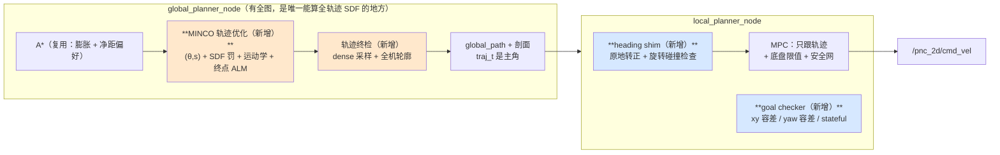

# MINCO 轨迹优化层开发计划（P6）

> 分支：`feat/minco-trajectory-optimizer`（从 `feat/add_log` 切出）
> 参考实现 ①：`/home/gmd/r41_ws/DDR-opt`（ROS 1 catkin 全栈，GPL-3.0；**用户 2026-09-24 确认可用，项目不商用**）
> 参考实现 ②：Nav2 `nav2_rotation_shim_controller`（Apache-2.0，许可干净）

## 0. 本期范围（2026-09-24 用户两次收窄，**以此为准**）

**做**：A\* → MINCO（`(θ,s)`，SDF 罚 + 运动学 + 终点 ALM + 终检）→ 剖面随路径下发 → MPC 跟踪；
并把"到点 / 末朝向 / 原地对正"从 MPC 里**拔出来**做成独立层（参考 Nav2 `rotation_shim_controller`）。

**不做**：

| 不做 | 影响 |
|---|---|
| 走廊约束（`corridor_width` / 贴线） | 局部侧 `corridorSlice`/`StrictCorridor*` **不动不删**，但不在本期验收范围内 |
| 限速区前视 | 同上（`zoneSpeedLimitAheadFromProjection` 不动） |
| 禁行区停车 | 同上（`fuseForbidden`/`burnForbidden` 不动） |
| 路网（route_network） | 后端只跟 A\* 折线对接；route 模式留待后续 |
| `icrekf`（在线瞬心估计） | 用户明确不需要；`(θ,s)` 参数化里也没有它（差速是退化情形） |
| NMPC（ACADO + MATLAB 代码生成） | 不移植 |
| **换掉我们的 MPC** | **本期不换**；逻辑见 §2 末与 §5 R11（留到 M5 之后一次可回滚的 A/B） |

⇒ 本期**唯一的 IPC 改动**是给 `PlanPath.srv` / `FollowPath.action` 加剖面数组（§2）。

---

## 1. 要解决的是什么问题

现有链路：`A*(栅格) → global_path(折线) → MPC(20 Hz 同时干跟踪/避障/限速/走廊/对正)`

实测暴露的三个问题，都能追到"**MPC 在替上游擦屁股**"：

| 现象 | 根因（已量测） | MINCO 层如何消除 |
|---|---|---|
| 自由段**摇摇摆摆**（ω 相邻周期 +0.65→−0.65） | A* 折线切角 + 参考只是"大致往那儿走"，MPC 每周期都在做大横向修正 | 参考本身 C² 连续且贴近可跟踪极限 ⇒ 修正量天然变小 |
| **绕障效果差 / 贴墙**（0.15 m 处擦过障碍） | A* 只在"格心 + 膨胀"意义下避障；折线的**曲率与净距不可同时保证** | SDF 罚函数沿整条轨迹拉开净距，且平滑不与净距冲突 |
| MPC **同时干太多**（20 Hz + 1.4 m 前瞻，启发式参考） | 缺少"轨迹级可行性"这一层；MPC 拿到的路径不保证可跟踪 | 把"路径可行"降级为上游职责，MPC 退回跟踪器 |

**核心主张**：不要靠调 MPC 的权重去修几何问题；在 A* 与 MPC 之间补一层"**几何 + 运动学可行**"的轨迹优化，MPC 只保证"跟踪得动"。

DDR-opt 的做法印证了这条分工：它的 `mpc.cpp` 里**没有任何障碍代价**（`matrix_q=[15,15,0,1]`、`matrix_r=[0,0]`、`matrix_rd=[1,0.05]`），100 Hz 纯跟踪；避障/可行性全在 MINCO 后端（SDF 罚 + 运动学 + 终点 ALM + `check_final_collision`）。

---

## 2. 分层与数据流



**为什么放在全局节点**（回答上一轮悬空的问题）：
- MINCO 需要**整条轨迹范围**的 SDF 与梯度；局部节点只有 80×80 @0.1 m 滑窗 + ≤3 m 的 ESDF 点云。
- 全局节点**已经**订阅 odom（`topics.odom`）、持有 `CostMap2D`、持有 `ClearanceField`（净距偏好用的那个）。
- 走同一个 `plan()` 代码路径 ⇒ `/goal_pose` 话题触发与 `PlanPath.srv` 触发**自动都过 MINCO**。

**速度剖面归属（2026-09-24 用户纠正后修订）**：

**速度剖面 = 时间参数化，与几何是同一个优化问题的两个面，不能拆层。** 拆开的后果不是"精度差一点"，
而是**把已经解出来的可行性结论丢掉，让下游再猜一遍**（我们已经在 `brakeAcc` / `stopCoast` /
限速前瞻三处栽过 6.7 倍偏差，见 `doc/mpc_local_planner_plan.md`）。三条耦合都是硬耦合：

1. **曲率 ↔ 速度**：`v ≤ √(a_lat_max / κ)`。而 A\* 折线的 κ 是**噪声级**（实测直线上算出 curv 0.546 1/m，
   导致一加速就撞走廊硬界、MPC 趴窝）。让 MPC 基于折线 κ 限速 = 基于噪声限速。
2. **净距 ↔ 速度**：空旷处该快、贴障碍该慢。MINCO 有**全图**净距，能沿 s 给出正确剖面；
   MPC 只有 ≤3 m 局部 ESDF（感知只在 0<d≤3 m 发点）。
3. **时间分配 = 运动学可行性本身**。MINCO 的 `T_i` 就是剖面；`|v|/|a|/|ω|/|α|` 是否满足，
   是时间分配解出来的**结论**，不是下游能重新推出来的东西。

| 内容 | 归属层 | 理由 |
|---|---|---|
| **几何 + 时间参数化（= 剖面 v(s), v(t), a, ω, α）** | **MINCO（轨迹层）** | 只有它有全图；且与几何/净距硬耦合 |
| **限速（限速区、任务限速、曲率限速、净距限速）** | **MINCO** | 限速区是**地图语义**，跟着地图走；将来接禁行区/限速区时进它，不进 MPC |
| 底盘硬限值 `v_max/a_max/ω_max/α_max` | **配置单一来源**（MINCO 读；MPC 只做兜底钳位） | 限值≠剖面 |
| 底盘执行：ω 死区补偿、`cmd_vel` 标定、`stop_coast`、`brake_acc` | MPC / 底盘适配层 | 这是**执行**，不是剖面 |
| 到点判定 + 末段停靠（`approach`/`crawl`/±3 cm）+ 终点对正 | MPC | 产品策略 + 底盘可否原地转 |

⇒ **剖面必须传输给 MPC**：MPC 从"**算**速度"变成"**跟**速度（前馈）+ 底盘钳位 + 末段停靠策略"。

**传输方式**（低风险，因为 `corridor_width[]` 等已有数组都是**按 path 点下标对齐**的，不能换容器）：
- 保留 `nav_msgs/Path path`（RViz 可视化、`corridor_width` 下标对齐全部不变）；
- `PlanPath.srv` 与 `FollowPath.action` 增加 `float64[] traj_t`、`float64[] traj_v`、`float64[] traj_omega`；
- ★ **长度 ≠ `path.poses.size()` ⇒ 视为"没有剖面"**（整体失效，不是"部分有效"），并 WARN；
- 没有剖面时 MPC 走**现有**的自建剖面（= 现网行为）⇒ 这正是 M5 的 A/B 对照臂。

### ★ 参数化选型：改用 **(θ, s)**（2026-09-24 读原版代码后修订；我原计划写的是 (x, y)）

原版 `back_end` 的 MINCO 不跑在 (x, y) 上，而是跑在 **(θ, s)** 上（`Trajectory<5,2>`）：
`p = (θ, s)`、`v = (ω, v)`、`a = (α, a)`，jerk 为输入；XY 靠 **Simpson 积分**从 θ 还原：

    x = x0 + ∫ cos θ · ds ,   y = y0 + ∫ sin θ · ds
    （`traj_anal.hpp` 逐字如此，只含 cos/sin，**不含 ICR 项**）

这一条**比我原来的 (x, y) 好，采纳**。每一条好处都对着我们已经踩过的坑：

| (θ, s) 的好处 | 消掉我们哪个手搓补丁 |
|---|---|
| **yaw 是独立决策变量**（`ṡ=0, θ̇≠0` 是合法状态） | `align_in_place_deg` / `align_exit_deg` / `goalYawAlign()` / 到点对正那一整套 |
| 运动学**线性**：`ω=θ̇`、`v=ṡ` ⇒ 约束直接是 `\|ṡ\|≤v_max`、`\|θ̇\|≤ω_max`、`\|θ̈\|≤α_max` | 曲率限速 `v ≤ √(a_lat/κ)` + **折线 κ 是噪声**那个坑（实测直线上算出 curv 0.546） |
| 与差速底盘限值**同构**（我们配的就是 v/ω/a/α） | `reference_speed` / 曲率前瞻 / `crawl_speed` 之间反复调参 |
| **终点朝向是状态约束** `θ(T)=目标 yaw` | "末点 yaw 写死目标朝向 + 到点再原地转"的两段式 |
| 剖面的定义就是 `ṡ(t)`，无歧义 | "剖面到底传什么" |

代价（必须认账）：
- XY 是**派生量**（积分得到）⇒ **终点 XY 只能靠 ALM 拉回**（原版 `ALM update` + `FinalIntegralXYError`
  就是干这个的；我原计划里 ALM 只是"为了更准"，在这里是**必需**）。
- SDF 查询点也要先积分成 XY ⇒ 每次迭代多一层积分开销（原版用 `Integral_appr_resInt: 4` 控制）。
- **ICR 不需要**：积分式里没有 ICR 项 ⇒ 差速（ICR 在车体中心）就是本参数化的退化情形。
  `if_directly_constrain_v_omega`（轮速上限）与 `icrekf` 一并不要（用户已明确）。

### 与原版（DDR-opt）的差异对照

| 维度 | 我原计划 | 原版实际 | 差 |
|---|---|---|---|
| 参数化 | MINCO_S3 on **(x, y)**，yaw = 路径切线 | MINCO_S3NU on **(θ, s)**，yaw 独立 | **大（已改）** |
| 终点位置 | 是状态 ⇒ 直接钉住 | 是**派生量** ⇒ ALM 必须 | **大（已改）** |
| 速度约束 | κ 耦合（`v≤√(a_lat/κ)`、`ω=κv`） | 直接 `\|ṡ\|≤v_max`、`\|θ̇\|≤ω_max`、`\|θ̈\|≤α_max` | **大（已改）** |
| 剖面传输 | `nav_msgs/Path` + `float64[] traj_t/traj_v/traj_omega` | `carstatemsgs::Polynome`（**多项式**：`innerpoints[] + t_pts[] + init/tail 状态`） | 中（介质不同，思想相同） |
| MPC 怎么吃剖面 | 按 `traj_t` 采样成参考窗口 | `TrajAnal` 把多项式积成 `(x,y,θ,t)` 序列（0.1 s）；`xref(0..3,i)=x,y,v,θ`、`dref=v,ω` | 中 |
| MPC 代价 | 跟踪 + 障碍 + 限速（大杂烩） | `Q=[15,15,**0**,1]`（x,y,**v**,θ）、`R=[0,0]`、`Rd=[1,0.05]` ⇒ **无控制代价、无障碍项**，靠 Δu 正则 | 中 |
| 终端参数 | — | `shot_path_horizon: 0.5`：末段切到另一套权重（`PathpenaltyWeights` vs `penaltyWeights`） | 小（可后补） |
| 重规划 | 切轨迹重规划（借鉴③） | `ifCutTraj_` + `time_weight_backup_for_replan` | 一致 |
| safeDis | 借鉴① | `safeDis = min(0.85·起点实测净距, safeDis_)` | 一致 |
| 终检 | 借鉴② | `check_final_collision()`：采样整条轨迹查 SDF，`< finalMinSafeDis` 即拒绝 | 一致 |

★ 一个**反直觉的实测细节**：原版 `matrix_q` 里 **v 的权重是 0**（`[15,15,0,1]` 的第 3 项，
对应 `dQ[dimx] += Q[2]`）⇒ `dref(0)=v` 那一项**不进代价**；ω 参考（`dref(1)`）在代价里也没找到。
**⇒ 原版的剖面主要靠"参考点的时序"起作用**（`xref` 按 dt 采样 MINCO 多项式），速度参考只是个开关项。
这条对我们的忠告：**光传 `traj_v` 数组、而 MPC 仍用自己的时间分配 = 剖面根本没传**；
必须让 MPC **真的按上游 `t` 采样**（`traj_t` 是主角，`traj_v` 是辅助）。

### ★ 对正/到点分层修订（2026-09-24 用户指定：参考 Nav2 `rotation_shim_controller`）

**决定**：把"原地对正 / 末朝向 / 到点判定"**从 MPC 里拔出来**，做成独立层。
这不只是"功能搬家"，而是**换掉了控制律** —— 我们反复踩的坑，根因就在律本身：

| Nav2 机制（源码事实，Apache-2.0） | 正对我们哪个坑 |
|---|---|
| **恒定角速度** `ω = sign(e)·omega_rot`，再 `clamp(ω, ω_prev ± α_max·dt)` | 我们 `align_gain·e` 在小误差时衰减进**底盘死区**（`align_w_min` 就是这么来的）；恒速律**不会产生任意小的指令** |
| **减速防过冲** `\|ω\| = min(\|ω\|, √(2·α_max·\|e\|))` | 替代"靠放宽容差忍过冲"，且每个量都有物理含义 |
| **迟滞交棒**：触发用 45°(0.785)，已在转时改用 22.5°(0.3925) | 我们手搓的 `align_exit_deg`。★ 交棒时**仍在转**（≈1.59 rad/s）⇒ 交棒平滑 |
| **旋转碰撞检查**：按控制周期前向模拟 1.0 s 扫过的 yaw，逐位姿查 footprint，不安全就 `throw` ⇒ **交回主控制器** | "原地转其实在划小弧 ⇒ 漂 0.09~0.19 m ⇒ 撞"；`align_min_clearance` 只是弱化版 |
| **触发点 = 路径前方 0.5 m 处的朝向** | 比"只跟终点朝向比"更早发现"接下来要拐"，避免走出不可跟踪的弧线 |
| **位置/朝向是两个独立判据** `{xy_tol, yaw_tol, stateful}` | 我们把两者混在节点层 + MPC 里 ⇒ 这就是为什么在那一处反复踩 |
| **交棒角速度 ≤ 主控制器 `max_ω`**（README Etc Notes） | ★ 跳层不变量，见 R10 —— 与"跳层物理量只配一遍"同一个教训 |

**落点**：`core/goal_checker.hpp` + `local/heading_shim_planner`（实现我们已有的 `LocalPlanner`
接口、内部持有 primary）⇒ `local.type: heading_shim` + `shim.primary: mpc`，**local 节点零改动**。
详见 M5.1/M5.2。

**推论（重要）**：把产品逻辑拔出来之后，MPC 只剩"跟轨迹 + 底盘限值 + 安全网" ⇒
**"要不要换成原版 MPC"从架构问题降级为工程取舍**。⇒ 本期**不换**，留到 M5 之后一次可回滚的 A/B。

---

## 3. 文件清单

| 类别 | 文件 | 说明 |
|---|---|---|
| 接口 | `include/pnc_2d/core/trajectory_optimizer.hpp` | `TrajectoryOptimizer` 抽象 + `TrajOptRequest/Result/Stats` + `TrajStatus` |
| 复用（vendored） | `include/pnc_2d/traj/gcopter/{minco.hpp,lbfgs.hpp,trajectory.hpp,root_finder.hpp,sdlp.hpp}` | 直接 vendor 原版算法层（用户已确认非商用可用）；**保留 GPL-3 许可头 + 加 `README.md` 注明来源/版本/commit/改动** |
| 实现 | `include/pnc_2d/traj/minco_optimizer.hpp` + `src/traj/minco_optimizer.cpp` | **(θ,s) 参数化映射 + Simpson 积分 + SDF 罚 + 运动学罚 + 终点 ALM + 时间优化**（结构参照原版 `back_end/src/optimizer.cpp`） |
| 实现 | `include/pnc_2d/traj/traj_anal.hpp` | 多项式 → `(x,y,θ,t)` 序列 + `(v,ω)` 求值（参照原版 `mpc_controller/include/mpc_controller/traj_anal.hpp`） |
| 基础设施 | `core/clearance_field.{hpp,cpp}` **扩展** | 新增**双线性世界坐标查询 + 梯度**（现在只有 `distanceToLethal(int x,int y)`） |
| 工厂 | `core/factory.{hpp,cpp}` **扩展** | `createTrajectoryOptimizer(params)` + `createLocalPlanner` 支持 `heading_shim`（内部再建 primary）；未知类型返回 `nullptr`（与现有约定一致） |
| 分层（新增） | `include/pnc_2d/core/goal_checker.hpp` | xy/yaw 容差 + `stateful` 锁存（Nav2 `SimpleGoalChecker` 语义） |
| 分层（新增） | `include/pnc_2d/local/heading_shim_planner.hpp` + `src/local/heading_shim_planner.cpp` | 装饰器，参考 Nav2 `RotationShimController`；原地对正 + 旋转碰撞检查 + 迟滞交棒 |
| 节点 | `src/nodes/global_planner_node.cpp` **改** | `plan()` 成功后跑 MINCO → 终检 → 发布；失败**降级用 A* 原路径**；统计进 status |
| 配置 | `config/traj_minco.yaml`、`config/local_heading_shim.yaml`（新）+ `config/pnc_2d.yaml`（加 `traj.*`/`shim.*` 默认值） | 按现有"配置拆分"顺序合并（`extra_config` 可覆盖） |
| 测试 | `test/test_clearance_gradient.cpp`、`test/test_minco_optimizer.cpp`、`test/test_trajectory_check.cpp`、`test/test_heading_shim.cpp`、`test/test_goal_checker.cpp` | 全部**离线**、毫秒级（不依赖 ROS/仿真） |
| 离线工作台 | `test/tools/traj_workbench.cpp` | 读地图 + 一条路径 → 打印/导出 MINCO 前后指标（净距分位、曲率、求解时间、失败率），不跑仿真 |
| 文档 | 本文件 + `README.md` + `doc/mpc_local_planner_plan.md` 增补 | |

**开关（A/B 必须可切）**：`traj.type: none | minco`（默认 `none`）、`local.type: mpc | heading_shim`（默认先保持 `mpc`；切到 `heading_shim` 时 primary 仍是 `mpc`）—— 先保证现网行为零变化。全局节点的 status 消息里带 `"MINCO: 净距 0.28→0.61 m, max|κ| 0.49→0.12, 18 ms"` 这类可读结论。

---

## 4. 阶段划分

每一阶段都以"**能测的量**"收口，不写"看起来合理"的结论。

### M0 准备（本步，已完成）
- [x] 从 `feat/add_log` 切出 `feat/minco-trajectory-optimizer`
- [x] `.gitignore` 加 `DDR-opt`（ROS 1 克隆，避免污染；`colcon build` 在根目录会撞）
- [x] 计划文档（本文件）
- 交付物：分支 + 文档；无代码风险

### M1 距离场梯度基础设施（小而关键，先做）
- `ClearanceField` 新增：`bool buildFromMap(...)` 保持不变；新增
  `double distanceAtWorld(double wx, double wy) const`（双线性）、
  `void gradientAtWorld(double wx, double wy, double g[2]) const`（中心差分/双线性解析梯度）、
  `bool insideWorld(...)`。
- 同时提供"**全机轮廓**净距"查询：`double footprintClearanceAt(FootprintCollisionChecker&, x, y, yaw)`
  —— 终检要用它，不能只用点净距（车长 0.70 m，点净距 0.28 m 照样撞）。
- 单测 `test/test_clearance_gradient.cpp`：
  ① 单面墙的解析梯度（法向 1.0 / 切向 0.0，容差 1e-3）；
  ② 角点处的梯度方向（指向最近致命格）；
  ③ 与"暴力逐格搜索最近致命格"逐点比对（随机 200 点，误差 ≤ 0.5 格 × 分辨率）；
  ④ 边界外/越界返回保守值且不 UB。
- 验收：单测全绿；`footprintClearanceAt` 与 `FootprintCollisionChecker::poseInCollisionAtMargin`
  在 ±1 mm 扫描下**判据一致**（同零点）。

### M2 MINCO 核心库（离线可测，不碰 ROS）
- **状态**：`(θ, s)`，S3 链（`p, v, a` + jerk 输入），即原版 `MINCO_S3NU` / `Trajectory<5,2>`。
- **内层**：固定路点 + 固定时间 ⇒ 最小化 ∫ jerk²，解**带状线性系统**（vendor 的 `minco.hpp` 里就有，O(N)），
  C² 连续。
- **XY 还原**：`x = x0 + ∫cos θ ds`、`y = y0 + ∫sin θ ds`（Simpson，`Integral_appr_resInt: 4`）；
  终点 XY 误差就是这个积分与目标的差。
- **时间分配**：启发式初值 `T_i ∝ 段长 / v_ref` + 对 `T_i` 做 L-BFGS（权重对照原版
  `PathpenaltyWeights`/`penaltyWeights`：`time_weight` / `mean_time_weight` / `moment_weight` /
  `acc_weight` / `domega_weight`；末段用 `shot_path_horizon` 切另一套）。
- **代价与约束**：
  - SDF 罚（软）：`w_sdf · max(0, d_safe − d)²`，梯度由 M1 提供（**查询点必须先积分成 XY**）；
  - 运动学（罚，全部线性于状态导数）：`|ṡ| ≤ v_max`、`|s̈| ≤ a_max`、`|θ̇| ≤ ω_max`、`|θ̈| ≤ α_max`，
    向心项 `|v·ω|`（`cen_acc_weight`）；**不做逆速**（`ṡ ≥ 0`，四足不倒车）；
  - **终点 XY 等式 = ALM（增广拉格朗日）** —— 因为 XY 是派生量，这是**必需**而不是可选；
  - **终点朝向 = 状态约束 `θ(T) = 目标 yaw`**（不再靠 MPC 的 `goalYawAlign` 收尾；
    那个降级成兜底）；
  - 起点状态作为**初值条件精确固定**（不是约束）。
- **`safeDis` 自适应（借鉴机制 ①）**：`d_safe_eff = min(0.85 × 起点实测净距, d_safe_max)`。
  这一条直接对应我们之前用"虚拟起点"硬扛的那个场景（起点擦余量 ⇒ 局部 BLOCKED ⇒
  重规划又 `START_FOOTPRINT_COLLISION` ⇒ 任务死锁）。DDR-opt 一行解决。
- 单测 `test/test_minco_optimizer.cpp`：
  ① **单调性/平滑性**：折线输入 ⇒ 输出 max|κ| 严格下降、C² 残差 ≤ 容差；
  ② **净距不退化**：柱子场景下最小净距（排除首末点）不低于输入；
  ③ **运动学硬事实**：输出采样后 `max|v| ≤ v_max·(1+1e-3)`、`|ω| ≤ ω_max·(1+1e-3)`；
  ④ **终点精度**：`|p(T) − goal| ≤ 1 cm`，并打印 ALM 迭代数与最终乘子；
  ⑤ **退化输入**：全等路点 / 单段 / 直角折返 / 起点在障碍余量内，均**不崩且给结论**；
  ⑥ **时间上界**：607×307 地图、30 m 路径，P99 求解 ≤ 50 ms（Release）。
- 验收：以上单测全绿 + `traj_workbench` 能打印指标表（这就是给用户看的量）。

#### M2 实施记录（2026-09-24，**与上面原计划的偏差以此为准**）

时间参数化**没有**用原计划的"L-BFGS 调 `T_i`"，而是：

1. **曲率感知速度剖面**（解析，无迭代）：`v_cap(s) = min(v_ref, ω_max/κ)`（三点式曲率，±0.30 m 基线）
   → 前后向加速度受限扫描（`v_i = √(v_{i-1}² + 2·a_cp·Δs)`，`a_cp = 0.5·a_max`）→ 弧长-时间映射。
   弯道**局部**减速，而不是全路变慢（这是折角用例时间×19.8 → 1.03 的关键）。
2. **路点 = 时间等分 + 弧长按剖面走**（反过来会让带状系统解出剧烈摆动）。
3. **终点 XY 修正用数值 Jacobian + 阻尼最小二乘**（不是原计划的 ALM）。免迭代调和、
   一次收敛；ALM 留作冗余。
4. **时间缩放**保留为**安全网**（解析：`T_i ← k·T_i` ⇒ `v/k`、`a/k²`，几何不变）；
   正常应退出（k ≈ 1）。

**修掉的两个"剖面不自洽"（"轨迹比剖面慢 1.8 倍"的真根因，不是多项式跟不上）**：

- ① **端点速度被地板抬高**：剖面写 `v_prof[0] = max(v0p, v_floor)`。车静止起步（`v0p = 0`）时
  被抬到 `v_min = 0.2 m/s`，剖面于是声称"0.084 m 用 0.40 s 走完"；而从静止、`|a| ≤ 0.25`
  走完 0.084 m **至少**需要 `√(2·0.084/0.25) = 0.82 s`。少算的时间只能靠超限加速度补：
  实测 `max|a| = 1.567 ≈ 2·0.084/0.4² × 1.5`（常数加速度需 1.05，min-jerk 峰值更高）
  = **6.3 × a_cp** ⇒ 解析缩放乘 `k = 1.78` ⇒ 8 m 直线 27 s（本该 12.5 s），`max_v` 0.9 → 0.508。
  ⇒ 端点**如实**用请求给的边界速度（0 就写 0）；`v_min` 地板只管**内部**点（语义是"弯道别爬"）。
- ② **t→s 用线性插值**：`v ∝ √s` 是**凸**的，v(s) 线性插值会**高估** v —— 剖面说
  "s = 0.053 用 0.39 s"，真实需要 0.65 s ⇒ 路点被放到**物理上到不了**的位置 ⇒ 多项式照旧超限
  ⇒ 缩放仍乘 1.45。⇒ 改用"区间内**恒定加速度**"的精确关系（`v² = v₀² + 2a·Δs`、
  `Δt = (v − v₀)/a`），`s→t` 与 `t→s` **互逆且都是精确式**
  （区间时长 `2Δs/(v₀+v₁)` 与 `(v₁−v₀)/a` **恒等**，不是梯形近似）。

> 教训："多项式跟不上分段剖面形状"是**错的**结论（曾被写进提交信息与本节）——
> 取证方式是**逐段打印剖面意图 vs 实得**，一眼看到差在**首段**（端点条件不一致），
> 不是全局形状。**先取证再改算法**，否则会去重写本来没问题的东西。

**③ 剖面看不见"转向"（2026-09-24 用户 RViz 实测：`5.62 m` 走出 `144.75 s`、`max|v| 0.070 m/s`、
时间缩放 `×10.10`）** —— 与 ① 同一类错误（**剖面看不见某个状态约束**），两条线索都能直接算出来：

- `折线max|κ| = 14.0` 是**伪造的**：`i=0` 处 `atS(s−win)` 与 `atS(s)` 是同一个点 ⇒
  `atan2(0,0)` 返回 0 被当"入方向" ⇒ 转角被算成"相对 0 朝向的绝对朝向"。
  $14.0\times0.15\ \text{m} = 2.1\ \text{rad}$ = 路径首段朝向。
- 未缩放 $\max|\omega| = 0.65\times10.10 = 6.57$ rad/s（限 0.65）。`θ(0) = req.start.yaw`
  是**车的实际朝向**（odom），而 A\* 从当前格朝**任意方向**迈第一步（不看车朝向）⇒ 实测两者差
  **2.1 rad**。曲率只描述折线自己，**完全看不见这个差** ⇒ 不给它分配时间 ⇒ 2.1 rad 只能在一个
  `T_step`(0.4 s) 内转完 ⇒ $\omega=5.25$，多项式过冲到 6.57。
- 还有一条把问题掩盖成"随机"的：剖面写 `max(v_floor, min(vcp, ω_max/κ))` —— κ=14 处上限只有
  0.046，地板 `v_min=0.2` 把它抬回 0.2（4 倍）⇒ 剖面**谎报速度**。

三处修改：

1. **剖面判据改为从 θ(s) 直接推**（不再从折线几何另算一份曲率）：θ(s) 按"与路点同一套规则"
   生成（起点 = `req.start.yaw`，其余按切线解缠）；速度上限取两个 κ 估计的**大者**：
   **逐段必要条件** $|\Delta\theta_i|/\Delta s_i \Rightarrow v \le \omega_{\max}\Delta s/|\Delta\theta|$
   （对离散 θ 序列精确成立，起点朝向差天然落在 `i=1` 段）+ ±`tan_base` 基线窗口（只当**平滑偏好**）。
   顺带修掉 `v_min` 地板覆盖运动学上限的错 —— 地板降级为**告警阈值**。
2. **路点朝向做转向速率限幅**，律直接借用项目自己的 Nav2 rotation_shim 三件套
   （`ω_des = clamp(e/Δt, ±ρω_max)` → `clamp(ω_prev ± ρ_α·α_max·Δt)` →
   `sign·min(|ω_des|, √(2ρ_α α_max|e|))` 防过冲）。**硬 clamp 试过**：斜率从 `ρω_max` 直接掉到 0
   ⇒ α 冲激（实测 4.34 = 1.7×α\_{max}）⇒ 缩放又乘 1.32。转不完的部分表现为"轨迹滞后于切线"
   = 起点附近**原地转**（头 1 s 位移 0.001 m）。
3. **`ρ_w = 0.6`，且剖面与限幅必须用同一个系数**：C² 多项式在两个路点**之间**的 ω 峰值会过冲到
   路点斜率的 ~1.6 倍（与 `acp = 0.5·a_max` 完全同理）。实测限幅取 0.8 时多项式 ω 反而到
   $1.26\omega_{\max}$ ⇒ 缩放乘 `k=1.26`。**两处系数不一致 = 两套剖面**（这个错已经犯过）。

实测（新用例 `StartHeadingMismatchIsTurnedWithAllocatedTime`，起点 yaw 与路径差 120°）：
`max|ω|` 0.618/0.65、`max|α|` 2.497/2.5、`k = 1.038`（不是 10.10）、时长 **144.75 → 27.15 s**、
头 1 s 位移 0.001 m、求解 1.6 ms。

**终点修正的秩亏（另一个"冻住"的坑）**：折角用例末端 0.8 m 是沿末端朝向的**直线** ⇒
`∫cosθ·ds` 与这段的 s 分布无关 ⇒ `∂p_end/∂s_k ≡ 0`，J 第一列**全零**、`det = 0`
（实测 `J = [-0.000 -0.302; -0.000 -0.007]`）。旧代码一见 `|det| ≤ 1e-6` 就掉进"沿末端
切线的 1 维退化分支"，而那个分支只能沿末端朝向挪 `s_total`（末端朝向 π/2 ⇒ 只能动 y），
残差却全在 x 上 ⇒ 12 次迭代残差冻在 0.0274 m。⇒ 自由变量补上 `s_total`（J 变 **2×3**），
用**阻尼最小二乘** `(JᵀJ + λI)⁻¹Jᵀr` —— 恒可逆，λ→0 退化为**最小范数解**（秩亏方向自动不动）。
实测一步收敛：**0.0274 → 0.0005 m**。

**起点守卫（新增 `TrajStatus::kStartBlocked`）**：车体**真实轮廓**（`safe_margin = 0`）
压在致命格上 ⇒ 拒绝规划。与 `astar_planner.cpp` 的虚拟起点守卫**同口径**
（"起点在余量带里 ⇒ 换虚拟起点；真实轮廓都放不下 ⇒ 停车报错交人工"）——
否则 A\* 拒了、本层却硬算，口径就分叉了。旧行为会从柱子内部算出一条
`30 段 / 80.2 s / 时间×6.85 / 终点残差 0.000 m` 的轨迹：净距统计与终点修正全建在
假前提上，还把"定位漂移/地图错"这个真故障藏起来。
**只拒"真实轮廓压上"**：落在**余量带**里必须照常规划（全局图与感知图差几 cm 是常态，
拒了就是不可恢复的死局）。

**实测数字（单测口径，Release）**：

| 场景 | 修前 | 修后 |
|---|---|---|
| 8 m 直线（`v_ref = 0.6`） | 26.72 s / `max_v` 0.33 / 1.0 ms | **15.74 s / 0.60 / 0.6 ms** |
| 8 m 直线（`v_ref = 3.0`，考运动学） | `k = 1.776` / 20.59 s / 0.508 | **`k = 1.006` / 12.56 s / 0.900** |
| 90° 折角 | 终点残差 0.0265 m / 时间×19.8（更早） | **0.0005 m / 时间×1.03** |
| 起点压障 | 硬算出一条 80.2 s 轨迹 | **`START_BLOCKED`（不给轨迹）** |

**关于"换 B 样条"与"分段"（2026-09-24 用户提出，已评估）**：

- **B 样条：本期不做**，理由是**根因不在多项式族** —— 修掉剖面不自洽后 MINCO 已能
  逐段跟随剖面（比 1.01），换 B 样条只是换个工具，那三个 bug 照样存在。
  但它的两个**结构性**好处记在这里，作为**升级路径**：均匀三次 B 样条的
  `v(t) = Σ (ΔP_i/Δt)·B_i(t)`、`a(t) = Σ (Δ²P_i/Δt²)·B_i(t)` ⇒ 由**凸包性质**，
  `max|v| ≤ max|ΔP_i|/Δt`、`max|a| ≤ max|Δ²P_i|/Δt²` 是**可证明**的界（现在靠
  "剖面 + 时间缩放"事后校验）；而且它是**逼近**、不是插值，最后一个控制点直接就是目标
  ⇒ 终点 XY 精确（秩亏那套完全不需要）。**触发条件**：若将来要求"轨迹绝不允许超出剖面"
  的形式化保证，或需要 O(N) 无迭代生成。
- **分段：它不是加速手段**。拆 K 段分别解，总 FLOPs 一样（同样 O(Σn)）；能省的只有"终点
  修正只在**最后一段**做"（4 次求解/迭代）。真正的加速来自**时长**——所有 O(N·时长) 的
  成本（段数、积分步数、净距统计）都跟着涨，而时长已经在上面从 20.6 s → 12.6 s（×0.61）。
  分段的真实价值在 M6：**重规划时只重算受影响的那一段**（缓存），不是单次求解提速。

### M3 轨迹终检（借鉴机制 ②，同时是 M2 的安全门）
- `TrajectoryOptimizer::checkTrajectory()`：沿轨迹 **2 cm** 密集采样，每点做
  **全机轮廓**判定（非点净距）；两级阈值：
  - 罚函数瞄"舒适净距" `d_safe`；
  - 终检只要求"**不碰**" `d_hard`（= 现有 `footprint.safe_margin` 那一档）。
- 终检不过 ⇒ **不用这条轨迹**（降级 A* 原路径 或 重试一次更小 `d_safe`），并在 status 里点名
  失败点坐标 + 实测净距（可操作，不写"优化失败"四个字）。
- 单测：构造"罚函数收敛但终检不过"的用例（把 `d_hard` 卡在罚目标之上），钉住"终检说了算"。
- ★ 这一层顺带补齐现有缺口：**全局路径现在只有节点级检查，没有连续轨迹检查**
  （`START_FOOTPRINT_COLLISION` 类问题都出在这里）。

#### M3 实施记录（2026-09-24，**与上面原计划的偏差以此为准**）

- 落地为**自由函数**（不是虚方法）：`checkTrajectory(samples, ck, prm)` 声明在
  `core/trajectory_optimizer.hpp`、实现在 `src/core/trajectory_check.cpp`。
  理由：它只依赖"样本 + 判定器 + 阈值"，与优化器实现无关 ⇒ 节点侧也能调（M4 发布前再查一遍），
  且可独立单测。另加 `trajSamplesFromPath(path, ds)` 把折线转成样本（朝向 = 线段方向）⇒
  **降级路径 A\* 也必须被终检过一遍**（降级不能降到没人查的东西上）——原计划没写到这一条。
- **硬门 `d_hard` 默认取 0（"不碰"），不是 `footprint.safe_margin`**。原因：轮廓判定把位姿
  **吸附到格心**（误差 ±半格 = ±5 cm，见 R13），半格量级的余量当硬门会**随机失败** ——
  那是判据噪声，不是性能问题。余量改作 `check_warn_margin` **只记一笔**。
- ★★ **采样必须同时按弧长与朝向**（原计划只写了"2 cm 密集采样"，这是本层最容易漏的洞）：
  轨迹现在会**原地转**（起点朝向与路径首段差很大时就是，实测头 1 s 位移 0.001 m），原地转
  几乎不产生弧长 ⇒ 只按 `ds` 采会**整段漏掉**旋转扫掠。所以子步取
  `max(⌈Δs/ds⌉, ⌈|Δyaw|/dyaw⌉)`。判据用例：给 2 个样本（同一位置、yaw 0→π）
  · 只按弧长 ⇒ 查 **2** 个位姿 ⇒ 端点对矩形车体对称、都安全 ⇒ **判"通过"**（漏检）
  · 带 `dyaw` ⇒ 查 **33** 个位姿 ⇒ **19 个不过**、最差净距 **−0.039 m** ✓
- 接进 `optimize()` 作**交付门**：不过 ⇒ `status = CHECK_FAILED`，`samples` **保留**（失败点要
  看得到），但状态明确"不得执行"；`message` = 终检结论 + 优化器 note。同时**删掉**原来那段
  "在输出采样上量最小净距"的循环（同一件事别做两遍）—— 现在 `min_clearance*` 直接来自终检
  （更密、含朝向），另加 `check_points/check_violations/check_worst_clearance/check_worst_s`。
- `traj_viz_node`：失败时**仍然把轨迹发出来**（这是可视化节点，用户必须看到失败在哪），
  但日志 WARN + 状态前缀 status + 明说"不可执行，仅用于诊断"。
- ⚠ 没有判定器时**不检查**（`check_ok` 保持 true，但 note 说清"未做终检"）。第一版我
  写成了无条件解引用 `ck_`，测试立刻**段错误** —— 这个保护是原有的，别丢。
- 配置：`traj.check_ds 0.02` / `check_dyaw 0.10` / `check_hard_margin 0.0` /
  `check_warn_margin 0.05`（每个都写了理由）。
- **仍待做（原计划的"重试一次更小 d_safe"）**：没做，原因见下面「待定」——
  实测表明"硬门不过"的常见原因是**平滑没收敛**（目标 0.76 m / 达成 0.55 m），
  而**减小** `d_safe` 只会让平滑更不积极，方向是反的。真正对症的是 DDR-opt 机制 ①
  （`safeDis = min(0.85 × 起点实测净距, safeDis_max)` 自适应**下调**目标），
  以及/或者允许"起点/终点锚点附近豁免"。这两条都需要单独量测，先记在这里。

##### 机制 ① 已量测，结论与预期相反 ⇒ **默认关闭**（commit `79e8ad2`）

用户 2026-09-24 批准"做 A"（机制 ① + 锚点豁免，目标是降终检拦停率）。实现并**量测**后：

| 贴墙走 10 m、离墙 0.6 m | 端点自适应下限 | **实际达成净距** | 缺口 | 路径偏移 |
|---|---|---|---|---|
| 机制① **开**（`ratio=0.85`） | 0.492 | **0.578 m** | 0.007 | 0.039 |
| 机制① **关**（默认） | 0.622 | **0.607 m** | 0.015 | 0.036 |

**根因是结构性的**：降低目标 ⇒ SDF 罚提前归零 ⇒ 锚定项把路径拉回来 ⇒ **实际达成净距变低**。
而 M3 终检查的是**实际净距** ⇒ 开它只会让拦停**更频繁**。缺口变小只是"逐点目标更松"这个
**报告口径**的事，不是安全变好。（原版用它是对付"起点在死角落里"——那里宁可少推也不要把
路径挤歪，与我们的判据方向相反。）

⇒ 交付：`smooth_safe_ratio` 默认 **0 = 关闭**（同 `max_length_m: 0 = 不截断` 的约定），
能力/数据/开关用例都保留；同时**保留更诚实的指标** `smooth_shortfall = max(逐点目标 − 实际净距)`
（0 = 平滑在自己的目标下做到了）—— 正是这个新指标让我**量出**了机制 ① 是反效果。
逐点目标按**点索引**给（不是实时弧长：实时弧长是位置的函数，忽略它的导数会失真、L-BFGS 会卡）。

**真正的杠杆也量了**（`AvoidanceWeightVsAchievedClearanceIsMonotoneAndMeasured`，
并钉住不变式"加大避障权重不得让实际净距变小"）：

| `w_sdf` | 达成净距 | 路径偏移 |
|---|---|---|
| 2.0（现值） | 0.607 m | 0.036 m |
| 4.0 | 0.611 m | 0.037 m |
| 8.0 | 0.615 m | 0.038 m |
| 16.0 | 0.619 m | 0.039 m |

收益**单调但饱和**、代价几乎不变 ⇒ 真在地图上看到拦停时可调到 8。**先留 2.0** ——
更高的权重在更拥挤的图里可能把路径推进别的障碍，这个风险**没量过**。

> ★★ **关于"拦停率"的关键认识**（直接影响下一步判断）：M3 终检是**含朝向**的，比
> `外接圆半径 + margin` 那条**中心线**判据**宽松得多** ⇒ **"达成 < R_circ" 并不等于终检会失败**
> （贴墙用例：达成 0.439 < R_circ 0.4717，终检**通过**）。目前看到的失败案例都是
> **几何本身就勉强**（实测那条：真实净距只剩 5 cm，而车长 0.7 m ⇒ 一低头就撞）。
> ⇒ "拦停率"必须用**真实地图真实数据**量，不能靠合成几何外推。

> ★ 顺带修了两个**测试自身的错**（都是加了守卫/终检才暴露的，记下来避免重犯）：
> ① "余量带"用例原来把余量取 0.15 且在带的下沿取点 ⇒ 真实净距只有 5 cm，车身一低头
> **真的会撞**（终检给出 −0.034 m）。**终检抓对了，是用例前提太弱** ⇒ 余量取 0.35（> 一格）
> 并在带内取**上沿**（真实净距最富裕处）；
> ② 夹具图只有 6×6 m，而用例终点写在 `(8.0, …)` = **图外**（图外一律视为致命）。

### M4 节点接线（A/B 开关 + 发布）

#### ★ 三个已拍板的决定（2026-09-24，用户确认）

**决定 A：剖面按【弧长】传（`traj_s/traj_v/traj_w`），不按时间传。**
原计划写的是 `traj_t`。改的理由：
- 局部 MPC 的参考**本来就是弧长参数化**的（`ref_s_` / `projectOntoReference` → `progress_s_`），
  OCP 里消费的就是 $v_{\text{ref}}(s)$ ⇒ 弧长是**天然**的接口；
- 按时间传需要 MPC 维护与上游一致的**时间基准**（停车/延迟/取消都要重同步）——那是 M6 的活，而且脆；
- 弧长索引**对"停车再走"天然免疫**：被动态障碍挡 10 s 后再走，$s$ 没跳、$v(s)$ 还是对的，
  不会出现"追进度"那种冲出去的问题。
**丢掉的**：只有"必须在 t 时刻到 s"这种时序约束 —— 跟踪任务不需要。

**决定 B：M4 只管 `free` 模式；route/贴线模式明确不动。** 理由是硬的：
- MINCO 会**横向偏移**平滑路径 —— 实测 `path_shift_max` 到 **0.30 m**；
- 而 route 模式下 `corridor_width` 是**硬约束、不可违反**（决策 12），严格通道半宽 = 0（数值下限 0.05 m）；
- 0.30 m 的偏移在严格车道上**非法** ⇒ MPC 直接 `BLOCKED`；
- 要让"平滑"与"贴线"共存，得把走廊做成 MINCO 的**线性硬约束** —— 那是 **R6 明确排到后面**的事。
⇒ 判据：`has_corridor == true` ⇒ **跳过 MINCO**，路径/走廊/剖面全部保持今天的样子（零风险）；
`has_corridor == false`（A\* 自由空间任务）⇒ 走新链路。

**决定 C：`map_epoch` / 换图失效重检 不在 M4 做**（用户：运行中一般不换图）。
只记为**已知限制 + 触发条件**（见 R14）。

#### 分步（每步都能独立验证）

**M4.1 剖面下行管道**（不动 MPC 行为）：srv/action/manager/node 打通字段，全局节点先发
**自己的 A\* 路径 + 空剖面**，再发"把 `s/v/w` 填上"的版本 ⇒ 端到端只验"字段能通、长度对、
日志能看到"。验：local 侧打印收到的点数 + 首末 $s/v$；两侧 $s$ 轴长度一致（差 ≤ 1%）。

**M4.2 全局节点接 MINCO**（仅 free 模式）：`plan()` 成功后组请求（`start` = 当前位姿、
`goal`、`start_v` 优先 odom twist；为 0/不可信（`/lightning/perception/pose` 的 twist 很可能恒 0）
⇒ 用**位姿差分**（0.25 s 窗口 + 低通，复用 `local.vel_from_pose` 同一套做法），再不行取 0）
→ `optimize()` → **两道门**（`kin_ok` + `check_ok`）→ 通过则用 dense 轨迹替换路径
（`traj.publish_spacing: 0.05 m`，⚠ 必须 ≥ MPC 切线基线 `min_span=5 cm`）+ 打包剖面；
不通过则 A\* 原路径 + 空剖面 + status 点名原因。

**M4.2 已完成 + 实测（2026-09-24，离线 A/B `scripts/traj_ab_probe.sh`）**：地图
`data/go2_sim_map`，起点 (-3.975, 4.425) → 目标 (4.025, 4.425)（8.00 m 直线，两侧 ≥0.6 m 净空）。

| | `traj.type: none` | `traj.type: minco` |
|---|---|---|
| status / success | SUCCESS / true | SUCCESS / true |
| `path.poses` | 30 | **136**（0.05 m 稠密） |
| `traj_s/v/w` | 0 / 0 / 0（`traj_valid=false`） | **136 / 136 / 136**（`traj_valid=true`） |
| 求解 | A\* 2.1 ms | A\* 1.3 ms **+ MINCO 6.4 ms**（平滑 0.1 / MINCO 6.3 / 统计 5.8） |
| 轨迹 | — | 8.00 m / **15.74 s** / max\|v\| 0.60 / \|a\| 0.35 / \|κ\| 0 / 缩放 ×1.000（收敛 是） |
| 两道门 | — | 终检 566 点 **0 不过**、净距 0.575 m｜运动学 **过** |

三条**必须记下来的**读数：

1. **`plan_time_ms` 不含 MINCO**（那个字段来自 A\* 的 `stats`）。比总耗时要看日志里的
   `求解 x ms`，否则会得出"MINCO 不花时间"的错误结论。
2. **当前没有任何约束在起作用**：`max|v| 0.60 = traj.v_ref`（不是 `v_max 0.90`）、
   `max|a| 0.35 < a_max 0.50` ⇒ 时长是被**时间初值的 `time_margin ×1.15`** 锁住的
   （15.74 s vs 约束允许的 ~13 s）。即剖面**系统性保守约 15%**。要提速得加"向下收紧"的
   一遍缩放（本期不做，先记账）。
3. **走廊模式直接跳过**：`has_corridor == true` 不优化（`traj_note` 写"走廊模式…"）
   ⇒ 主链路的 route 模式**零改动**，A/B 只能在 free 模式做。

**★ R15：探针必须跑在隔离域**（`PROBE_DOMAIN_ID`，默认 31）。脚本自带 map_server
（往 `global_map/occupancy` 发 latched 图）与一个 `global_planner` 节点；与正在运行的整套
系统同域时会 ① 两边的图互相覆盖（后发的留在下游缓存里）、② `~/plan_path` 服务名撞车
（探针可能调到别人的旧节点，字段都对不上）。2026-09-24 实测踩到；恢复办法 = 对现网
map_server 调一次 `~/load_map` 让它重发自己的图。

**M4.3 MPC 用剖面**（A/B 开关）：`refSpeedAt(s)` 有剖面时
`v = min(v_profile(s), 底盘钳位, 末段 approach/crawl, degraded 限速)`，并**删掉** MPC 自己的
`lat_acc_max/curv` 与 `brake_acc` 制动剖面 —— **是删不是取 min**：取 min 会留下"两套剖面"的尾巴
（R8/R9 警告的正是这个）。无剖面 ⇒ 走今天的分支（逐点一致）。

**M4.3 已完成**（2026-09-24）：实现与计划的差异只有一处 —— **终点制动剖面保留**
（不是忘删）：上游剖面可能只覆盖前 `traj.max_length_m`=40 m，尾部需要它接手；
且 `stop_coast`/`approach_dist`/`crawl_speed` 是底盘标定量，上游结构上不知道。
它虽然写成取 min 但**不会打架**：本地 `brake_acc`(1.0) > `traj.a_max`(0.5)
⇒ 有剖面时总是上游更紧。开关 `local_mpc.use_upstream_profile`（默认 true）。
验：`test_upstream_profile.cpp` 6 用例（含"弯道 + 宽松剖面 ⇒ 本地曲率限速必须消失"，
这一条才是"换掉 vs 取 min"的判别器；直线路径上两者相等，测不出来）；整包 13/13。

**M4.4 一致性度量（R9）**：局部侧每周期量"实际执行的 v 与上游 $v(s)$ 的偏差"，超 10% 在
`LocalStatus.message` 里报出来（节流）。★ 这是"剖面真的传下去了"的**唯一诚实证据**
（原版 `matrix_q` 里 v 权重 = 0 那个坑就是因为没有这条指标才没被发现）。

**M4.4 已完成**（2026-09-24）：口径落在 `LocalStats::profile_dev`
= `|v实测 − v剖面(s)| / max(v剖面(s), 0.1)`，**`<0` = 不适用**（没有剖面）。
节点在 >10% 时 `WARN_THROTTLE(2 s)`，并把"本任务 max 偏差 / 超限拍数"挂在 1 Hz
诊断行尾部（A/B 表要的就是这个数）。算法内部原生量在 `MpcSolveInfo::prof_v/prof_dev`。
三处**必须钉住的边界**（都进了单测）：① 没有剖面报 `<0` 而不是 `0`（报 0 会被读成
"完全一致"）；② 分母有 0.10 地板（否则 1 cm/s 的测量噪声会算出 500%）；
③ 只在**真正执行跟踪**的分支回填（原地对正/到点停车时 v 本来就是 0，拿它比剖面会得到
100% 的**假偏差**）。整包 13/13、`test_upstream_profile` 10 用例。

**M4.5 E2E + A/B 表**：`test_three_node_smoke.py` / `test_drive_goal.py`，`traj.type` 各跑一遍，
出表：横向偏差、RMS|ω|、ω 反向次数、到点误差、**剖面偏差**、求解耗时。

#### 失败与降级策略（写死，不留含糊）

```
kSolverFailed（无解/超时）        ⇒ A* 原路径 + 空剖面 + status 说明
kStartBlocked / kGoalBlocked     ⇒ A* 原路径 + 空剖面 + 明确报"起/终点不可规划"
kCheckFailed（终检不过）         ⇒ A* 原路径 + 空剖面 + 点名失败坐标
kKinematicsFailed（缩放未收敛）   ⇒ A* 原路径 + 空剖面
has_corridor == true（route）    ⇒ 直接跳过，零改动
```
**共同点：轨迹层永远不让任务失败** —— 它只决定"用哪条参考"；任务成败仍由状态机 + 局部层决定。

#### 接口改动

| 文件 | 改什么 |
|---|---|
| `srv/PlanPath.srv` | `+ float64[] traj_s / traj_v / traj_w` + `bool traj_valid` + `string traj_note` |
| `action/FollowPath.action` | 同样三个数组 + `traj_valid`（goal 段）|
| `pnc_manager_node` | **透传**（已经在透传走廊字段，同处加）|
| `local_planner_node` | 从 goal 读剖面 → `planner_->setReferenceProfile(...)` |
| `local/mpc_local_planner.{hpp,cpp}` | `setReferenceProfile()`；`refSpeedAt()` 与剖面取 min |
| `global_planner_node` | `traj.type` 开关 + 组装请求 + 两道门 + 打包剖面 + status |
| `config/pnc_2d.yaml` | `traj.type` / `traj.publish_spacing` / `local_mpc.use_upstream_profile` |

**长度不匹配 / `traj_valid == false` ⇒ 整体视为"无剖面" + WARN**（绝不半信半疑地用一半）。

#### 末段剖面拼接（避免两套减速剖面打架）
- MINCO 末段速度**单调降到 `traj.goal_v`**（默认取 `local_mpc.approach_speed` 同源值，>5% 偏差
  时按现有约定 WARN），**不是**降到 0；最后 ~0.15 m 的停靠仍由 MPC 的 `stop_coast`/`crawl_speed`
  负责（那是底盘标定）。
- 验收（不需仿真）：`pnc_path_probe.py` 扩成轨迹版 —— 同一张图 + 同一目标，`traj.type: none`
  vs `minco` 的**最小净距（排除首末点）/ 5 分位净距 / max|κ| / 长度 / 规划耗时**对照表。

### M5 把"对正/到点"拔出来 → 再做薄 MPC

**为什么先做这个**：这是"要不要换 MPC"的**前置条件**（§2 末）。拔出来之后 MPC 只剩
"跟轨迹 + 底盘限值 + 安全网"，换与不换都便宜。
★ 纪律：**一次只动一层**（先 M5.1/M5.2，再 M5.3），否则摇摆变好了也量不出是谁的功劳。

**★★ M5 开工前必读：现在的起点（2026-09-24 封版）**

M4（轨迹层接线）已全部完成并实测，M5 从下面这组数字开始 —— **它们就是 M5 的对照基线**：

| 量 | `traj.type: none`（旧行为） | `traj.type: minco`（现状） | 出处 |
|---|---|---|---|
| 到点误差 | 0.023 m | 0.016 m | M4.5 A/B（两趟都 GOAL_REACHED） |
| 稳态横向偏差 max / 均值偏置 | 0.014 / +0.004 m | 0.018 / −0.000 m | 同上 |
| **ω 反向次数 / 频率** | **10 次 / 1.47 Hz** | **0 次 / 0.00 Hz** | 同上 |
| RMS\|ω\| 稳态 | 0.015 rad/s | 0.011 rad/s | 同上 |
| **跟踪偏差 均值 / max** | — | **27.2% / 204%** | 同上（**M5.3 要吃掉的**） |
| 参考偏差 均值 | — | 4.2% | 同上（剖面就是生效上限） |
| 到点判据 | 沿向 + 横向**已拆分**（commit `6e39084`，新参数 `local.lateral_tolerance`） | | |
| 两次“坏场景”的横向偏置 | **+0.104 / −0.096 m**（到点 0.081 / 0.107 ⇒ FAIL） | | **M5.0 要查的因** |

**M5 的两条硬纪律**：

1. **一次只动一层**：M5.0（只量测）→ M5.1（goal checker）→ M5.2（shim）→ M5.3（MPC），
   每层之间留 A/B 表。同时动两层 ⇒ 摇摆变好了也量不出是谁的功劳（R11）。
2. **不动安全网**：见 §M5.3 末尾的明文清单。任何会减弱本地安全网的改动，
   都必须先补 R14（换图时重跑 `checkTrajectory`）。

**怎么自己复现 / 验证（不需要助手）**：

```bash
cd /home/gmd/r41_ws
export CYCLONEDDS_URI=$PWD/src/bringup/cyclonedds.xml ROS_DOMAIN_ID=30 RMW_IMPLEMENTATION=rmw_cyclonedds_cpp
source install/setup.bash

# 单测（13 个测试目标；含 M4 新增的 reference_profile / upstream_profile）
colcon build --packages-above pnc_2d --cmake-args -DCMAKE_BUILD_TYPE=Release
ctest --test-dir build/pnc_2d

# P5.4 验收（自由空间直线；自己起停 pnc_2d 三节点，跑前会检查残留栈）
python3 src/pnc_2d/test/sim/test_drive_goal.py --dist 4

# M4.5 A/B 对照（两趟各自选直线目标）
python3 src/pnc_2d/test/sim/traj_ab.py --dist 4 --csv-prefix /tmp/ab --keep-log

# 节点崩了要回溯（gdb 只套在局部节点上）
export PNC2D_LAUNCH_PREFIX="gdb -batch -ex run -ex bt -ex quit --args"
export PNC2D_LAUNCH_PREFIX_FILTER="local_planner_node"
```

**⚠ 改过 `srv`/`action`/`msg` 之后必须重启整套 pnc_2d**（类型 hash 变了，新旧进程不是
“读不到字段”而是**彻底不兼容**）。仿真/定位/map_server 不用动。

**⚠ 跑 E2E 脚本前先确认没有残留的 pnc_2d**（`ros2 node list` 对**重名节点只列一次**，
两套栈同时存在时从列表上看不出来；指标会变成两套的混合，而且每一条单独看都像真
bug —— 2026-09-24 为此排查了一整轮）。`sim_common.launch()` 现已内置守卫。

#### ★ M5.0 先取证：**场景相关的横向偏置**（M4.5 发现，排最前）

**为什么先做它**（M4.5 实测，2026-09-24）：

| 场景 | 稳态横向偏置 | 到点误差 |
|---|---|---|
| A（M4.5 的 A/B 两趟） | **+0.004 / −0.000 m** | 0.023 / 0.016 m ✓ |
| B（更早两次） | **+0.104 / −0.096 m** | 0.081 / 0.107 m ✗ |

⇒ ① 那 10 cm **不是恒定标定偏移**（否则 A 也该有）；② 它就是 A1/B1 同时失败的
**同一根因**（到点误差 ≈ 横向偏置，因为“沿向”早就满足了）；③ **在它被钉死之前，
M5.1/M5.2 改什么都会被它掩盖** —— 到点误差会在“好/坏”之间随机跳，而当次的横向指标
只取决于落在哪个场景。

**做法（一次只动一个变量，每步只量“横向偏置”一个数）**：

1. **量“参考线 vs 车”的偏置归属**：同一张图、同一段直线、**原地不动**，把
   `/pnc_2d/global_path`（全局图 0.05 m）与 `/grid_map/occupancy_2d`（局部图 0.1 m）
   叠起来 —— 若局部图里那条空走廊的“中心”与全局路径差 ~10 cm，
   根因就是“两套图不同源”（首选怀疑）。
2. **扫起点/朝向**：同一个目标，起点横向平移 ±0.15 m、朝向 ±10°，看偏置是否随
   **起点落在 0.1 m 局部栅格的哪一格**而变（栅格相位假设）。
3. **关掉 `obstacle_weight` 复现一次**（软代价假设）：偏置消失 ⇒ 就是软代价在粗栅格
   上的方向性偏差。
4. 只有前三条都排除，才去怀疑底盘侧向漂移（四足）——它通常不恒定，放最后。

**判据**：把“偏置 < 2 cm”与“偏置 ~10 cm”变成**两个可复现的场景**写进文档 ——
有了这两个场景，M5.1/M5.2 的改动才有一个稳定的对照基准。

**★ 纪律**：这一步**不改任何算法**，只加量测（`test/sim/` 里加一个
`probe_lateral_bias.py`）。

#### M5.1 `core/goal_checker.hpp`（Nav2 `SimpleGoalChecker` 语义）
- `xy_goal_tolerance` / `yaw_goal_tolerance` **分开判**，加 `stateful` **锁存**
  （一旦满足就锁住，解决"到点判定后又漂走"）。
- 把现在散在两处的判定收拢：`MpcLocalPlanner::goalYawAlign()` + 节点 `finishReached()`。
- 单测：① xy 满足 / yaw 不满足 ⇒ **不许报到达**；② 两个都满足后**被推离再回来**不许重复报；
  ③ 锁存生效（中途抖动不影响）。

#### M5.2 `local/heading_shim_planner.{hpp,cpp}`（装饰器，参考 `RotationShimController`）
- **实现已有 `LocalPlanner` 接口**，内部持有 primary（`shim.primary: mpc`）⇒
  `local.type: heading_shim`，**local 节点零改动**。
- 触发：与路径前方 `shim.forward_sampling_distance`(0.5 m) 处**朝向**之差 >
  `shim.engage_deg`(45°)；已在转时改用 `shim.disengage_deg`(22.5°) —— **迟滞**。
  ★ 我们的轨迹天然带朝向 ⇒ 等价于 Nav2 的 `use_path_orientations: true`（且更准）。
- 控制律（**与我们的增益式不同，这是关键**）：
  `\|ω\| = min(omega_rot, √(2·alpha_max·\|e\|))`，方向 `sign(e)`；再 `clamp(ω, ω_prev ± alpha_max·dt)`。
  恒速 + 加速度斜坡 + 减速防过冲 ⇒ **不会产生任意小的指令**（我们 ω 死区坑的根源）。
  ⚠ 交棒时它**仍在转**（`min(1.8, √(2·3.2·0.3925)) = 1.59 rad/s`）—— 这是平滑交棒的关键。
- **旋转碰撞检查**：按控制周期前向模拟 `simulate_ahead_time`(1.0 s) 扫过的 yaw，逐步
  `poseInCollisionAtMargin()`；不安全 ⇒ **交回主控制器**（不原地干转）。
- `closed_loop`：`true` 用 odom 的 ω / `false` 用上一条指令 / 我们再加第三档
  `vel_from_pose`（对应我们"`odom.twist` 低速不可信"那个坑）。
- **从 MPC 删掉**（连单测一起**搬**过去）：`align_in_place_deg`/`align_exit_deg`/`align_gain`/
  `align_w_min`/`goal_yaw_tolerance_deg`/`goal_yaw_align_distance`/`goal_yaw_align_timeout`/
  `goalYawAlign()`/`AlignsGoalYawInPlaceAtGoal`/`BlocksGoalYawAlignWhenTooTightToRotate`。
- 单测：① 30°/60°/90° 差都**先转正再走**（转的过程中横向位移 ≈0）；
  ② 迟滞：转到 45° 以下仍在转、到 22.5° 以下才交棒，且**交棒瞬间 ω ≥ 0.3 rad/s**；
  ③ 环绕不安全 ⇒ **不转**、交回主控制器；
  ④ 配置校验：交棒角速度 ≤ primary 的 `max_ω`（见 R10）。

#### M5.3 MPC 变薄 + 复测
- **参考层改为剖面驱动 —— ★ 已完成（M4.3，commit `ded117b`）**：
  `speedLimitAt()` 在有剖面时**换掉**（不是取 min）自己的 `lat_acc_max/curv` 限速，
  `sampleAt()` 的 ω 直接取剖面的 `omegaAt(s)`；只保留**底盘层**的 `v_max` 钳位、
  末段 `approach_speed`/`crawl_speed`、`degraded_speed_limit`。
  ★ 与计划的一处偏差：**终点制动剖面保留**（上游只覆盖前 `max_length_m`，且
  `stop_coast`/`approach`/`crawl` 是底盘标定量）。实测当前配置下 `brake_acc 0.15 <
  traj.a_max 0.50` ⇒ 它在**终点段会盖住剖面**，所以“参考偏差”在终点段 >0 是
  **预期**（M4.5 实测 26/332 拍，全部落在终点段）。
  ⇒ 这一条**不用再做了**，M5.3 只剩下面几项。
- **M5.3 的基线（M4.5 实测，2026-09-24）**：`跟踪偏差 均值 27.2% / max 204%`
  （控制器跟不上**自己的参考**）—— 这就是“薄 MPC”要吃掉的那部分。
- ★★ **不要为了"轨迹已保证"去下调 `local_mpc.obstacle_weight`**（原计划写的 1000 → 300，**已作废**）。
  理由（2026-09-24 与用户讨论动态障碍时确定）：轨迹层的保证是**对规划时刻那张静态图**的，
  而 `obstacle_weight` 这个权重的**真正客户恰恰是上游永远看不见的那类障碍 = 动态障碍**
  （感知 `/esdf` → `LocalDistanceField` 每帧重建 → MPC 软代价 + 硬下界；MINCO 看不到感知）。
  为了一个对动态障碍零保证的理由去削弱唯一能看见它的机制，方向是反的。
  ⇒ **保持 1000**，并在 yaml 注释里写明"这个权重是留给动态障碍的"。
  （真要把"静态避障"与"动态避障"分成两个权重，那是另一件工程，不在本期。）
- **借鉴原版 MPC 两处**（成本极小）：
  - `delay_steps`（默认 0，Go2 试 1）：发 `u[k+delay]`，**线性化点也用同一个延时**（自洽）。
    ⇒ 纯时序修正，**不减弱任何安全约束**。
  - `max_solve_ms` 时间预算护栏（超时发上一步解，不空转）。
    ⚠ **有安全含义**：这一拍用的是**旧指令**，动态障碍逼近时那几厘米就是没反应。
    必须量“超时发生在什么情况下、多频繁”，**不能默认它无害**；若正常场景就频繁触发，
    说明预算定小了，应先查求解耗时而不是接受降级。
- 自由模式顺滑参数（`free_lat_scale/free_yaw_scale/free_lat_deadband/free_w_max`）
  **先不动**，量测后再决定是否放宽 —— 参考变平滑后，这些补丁可能可以退掉一部分。
  ⚠ **这一组是“顺滑 vs 安全”的直接权衡旋钮**：`free_lat_scale` 是自由模式的**横向误差
  权重**、`free_lat_deadband` 是横向死区，放宽它们 = 让控制器**对横向偏差更不敏感**，
  而**横向偏差正是横向净距的来源**。⇒ 每一项单独量、单独留 A/B；
  “参考变平滑了所以这些补丁可以退掉”**必须先用数字证明**。

**★★★ 不动安全网（明文约束，不要绕过）**

| 不许动 | 为什么 |
|---|---|
| `local_mpc.obstacle_weight`（保持 1000） | 它是**唯一能看见动态障碍**的机制（见上面的说明） |
| `local_mpc.obstacle_hard_distance` + 解后真实距离复核 | 硬下界就是安全网本身；轨迹层的保证**不该**替代它 |
| `local_mpc.degraded_speed_limit` 与整条降级路径 | 缺距离场时的降速是最后一道；不能用“轨迹上有净距”绕过 |
| `traj.check_*`（M3 终检） | 它是“这条轨迹能不能用”的判据；**放宽它 = 把安全换成通过率**，任何放宽都要有实测理由 |

**度量口径的变化也要守住**：任何“看起来变好了”的改动，都要在 §7 的口径下同时看
**横向偏差 / 最小净距 / ω 指标**三组数 —— 只看顺滑度，必然能把车调成“贴着墙滑行”。
- 复测口径（沿用现有脚本，A/B）：
  - `test/sim/test_drive_goal.py`：到点误差、末朝向、**稳态横向偏差**、
    **顺滑度**（ω 反向频率 + RMS|ω|）、**交棒处 ω 突变**；
  - `test_route_lane.py`、`test_zones.py`：本期不动，**必须不受影响**（8/8、7/7）。
- 验收：跟踪横向偏差与 ω 指标**不劣化**（目标：稳态横向 ≤0.08 m、ω 反向频率下降）。

**M5 之后的决策点**：若这时仍明显不如原版 MPC，再挂 `local.type: mpc_ref` 做 A/B（可回滚）。

### M6 切轨迹重规划（借鉴机制 ③）+ 时间基准（机制 ④）
- **切轨迹重规划**：重规划时**保留已走过的那一段** —— 把当前位姿投影到轨迹上取弧长 `s_cut`，
  切掉 `[0, s_cut]`，**只对剩余段重新优化**，起点状态用当前实测状态 ⇒ 消除"丢整条 +
  重规划整条"造成的参考跳变。
- 需要：全局节点缓存 MINCO 解（`pieceTime` + 控制点）与上一次的路径 id；
  `traj.cut_and_replan: true`；`traj.cut_backoff: 0.30 m`（往回多留一点，避免切在车头前）。
- **时间基准（机制 ④）**：原版 `Polynome.traj_start_time` + MPC 侧 `new_traj_start_time_`/`if_get_traj_`
  —— 新轨迹到达时**必须换时间原点**（新轨迹 `t=0` ≡ 这次规划时车的时刻），MPC 按新原点重算 `t_cur`；
  且切换**只能发生在控制周期边界**，否则参考点会跳、速度会突跳。
  ⇒ 我们下发的 `traj_t` 就承担这个角色（`traj_t[0] = 0` = 本次规划时刻）。
- 单测：① 同一起点连续两次重规划，第二次的轨迹**在 `s_cut` 之前与第一次逐点一致**（误差 ≤1 mm）；
  ② 注入"新轨迹到达"事件，检查参考点在切换前后**连续**（`|Δp| ≤` 一个周期的行程）。
- 验收：连续 3 次重规划的总耗时下降，且车横向跟踪无跳变（`test_drive_goal.py` 里加"重规划期间
  max|ω| 突变"这一项）。

### M7 仿真验收 + 文档
- `src/pnc_2d/test/e2e/run_all.sh` 退出码 0；单测全绿（现 146）+ 新增约 15 用例。
- 文档：`README.md` 分层图与不变量、`doc/mpc_local_planner_plan.md` 增补"上游有了轨迹层之后，
  MPC 的哪些补丁可以退"、本文件补"实测数字"章节。
- 记忆：`/memories/repo/` 新增 `pnc2d-minco-trajectory.md`（分层切分 + 实测数字 + 踩坑）。

---

## 5. 风险与对策（先写下来，实施时对号入座）

| # | 风险 | 对策 |
|---|---|---|
| R1 | **许可证**（2026-09-24 用户拍板：**可以使用原版代码，项目不商用**） | 直接 vendor 原版算法层，但**圈定范围**：只 vendor `gcopter/*` + 参照 `optimizer.cpp`/`traj_anal.hpp` 实现 `(θ,s)` 映射（**不** vendor ROS 1 节点、`carstatemsgs`、acados/OSQP-Eigen 构建链）。全部集中在 `include/pnc_2d/traj/gcopter/` ⇒ **将来若要闭源商用，替换这一个目录即可**。保留许可头 + `README` 注明来源/版本/commit/改动。 |
| R2 | 终点朝向 | **(θ,s) 里它是状态约束** `θ(T)=目标 yaw`（原版另有"终点角度约束权重"）；到点/末朝向判定归 **goal checker**、原地转归 **shim** ⇒ MPC 不再参与（`goalYawAlign` 删除） |
| R3 | MINCO 是优化 ⇒ **可能失败/慢** | 必须可降级（A* 原路径）；求解时间设上限 `traj.max_solve_ms: 50`，超时即降级 |
| R4 | dense 路径给 MPC 带来额外开销 | 采样 5 cm、按需抽稀；先在离线工作台量 `FollowPath` 单周期耗时，再上仿真 |
| R5 | 时间分配不收敛（L-BFGS 抖动） | 分两级：启发式时间**必须**能出可行解；时间优化是**增强**，量测不到收益就砍掉 |
| R6 | 与走廊/禁行区将来打架 | 结构上预留：走廊 = 额外线性硬约束（`|n·e| ≤ hw`）；禁行区 = SDF 上限置 0（复用 `map_zones`）。本期不实现，但接口不挡路 |
| R7 | 又变成"调参救火" | 每个阶段先做 **A/B 量测表**，参数只作为"量到收益"的结论落地，并在 yaml 里写清"为什么是这个值" |
| R8 | **末段两套减速剖面打架**（MINCO 冲 0 + MPC 再压一次 ⇒ 抖动/冲过） | MINCO 末段降到 `traj.goal_v`（≈`approach_speed`）而非 0；最后 0.15 m 归 MPC；仿真里量"末段 v(t) 是否单调" |
| R9 | 执行与剖面**不一致却没人发现**（MPC 又偷偷自己限了一次速） | 量测口径里加一条：**实际执行的 v(t) 与上游剖面的偏差**；偏差 >10% 即视为"两套剖面"回归 |
| R10 | **交棒动力学不可行**：shim 交棒时角速度 > 主控制器 `max_ω` ⇒ 交棒瞬间指令被钳、动作打折 | 写**配置校验断言**：`min(shim.omega_rot, √(2·shim.alpha_max·shim.disengage_rad)) ≤ local_mpc.w_max·1.05`，启动即 WARN。这是"跳层物理量只配一遍"的第 N 个实例（`brakeAcc`/`stopCoast`/`corridorTolerance`/`goalYawTolerance`） |
| R11 | **同时动两层 ⇒ 量不出功劳**（摇摆变好但不知是 shim、剖面还是 MPC） | 纪律：M5.1/M5.2（shim）与 M5.3（MPC）**分开量测**，每次只动一层，逐层留 A/B 表 |
| R12 | shim 与 MPC 里旧的 `align_*` 逻辑**并存** ⇒ 两套对正逻辑打架 | 删干净（R2）并把单测**搬**过去而不是复制；用 `grep -n "align_in_place\|goalYaw"` 做退出条件 |
| R13 | **轮廓判定把位姿吸附到格心**（实测 2026-09-24）：`rectOffsets` 只用机体系 offset 建矩形（相对"当前格中心"），**丢掉 (wx,wy) 的亚格偏移** ⇒ 判定误差达 **±半格**（`res = 0.10` ⇒ ±5 cm）。实测同一格内 y 从 2.61 扫到 2.70，净距**恒为 0.0499**（= 格心 2.65 处的值），而非连续变化的 0.01→0.10。 | **`safe_margin` 必须 > 一格才有意义**（取 0.05 = 半格时，"余量带"在格心模型下是**空集**，该场景根本构造不出来）。修需要给 `rectOffsets` 加亚格偏移，而 8 方向预计算表用不上逐位姿偏移 ⇒ 要么弃表要么改判据 ⇒ **跳模块改动，本期不做**；先写进头文件（`poseInCollision` 注释）与单测夹具注释，参数侧将来按此选值 |
| R14 | **轨迹的保证只对"规划时刻的那张静态图"成立**。地图真的变了（`/global_map/load_map` 换图/重载）时：`onMap` 会 `setCostMap` 重建判据、**下一次规划**用新图，但**正在执行的那条轨迹没有任何东西回头再查**（`pnc_manager_node` 只订 odom+goal，换图不触发重规划）⇒ 车会继续跟一条可能已经穿墙的轨迹。（**动态障碍不属此列** —— 那是本地层的活，链路完整。） | 用户（2026-09-24）："运行中一般不需要换图" ⇒ **本期不实现**，记为已知限制。若将来要支持：`map_load_time` 就是现成的代次 ⇒ 换图时**重跑 `checkTrajectory`**（它是独立自由函数、~20-30 ms，不必重规划）：通过就继续用（省一次停车+重规划）、不通过就立刻重规划。**触发条件：一旦允许运行中换图/重载，就必须先补这条**（否则 M5.3 削弱本地避障后就没有兜底了）|

---

## 6. 明确不做（本期）

**用户明确**：走廊约束、限速区前视、禁行区停车、路网 —— 全部不做（见 §0 表）。

- ❌ `icrekf`（在线瞬心估计）—— 用户明确不需要；`(θ,s)` 参数化里也没有它
- ❌ NMPC + ACADO（`nmpc_controller`）+ MATLAB 代码生成
- ❌ ROS 1 移植、JPS（我们用自家 A\*）、`laser_simulator`/`simulator`
- ❌ **换掉我们的 MPC**（本期不换；M5 之后才是一次可回滚的 A/B）
- ❌ 把 MPC 换成 MINCO 自带的轨迹跟踪（MPC 保留，只变薄）
- ❌ 改/删走廊与区域相关代码（`corridorSlice`/`fuseForbidden`/`zoneSpeedLimit*` 原样保留，
  本期不验收也不重构）—— **但结构上预留**：
  走廊 = 额外线性硬约束（`|n·e| ≤ hw`）；禁行区 = SDF 上限置 0（复用 `map_zones`）；
  限速区 = 进 MINCO 的速度约束（**不进 MPC**），届时 `zoneSpeedLimitAheadFromProjection`
  （三个 bug 的产物）可整体退休

---

## 7. 度量口径（防止"看着变好了"）

| 指标 | 怎么量 | 合格线 |
|---|---|---|
| 净距 | 轨迹密集采样 × **全机轮廓**；**排除首末点**（首点=车自己、末点=目标，会掩盖差异） | 最小 ≥ `d_hard`；5 分位 ≥ 输入路径 |
| 曲率 | `max|κ|`、超限比例 | `max|κ|` 明显下降（折线 → C²） |
| 求解 | P50/P99 ms、失败率、ALM 迭代数 | P99 ≤ 50 ms，失败率 < 5%（失败可降级） |
| **剖面一致性** | 实测执行的 `v(t)` vs 上游 `traj_v` 的偏差；末段 `v(t)` 单调性 | 偏差 ≤10%；末段单调（否则就是两套剖面在打架） |
| 跟踪 | 稳态横向偏差、到点误差、末朝向 | 不劣化（目标 ≤0.08 m 稳态横向） |
| 顺滑 | ω 反向频率、RMS|ω| | 下降（具体阈值要跑几轮标定后再变断言） |
| 对正/交棒 | 大角差场景：原地转期间的**横向漂移**、交棒瞬间 ω、交棒后 0.5 s 内 ω 突变 | 漂移 ≤0.05 m；交棒 ω ≥0.3 rad/s；无突变 |
| 到点 | xy 误差、末朝向误差、**stateful 锁存后是否反复报到达** | xy ≤0.03 m、末朝向 ≤10°、不反复 |
| 回归 | `test_route_lane` 8/8、`test_zones` 7/7、E2E exit 0 | 全绿 |

---

## 8. 下一步

**★ 现在的位置（2026-09-24）**：**M1/M2/M3/M4 已全部完成并实测**（M4 的 A/B 见表 §附），
当前可用的开关：`traj.type: none | minco`（`none` = 现网行为，逐位不变）。

1. ~~R1 许可证~~ → 用户已确认"可以使用原版代码，不商用" ⇒ 按 §5 R1 的**圈定复用**执行。
2. ~~范围收窄 / 对正分层~~ → 已按 §0 与 §2 写入本计划（M5.1/M5.2）。
3. **推进顺序**：~~M1 → M2 → M3 → M4~~ ✅ 已完成；接着
   **M5.0（横向偏置取证，只量测）→ M5.1（goal checker）→ M5.2（shim）→ M5.3（MPC 变薄）**
   → M6（切轨迹重规划）→ M7（验收）。
4. 用户可随时用 `traj.type: none` 回到现网行为做对照。
5. **下一步的"第一刀"（已定，等开工）**：**M5.0 第 1 步** —— 写
   `test/sim/probe_lateral_bias.py`：同一张图、同一段直线、**原地不动**，把
   `/pnc_2d/global_path`（全局图 0.05 m）与 `/grid_map/occupancy_2d`（局部图 0.1 m）
   叠起来，量"局部图里那条空走廊的中心"与全局路径的横向偏移。
   - **若 ≈10 cm** ⇒ 根因就是"两套图不同源"，M5.1/M5.2 之前必须先解决它；
   - **若 <2 cm** ⇒ 排除该假设，接着做 M5.0 第 2 步（扫起点/朝向看是否随 0.1 m
     栅格相位变）。
   两种结果都是硬结论，且**这一段只加量测、不改算法**。

## 附：M4.5 A/B 实测（2026-09-24，仿真，同一段走廊）

条件：`planner_type:=astar local_type:=mpc` + `go2_run.yaml` 平台参数；
起点净距 ≥0.78 m、机头与路径方向差 ≤10°；**两趟路径长度都是 3.75 m**。
命令：`python3 test/sim/traj_ab.py --dist 4 --csv-prefix /tmp/ab`

| 指标 | `traj.type: none` | `traj.type: minco` | 读法 |
|---|---|---|---|
| 状态 / 到点用时 | GOAL_REACHED / 15.26 s | GOAL_REACHED / 16.67 s | minco 慢 9% |
| 到点误差 | 0.023 m | **0.016 m** | 两趟都 ≤ 0.03 m（A1 这次过） |
| 横向偏差 max 全程 / 稳态 | 0.014 / 0.014 m | 0.032 / 0.018 m | 略差 1.8 cm，远低于阈值 |
| 横向 RMS 稳态 / 均值偏置 | 0.006 / +0.004 m | 0.007 / −0.000 m | 相当 |
| **ω 反向次数 / 频率** | **10 次 / 1.47 Hz** | **0 次 / 0.00 Hz** | ★ 核心收益：直线段不再左右打摆 |
| RMS\|ω\| 稳态 | 0.015 rad/s | **0.011 rad/s** | −27% |
| 指令峰值 \|ω\| | 0.034 rad/s | 0.257 rad/s | minco 用了转向前馈 |
| 路径点数 | 2 | 63（0.05 m 稠密） | 剖面替换生效 |
| 剖面点数 / 参考偏差 均值 | 0 / — | **332 / 4.2%** | 剖面就是生效上限 |
| 参考偏差 max（拍数） | — | 86.5%（26/332） | 终点段（本地 `brake_acc` 0.15 更紧） |
| 跟踪偏差 均值 / max | — | 27.2% / 204% | **控制器跟不上参考 → M5** |
| 求解耗时 max | 4.9 ms | 4.1 ms | 无关紧要 |
| 最小障碍净距 | 1.000 m | 0.798 m | 都远离障碍 |

**结论（M4 验收）**：

1. 剖面确实下发并被当作参考：参考偏差 均值 4.2%，且
   `生效 v_ref 均值 0.264` ≈ `剖面 v 均值 0.272`；
2. 两道门都过（净距终检 + 运动学终验），路径被成功替换成 63 点稠密轨迹；
3. **收益可量化且方向正确**：ω 反向 **10 → 0** 次、RMS|ω| **−27%**（原来直线段
   也在 1.47 Hz 地左右打摆，用上游剖面后完全不摆）；
4. 代价：时长 +9%、横向偏差 max +1.8 cm（仍在阈值内）、峰值 |ω| 变大；
5. 遗留（都**不属于** M4）：跟踪偏差 27.2% → M5 的薄 MPC；参考偏差的终点段
   26 拍是**预期**（本地终点制动比上游紧）。

**★ 一条改变了 M5 调查方向的旁证**：本次稳态横向偏置只有 **+0.004 m**，而前两次
场景是 **+0.104 m / −0.096 m**。⇒ 那 10 cm **不是恒定标定偏移**，而是**场景相关**的
（某些起点/朝向/局部图组合下才会被拉偏）。M5 不该去查"恒定的横向偏移"，而该查
"什么条件下会被拉偏"——首选怀疑：局部图 0.1 m 栅格 vs 全局图 0.05 m **不同源**，
以及 `obstacle_weight` 的软代价在粗栅格上的方向性偏差。
