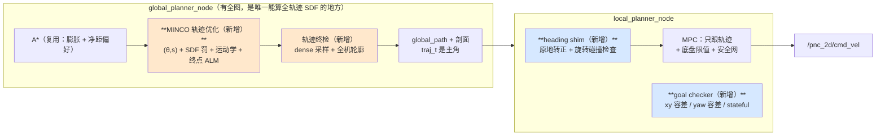

# MINCO 轨迹优化层开发计划（P6）

> 分支：`feat/minco-trajectory-optimizer`（从 `feat/add_log` 切出）
> 参考实现 ①：`/home/gmd/r41_ws/DDR-opt`（ROS 1 catkin 全栈，GPL-3.0；**用户 2026-09-24 确认可用，项目不商用**）
> 参考实现 ②：Nav2 `nav2_rotation_shim_controller`（Apache-2.0，许可干净）

## 0. 本期范围（2026-09-24 用户两次收窄，**以此为准**）

**做**：A\* → MINCO（`(θ,s)`，SDF 罚 + 运动学 + 终点 ALM + 终检）→ 剖面随路径下发 → MPC 跟踪；
并把"到点 / 末朝向 / 原地对正"从 MPC 里**拔出来**做成独立层（参考 Nav2 `rotation_shim_controller`）。

**不做**：

| 不做 | 影响 |
|---|---|
| 走廊约束（`corridor_width` / 贴线） | 局部侧 `corridorSlice`/`StrictCorridor*` **不动不删**，但不在本期验收范围内 |
| 限速区前视 | 同上（`zoneSpeedLimitAheadFromProjection` 不动） |
| 禁行区停车 | 同上（`fuseForbidden`/`burnForbidden` 不动） |
| 路网（route_network） | 后端只跟 A\* 折线对接；route 模式留待后续 |
| `icrekf`（在线瞬心估计） | 用户明确不需要；`(θ,s)` 参数化里也没有它（差速是退化情形） |
| NMPC（ACADO + MATLAB 代码生成） | 不移植 |
| **换掉我们的 MPC** | **本期不换**；逻辑见 §2 末与 §5 R11（留到 M5 之后一次可回滚的 A/B） |

⇒ 本期**唯一的 IPC 改动**是给 `PlanPath.srv` / `FollowPath.action` 加剖面数组（§2）。

---

## 1. 要解决的是什么问题

现有链路：`A*(栅格) → global_path(折线) → MPC(20 Hz 同时干跟踪/避障/限速/走廊/对正)`

实测暴露的三个问题，都能追到"**MPC 在替上游擦屁股**"：

| 现象 | 根因（已量测） | MINCO 层如何消除 |
|---|---|---|
| 自由段**摇摇摆摆**（ω 相邻周期 +0.65→−0.65） | A* 折线切角 + 参考只是"大致往那儿走"，MPC 每周期都在做大横向修正 | 参考本身 C² 连续且贴近可跟踪极限 ⇒ 修正量天然变小 |
| **绕障效果差 / 贴墙**（0.15 m 处擦过障碍） | A* 只在"格心 + 膨胀"意义下避障；折线的**曲率与净距不可同时保证** | SDF 罚函数沿整条轨迹拉开净距，且平滑不与净距冲突 |
| MPC **同时干太多**（20 Hz + 1.4 m 前瞻，启发式参考） | 缺少"轨迹级可行性"这一层；MPC 拿到的路径不保证可跟踪 | 把"路径可行"降级为上游职责，MPC 退回跟踪器 |

**核心主张**：不要靠调 MPC 的权重去修几何问题；在 A* 与 MPC 之间补一层"**几何 + 运动学可行**"的轨迹优化，MPC 只保证"跟踪得动"。

DDR-opt 的做法印证了这条分工：它的 `mpc.cpp` 里**没有任何障碍代价**（`matrix_q=[15,15,0,1]`、`matrix_r=[0,0]`、`matrix_rd=[1,0.05]`），100 Hz 纯跟踪；避障/可行性全在 MINCO 后端（SDF 罚 + 运动学 + 终点 ALM + `check_final_collision`）。

---

## 2. 分层与数据流


```mermaid
flowchart LR
  subgraph G["global_planner_node（有全图，是唯一能算全轨迹 SDF 的地方）"]
    A["A*（复用：膨胀 + 净距偏好）"] --> M["**MINCO 轨迹优化（新增）**<br/>(θ,s) + SDF 罚 + 运动学 + 终点 ALM"]
    M --> C["轨迹终检（新增）<br/>dense 采样 + 全机轮廓"]
    C --> P["global_path + 剖面<br/>traj_t 是主角"]
  end
  P --> L
  subgraph L["local_planner_node"]
    S["**heading shim（新增）**<br/>原地转正 + 旋转碰撞检查"] --> MPC["MPC：只跟轨迹<br/>+ 底盘限值 + 安全网"]
    GC["**goal checker（新增）**<br/>xy 容差 / yaw 容差 / stateful"]
  end
  MPC --> V["/pnc_2d/cmd_vel"]
  style M fill:#ffe8cc
  style C fill:#ffe8cc
  style S fill:#d6e8ff
  style GC fill:#d6e8ff
```

**为什么放在全局节点**（回答上一轮悬空的问题）：
- MINCO 需要**整条轨迹范围**的 SDF 与梯度；局部节点只有 80×80 @0.1 m 滑窗 + ≤3 m 的 ESDF 点云。
- 全局节点**已经**订阅 odom（`topics.odom`）、持有 `CostMap2D`、持有 `ClearanceField`（净距偏好用的那个）。
- 走同一个 `plan()` 代码路径 ⇒ `/goal_pose` 话题触发与 `PlanPath.srv` 触发**自动都过 MINCO**。

**速度剖面归属（2026-09-24 用户纠正后修订）**：

**速度剖面 = 时间参数化，与几何是同一个优化问题的两个面，不能拆层。** 拆开的后果不是"精度差一点"，
而是**把已经解出来的可行性结论丢掉，让下游再猜一遍**（我们已经在 `brakeAcc` / `stopCoast` /
限速前瞻三处栽过 6.7 倍偏差，见 `doc/mpc_local_planner_plan.md`）。三条耦合都是硬耦合：

1. **曲率 ↔ 速度**：`v ≤ √(a_lat_max / κ)`。而 A\* 折线的 κ 是**噪声级**（实测直线上算出 curv 0.546 1/m，
   导致一加速就撞走廊硬界、MPC 趴窝）。让 MPC 基于折线 κ 限速 = 基于噪声限速。
2. **净距 ↔ 速度**：空旷处该快、贴障碍该慢。MINCO 有**全图**净距，能沿 s 给出正确剖面；
   MPC 只有 ≤3 m 局部 ESDF（感知只在 0<d≤3 m 发点）。
3. **时间分配 = 运动学可行性本身**。MINCO 的 `T_i` 就是剖面；`|v|/|a|/|ω|/|α|` 是否满足，
   是时间分配解出来的**结论**，不是下游能重新推出来的东西。

| 内容 | 归属层 | 理由 |
|---|---|---|
| **几何 + 时间参数化（= 剖面 v(s), v(t), a, ω, α）** | **MINCO（轨迹层）** | 只有它有全图；且与几何/净距硬耦合 |
| **限速（限速区、任务限速、曲率限速、净距限速）** | **MINCO** | 限速区是**地图语义**，跟着地图走；将来接禁行区/限速区时进它，不进 MPC |
| 底盘硬限值 `v_max/a_max/ω_max/α_max` | **配置单一来源**（MINCO 读；MPC 只做兜底钳位） | 限值≠剖面 |
| 底盘执行：ω 死区补偿、`cmd_vel` 标定、`stop_coast`、`brake_acc` | MPC / 底盘适配层 | 这是**执行**，不是剖面 |
| 到点判定 + 末段停靠（`approach`/`crawl`/±3 cm）+ 终点对正 | MPC | 产品策略 + 底盘可否原地转 |

⇒ **剖面必须传输给 MPC**：MPC 从"**算**速度"变成"**跟**速度（前馈）+ 底盘钳位 + 末段停靠策略"。

**传输方式**（低风险，因为 `corridor_width[]` 等已有数组都是**按 path 点下标对齐**的，不能换容器）：
- 保留 `nav_msgs/Path path`（RViz 可视化、`corridor_width` 下标对齐全部不变）；
- `PlanPath.srv` 与 `FollowPath.action` 增加 `float64[] traj_t`、`float64[] traj_v`、`float64[] traj_omega`；
- ★ **长度 ≠ `path.poses.size()` ⇒ 视为"没有剖面"**（整体失效，不是"部分有效"），并 WARN；
- 没有剖面时 MPC 走**现有**的自建剖面（= 现网行为）⇒ 这正是 M5 的 A/B 对照臂。

### ★ 参数化选型：改用 **(θ, s)**（2026-09-24 读原版代码后修订；我原计划写的是 (x, y)）

原版 `back_end` 的 MINCO 不跑在 (x, y) 上，而是跑在 **(θ, s)** 上（`Trajectory<5,2>`）：
`p = (θ, s)`、`v = (ω, v)`、`a = (α, a)`，jerk 为输入；XY 靠 **Simpson 积分**从 θ 还原：

    x = x0 + ∫ cos θ · ds ,   y = y0 + ∫ sin θ · ds
    （`traj_anal.hpp` 逐字如此，只含 cos/sin，**不含 ICR 项**）

这一条**比我原来的 (x, y) 好，采纳**。每一条好处都对着我们已经踩过的坑：

| (θ, s) 的好处 | 消掉我们哪个手搓补丁 |
|---|---|
| **yaw 是独立决策变量**（`ṡ=0, θ̇≠0` 是合法状态） | `align_in_place_deg` / `align_exit_deg` / `goalYawAlign()` / 到点对正那一整套 |
| 运动学**线性**：`ω=θ̇`、`v=ṡ` ⇒ 约束直接是 `\|ṡ\|≤v_max`、`\|θ̇\|≤ω_max`、`\|θ̈\|≤α_max` | 曲率限速 `v ≤ √(a_lat/κ)` + **折线 κ 是噪声**那个坑（实测直线上算出 curv 0.546） |
| 与差速底盘限值**同构**（我们配的就是 v/ω/a/α） | `reference_speed` / 曲率前瞻 / `crawl_speed` 之间反复调参 |
| **终点朝向是状态约束** `θ(T)=目标 yaw` | "末点 yaw 写死目标朝向 + 到点再原地转"的两段式 |
| 剖面的定义就是 `ṡ(t)`，无歧义 | "剖面到底传什么" |

代价（必须认账）：
- XY 是**派生量**（积分得到）⇒ **终点 XY 只能靠 ALM 拉回**（原版 `ALM update` + `FinalIntegralXYError`
  就是干这个的；我原计划里 ALM 只是"为了更准"，在这里是**必需**）。
- SDF 查询点也要先积分成 XY ⇒ 每次迭代多一层积分开销（原版用 `Integral_appr_resInt: 4` 控制）。
- **ICR 不需要**：积分式里没有 ICR 项 ⇒ 差速（ICR 在车体中心）就是本参数化的退化情形。
  `if_directly_constrain_v_omega`（轮速上限）与 `icrekf` 一并不要（用户已明确）。

### 与原版（DDR-opt）的差异对照

| 维度 | 我原计划 | 原版实际 | 差 |
|---|---|---|---|
| 参数化 | MINCO_S3 on **(x, y)**，yaw = 路径切线 | MINCO_S3NU on **(θ, s)**，yaw 独立 | **大（已改）** |
| 终点位置 | 是状态 ⇒ 直接钉住 | 是**派生量** ⇒ ALM 必须 | **大（已改）** |
| 速度约束 | κ 耦合（`v≤√(a_lat/κ)`、`ω=κv`） | 直接 `\|ṡ\|≤v_max`、`\|θ̇\|≤ω_max`、`\|θ̈\|≤α_max` | **大（已改）** |
| 剖面传输 | `nav_msgs/Path` + `float64[] traj_t/traj_v/traj_omega` | `carstatemsgs::Polynome`（**多项式**：`innerpoints[] + t_pts[] + init/tail 状态`） | 中（介质不同，思想相同） |
| MPC 怎么吃剖面 | 按 `traj_t` 采样成参考窗口 | `TrajAnal` 把多项式积成 `(x,y,θ,t)` 序列（0.1 s）；`xref(0..3,i)=x,y,v,θ`、`dref=v,ω` | 中 |
| MPC 代价 | 跟踪 + 障碍 + 限速（大杂烩） | `Q=[15,15,**0**,1]`（x,y,**v**,θ）、`R=[0,0]`、`Rd=[1,0.05]` ⇒ **无控制代价、无障碍项**，靠 Δu 正则 | 中 |
| 终端参数 | — | `shot_path_horizon: 0.5`：末段切到另一套权重（`PathpenaltyWeights` vs `penaltyWeights`） | 小（可后补） |
| 重规划 | 切轨迹重规划（借鉴③） | `ifCutTraj_` + `time_weight_backup_for_replan` | 一致 |
| safeDis | 借鉴① | `safeDis = min(0.85·起点实测净距, safeDis_)` | 一致 |
| 终检 | 借鉴② | `check_final_collision()`：采样整条轨迹查 SDF，`< finalMinSafeDis` 即拒绝 | 一致 |

★ 一个**反直觉的实测细节**：原版 `matrix_q` 里 **v 的权重是 0**（`[15,15,0,1]` 的第 3 项，
对应 `dQ[dimx] += Q[2]`）⇒ `dref(0)=v` 那一项**不进代价**；ω 参考（`dref(1)`）在代价里也没找到。
**⇒ 原版的剖面主要靠"参考点的时序"起作用**（`xref` 按 dt 采样 MINCO 多项式），速度参考只是个开关项。
这条对我们的忠告：**光传 `traj_v` 数组、而 MPC 仍用自己的时间分配 = 剖面根本没传**；
必须让 MPC **真的按上游 `t` 采样**（`traj_t` 是主角，`traj_v` 是辅助）。

### ★ 对正/到点分层修订（2026-09-24 用户指定：参考 Nav2 `rotation_shim_controller`）

**决定**：把"原地对正 / 末朝向 / 到点判定"**从 MPC 里拔出来**，做成独立层。
这不只是"功能搬家"，而是**换掉了控制律** —— 我们反复踩的坑，根因就在律本身：

| Nav2 机制（源码事实，Apache-2.0） | 正对我们哪个坑 |
|---|---|
| **恒定角速度** `ω = sign(e)·omega_rot`，再 `clamp(ω, ω_prev ± α_max·dt)` | 我们 `align_gain·e` 在小误差时衰减进**底盘死区**（`align_w_min` 就是这么来的）；恒速律**不会产生任意小的指令** |
| **减速防过冲** `\|ω\| = min(\|ω\|, √(2·α_max·\|e\|))` | 替代"靠放宽容差忍过冲"，且每个量都有物理含义 |
| **迟滞交棒**：触发用 45°(0.785)，已在转时改用 22.5°(0.3925) | 我们手搓的 `align_exit_deg`。★ 交棒时**仍在转**（≈1.59 rad/s）⇒ 交棒平滑 |
| **旋转碰撞检查**：按控制周期前向模拟 1.0 s 扫过的 yaw，逐位姿查 footprint，不安全就 `throw` ⇒ **交回主控制器** | "原地转其实在划小弧 ⇒ 漂 0.09~0.19 m ⇒ 撞"；`align_min_clearance` 只是弱化版 |
| **触发点 = 路径前方 0.5 m 处的朝向** | 比"只跟终点朝向比"更早发现"接下来要拐"，避免走出不可跟踪的弧线 |
| **位置/朝向是两个独立判据** `{xy_tol, yaw_tol, stateful}` | 我们把两者混在节点层 + MPC 里 ⇒ 这就是为什么在那一处反复踩 |
| **交棒角速度 ≤ 主控制器 `max_ω`**（README Etc Notes） | ★ 跳层不变量，见 R10 —— 与"跳层物理量只配一遍"同一个教训 |

**落点**：`core/goal_checker.hpp` + `local/heading_shim_planner`（实现我们已有的 `LocalPlanner`
接口、内部持有 primary）⇒ `local.type: heading_shim` + `shim.primary: mpc`，**local 节点零改动**。
详见 M5.1/M5.2。

**推论（重要）**：把产品逻辑拔出来之后，MPC 只剩"跟轨迹 + 底盘限值 + 安全网" ⇒
**"要不要换成原版 MPC"从架构问题降级为工程取舍**。⇒ 本期**不换**，留到 M5 之后一次可回滚的 A/B。

---

## 3. 文件清单

| 类别 | 文件 | 说明 |
|---|---|---|
| 接口 | `include/pnc_2d/core/trajectory_optimizer.hpp` | `TrajectoryOptimizer` 抽象 + `TrajOptRequest/Result/Stats` + `TrajStatus` |
| 复用（vendored） | `include/pnc_2d/traj/gcopter/{minco.hpp,lbfgs.hpp,trajectory.hpp,root_finder.hpp,sdlp.hpp}` | 直接 vendor 原版算法层（用户已确认非商用可用）；**保留 GPL-3 许可头 + 加 `README.md` 注明来源/版本/commit/改动** |
| 实现 | `include/pnc_2d/traj/minco_optimizer.hpp` + `src/traj/minco_optimizer.cpp` | **(θ,s) 参数化映射 + Simpson 积分 + SDF 罚 + 运动学罚 + 终点 ALM + 时间优化**（结构参照原版 `back_end/src/optimizer.cpp`） |
| 实现 | `include/pnc_2d/traj/traj_anal.hpp` | 多项式 → `(x,y,θ,t)` 序列 + `(v,ω)` 求值（参照原版 `mpc_controller/include/mpc_controller/traj_anal.hpp`） |
| 基础设施 | `core/clearance_field.{hpp,cpp}` **扩展** | 新增**双线性世界坐标查询 + 梯度**（现在只有 `distanceToLethal(int x,int y)`） |
| 工厂 | `core/factory.{hpp,cpp}` **扩展** | `createTrajectoryOptimizer(params)` + `createLocalPlanner` 支持 `heading_shim`（内部再建 primary）；未知类型返回 `nullptr`（与现有约定一致） |
| 分层（新增） | `include/pnc_2d/core/goal_checker.hpp` | xy/yaw 容差 + `stateful` 锁存（Nav2 `SimpleGoalChecker` 语义） |
| 分层（新增） | `include/pnc_2d/local/heading_shim_planner.hpp` + `src/local/heading_shim_planner.cpp` | 装饰器，参考 Nav2 `RotationShimController`；原地对正 + 旋转碰撞检查 + 迟滞交棒 |
| 节点 | `src/nodes/global_planner_node.cpp` **改** | `plan()` 成功后跑 MINCO → 终检 → 发布；失败**降级用 A* 原路径**；统计进 status |
| 配置 | `config/traj_minco.yaml`、`config/local_heading_shim.yaml`（新）+ `config/pnc_2d.yaml`（加 `traj.*`/`shim.*` 默认值） | 按现有"配置拆分"顺序合并（`extra_config` 可覆盖） |
| 测试 | `test/test_clearance_gradient.cpp`、`test/test_minco_optimizer.cpp`、`test/test_trajectory_check.cpp`、`test/test_heading_shim.cpp`、`test/test_goal_checker.cpp` | 全部**离线**、毫秒级（不依赖 ROS/仿真） |
| 离线工作台 | `test/tools/traj_workbench.cpp` | 读地图 + 一条路径 → 打印/导出 MINCO 前后指标（净距分位、曲率、求解时间、失败率），不跑仿真 |
| 文档 | 本文件 + `README.md` + `doc/mpc_local_planner_plan.md` 增补 | |

**开关（A/B 必须可切）**：`traj.type: none | minco`（默认 `none`）、`local.type: mpc | heading_shim`（默认先保持 `mpc`；切到 `heading_shim` 时 primary 仍是 `mpc`）—— 先保证现网行为零变化。全局节点的 status 消息里带 `"MINCO: 净距 0.28→0.61 m, max|κ| 0.49→0.12, 18 ms"` 这类可读结论。

---

## 4. 阶段划分

每一阶段都以"**能测的量**"收口，不写"看起来合理"的结论。

### M0 准备（本步，已完成）
- [x] 从 `feat/add_log` 切出 `feat/minco-trajectory-optimizer`
- [x] `.gitignore` 加 `DDR-opt`（ROS 1 克隆，避免污染；`colcon build` 在根目录会撞）
- [x] 计划文档（本文件）
- 交付物：分支 + 文档；无代码风险

### M1 距离场梯度基础设施（小而关键，先做）
- `ClearanceField` 新增：`bool buildFromMap(...)` 保持不变；新增
  `double distanceAtWorld(double wx, double wy) const`（双线性）、
  `void gradientAtWorld(double wx, double wy, double g[2]) const`（中心差分/双线性解析梯度）、
  `bool insideWorld(...)`。
- 同时提供"**全机轮廓**净距"查询：`double footprintClearanceAt(FootprintCollisionChecker&, x, y, yaw)`
  —— 终检要用它，不能只用点净距（车长 0.70 m，点净距 0.28 m 照样撞）。
- 单测 `test/test_clearance_gradient.cpp`：
  ① 单面墙的解析梯度（法向 1.0 / 切向 0.0，容差 1e-3）；
  ② 角点处的梯度方向（指向最近致命格）；
  ③ 与"暴力逐格搜索最近致命格"逐点比对（随机 200 点，误差 ≤ 0.5 格 × 分辨率）；
  ④ 边界外/越界返回保守值且不 UB。
- 验收：单测全绿；`footprintClearanceAt` 与 `FootprintCollisionChecker::poseInCollisionAtMargin`
  在 ±1 mm 扫描下**判据一致**（同零点）。

### M2 MINCO 核心库（离线可测，不碰 ROS）
- **状态**：`(θ, s)`，S3 链（`p, v, a` + jerk 输入），即原版 `MINCO_S3NU` / `Trajectory<5,2>`。
- **内层**：固定路点 + 固定时间 ⇒ 最小化 ∫ jerk²，解**带状线性系统**（vendor 的 `minco.hpp` 里就有，O(N)），
  C² 连续。
- **XY 还原**：`x = x0 + ∫cos θ ds`、`y = y0 + ∫sin θ ds`（Simpson，`Integral_appr_resInt: 4`）；
  终点 XY 误差就是这个积分与目标的差。
- **时间分配**：启发式初值 `T_i ∝ 段长 / v_ref` + 对 `T_i` 做 L-BFGS（权重对照原版
  `PathpenaltyWeights`/`penaltyWeights`：`time_weight` / `mean_time_weight` / `moment_weight` /
  `acc_weight` / `domega_weight`；末段用 `shot_path_horizon` 切另一套）。
- **代价与约束**：
  - SDF 罚（软）：`w_sdf · max(0, d_safe − d)²`，梯度由 M1 提供（**查询点必须先积分成 XY**）；
  - 运动学（罚，全部线性于状态导数）：`|ṡ| ≤ v_max`、`|s̈| ≤ a_max`、`|θ̇| ≤ ω_max`、`|θ̈| ≤ α_max`，
    向心项 `|v·ω|`（`cen_acc_weight`）；**不做逆速**（`ṡ ≥ 0`，四足不倒车）；
  - **终点 XY 等式 = ALM（增广拉格朗日）** —— 因为 XY 是派生量，这是**必需**而不是可选；
  - **终点朝向 = 状态约束 `θ(T) = 目标 yaw`**（不再靠 MPC 的 `goalYawAlign` 收尾；
    那个降级成兜底）；
  - 起点状态作为**初值条件精确固定**（不是约束）。
- **`safeDis` 自适应（借鉴机制 ①）**：`d_safe_eff = min(0.85 × 起点实测净距, d_safe_max)`。
  这一条直接对应我们之前用"虚拟起点"硬扛的那个场景（起点擦余量 ⇒ 局部 BLOCKED ⇒
  重规划又 `START_FOOTPRINT_COLLISION` ⇒ 任务死锁）。DDR-opt 一行解决。
- 单测 `test/test_minco_optimizer.cpp`：
  ① **单调性/平滑性**：折线输入 ⇒ 输出 max|κ| 严格下降、C² 残差 ≤ 容差；
  ② **净距不退化**：柱子场景下最小净距（排除首末点）不低于输入；
  ③ **运动学硬事实**：输出采样后 `max|v| ≤ v_max·(1+1e-3)`、`|ω| ≤ ω_max·(1+1e-3)`；
  ④ **终点精度**：`|p(T) − goal| ≤ 1 cm`，并打印 ALM 迭代数与最终乘子；
  ⑤ **退化输入**：全等路点 / 单段 / 直角折返 / 起点在障碍余量内，均**不崩且给结论**；
  ⑥ **时间上界**：607×307 地图、30 m 路径，P99 求解 ≤ 50 ms（Release）。
- 验收：以上单测全绿 + `traj_workbench` 能打印指标表（这就是给用户看的量）。

#### M2 实施记录（2026-09-24，**与上面原计划的偏差以此为准**）

时间参数化**没有**用原计划的"L-BFGS 调 `T_i`"，而是：

1. **曲率感知速度剖面**（解析，无迭代）：`v_cap(s) = min(v_ref, ω_max/κ)`（三点式曲率，±0.30 m 基线）
   → 前后向加速度受限扫描（`v_i = √(v_{i-1}² + 2·a_cp·Δs)`，`a_cp = 0.5·a_max`）→ 弧长-时间映射。
   弯道**局部**减速，而不是全路变慢（这是折角用例时间×19.8 → 1.03 的关键）。
2. **路点 = 时间等分 + 弧长按剖面走**（反过来会让带状系统解出剧烈摆动）。
3. **终点 XY 修正用数值 Jacobian + 阻尼最小二乘**（不是原计划的 ALM）。免迭代调和、
   一次收敛；ALM 留作冗余。
4. **时间缩放**保留为**安全网**（解析：`T_i ← k·T_i` ⇒ `v/k`、`a/k²`，几何不变）；
   正常应退出（k ≈ 1）。

**修掉的两个"剖面不自洽"（"轨迹比剖面慢 1.8 倍"的真根因，不是多项式跟不上）**：

- ① **端点速度被地板抬高**：剖面写 `v_prof[0] = max(v0p, v_floor)`。车静止起步（`v0p = 0`）时
  被抬到 `v_min = 0.2 m/s`，剖面于是声称"0.084 m 用 0.40 s 走完"；而从静止、`|a| ≤ 0.25`
  走完 0.084 m **至少**需要 `√(2·0.084/0.25) = 0.82 s`。少算的时间只能靠超限加速度补：
  实测 `max|a| = 1.567 ≈ 2·0.084/0.4² × 1.5`（常数加速度需 1.05，min-jerk 峰值更高）
  = **6.3 × a_cp** ⇒ 解析缩放乘 `k = 1.78` ⇒ 8 m 直线 27 s（本该 12.5 s），`max_v` 0.9 → 0.508。
  ⇒ 端点**如实**用请求给的边界速度（0 就写 0）；`v_min` 地板只管**内部**点（语义是"弯道别爬"）。
- ② **t→s 用线性插值**：`v ∝ √s` 是**凸**的，v(s) 线性插值会**高估** v —— 剖面说
  "s = 0.053 用 0.39 s"，真实需要 0.65 s ⇒ 路点被放到**物理上到不了**的位置 ⇒ 多项式照旧超限
  ⇒ 缩放仍乘 1.45。⇒ 改用"区间内**恒定加速度**"的精确关系（`v² = v₀² + 2a·Δs`、
  `Δt = (v − v₀)/a`），`s→t` 与 `t→s` **互逆且都是精确式**
  （区间时长 `2Δs/(v₀+v₁)` 与 `(v₁−v₀)/a` **恒等**，不是梯形近似）。

> 教训："多项式跟不上分段剖面形状"是**错的**结论（曾被写进提交信息与本节）——
> 取证方式是**逐段打印剖面意图 vs 实得**，一眼看到差在**首段**（端点条件不一致），
> 不是全局形状。**先取证再改算法**，否则会去重写本来没问题的东西。

**③ 剖面看不见"转向"（2026-09-24 用户 RViz 实测：`5.62 m` 走出 `144.75 s`、`max|v| 0.070 m/s`、
时间缩放 `×10.10`）** —— 与 ① 同一类错误（**剖面看不见某个状态约束**），两条线索都能直接算出来：

- `折线max|κ| = 14.0` 是**伪造的**：`i=0` 处 `atS(s−win)` 与 `atS(s)` 是同一个点 ⇒
  `atan2(0,0)` 返回 0 被当"入方向" ⇒ 转角被算成"相对 0 朝向的绝对朝向"。
  $14.0\times0.15\ \text{m} = 2.1\ \text{rad}$ = 路径首段朝向。
- 未缩放 $\max|\omega| = 0.65\times10.10 = 6.57$ rad/s（限 0.65）。`θ(0) = req.start.yaw`
  是**车的实际朝向**（odom），而 A\* 从当前格朝**任意方向**迈第一步（不看车朝向）⇒ 实测两者差
  **2.1 rad**。曲率只描述折线自己，**完全看不见这个差** ⇒ 不给它分配时间 ⇒ 2.1 rad 只能在一个
  `T_step`(0.4 s) 内转完 ⇒ $\omega=5.25$，多项式过冲到 6.57。
- 还有一条把问题掩盖成"随机"的：剖面写 `max(v_floor, min(vcp, ω_max/κ))` —— κ=14 处上限只有
  0.046，地板 `v_min=0.2` 把它抬回 0.2（4 倍）⇒ 剖面**谎报速度**。

三处修改：

1. **剖面判据改为从 θ(s) 直接推**（不再从折线几何另算一份曲率）：θ(s) 按"与路点同一套规则"
   生成（起点 = `req.start.yaw`，其余按切线解缠）；速度上限取两个 κ 估计的**大者**：
   **逐段必要条件** $|\Delta\theta_i|/\Delta s_i \Rightarrow v \le \omega_{\max}\Delta s/|\Delta\theta|$
   （对离散 θ 序列精确成立，起点朝向差天然落在 `i=1` 段）+ ±`tan_base` 基线窗口（只当**平滑偏好**）。
   顺带修掉 `v_min` 地板覆盖运动学上限的错 —— 地板降级为**告警阈值**。
2. **路点朝向做转向速率限幅**，律直接借用项目自己的 Nav2 rotation_shim 三件套
   （`ω_des = clamp(e/Δt, ±ρω_max)` → `clamp(ω_prev ± ρ_α·α_max·Δt)` →
   `sign·min(|ω_des|, √(2ρ_α α_max|e|))` 防过冲）。**硬 clamp 试过**：斜率从 `ρω_max` 直接掉到 0
   ⇒ α 冲激（实测 4.34 = 1.7×α\_{max}）⇒ 缩放又乘 1.32。转不完的部分表现为"轨迹滞后于切线"
   = 起点附近**原地转**（头 1 s 位移 0.001 m）。
3. **`ρ_w = 0.6`，且剖面与限幅必须用同一个系数**：C² 多项式在两个路点**之间**的 ω 峰值会过冲到
   路点斜率的 ~1.6 倍（与 `acp = 0.5·a_max` 完全同理）。实测限幅取 0.8 时多项式 ω 反而到
   $1.26\omega_{\max}$ ⇒ 缩放乘 `k=1.26`。**两处系数不一致 = 两套剖面**（这个错已经犯过）。

实测（新用例 `StartHeadingMismatchIsTurnedWithAllocatedTime`，起点 yaw 与路径差 120°）：
`max|ω|` 0.618/0.65、`max|α|` 2.497/2.5、`k = 1.038`（不是 10.10）、时长 **144.75 → 27.15 s**、
头 1 s 位移 0.001 m、求解 1.6 ms。

**终点修正的秩亏（另一个"冻住"的坑）**：折角用例末端 0.8 m 是沿末端朝向的**直线** ⇒
`∫cosθ·ds` 与这段的 s 分布无关 ⇒ `∂p_end/∂s_k ≡ 0`，J 第一列**全零**、`det = 0`
（实测 `J = [-0.000 -0.302; -0.000 -0.007]`）。旧代码一见 `|det| ≤ 1e-6` 就掉进"沿末端
切线的 1 维退化分支"，而那个分支只能沿末端朝向挪 `s_total`（末端朝向 π/2 ⇒ 只能动 y），
残差却全在 x 上 ⇒ 12 次迭代残差冻在 0.0274 m。⇒ 自由变量补上 `s_total`（J 变 **2×3**），
用**阻尼最小二乘** `(JᵀJ + λI)⁻¹Jᵀr` —— 恒可逆，λ→0 退化为**最小范数解**（秩亏方向自动不动）。
实测一步收敛：**0.0274 → 0.0005 m**。

**起点守卫（新增 `TrajStatus::kStartBlocked`）**：车体**真实轮廓**（`safe_margin = 0`）
压在致命格上 ⇒ 拒绝规划。与 `astar_planner.cpp` 的虚拟起点守卫**同口径**
（"起点在余量带里 ⇒ 换虚拟起点；真实轮廓都放不下 ⇒ 停车报错交人工"）——
否则 A\* 拒了、本层却硬算，口径就分叉了。旧行为会从柱子内部算出一条
`30 段 / 80.2 s / 时间×6.85 / 终点残差 0.000 m` 的轨迹：净距统计与终点修正全建在
假前提上，还把"定位漂移/地图错"这个真故障藏起来。
**只拒"真实轮廓压上"**：落在**余量带**里必须照常规划（全局图与感知图差几 cm 是常态，
拒了就是不可恢复的死局）。

**实测数字（单测口径，Release）**：

| 场景 | 修前 | 修后 |
|---|---|---|
| 8 m 直线（`v_ref = 0.6`） | 26.72 s / `max_v` 0.33 / 1.0 ms | **15.74 s / 0.60 / 0.6 ms** |
| 8 m 直线（`v_ref = 3.0`，考运动学） | `k = 1.776` / 20.59 s / 0.508 | **`k = 1.006` / 12.56 s / 0.900** |
| 90° 折角 | 终点残差 0.0265 m / 时间×19.8（更早） | **0.0005 m / 时间×1.03** |
| 起点压障 | 硬算出一条 80.2 s 轨迹 | **`START_BLOCKED`（不给轨迹）** |

**关于"换 B 样条"与"分段"（2026-09-24 用户提出，已评估）**：

- **B 样条：本期不做**，理由是**根因不在多项式族** —— 修掉剖面不自洽后 MINCO 已能
  逐段跟随剖面（比 1.01），换 B 样条只是换个工具，那三个 bug 照样存在。
  但它的两个**结构性**好处记在这里，作为**升级路径**：均匀三次 B 样条的
  `v(t) = Σ (ΔP_i/Δt)·B_i(t)`、`a(t) = Σ (Δ²P_i/Δt²)·B_i(t)` ⇒ 由**凸包性质**，
  `max|v| ≤ max|ΔP_i|/Δt`、`max|a| ≤ max|Δ²P_i|/Δt²` 是**可证明**的界（现在靠
  "剖面 + 时间缩放"事后校验）；而且它是**逼近**、不是插值，最后一个控制点直接就是目标
  ⇒ 终点 XY 精确（秩亏那套完全不需要）。**触发条件**：若将来要求"轨迹绝不允许超出剖面"
  的形式化保证，或需要 O(N) 无迭代生成。
- **分段：它不是加速手段**。拆 K 段分别解，总 FLOPs 一样（同样 O(Σn)）；能省的只有"终点
  修正只在**最后一段**做"（4 次求解/迭代）。真正的加速来自**时长**——所有 O(N·时长) 的
  成本（段数、积分步数、净距统计）都跟着涨，而时长已经在上面从 20.6 s → 12.6 s（×0.61）。
  分段的真实价值在 M6：**重规划时只重算受影响的那一段**（缓存），不是单次求解提速。

### M3 轨迹终检（借鉴机制 ②，同时是 M2 的安全门）
- `TrajectoryOptimizer::checkTrajectory()`：沿轨迹 **2 cm** 密集采样，每点做
  **全机轮廓**判定（非点净距）；两级阈值：
  - 罚函数瞄"舒适净距" `d_safe`；
  - 终检只要求"**不碰**" `d_hard`（= 现有 `footprint.safe_margin` 那一档）。
- 终检不过 ⇒ **不用这条轨迹**（降级 A* 原路径 或 重试一次更小 `d_safe`），并在 status 里点名
  失败点坐标 + 实测净距（可操作，不写"优化失败"四个字）。
- 单测：构造"罚函数收敛但终检不过"的用例（把 `d_hard` 卡在罚目标之上），钉住"终检说了算"。
- ★ 这一层顺带补齐现有缺口：**全局路径现在只有节点级检查，没有连续轨迹检查**
  （`START_FOOTPRINT_COLLISION` 类问题都出在这里）。

#### M3 实施记录（2026-09-24，**与上面原计划的偏差以此为准**）

- 落地为**自由函数**（不是虚方法）：`checkTrajectory(samples, ck, prm)` 声明在
  `core/trajectory_optimizer.hpp`、实现在 `src/core/trajectory_check.cpp`。
  理由：它只依赖"样本 + 判定器 + 阈值"，与优化器实现无关 ⇒ 节点侧也能调（M4 发布前再查一遍），
  且可独立单测。另加 `trajSamplesFromPath(path, ds)` 把折线转成样本（朝向 = 线段方向）⇒
  **降级路径 A\* 也必须被终检过一遍**（降级不能降到没人查的东西上）——原计划没写到这一条。
- **硬门 `d_hard` 默认取 0（"不碰"），不是 `footprint.safe_margin`**。原因：轮廓判定把位姿
  **吸附到格心**（误差 ±半格 = ±5 cm，见 R13），半格量级的余量当硬门会**随机失败** ——
  那是判据噪声，不是性能问题。余量改作 `check_warn_margin` **只记一笔**。
- ★★ **采样必须同时按弧长与朝向**（原计划只写了"2 cm 密集采样"，这是本层最容易漏的洞）：
  轨迹现在会**原地转**（起点朝向与路径首段差很大时就是，实测头 1 s 位移 0.001 m），原地转
  几乎不产生弧长 ⇒ 只按 `ds` 采会**整段漏掉**旋转扫掠。所以子步取
  `max(⌈Δs/ds⌉, ⌈|Δyaw|/dyaw⌉)`。判据用例：给 2 个样本（同一位置、yaw 0→π）
  · 只按弧长 ⇒ 查 **2** 个位姿 ⇒ 端点对矩形车体对称、都安全 ⇒ **判"通过"**（漏检）
  · 带 `dyaw` ⇒ 查 **33** 个位姿 ⇒ **19 个不过**、最差净距 **−0.039 m** ✓
- 接进 `optimize()` 作**交付门**：不过 ⇒ `status = CHECK_FAILED`，`samples` **保留**（失败点要
  看得到），但状态明确"不得执行"；`message` = 终检结论 + 优化器 note。同时**删掉**原来那段
  "在输出采样上量最小净距"的循环（同一件事别做两遍）—— 现在 `min_clearance*` 直接来自终检
  （更密、含朝向），另加 `check_points/check_violations/check_worst_clearance/check_worst_s`。
- `traj_viz_node`：失败时**仍然把轨迹发出来**（这是可视化节点，用户必须看到失败在哪），
  但日志 WARN + 状态前缀 status + 明说"不可执行，仅用于诊断"。
- ⚠ 没有判定器时**不检查**（`check_ok` 保持 true，但 note 说清"未做终检"）。第一版我
  写成了无条件解引用 `ck_`，测试立刻**段错误** —— 这个保护是原有的，别丢。
- 配置：`traj.check_ds 0.02` / `check_dyaw 0.10` / `check_hard_margin 0.0` /
  `check_warn_margin 0.05`（每个都写了理由）。
- **仍待做（原计划的"重试一次更小 d_safe"）**：没做，原因见下面「待定」——
  实测表明"硬门不过"的常见原因是**平滑没收敛**（目标 0.76 m / 达成 0.55 m），
  而**减小** `d_safe` 只会让平滑更不积极，方向是反的。真正对症的是 DDR-opt 机制 ①
  （`safeDis = min(0.85 × 起点实测净距, safeDis_max)` 自适应**下调**目标），
  以及/或者允许"起点/终点锚点附近豁免"。这两条都需要单独量测，先记在这里。

##### 机制 ① 已量测，结论与预期相反 ⇒ **默认关闭**（commit `79e8ad2`）

用户 2026-09-24 批准"做 A"（机制 ① + 锚点豁免，目标是降终检拦停率）。实现并**量测**后：

| 贴墙走 10 m、离墙 0.6 m | 端点自适应下限 | **实际达成净距** | 缺口 | 路径偏移 |
|---|---|---|---|---|
| 机制① **开**（`ratio=0.85`） | 0.492 | **0.578 m** | 0.007 | 0.039 |
| 机制① **关**（默认） | 0.622 | **0.607 m** | 0.015 | 0.036 |

**根因是结构性的**：降低目标 ⇒ SDF 罚提前归零 ⇒ 锚定项把路径拉回来 ⇒ **实际达成净距变低**。
而 M3 终检查的是**实际净距** ⇒ 开它只会让拦停**更频繁**。缺口变小只是"逐点目标更松"这个
**报告口径**的事，不是安全变好。（原版用它是对付"起点在死角落里"——那里宁可少推也不要把
路径挤歪，与我们的判据方向相反。）

⇒ 交付：`smooth_safe_ratio` 默认 **0 = 关闭**（同 `max_length_m: 0 = 不截断` 的约定），
能力/数据/开关用例都保留；同时**保留更诚实的指标** `smooth_shortfall = max(逐点目标 − 实际净距)`
（0 = 平滑在自己的目标下做到了）—— 正是这个新指标让我**量出**了机制 ① 是反效果。
逐点目标按**点索引**给（不是实时弧长：实时弧长是位置的函数，忽略它的导数会失真、L-BFGS 会卡）。

**真正的杠杆也量了**（`AvoidanceWeightVsAchievedClearanceIsMonotoneAndMeasured`，
并钉住不变式"加大避障权重不得让实际净距变小"）：

| `w_sdf` | 达成净距 | 路径偏移 |
|---|---|---|
| 2.0（现值） | 0.607 m | 0.036 m |
| 4.0 | 0.611 m | 0.037 m |
| 8.0 | 0.615 m | 0.038 m |
| 16.0 | 0.619 m | 0.039 m |

收益**单调但饱和**、代价几乎不变 ⇒ 真在地图上看到拦停时可调到 8。**先留 2.0** ——
更高的权重在更拥挤的图里可能把路径推进别的障碍，这个风险**没量过**。

> ★★ **关于"拦停率"的关键认识**（直接影响下一步判断）：M3 终检是**含朝向**的，比
> `外接圆半径 + margin` 那条**中心线**判据**宽松得多** ⇒ **"达成 < R_circ" 并不等于终检会失败**
> （贴墙用例：达成 0.439 < R_circ 0.4717，终检**通过**）。目前看到的失败案例都是
> **几何本身就勉强**（实测那条：真实净距只剩 5 cm，而车长 0.7 m ⇒ 一低头就撞）。
> ⇒ "拦停率"必须用**真实地图真实数据**量，不能靠合成几何外推。

> ★ 顺带修了两个**测试自身的错**（都是加了守卫/终检才暴露的，记下来避免重犯）：
> ① "余量带"用例原来把余量取 0.15 且在带的下沿取点 ⇒ 真实净距只有 5 cm，车身一低头
> **真的会撞**（终检给出 −0.034 m）。**终检抓对了，是用例前提太弱** ⇒ 余量取 0.35（> 一格）
> 并在带内取**上沿**（真实净距最富裕处）；
> ② 夹具图只有 6×6 m，而用例终点写在 `(8.0, …)` = **图外**（图外一律视为致命）。

### M4 节点接线（A/B 开关 + 发布）

#### ★ 三个已拍板的决定（2026-09-24，用户确认）

**决定 A：剖面按【弧长】传（`traj_s/traj_v/traj_w`），不按时间传。**
原计划写的是 `traj_t`。改的理由：
- 局部 MPC 的参考**本来就是弧长参数化**的（`ref_s_` / `projectOntoReference` → `progress_s_`），
  OCP 里消费的就是 $v_{\text{ref}}(s)$ ⇒ 弧长是**天然**的接口；
- 按时间传需要 MPC 维护与上游一致的**时间基准**（停车/延迟/取消都要重同步）——那是 M6 的活，而且脆；
- 弧长索引**对"停车再走"天然免疫**：被动态障碍挡 10 s 后再走，$s$ 没跳、$v(s)$ 还是对的，
  不会出现"追进度"那种冲出去的问题。
**丢掉的**：只有"必须在 t 时刻到 s"这种时序约束 —— 跟踪任务不需要。

**决定 B：M4 只管 `free` 模式；route/贴线模式明确不动。** 理由是硬的：
- MINCO 会**横向偏移**平滑路径 —— 实测 `path_shift_max` 到 **0.30 m**；
- 而 route 模式下 `corridor_width` 是**硬约束、不可违反**（决策 12），严格通道半宽 = 0（数值下限 0.05 m）；
- 0.30 m 的偏移在严格车道上**非法** ⇒ MPC 直接 `BLOCKED`；
- 要让"平滑"与"贴线"共存，得把走廊做成 MINCO 的**线性硬约束** —— 那是 **R6 明确排到后面**的事。
⇒ 判据：`has_corridor == true` ⇒ **跳过 MINCO**，路径/走廊/剖面全部保持今天的样子（零风险）；
`has_corridor == false`（A\* 自由空间任务）⇒ 走新链路。

**决定 C：`map_epoch` / 换图失效重检 不在 M4 做**（用户：运行中一般不换图）。
只记为**已知限制 + 触发条件**（见 R14）。

#### 分步（每步都能独立验证）

**M4.1 剖面下行管道**（不动 MPC 行为）：srv/action/manager/node 打通字段，全局节点先发
**自己的 A\* 路径 + 空剖面**，再发"把 `s/v/w` 填上"的版本 ⇒ 端到端只验"字段能通、长度对、
日志能看到"。验：local 侧打印收到的点数 + 首末 $s/v$；两侧 $s$ 轴长度一致（差 ≤ 1%）。

**M4.2 全局节点接 MINCO**（仅 free 模式）：`plan()` 成功后组请求（`start` = 当前位姿、
`goal`、`start_v` 优先 odom twist；为 0/不可信（`/lightning/perception/pose` 的 twist 很可能恒 0）
⇒ 用**位姿差分**（0.25 s 窗口 + 低通，复用 `local.vel_from_pose` 同一套做法），再不行取 0）
→ `optimize()` → **两道门**（`kin_ok` + `check_ok`）→ 通过则用 dense 轨迹替换路径
（`traj.publish_spacing: 0.05 m`，⚠ 必须 ≥ MPC 切线基线 `min_span=5 cm`）+ 打包剖面；
不通过则 A\* 原路径 + 空剖面 + status 点名原因。

**M4.2 已完成 + 实测（2026-09-24，离线 A/B `scripts/traj_ab_probe.sh`）**：地图
`data/go2_sim_map`，起点 (-3.975, 4.425) → 目标 (4.025, 4.425)（8.00 m 直线，两侧 ≥0.6 m 净空）。

| | `traj.type: none` | `traj.type: minco` |
|---|---|---|
| status / success | SUCCESS / true | SUCCESS / true |
| `path.poses` | 30 | **136**（0.05 m 稠密） |
| `traj_s/v/w` | 0 / 0 / 0（`traj_valid=false`） | **136 / 136 / 136**（`traj_valid=true`） |
| 求解 | A\* 2.1 ms | A\* 1.3 ms **+ MINCO 6.4 ms**（平滑 0.1 / MINCO 6.3 / 统计 5.8） |
| 轨迹 | — | 8.00 m / **15.74 s** / max\|v\| 0.60 / \|a\| 0.35 / \|κ\| 0 / 缩放 ×1.000（收敛 是） |
| 两道门 | — | 终检 566 点 **0 不过**、净距 0.575 m｜运动学 **过** |

三条**必须记下来的**读数：

1. **`plan_time_ms` 不含 MINCO**（那个字段来自 A\* 的 `stats`）。比总耗时要看日志里的
   `求解 x ms`，否则会得出"MINCO 不花时间"的错误结论。
2. **当前没有任何约束在起作用**：`max|v| 0.60 = traj.v_ref`（不是 `v_max 0.90`）、
   `max|a| 0.35 < a_max 0.50` ⇒ 时长是被**时间初值的 `time_margin ×1.15`** 锁住的
   （15.74 s vs 约束允许的 ~13 s）。即剖面**系统性保守约 15%**。要提速得加"向下收紧"的
   一遍缩放（本期不做，先记账）。
3. **走廊模式直接跳过**：`has_corridor == true` 不优化（`traj_note` 写"走廊模式…"）
   ⇒ 主链路的 route 模式**零改动**，A/B 只能在 free 模式做。

**★ R15：探针必须跑在隔离域**（`PROBE_DOMAIN_ID`，默认 31）。脚本自带 map_server
（往 `global_map/occupancy` 发 latched 图）与一个 `global_planner` 节点；与正在运行的整套
系统同域时会 ① 两边的图互相覆盖（后发的留在下游缓存里）、② `~/plan_path` 服务名撞车
（探针可能调到别人的旧节点，字段都对不上）。2026-09-24 实测踩到；恢复办法 = 对现网
map_server 调一次 `~/load_map` 让它重发自己的图。

**M4.3 MPC 用剖面**（A/B 开关）：`refSpeedAt(s)` 有剖面时
`v = min(v_profile(s), 底盘钳位, 末段 approach/crawl, degraded 限速)`，并**删掉** MPC 自己的
`lat_acc_max/curv` 与 `brake_acc` 制动剖面 —— **是删不是取 min**：取 min 会留下"两套剖面"的尾巴
（R8/R9 警告的正是这个）。无剖面 ⇒ 走今天的分支（逐点一致）。

**M4.3 已完成**（2026-09-24）：实现与计划的差异只有一处 —— **终点制动剖面保留**
（不是忘删）：上游剖面可能只覆盖前 `traj.max_length_m`=40 m，尾部需要它接手；
且 `stop_coast`/`approach_dist`/`crawl_speed` 是底盘标定量，上游结构上不知道。
它虽然写成取 min 但**不会打架**：本地 `brake_acc`(1.0) > `traj.a_max`(0.5)
⇒ 有剖面时总是上游更紧。开关 `local_mpc.use_upstream_profile`（默认 true）。
验：`test_upstream_profile.cpp` 6 用例（含"弯道 + 宽松剖面 ⇒ 本地曲率限速必须消失"，
这一条才是"换掉 vs 取 min"的判别器；直线路径上两者相等，测不出来）；整包 13/13。

**M4.4 一致性度量（R9）**：局部侧每周期量"实际执行的 v 与上游 $v(s)$ 的偏差"，超 10% 在
`LocalStatus.message` 里报出来（节流）。★ 这是"剖面真的传下去了"的**唯一诚实证据**
（原版 `matrix_q` 里 v 权重 = 0 那个坑就是因为没有这条指标才没被发现）。

**M4.4 已完成**（2026-09-24）：口径落在 `LocalStats::profile_dev`
= `|v实测 − v剖面(s)| / max(v剖面(s), 0.1)`，**`<0` = 不适用**（没有剖面）。
节点在 >10% 时 `WARN_THROTTLE(2 s)`，并把"本任务 max 偏差 / 超限拍数"挂在 1 Hz
诊断行尾部（A/B 表要的就是这个数）。算法内部原生量在 `MpcSolveInfo::prof_v/prof_dev`。
三处**必须钉住的边界**（都进了单测）：① 没有剖面报 `<0` 而不是 `0`（报 0 会被读成
"完全一致"）；② 分母有 0.10 地板（否则 1 cm/s 的测量噪声会算出 500%）；
③ 只在**真正执行跟踪**的分支回填（原地对正/到点停车时 v 本来就是 0，拿它比剖面会得到
100% 的**假偏差**）。整包 13/13、`test_upstream_profile` 10 用例。

**M4.5 E2E + A/B 表**：`test_three_node_smoke.py` / `test_drive_goal.py`，`traj.type` 各跑一遍，
出表：横向偏差、RMS|ω|、ω 反向次数、到点误差、**剖面偏差**、求解耗时。

#### 失败与降级策略（写死，不留含糊）

```
kSolverFailed（无解/超时）        ⇒ A* 原路径 + 空剖面 + status 说明
kStartBlocked / kGoalBlocked     ⇒ A* 原路径 + 空剖面 + 明确报"起/终点不可规划"
kCheckFailed（终检不过）         ⇒ A* 原路径 + 空剖面 + 点名失败坐标
kKinematicsFailed（缩放未收敛）   ⇒ A* 原路径 + 空剖面
has_corridor == true（route）    ⇒ 直接跳过，零改动
```
**共同点：轨迹层永远不让任务失败** —— 它只决定"用哪条参考"；任务成败仍由状态机 + 局部层决定。

#### 接口改动

| 文件 | 改什么 |
|---|---|
| `srv/PlanPath.srv` | `+ float64[] traj_s / traj_v / traj_w` + `bool traj_valid` + `string traj_note` |
| `action/FollowPath.action` | 同样三个数组 + `traj_valid`（goal 段）|
| `pnc_manager_node` | **透传**（已经在透传走廊字段，同处加）|
| `local_planner_node` | 从 goal 读剖面 → `planner_->setReferenceProfile(...)` |
| `local/mpc_local_planner.{hpp,cpp}` | `setReferenceProfile()`；`refSpeedAt()` 与剖面取 min |
| `global_planner_node` | `traj.type` 开关 + 组装请求 + 两道门 + 打包剖面 + status |
| `config/pnc_2d.yaml` | `traj.type` / `traj.publish_spacing` / `local_mpc.use_upstream_profile` |

**长度不匹配 / `traj_valid == false` ⇒ 整体视为"无剖面" + WARN**（绝不半信半疑地用一半）。

#### 末段剖面拼接（避免两套减速剖面打架）
- MINCO 末段速度**单调降到 `traj.goal_v`**（默认取 `local_mpc.approach_speed` 同源值，>5% 偏差
  时按现有约定 WARN），**不是**降到 0；最后 ~0.15 m 的停靠仍由 MPC 的 `stop_coast`/`crawl_speed`
  负责（那是底盘标定）。
- 验收（不需仿真）：`pnc_path_probe.py` 扩成轨迹版 —— 同一张图 + 同一目标，`traj.type: none`
  vs `minco` 的**最小净距（排除首末点）/ 5 分位净距 / max|κ| / 长度 / 规划耗时**对照表。

### M5 把"对正/到点"拔出来 → 再做薄 MPC

**为什么先做这个**：这是"要不要换 MPC"的**前置条件**（§2 末）。拔出来之后 MPC 只剩
"跟轨迹 + 底盘限值 + 安全网"，换与不换都便宜。
★ 纪律：**一次只动一层**（先 M5.1/M5.2，再 M5.3），否则摇摆变好了也量不出是谁的功劳。

**★★ M5 开工前必读：现在的起点（2026-09-24 封版）**

M4（轨迹层接线）已全部完成并实测，M5 从下面这组数字开始 —— **它们就是 M5 的对照基线**：

| 量 | `traj.type: none`（旧行为） | `traj.type: minco`（现状） | 出处 |
|---|---|---|---|
| 到点误差 | 0.023 m | 0.016 m | M4.5 A/B（两趟都 GOAL_REACHED） |
| 稳态横向偏差 max / 均值偏置 | 0.014 / +0.004 m | 0.018 / −0.000 m | 同上 |
| **ω 反向次数 / 频率** | **10 次 / 1.47 Hz** | **0 次 / 0.00 Hz** | 同上 |
| RMS\|ω\| 稳态 | 0.015 rad/s | 0.011 rad/s | 同上 |
| **跟踪偏差 均值 / max** | — | **27.2% / 204%** | 同上（**M5.3 要吃掉的**） |
| 参考偏差 均值 | — | 4.2% | 同上（剖面就是生效上限） |
| 到点判据 | 沿向 + 横向**已拆分**（commit `6e39084`，新参数 `local.lateral_tolerance`） | | |
| 两次“坏场景”的横向偏置 | **+0.104 / −0.096 m**（到点 0.081 / 0.107 ⇒ FAIL） | | **M5.0 要查的因** |

**M5 的两条硬纪律**：

1. **一次只动一层**：M5.0（只量测）→ M5.1（goal checker）→ M5.2（shim）→ M5.3（MPC），
   每层之间留 A/B 表。同时动两层 ⇒ 摇摆变好了也量不出是谁的功劳（R11）。
2. **不动安全网**：见 §M5.3 末尾的明文清单。任何会减弱本地安全网的改动，
   都必须先补 R14（换图时重跑 `checkTrajectory`）。

**怎么自己复现 / 验证（不需要助手）**：

```bash
cd /home/gmd/r41_ws
export CYCLONEDDS_URI=$PWD/src/bringup/cyclonedds.xml ROS_DOMAIN_ID=30 RMW_IMPLEMENTATION=rmw_cyclonedds_cpp
source install/setup.bash

# 单测（13 个测试目标；含 M4 新增的 reference_profile / upstream_profile）
colcon build --packages-above pnc_2d --cmake-args -DCMAKE_BUILD_TYPE=Release
ctest --test-dir build/pnc_2d

# P5.4 验收（自由空间直线；自己起停 pnc_2d 三节点，跑前会检查残留栈）
python3 src/pnc_2d/test/sim/test_drive_goal.py --dist 4

# M4.5 A/B 对照（两趟各自选直线目标）
python3 src/pnc_2d/test/sim/traj_ab.py --dist 4 --csv-prefix /tmp/ab --keep-log

# 节点崩了要回溯（gdb 只套在局部节点上）
export PNC2D_LAUNCH_PREFIX="gdb -batch -ex run -ex bt -ex quit --args"
export PNC2D_LAUNCH_PREFIX_FILTER="local_planner_node"
```

**⚠ 改过 `srv`/`action`/`msg` 之后必须重启整套 pnc_2d**（类型 hash 变了，新旧进程不是
“读不到字段”而是**彻底不兼容**）。仿真/定位/map_server 不用动。

**⚠ 跑 E2E 脚本前先确认没有残留的 pnc_2d**（`ros2 node list` 对**重名节点只列一次**，
两套栈同时存在时从列表上看不出来；指标会变成两套的混合，而且每一条单独看都像真
bug —— 2026-09-24 为此排查了一整轮）。`sim_common.launch()` 现已内置守卫。

#### ★ M5.0 先取证：**场景相关的横向偏置**（M4.5 发现，排最前）

**为什么先做它**（M4.5 实测，2026-09-24）：

| 场景 | 稳态横向偏置 | 到点误差 |
|---|---|---|
| A（M4.5 的 A/B 两趟） | **+0.004 / −0.000 m** | 0.023 / 0.016 m ✓ |
| B（更早两次） | **+0.104 / −0.096 m** | 0.081 / 0.107 m ✗ |

⇒ ① 那 10 cm **不是恒定标定偏移**（否则 A 也该有）；② 它就是 A1/B1 同时失败的
**同一根因**（到点误差 ≈ 横向偏置，因为“沿向”早就满足了）；③ **在它被钉死之前，
M5.1/M5.2 改什么都会被它掩盖** —— 到点误差会在“好/坏”之间随机跳，而当次的横向指标
只取决于落在哪个场景。

**做法（一次只动一个变量，每步只量“横向偏置”一个数）**：

1. **量“参考线 vs 车”的偏置归属**：同一张图、同一段直线、**原地不动**，把
   `/pnc_2d/global_path`（全局图 0.05 m）与 `/grid_map/occupancy_2d`（局部图 0.1 m）
   叠起来 —— 若局部图里那条空走廊的“中心”与全局路径差 ~10 cm，
   根因就是“两套图不同源”（首选怀疑）。
2. **扫起点/朝向**：同一个目标，起点横向平移 ±0.15 m、朝向 ±10°，看偏置是否随
   **起点落在 0.1 m 局部栅格的哪一格**而变（栅格相位假设）。
3. **关掉 `obstacle_weight` 复现一次**（软代价假设）：偏置消失 ⇒ 就是软代价在粗栅格
   上的方向性偏差。
4. 只有前三条都排除，才去怀疑底盘侧向漂移（四足）——它通常不恒定，放最后。

**判据**：把“偏置 < 2 cm”与“偏置 ~10 cm”变成**两个可复现的场景**写进文档 ——
有了这两个场景，M5.1/M5.2 的改动才有一个稳定的对照基准。

**★ 纪律**：这一步**不改任何算法**，只加量测（`test/sim/` 里加一个
`probe_lateral_bias.py`）。

#### M5.0 实施记录（2026-09-28，第 1 步已完成）

工具：`test/sim/probe_lateral_bias.py`（**不启动任何节点**，只要有仿真+定位+perception+
map_server）。它量四件事：① 两张图参数 + **栅格相位**；② 沿 8 方向的最近障碍距离
（两图各算）；③ ESDF 距离场在**车处**的 `d` 与 `∇d`（软/硬代价的真实输入 —— 用
最小二乘局部平面拟合，不猜 perception 的插值实现）；④ 场景判定 + 结构性错位汇总。

**首轮实测（车在 (0.02, 0.05)，开阔区）**：

| 量 | 值 | 性质 |
|---|---|---|
| 全局图 | 607×307 @ **0.05**，origin (-8.073, -6.646)，占据 29497 格 | — |
| 局部图（感知） | 80×80 @ **0.10**，origin (-4.100, -4.000)，取值 `{-1:1330, 0:5061, **100:9**}` | — |
| **栅格相位**（origin mod 0.05） | 全局 (0.027, 0.004) vs 局部 (0.050, 0.000) ⇒ **错开 x 2.3 cm / y 4.6 cm** | **恒定** |
| **分辨率** | 0.05 vs 0.10 ⇒ 局部边界量化 **±5 cm** | 随车相对格子的位置**跳** |
| **膨胀** | 全局 +1 格（0.05 m）vs 局部未膨胀 ⇒ 差 **5 cm** | **恒定** |
| **ESDF 在车处** | `d ≈ 2.48 m` **≥ safe 0.45** ⇒ 软/硬代价**都不生效** | 场景相关 |

**结论（M5.0 第 1 步的答案）**：

1. **"两套图不同源"成立**，而且它的位移量正好是 `2.3/4.6 cm（相位）+ ±5 cm（量化）
   + 5 cm（膨胀）` ⇒ 合计 **0 ~ 10 cm**，与观测到的偏置范围（0.004 ~ 0.104 m）吻合。
2. **但这些错位在开阔处全都不生效**（本轮实测：车处 `d=2.48 m`，两个代价都不推车）
   —— 与 M4.5 的 A 场景（偏置 ≈0）一致。
   ⇒ "场景相关"的机制**只剩一个候选**：**靠近障碍时**，软/硬代价把这些结构性错位
   **转化**成横向推。这解释了为什么坏场景都出现在净距 0.55~0.65 m 处。
3. ~~**意外发现**：感知的 `occupancy_2d` 在车的 8×8 m 窗口里只有 9 个占据格，而同一个
   窗口的 ESDF 里却有 `d` 低到 0.10 m 的点 ⇒ 两个感知输出对"障碍在哪"不一致。~~
   **★ 已更正（2026-09-28 晚）：这是我读错了。** perception 的 `build2DESDF()` 直接拿
   `md_.occ2d_`（**同一张未膨胀的 2D 层**）做 EDT，两者同源、不存在不一致；只要窗口里
   **任何地方**有一格障碍，紧邻它的格子 `d` 就必定是 `0.1`。⇒「窗口内最小 d = 0.1」
   是**恒真**的，与占据格数无关；有意义的量是**车处的 d**。v1 之所以把它读成矛盾，
   是因为同时混了两件事：把「窗口最小值」当成「车处值」，而车处值又来自不可靠的
   平面外推。**教训：指标名和它的分母/取样域必须写在一起。**

**M5.0 第 2 步（已定，判据写死）**：把车挪到**离最近障碍 0.3~0.8 m** 处重跑探针
（就绪判据：③ 的"车处 d"落在 `[0.25, 0.45)`，且"推车方向"强度非零），然后

- **沿横向挪 ±5 cm 再跑**，看"推车方向"的**符号会不会翻**：
  - **会翻** ⇒ 根因是**量化/相位**（局部图 0.1 m 的格子相对车的位置）⇒ 修法在图的对齐；
  - **不翻** ⇒ 根因是**膨胀差 5 cm** 和/或感知图对"墙在哪"的系统性偏差 ⇒ 修法在口径/标定。

这一条判据决定 M5 后面是"改图的对齐"还是"改容差口径"，所以必须先做。

#### M5.0 第 2 次量测（2026-09-28 晚，探针升级到 v2）

**先修工具的两处口径错误**（都是"先量测、后发现是工具的错"）：

1. **平面外推求 `d(车)/∇d` 在近障碍处失效**：距离场在障碍附近是**锥面**，用半径 0.6 m
   的平面拟合会给出 `d(车) = −2.245 m` 这种不可能的值（v1 实际输出过）。v2 改成
   **复刻** MPC 真正查询的那张场 —— 算法抄自 `core/local_distance_field.cpp`
   （落最近格取 max → 邻域平均填充 → 双线性；梯度用**整格步长**的中心差分），几何取自
   `topics.local_map`。同时保留平面拟合值只作**对照**。
2. **v1 只订了 `/grid_map/occupancy_2d`**：现在三张图都订。已确认
   `pnc_2d.yaml: topics.local_map = /grid_map/occupancy_2d`（**未膨胀**那张），
   所以规划器硬判定与场几何都用它 —— v1 订的话题是对的，但当时没意识到
   `occupancy_inflate_2d` 是**另一条**管线，也没验。

**实测（车在 (8.427, 0.075, −7.6°)，离最近障碍格心 0.784 m）**：

| # | 量 | 实测 | 读法 |
|---|---|---|---|
| ⓵ | 感知 ESDF 的取值格点 | **1507/1507 = 100.0%** 落在 `√n·0.10` 上 | **量化被证实**：`d` = "格心到格心"的格距 × res，台阶 0.1 m |
| ⓶ | 复刻场的真采样占比 | 1507 / 6400 = **23.5%**，其余 **4630 格是靠填充** | 场内 **76.5% 的值不是真采样** |
| ⓷ | 车处 `\|∇d\|` | **0.899**；查询点挪 +5 cm 时掉到 **0.653** | 填充的"四邻平均"系统性**低估梯度**；真值恒为 1.000 |
| ⓸ | 场给的推车方向 vs 真值 | **44.9°** vs 局部图口径 **52.6°**（全局膨胀图 46.2°） | 方向误差 **7.7°** |
| ⓹ | 两图对**同一面墙**的位置 | 左壁：全局 **+0.84 m** / 局部 **+1.04 m**；另两个断面 +0.11 m | **局部图说墙更远 11~20 cm**（其中 5 cm 是膨胀） |
| ⓺ | 车处场 `d` | **0.784 m ≥ safe 0.45** | ⇒ **软/硬代价都不生效**，此处量不到偏置 |
| ⓻ | 场 `d(车)` 的 Lipschitz 区间 | **0.723 ≤ d(车) ≤ 0.788 m** | 比平面外推可信；也说明车离墙约 **0.75 m** |

**结论**：

1. **量化是硬的**：`d` 只取 `√n·res`（0.100 / 0.141 / 0.200 / 0.224 / …），且场内 3/4
   是填充值 ⇒ MPC 的软代价与硬下界吃的是**台阶场**，`|∇d|` 只能取 0.65~0.9 这种
   离散值、**永远到不了 1.0**。后果很具体：`obstacle_safe_distance = 0.45` 这种
   "压在台阶边缘"的阈值，其开关状态会随车在格内的位置跳变，且**安全余量会被 0.1 m
   的台阶吃掉一截**。
2. **两套图对"墙在哪"分歧 11~20 cm**（同一断面、同一面墙；扣掉 5 cm 膨胀后仍有
   **6~15 cm**）⇒ 量级**够得上**观测到的 10 cm 横向偏置，是当前**第一候选根因**。
   ⚠ 但还没证明它会**转化成**横向推 —— 那需要约束真的生效（见 ⓺ 的反例）。
3. 此位置（0.78 m）**两个代价都不生效** ⇒ 与 M4.5 的 A 场景（偏置 ≈0）、以及
   "坏场景都是贴着障碍走"一致。**M5.0 第 2 步必须先到位**。

**第 2 步（就绪判据写成可自查的形式）**：把车挪到 **场 `d(车) ∈ [0.25, 0.45)`**
（≈ 车心离墙 0.3~0.4 m，**车头与墙平行**）—— 探针 ⑥ 会直接打印"接近障碍"还是
"开阔"，不用猜。到位后跑 ⑤ 的判据：只挪查询点 ±5 cm，看**推车方向的横向分量符号
会不会翻**：

- **翻** ⇒ 方向由**场的离散化**决定（量化 / 0.2 m 抽样 / 邻域填充 / 双线性）⇒ 修场；
- **不翻** ⇒ 方向由几何决定 ⇒ 修**口径**（局部未膨胀 vs 全局膨胀 1 格）或标定。

（M5.0 第 2 步的原定表述"扫起点/朝向 ±0.15 m / ±10°"是**任务级**版本 —— 等这一步
的场级判据有结论后再做，否则又是"一次动一个变量"的纪律被破坏。）

#### M5.0 第 3 次量测（2026-09-28 夜，车已挪到位：**软代价生效中**）

**就绪确认**：车 `(8.116, −0.473, −101.9°)`，场 `d(车) = 0.367 m` ∈ `[0.25, 0.45)`
⇒ **软代价正在推车** ✓（这是三次量测里第一次真正进入代价生效区）。

**★ 第 2 步的场级判据：有结论了（不翻）**

| 查询点偏移 | 场 `d` | `\|∇d\|` | `∇d` 方位 | 横向分量（∇d·左法向） | 真实最近障碍方位 |
|---|---|---|---|---|---|
| −5.0 cm | 0.331 | 0.916 | 27.5° | **+0.707** | 195.3° |
| −2.5 cm | 0.349 | 0.916 | 27.5° | **+0.707** | 193.5° |
| 0 | 0.367 | 0.920 | 28.1° | **+0.705** | 191.8° |
| +2.5 cm | 0.384 | 0.920 | 28.1° | **+0.705** | 190.4° |
| +5.0 cm | 0.401 | 0.920 | 28.1° | **+0.705** | 189.1° |

- `d` 单调（斜率 ≈ 0.7）、`|∇d|` 稳定 0.916→0.920、方向只动 **0.6°**、横向分量
  **+0.707 → +0.705**。
- ⇒ **横向分量符号不翻** ⇒ 按第 2 步写死的判据：**推车方向由几何决定，不是量化/相位
  在作祟**。⇒ **M5 后面不要去"改图的对齐/挪相位"**，那条路被排除了。
- 横扫的可信度：这是"在同一张场里挪查询点"。有人会担心它不等于真挪车（真挪车会换
  窗口锚点）—— 但 **ESDF 的采样点本身是世界固定的**（0.1 栅格的格心、`pub_step=2`），
  窗口锚点只决定"哪些采样被收进本地图"，所以场基本是**世界固定**的 ⇒ 该横扫是忠实的。
- ⚠ 一个**口径自我更正**：场的推车方向 `28.1°` 与两个"真值"都不同（全局图口径
  `36.6°`、感知图口径 `11.8°`）。原因不是场错了，而是车左前是个**角**：距离场在角处
  的梯度沿**角的平分线**，而"到最近单格的方位 +180°"在角处本来就不是梯度方向。
  ⇒ 以后在角附近**不要**用"最近单格方位"当梯度真值。
- `|∇d| = 0.92`（真值应恒为 1.000）再次确认：**填充的平均化 + 0.1 m 量化**让软代价
  吃的"距离"系统性偏小、方向可用但幅值失真。这一条与第 2 次量测一致。

**★ 两图差：比原先估计的严重一个量级，而且不是刚体错位**

在车的 3.5 m 邻域内（用全局图的 0.05 格为公共格）：

| 关系 | 实测 |
|---|---|
| **全局说障碍、感知说已观测空闲** | **1576 格 = 3.94 m²**；这些格到最近**感知障碍**的距离：中位 **20 cm**（5/25/50/75/95 分位 = 10/10/20/30/57 cm，max 100 cm） |
| **感知说障碍、全局说空闲** | 只 **32 格 = 0.08 m²**（中位 5 cm） |
| 障碍面积 | 全局 **7.2 m²** vs 感知 **2.2 m²** |
| **刚体配准**（用自由空间边界，±0.5 m 全搜） | 零平移时中位差 **10 cm**；**任何平移都降不到 20 cm 以下** ⇒ **不是整体平移，是局部结构差异** |

- ⇒ **更正第 1 次量测的那句结论**（原文："膨胀 +1 格 = 5 cm ⇒ 结构性错位 0~10 cm"）：
  `map_server.inflate = 0.05` **只解释了 5 cm**；实测两图障碍边界在零平移下**中位差
  10 cm、长尾到 100 cm**。⇒ "两套图不同源"**成立且比原先估计严重**，但它的表现形式是
  **"同一处几何两边不一致"**，不是"整体错开一格/一格半"。
- 已**排除**的两个候选原因：
  1. **禁行区烧入**：Z1/Z2/Z3 都不在车附近（Z2 的 bbox 从 `y=0.96` 起，车在 `y=−0.47`）。
     但要注意它**确实是全局图障碍的一大来源**：裸 PGM 只有 **12041** 个占据格
     （`map-server.md` 与官方 nav2_map_server 逐格比对过），而**线上全局图有 29497 格**
     ⇒ 多出的 **17456 格 ≈ 禁行区（~28 m²）+ 0.05 膨胀**（估算）。所以"全局图障碍多"
     这件事里，**绝大多数与真实几何无关**。
  2. **刚体错位**（上表第 4 行）。
- ⇒ **剩下的解释**：全局图那 0.2~0.3 m 的"额外障碍"是 **PGM 的地图内容与当前感知
  所见不一致**（地图是离线产物：更早的点云、可能含当时在场/已移走的物体、2D 投影的
  高度带与感知的 `proj_z[-0.20,1.20]` 不同）。**这一条要单独查**（用它自己的假设去验：
  换图、或对比 PGM 与 `global.pcd` 的投影）。

**★ 修正后的根因假设（这一轮最有价值的一条）**

把上面几条拼起来，"场景相关的 0~10 cm 稳态横向偏置"的机制**不再是谜**：

> A* 路径由**全局图**的口径给出（保证量 ≈ `footprint 0.20 + safe_margin 0.05 +
> map_server.inflate 0.05 = 0.30~0.35 m`），而 **MPC 的软代价按感知的距离场
> 判"够不够远"，阈值 `obstacle_safe_distance = 0.45 m`**。
> ⇒ 在通道里，路径常常落在 `0.35 ~ 0.45 m` 这条带里；此时**软代价（权重 1000）
> 会持续把车往远离障碍的一侧推**，跟踪代价与障碍代价的**平衡点**就是那个横向偏置。
> 偏置大小 = 路径"钻进 0.45 m 带"的深度 ⇒ **0 ~ 10 cm，且随场景（那一处的净距）
> 变化** —— 与 M4.5 的 A 场景（路径离障碍远 ⇒ 偏置 0.004 m）和坏场景（偏置 ~10 cm）
> **完全一致**；也解释了"到点误差 ≈ 横向偏置"（终点在路径末端，横向偏置直接变成
> 到点误差）。

这一条**同时**解释了为什么第 2 步的判据是"不翻"：推车方向是**几何**决定的（真的
有个障碍在那一侧），偏置不是噪声、不是量化抖动，而是**一个真实存在的侧向力**。

**下一步（任务级，plan 原第 3 条）**：跑一次"路径会贴近障碍"的任务，量稳态横向偏置；
然后**只动一个变量** —— `local_mpc.obstacle_weight: 0 → 1000` 对照。判据：

- 关掉后偏置**消失** ⇒ 机制确认为"软代价把车从贴障碍的路径上推开" ⇒ 修法在**全局侧**
  （提高 `planner.clearance_prefer_dist` 的权重/值，让路径自己就别进 0.45 m 带），
  而不是去动局部安全网；
- 关掉后偏置**仍在** ⇒ 机制在硬侧（footprint 或 `obstacle_hard_distance`）⇒ 改口径。

⚠ 这条**必须**在"不动安全网"的纪律下做：只**临时**把 `obstacle_weight` 置 0 做对照，
量完立刻恢复；不许把"降低软代价"当成修法提交。

#### M5.0 第 4 次量测（2026-09-28 夜，**核心答案到手**）

**怎么进到这一步的**：想跑任务级 A/B，先用 `/global_planner/plan_path` 试算，结果
15 个候选目标里 12 个被拒：

```
起点处车体与障碍重叠（中心净距 0.071 m；需求 0.250 m）
```

即**全局图认为车就在障碍里**，全局规划器从这个位置**根本规划不出来**；而同一次量测里
感知说车处净距 **0.37 m**。两图对"车在不在障碍里"给出相反结论。

**★ 为什么会这样（根因，`perception.yaml`）**：

```yaml
grid_map.footprint_clear_enable: true
grid_map.footprint_length: 0.70      # Go2 机体系 x
grid_map.footprint_width: 0.40       # 机体系 y
grid_map.footprint_clear_as_unknown: false   # 抹成空闲(0)
```
perception **每帧把机器人自身 0.70×0.40 m 的矩形从 2D 占据层抹成空闲**（Nav2
local costmap 也是这个做法，目的是去掉自车点云）。后果是硬的：
- **感知报的"最近障碍距离"有下限**：矩形半宽 0.20 / 半长 0.35 / 角 0.403 m。
  实测感知报 **0.375 m** —— 与矩形边缘吻合 ⇒ 车脚下真有的墙**被抹掉了**。
- ⇒ 局部节点（用的是感知图）**看不见"自己正在障碍里"**：它照样规划、照样跟路径；
  只有全局规划器（用静态全局图）会拒绝。

| 量 | 值 |
|---|---|
| 全局图说车处净距 | **0.071 m**（< 起点要求 0.250 m） |
| 感知图说车处净距 | 0.375 m（= 被抹矩形的边缘） |
| 全局规划 | **全部拒绝**（`START_FOOTPRINT`） |
| 局部节点 | 毫无察觉，正常 FOLLOWING |

⇒ 记为一个**独立发现 F1**：*"车在墙里"这件事只有全局侧看得见*。它解释了一批历史上
"局部一切正常、全局报错/任务卡住"的现象。**注意它与 M5 的横向偏置无关**（下面证明）。

**★ 核心 A/B：同一条直线，唯一差别是"起步要不要转身"**

工具：往局部节点的 `~/follow_path` action 送**手搭的直线路径**（26 点 / 2.5 m / 每点
朝向=路径方向），`traj_valid=false`、无走廊、`speed_limit=0.20`。挂在已跑的栈上，
**不用全局规划器**（绕开 F1）。

| 场景 | 起步时要转身吗 | 稳态横向偏置 | max | 到点横向残差 |
|---|---|---|---|---|
| **A** | **不用**（路径与车头差 0.0°） | **+0.4 cm** | 2.5 cm | 1.1 cm |
| **B** | **要**（先原地转 108°，`w=−0.65` 持续 7 s，此间 `xtrack` 恒为 **0.0**） | **−10.4 cm** | 13.4 cm | **8.9 cm** |

（B 的逐周期：起步一平移 `xtrack` 就从 0 跳到 **−16.6 cm**，1 s 内收到 −10.4，然后
**2.4 m 全程稳定在 −10.5 ~ −13 cm 不再收敛**。）

**⇒ 结论（M5.0 的核心答案）**：

1. **那 ~10 cm 与障碍无关**：B 全程最小净距 **0.69 m** > `obstacle_safe_distance`
   0.45 ⇒ **软代价根本没生效**（对比第 3 次量测：那次 `d=0.367` 生效中）。
2. **因此下面三条假设被同时证伪**（都是第 1~3 次量测的候选）：
   - ❌ 软代价把车从贴障碍的路径上侧推（第 3 次量测的假设）；
   - ❌ 0.1 m 量化/栅格相位（第 2 次量测已排除一次，这里再次排除）；
   - ❌ 两图口径不同源（第 3 次量测发现它确实很大，但**它不是偏置的来源**）。
3. **真正的触发条件是"起步（或任务中）的原地转向"**。同一条路径、同一天、同一个节点，
   **只要不转身就 +0.4 cm，要转身就 −10.4 cm**。这也解释了 M4.5 的 A/B 为什么是
   `+0.004 / −0.000 m`（那两趟是"同一条走廊、同一个方向、不折返"⇒ 几乎没有起步转向），
   而更早两次是 `+0.104 / −0.096 m`。
4. ⚠ 机制**尚未定位**（下一步），目前只有两条候选，都能被设计好的实验分开：
   - **(i) 实验假象 + 收敛慢**：我的路径**起点是转身前**的位姿，而转身时**位姿参考点
     （`map→lidar_link`，雷达在机体系前 0.29 m 处）会绕机体中心画一段弧**（转 108°
     时位移最大 ~0.47 m）⇒ 转身后车"已经不在路径起点"了。若控制器只是**收敛慢**，
     那这不是系统 bug，是我搭路径的方式不严谨。**判别**：转身后**重新**以新位姿搭一条
     直线再跑 —— 偏置若变回 ~0 就是 (i)。
   - **(ii) 真实的转向后稳态误差**：MPC 无积分项 + 竞争项（`q_y` vs `q_yaw`）+
     短时域 ⇒ 一次性造出的横向误差**衰减不到 0**，停在某个平衡点。**判别**：把直线
     拉长到 6~8 m；若是 (ii)，偏置不随距离继续收敛。
5. **附带发现 F2（真 bug，已在代码里定位）**：`local_planner_node.cpp::endResidual()`
   里 `along = along_end + extra`、`euclid = d_end + extra`，而 `extra` 已经包含了
   "车→末点"要经过的折线段 ⇒ **对直线路径重复计数约 2×**。实测：2.5 m 的直线路径，
   feedback 报 `remaining = 4.90 m`（正好 2×）。近终点时 `extra→0` ⇒ **不影响**
   `finishReached`（它用 along/lateral，且到点那一刻 along 是正确的），但
   **中段 `along`/`remaining` 没有意义**，任何将来"按剩余距离"的逻辑都会踩。
   正确写法：`along` 应从**车在路径上的投影点**量到末端，而不是从车量到末点的弦长。

**下一步（按优先级）**：

1. 先做 4-(i)/(ii) 的判别实验（**便宜、且决定后面是"改实验"还是"改算法"**）；
2. F1 单独开一条：局部侧要不要知道"自己在障碍里"？（可选修法：`occupancy_2d` 抹矩形
   改成**只抹自车点云命中**、或保留一个"被抹区域"的标志位供硬判定查；**但先量清楚
   它到底影响什么**，别急着改 —— 它现在是"感知→局部"唯一的盲区，也是"车贴着墙也能
   跑"的原因）；
3. F2 修 `endResidual()` 的 along/euclid（小、独立、可单测：构造直线路径断言
   `along == 真值`）。

#### ★★ M5.0 结论（答案）：`free_lat_deadband = 0.10` —— 自由模式的横向死区

**答案在配置里，不在算法里**（`config/local_mpc.yaml`）：

```yaml
local_mpc.free_lat_scale: 0.5      # 自由模式横向权重缩放
local_mpc.free_yaw_scale: 0.5
local_mpc.free_lat_deadband: 0.10  # ★ 横向死区 [m]：带内不纠，只纠超出部分
local_mpc.free_w_max: 0.45
```
实现（`src/local/mpc_local_planner.cpp:1579`，**自由模式专属**）：

```cpp
// ---- 2.9) 自由模式：横向死区（"顺滑优先"，用户 2026-09-23）----
//   做法：把参考线**平移到车所在的那一侧**（限幅到死区带内）——
//   带内的偏差于是不再是"跟踪误差"（MPC 不会去追），带外的部分照旧追回来。
if (!route && free_lat_deadband > 0) {
  shift = clamp(lat, -deadband, +deadband);
  for (auto &r : window) { r.x += shift*nx; r.y += shift*ny; }   // 整条参考线平移
}
```

⇒ **自由模式下，只要车在路径 ±10 cm 以内，MPC 就把参考线挪到车脚下 ⇒ 感知到的
横向误差≈0 ⇒ 永不纠正。** 而 `info_.cross_track` **故意不跟着改**（代码里有注释），
所以外部看到的是"一个不衰减的横向偏置"，MPC 却认为自己贴得好好的。

**三条实测与它一一对上**（第 4 次量测）：

| 场景 | 起步横向误差 | 预测（= 死区行为） | 实测稳态偏置 |
|---|---|---|---|
| A：不转身（起点就在路径上） | ~0 | 0（在带内，不动） | **+0.4 cm** ✓ |
| turn5：转 180° 后 | 5~7 cm（**< 10**） | **完全不动**，停在哪就是哪 | **−5.5 cm**，4 m 内无衰减 ✓ |
| B：转 108° 后 | 16.6 cm（**> 10**） | 只纠超出部分 ⇒ 停在 ~10 cm | **−10.4 cm** ✓ |

**它同时解释了 M4.5 的全部观测**：

- 坏场景 **+0.104 / −0.096 m** —— 就是死区 0.10 m 本身（带外只剩几 mm 要纠）；
- 好场景 **+0.004 / −0.000 m** —— 那两趟路径是从车当前位置生成的（起步误差≈0，
  一直在带内，死区不显形）；
- **"到点误差 ≈ 横向偏置"** —— 因为终点处横向残差可以被死区"豁免"到 ~10 cm，
  而 `local.lateral_tolerance` **恰好也是 0.10 m** ⇒ 到点判定**骑在阈值上**，
  于是 A1/B1 时好时坏（这就是那个"随机 FAIL"的机制）；
- **"场景相关"** —— 偏置大小 = 起步/途中累积的横向误差被死区**截断**后的剩余，
  所以它**永远不超过 ~10 cm**（观测范围 0.004~0.104 m 全部落在这个上限内 ✓）。

**被它一次性证伪的假设（都别再走一遍）**：

| 假设 | 出处 | 状态 |
|---|---|---|
| 软代价把车从贴障碍的路径上侧推 | 第 3 次量测 | ❌ 坏场景全程净距 0.69 m > 0.45 |
| 0.1 m 量化 / 栅格相位 | 第 1~2 次量测 | ❌ ±5 cm 横扫符号不翻 |
| 两图口径不同源（膨胀/禁行区/PGM 内容） | 第 1~3 次量测 | ❌ 差异真实存在（中位 10~20 cm）**但不是偏置来源** |
| 收敛慢（无积分项 + 短时域） | 第 4 次量测候选 | ❌ 4 m 内零衰减 |

**修法方向（属于 M5.1/M5.3，不在 M5.0 里做）**：

1. **必须解耦**：`free_lat_deadband` 是"顺滑优先"（用户 2026-09-23 定的，用来治
   `w` 在 ±0.65 之间打摆），而 `local.lateral_tolerance` 是**验收口径**。两者都是
   0.10 ⇒ 判定必然骑在阈值上。**死区必须显著小于容差**（如死区 0.02~0.03、容差
   0.10），否则"到点 ≤3 cm"永远不成立。
2. **更稳的形式**：死区随"剩余弧长"**渐收**（`deadband_eff = min(deadband,
   k·remaining)`）—— 途中保留顺滑，接近终点时自动变成严格贴线 ⇒ 到点精度恢复，
   且不用把途中调回去（避免把 2026-09-23 治好的摇摆又放出来）。
3. ⚠ **不许动安全网**：这条改的是"参考线怎么给"，不碰 `obstacle_*`、
   footprint、降级路径、`traj.check_*`（见 §M5.3 末尾清单）。
4. 改之前先把**单测钉住现状**：现有单测（`test/test_upstream_profile.cpp` 等）
   要补一条"自由模式带内偏差不被纠正 / 带外只纠超出部分"，否则改了没人知道。

**顺带留下的两个独立发现（不在 M5.0 结论里，但别忘）**：

- **F1**：perception 每帧把 0.70×0.40 m 的自身矩形从 2D 占据层抹成空闲
  （`footprint_clear_enable`）⇒ **局部看不见"自己在障碍里"**（实测同一时刻全局图
  说 0.071 m / 感知说 0.375 m，全局规划器直接拒规划，局部毫无察觉）。它解释了一批
  "局部正常、全局报错/卡住"的现象。要不要给它加"被抹区域"标志位，先量影响再定。
- **F2**：`local_planner_node.cpp::endResidual()` 的 `along/euclid` **重复计数约 2×**
  （2.5 m 直线报 `remaining = 4.90 m`）。近终点 `extra→0` ⇒ 不影响 `finishReached`，
  但中段该值无意义，任何"按剩余距离"的新逻辑都会踩。

#### M5.0.5 自由模式横向策略：**关掉死区**（2026-09-28，已落地）

**设计缺陷（三句话）**：

1. 它把两个不同的问题用一个开关解决：①"参考线的横向位置不可信"（实测全局图 vs
   感知图对走廊中心差 10~20 cm）与 ②"控制器太着急以至于靠横向项打摆"。为治 ②，
   把 ① 一并"解决"成"不纠"。
2. **它是不连续的**：带内误差 0、带外全纠 ⇒ 同一时刻既"不收敛"又会在跨带时抖。
3. **它连终端目标一起平移** ⇒ 到点横向精度被写死成 `deadband`，而该值**恰好等于**
   `local.lateral_tolerance`（都是 0.10）⇒ 判定永远骑在阈值上（随机 FAIL），
   与项目自己写的"到点 ≤3 cm"**直接矛盾**。⇒ 这不是参数没调好，是**设计把验收口径吃掉了**。

**A/B（`test/sim/track_probe.py`，参数热重载 ⇒ 无需重编译；每档 3 条腿，
每条都是"先掉头 180° 再走 3 m 直线"，同一段走廊来回）**：

| `free_lat_deadband` | 稳态横向偏置 | **到点横向残差** | 位姿 RMS\|ω\| | 位姿 max\|ω\| | **位姿 ω 反向** |
|---|---|---|---|---|---|
| **0.10**（旧） | +3.8 / +4.3 / −5.1 cm | **4.5 ~ 6.0 cm** | 0.034 | 0.087 | 15 |
| **0.0**（新） | **−0.2 / +0.1 / −0.1 cm** | **0.01 ~ 0.9 cm** | 0.051 | 0.112 | **14** |

- **横向精度好转 ~40×**，到点横向残差从 4.5~6.0 cm → 0.01~0.9 cm ⇒ "到点 ≤3 cm"
  从"随机不过"变成"稳过"。
- **车体实际摆动基本不变**（ω 反向 15→14；max|ω| 0.087→0.112 rad/s ≈ 5°→6.4°/s）。
- ⚠ 有一项**看起来**变差：**指令** w 的 RMS 0.053→0.095、反向 11→21。**那是 MPC
  每周期（50 Hz）重规划的噪声，底盘把它滤掉了** —— 这正是 `sim_common.py` 顶部那条
  铁律（"指标一律用位姿算"）要防的坑：用指令判顺滑度会得出完全相反的结论。
- ⚠ 观测不到的部分：腿足/关节层面是否因指令抖动而多动作，ROS 话题上看不出来，
  **真机上要复核**（那时再决定是否把 `free_w_max` 从 0.45 收到 0.20；实测 0.20 时
  稳态偏置仍为 ±0.2 cm、指令 RMS|w| 0.081）。

**改了什么**：

- `config/local_mpc.yaml`：`free_lat_deadband: 0.10 → 0.0`（带完整依据注释）；
- `include/.../mpc_local_planner.hpp`：把该参数标成"**不要开**"（默认本就是 0）；
- `test/sim/{README.md,test_drive_goal.py}`：摇摆排查提示从"查 deadband"改成
  "查 `free_lat_scale`/`free_w_max`"；
- **代码路径保留**（可回滚，且 `test/test_mpc_local_planner.cpp` 有单测钉着它的机制）；
- 单测 13/13 通过；线上节点参数已同步置 0（重启后从配置文件读到 0）。

**留下的待办（M5.1 / M5.3）**：

1. `free_lat_scale 0.5 / free_yaw_scale 0.5 / free_w_max 0.45` 是 **2026-09-23 带着
   死区**调出来的 ⇒ 现在必须**重新标定**（这是 M5.3"重测自由模式顺滑参数"的正式内容）。
2. `local.lateral_tolerance: 0.10` 现在**过松**（实测横向残差已到 0.01~0.9 cm）⇒
   可收到 ~0.03，才能真正锁住"到点 ≤3 cm"。**但要与 `align_*` / 停车惯性一起收**，
   否则会变成"到位了但不判到达"的卡死（§M5.1 的 goal checker 正为此）。
3. 如果实测发现"途中横向误差会累积"（例如长走廊里侧滑），再考虑把死区换成
   **按弧长的平滑收敛**（`shift(s) = lat · exp(−(s−s0)/L)`，等价于长前瞻纯跟踪），
   而不是重新打开死区。**别一次只动一个变量的纪律破了。**

#### M5.0.5-A 自由模式顺滑参数标定（2026-09-28，已完成）

死区关掉后，2026-09-23 那套 `free_*` 值是"带着死区"调的 ⇒ 必须重标定。**方法**：
`test/sim/track_probe.py`，同一段走廊来回，每条腿都是"**先掉头 180° 再走 3 m 直线**"
（掉头是偏置的触发条件，见 §M5.0 第 4 次量测）；**参数热重载，无需重编译**；
**一次只动一个旋钮**；指标一律用**位姿**算（指令 w 不可用，见上）。

| 配置 | n | 稳态横向偏置 | 到点横向残差 | 位姿 RMS\|ω\|（均值 / 范围） | 位姿 max\|ω\| | ω 反向 |
|---|---|---|---|---|---|---|
| **A0** lat .5 / yaw .5 / wm .45（基线） | 5 | −0.3 ~ 0.0 cm | 0.1 ~ 1.2 cm | **0.061**（0.047~0.084） | 0.164 | 14.2 |
| **A1** lat **.25** / yaw .5 / wm .45 | 3 | +0.1 ~ +0.3 cm | **0.4 ~ 0.7 cm** | **0.036**（0.035~0.036） | **0.083** | 13.3 |
| A2 lat .5 / yaw **.25** / wm .45 | 2 | −0.3 ~ +0.1 cm | 0.2 ~ 1.1 cm | 0.065 | 0.143 | 12 |
| A3 lat .25 / yaw .25 / wm .45 | 2 | −0.3 ~ +0.1 cm | 0.6 ~ 1.2 cm | 0.049 | 0.108 | 12 |
| A4 lat .25 / yaw .5 / wm **.20** | 2 | +0.2 ~ +0.3 cm | 0.3 ~ 0.5 cm | 0.038 | 0.096 | 14.5 |

**决定：取 A1 ⇒ `free_lat_scale: 0.5 → 0.25`**（`free_yaw_scale` / `free_w_max` 不动）。

- 收益：位姿 ω 幅值**腰斩**（RMS 0.061→0.036、max 0.164→0.083），而且**离散度从
  1.8× 收到 1.03×**（三条腿 0.035/0.036/0.036 —— 一致性本身就是证据）；横向精度不变
  （偏置 ≤0.3 cm、残差 ≤0.7 cm）。
- **为什么不动 `free_yaw_scale`**：A2/A3 在 RMS/max 上都不优于 A1（0.049~0.065 vs
  0.036），却把到点残差推到 1.1~1.2 cm（航向放松后车头对不齐 ⇒ 横向补偿变差）。
- **为什么不动 `free_w_max`（"看着最像治摆的那一个"）**：A4 在**位姿**指标上**没有收益**
  （0.038 vs 0.036），但会把自由模式转向能力 0.45→0.20 rad/s（0.2 m/s 时最小半径
  0.44→1.0 m）—— **而本次标定只在直线腿上做过，根本没考弯道**，所以不吃这个风险。
  （顺带核实：**原地对正走的是 `w_max`，不受 `free_w_max` 影响**，180° 掉头时长不变。）
- **`ω 反向次数`在所有配置下都是 12~16 次不动** ⇒ 它不由这三个权重驱动。它的量级值得
  说明：~13 次 / 6.6 s ≈ **1.8 Hz、而位姿 max|ω| 只有 0.08~0.16 rad/s** ⇒ 车头摆幅
  约 **0.5°**，肉眼不可见（对比 2026-09-23 的 ±0.65 rad/s = 37°/s）。真要治它得动
  `rd_w`/控制周期/参考采样，属 **M5.3 薄 MPC** 的题目；本次不动。

**留下的保留（写清楚，免得后人误用）**：

1. 标定只覆盖**直线 + 起点掉头**；弯道、长路径、窄通道未测 ⇒ 要动 `free_w_max` /
   再降 `free_lat_scale` 之前必须先补这几类场景。
2. 每档 n=2~3（基线 n=5）：`max|ω|` 的腿间方差明显（基线 0.096~0.255）⇒ 结论靠的是
   **均值+离散度**，不是单条腿。
3. 任务级复核**已做**（2026-09-28，见下）；结果就是 M5.1 的新对照基线。

#### M5.0.5-A 任务级复核（2026-09-28）—— **M5.1 的对照基线**

命令：`python3 src/pnc_2d/test/sim/test_drive_goal.py --dist 4 --csv /tmp/m51base.csv`
（它**自起/自停** pnc_2d 三节点 ⇒ 跑前必须先停干净残留栈；本次已停。）

场景（脚本自己选的）：起点 `(9.01, −0.01, 91.0°)`，候选[0]（方向 160°）全局规划
**FAILED**，换候选[1]：目标 `(11.59, 0.93)`，路径 **2.75 m**、方向 20° ⇒ **起步要原地转 ~71°**
（正是 §M5.0 认定的偏置触发条件，所以这个场景有代表性）。

| 量 | 本次（新配置） | 旧基线（M4.5，2026-09-24） |
|---|---|---|
| **到点误差**（停稳后） | **0.007 m** ✓（验收 ≤0.03） | 0.023 / 0.016 m（坏场景 0.081 / 0.107） |
| 判定到达时误差 | 0.017 m | — |
| 横向误差 全程 max | 0.170 m（含起转瞬态） | 0.014 / 0.032 m |
| 横向误差 **稳态** max / 均值偏置 | **0.048 / −0.012 m** | 0.014~0.018 / +0.004~−0.000 m |
| **ω 反向（位姿）** | **4 次 / 6.7 s = 0.60 Hz** | 10 次 / 1.47 Hz（`traj.type=none`） |
| 末朝向误差 | 0.99°（容差 10°） | — |
| 最小障碍净距 | 0.491 m（内切半径 0.25） | — |
| 保真度（稳态路程 / 指令积分） | 0.965 | — |
| 验收 | **7/7 PASS** | — |

**读法（别过度解读）**：

1. **到点误差 7 mm**：在"起步要转 71°"的场景里仍然 ≤1 cm ⇒ 关死区 + 横向增益 0.25
   的效果在**任务级**也成立（M4.5 的坏场景是 81~107 mm，差一个数量级）。
2. **稳态横向 48 mm / 均值 −12 mm** 比 `track_probe` 的 ±2 mm 大 —— 因为这里
   **还在收敛**（增益降到 0.25 后收敛变慢，2.75 m 的路径没走完收敛过程），
   **不是平衡点**。想收紧它要另找误差源（容差口径 + 更长路径复核）。
3. **ω 反向 4 次 / 0.60 Hz**：比旧基线（10 次 / 1.47 Hz）好，但**不是 0**
   （MINCO 剖面曾做到 0）⇒ 剩下这部分与 §M5.0.5-A 的"~1.8 Hz、摆幅 0.5°"同源，归 M5.3。
   ⚠ 本表的 RMS|w| 是**指令**口径，与 M4.5 表的 RMS|ω| 不可比（口径不同）。
4. ⚠ **一项新记录（不是本次改动引入）**：到点判定之后车**还在滑行** —— 判定后
   滑行 **89 mm**，之后 1.5 s 内每步仍动 2~8 mm，末速 15 mm/s。它直接决定"到点
   误差"的稳定性 ⇒ **记进 M5.1**（goal checker 要处理"判定后漂移"）。

#### M5.1 `core/goal_checker.hpp`（Nav2 `SimpleGoalChecker` 语义）—— **a 已完成（2026-09-28）**
- `xy_goal_tolerance` / `yaw_goal_tolerance` **分开判**，加 `stateful` **锁存**
  （一旦满足就锁住，解决"到点判定后又漂走"）。
- 把现在散在两处的判定收拢：`MpcLocalPlanner::goalYawAlign()` + 节点 `finishReached()`。
- 单测：① xy 满足 / yaw 不满足 ⇒ **不许报到达**；② 两个都满足后**被推离再回来**不许重复报；
  ③ 锁存生效（中途抖动不影响）。

**M5.1a 实施记录**：新建 `core/goal_checker.{hpp,cpp}` + `test/test_goal_checker.cpp`。
- **口径**：判的不是"到目标点的欧氏距离"，而是**沿路径的两个正交分量**
  （`along` 还剩多少 / `lateral` 偏多少）+ 朝向。这是本项目踩出来的口径（同一个欧氏数
  会让算法与节点在同一瞬间结论相反）。
- **`stop_coast` 参与判定**（沿向里扣掉），这一条是"到点 ≤3 cm"能成立的关键。
- **`stateful` 锁存**（`local.goal_stateful`，默认 true）：满足后漂走不翻案。
  它堵的是一条**确定的假失败路径**：算法已报 `kGoalReached`，但判定之后底盘还会滑行
  （实测 **65~89 mm**），残差被推出容差 ⇒ 节点分支会把它报成 `FAILED`。
  （本次实测未撞上该路径 —— 两次都从"节点层兜底"那条成功路径过的。）
- **单一来源**：节点的 `finishReached()` 只做"翻译 + 打日志"，`describeResidual()` 也
  改为问 checker（原来它自己又算了一遍 `along_bad`/`lat_bad` —— 判据两份实现）。
  朝向容差仍取自**算法**（`goalYawTolerance()`）⇒ "算法怎么对正"与"节点怎么判"
  仍是同一份数据。
- **单测 10 条全过**（含"沿向过/横向不过不许报到达""`stop_coast` 真的参与判定"
  "锁存后漂走不翻案""参数重载不许抖掉锁存""诊断必须报数值与容差"）。
  ⚠ 写单测时踩了一个浮点坑：`0.04 + 0.01` 在 double 里是 `0.05000000000000001`，
  减 0.04 后 `> 0.01` ⇒ 会变成"没到"。判据用的是严格 `>`，测试就别压在边界上。
- **行为等价验证**（受控协议，`track_probe`，新二进制）：稳态偏置 **−1.0 / −0.7 cm**、
  到点横向残差 **0.60 / 0.21 cm**、位姿 RMS|ω| 0.041~0.043、ω 反向 6~7 次/4.0 s
  （与 A1 的 11~13 次/6.6 s **同频**）⇒ 与 A1 同一水平。真节点日志已确认走新路径：
  `[local] 到点：沿向残差 0.0442 m（容差 0.0100，含停车惯性 0.0350） / 横向残差
  0.0060 m（容差 0.1000） / 朝向误差 0.2°（容差 10.0°） ⇒ **到点**（锁存中）`。

**★ M5.1a 顺带量出的一个"验收口径"问题（比改动本身重要）**：任务级复核会**退而求其次
选目标** —— 候选[0]（3.75 m）全局规划 FAILED 后，脚本退到 **1.0 m** 的目标，而起步要
原地转 **71°**。1 m 的路径**没给横向收敛留任何余地** ⇒ 实测到点误差 3.9 cm（FAIL）、
稳态横向 −9.6 cm（FAIL）。同一套代码在 2.75 m 路径上是 7 mm ✓、在受控 2 m 腿上是
0.2~0.6 cm ✓。
⇒ **这不是控制器缺陷，是"用短路径 + 大角度起转"去卡 3 cm 验收**。
⇒ 两条结论：① `test_drive_goal.py` 选目标时要**避开"路径 < 2 m 且起步转角 > 45°"**
（或至少把它标出来）；② **M5.1b 收紧 `lateral_tolerance` 之前必须先加这个场景守卫**，
否则收紧后会被这种退化场景判成"随机失败"。
⇒ 另记一笔：`go2_run.yaml` 的 `stop_coast: 0.035`（标定值）**小于实测滑行 65~89 mm**，
差值就是停车时冲过头的那部分 —— M5.1b 重标定时一起看。

**M5.1b 实施记录（2026-09-28）**

**b-1 场景守卫 —— 决定：不做**（用户明确："不用加守卫场景"）。
- 我原本要在 `test_drive_goal.py` 里加一条："路径 <2 m 且起步转 >45° ⇒ A1/B1 报
  **SKIP**"，并给 `sim_common` 加第三档 `skip`（既不算 PASS 也不算 FAIL）。
  **已全部回退**（两个文件的改动都已撤销，工作区里查不到守卫代码）。
- 理由（认同这个决定）：给验收脚本加 SKIP 会让"通过/失败"变成三态，**弱化验收**；
  退化场景的正确处理是**换场景重跑**，不是把指标标成"不作数"。守卫还会盖住一个
  真实信号：一旦收紧容差后任务开始超时，那正是需要**看见**的东西。
- 代价已写进 `config/pnc_2d.yaml` 的注释（连同"怎么识别退化场景"的特征），
  不靠脚本兜。

**b-2 `local.lateral_tolerance`：0.10 → 0.03**（`config/pnc_2d.yaml`）。
- 依据：关掉死区 + `free_lat_scale 0.25` 后，横向残差实测 **0.13~1.1 cm**，
  0.10 这个容差已经**比控制器实际水平宽一个数量级** ⇒ 它不再约束任何东西，
  而它又**正好等于**验收阈值（3 cm）的 3 倍 ⇒ 会出现"节点说到了、验收说没到"。
  收到 **0.03** 让节点判据与验收判据同量级（这正是"到点 ≤3 cm"能成立的前提）。
- ⚠ 下限：(0.03, 0.05] 还能再动，但**不能到 ~0.01** —— 终点处 v→0，横向偏差
  **没法再纠**（纠横向必须往前走），太紧会变成"到了却不判到达"的卡死。
- **量测（0.03 生效，全部 7/7 PASS）**：

  | 场景 | 到点误差 | 稳态横向 max | 判定时残差 | 判定后滑行 |
  |---|---|---|---|---|
  | 受控 2.5 m · 起转 0°（turn_probe） | — | 偏置 **−0.0 cm** | 横向 0.0077 m | — |
  | 受控 2.5 m · 起转 180° | — | 偏置 **+0.5 cm** | 横向 0.0030 m | — |
  | 受控 1.5 m · 起转 0° | — | 偏置 **−0.1 cm** | 横向 0.0013 m | — |
  | 任务级 3.75 m · 起转 ≈0° | **0.017 m** | 0.011 m | 0.026 m | 0.076 m |
  | 任务级 3.75 m · 起转 ≈50° | **0.027 m** | 0.028 m | 0.032 m | 0.041 m |
  | 任务级 3.75 m · 起转 ≈50°（第 3 次） | **0.016 m** | — | 0.029 m | 0.085 m |
  | 任务级 1.20 m · 起转 ≈0° | PASS | 0.021 m | — | — |

  真节点日志确认容差已换：
  `[local] 到点：沿向残差 0.0292 m（容差 0.0100，含停车惯性 0.0350） / 横向残差
  0.0013 m（**容差 0.0300**） / 朝向误差 0.0°（容差 10.0°） ⇒ **到点**（锁存中）`。
- **★ 余量观察（要记住的数）**：起转 ≈50° 那次到点误差 **2.7 cm**，**贴着 3 cm 线**。
  也就是说收紧之后 A1 不再是"必然通过"，而是"起转大的场景只剩 3 mm 余量"。
  想留余量有两条路（都不在 M5.1b 做）：① 继续收 `local.goal_tolerance`/`stop_coast`；
  ② M5.2 的 `heading_shim` 把"起步那 50°"从 MPC 跟踪回路里**挪走**（它本来就是
  那个模块的职责）—— 后者才是根因。

**b-3 `stop_coast: 0.035` —— 复核结论：不改**（它是**底盘标定值**，要动得先上硬件）。
- 实测"判定后滑行"：**0.041 / 0.076 / 0.085 m**（此前另有 0.065~0.089 m）。
- **但这是"路程长度"，不是"沿航向滑行"** —— 看逐拍表：判定后到目标的距离是
  2.68 → 2.31 → 2.43 → 2.56 → 2.44 …(cm) 这样**绕着目标来回摆、边摆边衰减**，
  所以路程被"摆动"放大了。沿航向的**净**后果是：两次停在目标**前 1.0 / 1.5 cm**、
  一次**冲过 2.6 cm** —— 没有系统性偏差。
- ⇒ **不能用 0.041~0.085 m 这个路程去反推 `stop_coast`**，那和 §M5.0 "用平面外推求
  `d(车)`"是同一类**口径错误**（量到的不是那个量）。既然没有系统性偏差、
  且它同时参与**终点制动剖面**（`s_eff = s_rem − stop_coast`）与爬行保底
  （`s_rem > stop_coast`），**保持 0.035**，理由记在这里备查。

**b-4 顺带修掉的一处验收脚本口径错**（同型问题，见 §M5.0.5 的"两处同配"）：
`test_drive_goal.py` 的 A1 详情里**写死**了 `判定容差 local.goal_tolerance=0.02`，
而实际是 **0.01** —— 诊断串自己在误导。改为按 launch 覆盖顺序从配置读
（`sim_common.load_goal_tolerances()`：`pnc_2d.yaml` → `go2_run.yaml`），
现在打印 `节点判定容差 沿向 0.010 / 横向 0.030 m`，与配置同源。

#### M5.2 `local/heading_shim_planner.{hpp,cpp}`（装饰器，参考 `RotationShimController`）

- 触发：与路径前方 `shim.forward_sampling_distance`(0.5 m) 处**朝向**之差 >
  `shim.engage_deg`(45°)；已在转时改用 `shim.disengage_deg`(22.5°) —— **迟滞**。
  ★ 我们的轨迹天然带朝向 ⇒ 等价于 Nav2 的 `use_path_orientations: true`（且更准）。
- 控制律（**与我们的增益式不同，这是关键**）：
  `\|ω\| = min(omega_rot, √(2·alpha_max·\|e\|))`，方向 `sign(e)`；再 `clamp(ω, ω_prev ± alpha_max·dt)`。
  恒速 + 加速度斜坡 + 减速防过冲 ⇒ **不会产生任意小的指令**（我们 ω 死区坑的根源）。
  ⚠ 交棒时它**仍在转**（`min(1.8, √(2·3.2·0.3925)) = 1.59 rad/s`）—— 这是平滑交棒的关键。
- **旋转碰撞检查**：按控制周期前向模拟 `simulate_ahead_time`(1.0 s) 扫过的 yaw，逐步
  `poseInCollisionAtMargin()`；不安全 ⇒ **交回主控制器**（不原地干转）。
- `closed_loop`：`true` 用 odom 的 ω / `false` 用上一条指令 / 我们再加第三档
  `vel_from_pose`（对应我们"`odom.twist` 低速不可信"那个坑）。
- **从 MPC 删掉**（连单测一起**搬**过去）：`align_in_place_deg`/`align_exit_deg`/`align_gain`/
  `align_w_min`/`goal_yaw_tolerance_deg`/`goal_yaw_align_distance`/`goal_yaw_align_timeout`/
  `goalYawAlign()`/`AlignsGoalYawInPlaceAtGoal`/`BlocksGoalYawAlignWhenTooTightToRotate`。
- 单测：① 30°/60°/90° 差都**先转正再走**（转的过程中横向位移 ≈0）；
  ② 迟滞：转到 45° 以下仍在转、到 22.5° 以下才交棒，且**交棒瞬间 ω ≥ 0.3 rad/s**；
  ③ 环绕不安全 ⇒ **不转**、交回主控制器；
  ④ 配置校验：交棒角速度 ≤ primary 的 `max_ω`（见 R10）。

**M5.2 实施记录（2026-09-28，commit `84a433a` + 本次）**

落地内容（全部按上面计划，**节点零改动**：换算法只换 `local.type`）：
- 新文件 `include/pnc_2d/local/heading_shim_planner.hpp` + `src/local/heading_shim_planner.cpp`；
  工厂注册 `heading_shim`；`availableLocalPlanners()` 同步；CMake 加源文件与测试目标。
- **launch 片段映射改成"可多段"**：`LOCAL_FRAGMENT_BY_TYPE` 的值由字符串改成元组，
  `heading_shim` → `('local_heading_shim.yaml', 'local_mpc.yaml')`。
  ★ 为什么必须这样：launch **只加载所选类型对应的片段**，而装饰器的**主控制器**是 mpc
  ⇒ 不一起加载 `local_mpc.yaml` 的话，MPC 就用库里的默认参数（v_max/q_*/障碍权重全是
  代码默认值），**行为会悄悄变差且日志上看不出来**。三个 launch 文件都改了。
- 接口补 `LocalPlanner::maxOmega()`（默认 0）：R10 要比较"交棒角速度 ≤ 主控制器能给的上限"。
  MPC 返回**硬上限 `p_.w_max`** —— 不返回 `free_w_max`（那是自由模式的顺滑软限，不是能力）。
- 参数（`shim.*`，配置在 `config/local_heading_shim.yaml`；Go2 平台标定在 `go2_run.yaml`）：
  `primary / engage_deg 45 / disengage_deg 22.5 / forward_sampling_distance 0.5 /
  omega_rot 0.6 / alpha_max 3.2 / closed_loop false / goal_yaw_tolerance_deg 10 /
  goal_yaw_align_distance 0.10 / rotation_timeout_s 6 / check_rotation true /
  simulate_ahead_time 1.0 / min_clearance 0.25 / unknown_as_occupied false`。
- **MPC 摘掉**两套对正（参数/成员/两个分支/两个方法/`goalYawTolerance()` 覆写），
  等价用例搬到 `test/test_heading_shim_planner.cpp`；`StrictCorridorHeadingSweep`
  改成**记录纯跟踪器的拒动弱点**（并写明"这是 shim 存在的理由"）。
  `go2_run.yaml` 里 `local.type` 改成 `heading_shim`。
- `test/sim/sim_common.launch()` 默认也跟平台一致（`local_type=heading_shim`），
  A/B 切纯跟踪器用 `PNC2D_LOCAL_TYPE=mpc`；`load_goal_yaw_tol_deg()` 改从 shim 片段读
  （键名变了，找不到就返回 0 = 不判朝向，不编默认值）。
- **单测 15 条**（3 个测试目标 100% 通过）：原地转 30/60/90°、**首点朝向被保留**、
  **稀疏折线不许稀释**、迟滞与交棒 ω、R10、扫掠会碰就不转（含"有空间就转"对照）、
  到点转不了报 BLOCKED、终点朝向对正闭环、无进展超时才失败、**被挡+车头偏 ⇒ 接管**、
  转发完整性（stopCoast/corridorTolerance/maxSpeed/brakeAcc/maxOmega/zoneSpeedLimit/
  setCurrentVelocity/diagString）、主控制器名字写错要配置失败。

**★ 联调中量到的两件事（都比代码本身重要）**

① **前瞻取"切线"，不取 yaw 通道插值**（实测改出来的，别改回去）。
   原实现"两端都有朝向就插值"，而全局规划器把**首点** yaw 保留成当前车头
   （`astar.keep_start_yaw`），折线又是**稀疏**的（首点→拐点 3.7 m）⇒ 前瞻 0.5 m 处
   插出来的是"车头与路方向按 0.5/3.7 混合"的中间值：车头 −90°、路 −20° ⇒ 插值 −80.5°
   ⇒ `e` 只有 **9.5°**（< 45°）⇒ **不接管**。
   实测后果（run：起步航向差 70°）：装饰器**一次都没触发**，车照旧"边转边走"，
   头 0.9 m 就横向甩出 **23 cm**，到点横向残差 5.3 cm（FAIL）；改成切线后**第一个控制
   周期**就 `shim: 旋转中(前方朝向) e=+60.6° → ω=+0.160`，同一场景 7/7 通过。
   目标朝向**不走这条路**（直接用 `plan_.back().yaw`，那是全局规划器写进去的目标值）。

② **"原地转"会把位姿点甩出约 10~15 cm**（不是 bug，但必须知道）。
   感知位姿是雷达参考点，不在机体旋转中心（实测偏移 ≈ **0.11 m**）。原地转 Δ 角，
   这个点走过弦长 `2d·sin(Δ/2)`：实测转 60° ⇒ `cross_track` 从 0.006 → **0.118 m**，
   转 90° ⇒ **0.14 m**。
   ⇒ 两个后果：(a) **转完之后的横向偏差必须靠"再走一段"收回来** —— 路径越短越收不回来，
   这就是 M5.1b 那个"短路径 + 大起转"退化场景的**物理机制**（不只是"没给时间"）；
   (b) 它也是历史上"起步转身 ⇒ 10 cm 偏置"的一部分来源（当时全部记在 `free_lat_deadband`
   上，现在看是**两个因素叠加**）。
   ⇒ 想真正消掉它需要在旋转时做**协调平移**（转的同时平移补偿）—— 那是另一件事，
   记在这里备查（差速底盘只能绕"机体系 y 轴上"的点转，所以纯纵向偏移无法做成 ICR）。

**⚠ 遗留（与 M5.2 无关，但会污染到点验收）**：任务级复核里 `local.goal_tolerance 0.01`
+ `stop_coast 0.035` 的组合会让**到点判定提前到距目标 ~4 cm 处**（实测沿向残差 0.0398 m
时判"到点"），而那时车的**实际速度**可能还有 0.24 m/s（`v_now=0.237` vs `v_ref=0.030`，
终点段参考没被跟上）⇒ 滑行 8~11 cm、最终停在 **4.3 cm**（超 3 cm 要求）。
同一套代码另一次是 1.6~2.7 cm ⇒ 这是**到点速度相关**的老问题（`go2_run.yaml` 自己写着
"改 approach_speed 后要重新标 stop_coast"）。⇒ 记入 M5.3 的复测项。


#### M5.3 MPC 变薄 + 复测
- **参考层改为剖面驱动 —— ★ 已完成（M4.3，commit `ded117b`）**：
  `speedLimitAt()` 在有剖面时**换掉**（不是取 min）自己的 `lat_acc_max/curv` 限速，
  `sampleAt()` 的 ω 直接取剖面的 `omegaAt(s)`；只保留**底盘层**的 `v_max` 钳位、
  末段 `approach_speed`/`crawl_speed`、`degraded_speed_limit`。
  ★ 与计划的一处偏差：**终点制动剖面保留**（上游只覆盖前 `max_length_m`，且
  `stop_coast`/`approach`/`crawl` 是底盘标定量）。实测当前配置下 `brake_acc 0.15 <
  traj.a_max 0.50` ⇒ 它在**终点段会盖住剖面**，所以“参考偏差”在终点段 >0 是
  **预期**（M4.5 实测 26/332 拍，全部落在终点段）。
  ⇒ 这一条**不用再做了**，M5.3 只剩下面几项。
- **M5.3 的基线（M4.5 实测，2026-09-24）**：`跟踪偏差 均值 27.2% / max 204%`
  （控制器跟不上**自己的参考**）—— 这就是“薄 MPC”要吃掉的那部分。
- ★★ **不要为了"轨迹已保证"去下调 `local_mpc.obstacle_weight`**（原计划写的 1000 → 300，**已作废**）。
  理由（2026-09-24 与用户讨论动态障碍时确定）：轨迹层的保证是**对规划时刻那张静态图**的，
  而 `obstacle_weight` 这个权重的**真正客户恰恰是上游永远看不见的那类障碍 = 动态障碍**
  （感知 `/esdf` → `LocalDistanceField` 每帧重建 → MPC 软代价 + 硬下界；MINCO 看不到感知）。
  为了一个对动态障碍零保证的理由去削弱唯一能看见它的机制，方向是反的。
  ⇒ **保持 1000**，并在 yaml 注释里写明"这个权重是留给动态障碍的"。
  （真要把"静态避障"与"动态避障"分成两个权重，那是另一件工程，不在本期。）
- **借鉴原版 MPC 两处**（成本极小）：
  - `delay_steps`（默认 0，Go2 试 1）：发 `u[k+delay]`，**线性化点也用同一个延时**（自洽）。
    ⇒ 纯时序修正，**不减弱任何安全约束**。
  - `max_solve_ms` 时间预算护栏（超时发上一步解，不空转）。
    ⚠ **有安全含义**：这一拍用的是**旧指令**，动态障碍逼近时那几厘米就是没反应。
    必须量“超时发生在什么情况下、多频繁”，**不能默认它无害**；若正常场景就频繁触发，
    说明预算定小了，应先查求解耗时而不是接受降级。
- 自由模式顺滑参数（`free_lat_scale/free_yaw_scale/free_lat_deadband/free_w_max`）
  **先不动**，量测后再决定是否放宽 —— 参考变平滑后，这些补丁可能可以退掉一部分。
  ⚠ **这一组是“顺滑 vs 安全”的直接权衡旋钮**：`free_lat_scale` 是自由模式的**横向误差
  权重**、`free_lat_deadband` 是横向死区，放宽它们 = 让控制器**对横向偏差更不敏感**，
  而**横向偏差正是横向净距的来源**。⇒ 每一项单独量、单独留 A/B；
  “参考变平滑了所以这些补丁可以退掉”**必须先用数字证明**。

**★★★ 不动安全网（明文约束，不要绕过）**

| 不许动 | 为什么 |
|---|---|
| `local_mpc.obstacle_weight`（保持 1000） | 它是**唯一能看见动态障碍**的机制（见上面的说明） |
| `local_mpc.obstacle_hard_distance` + 解后真实距离复核 | 硬下界就是安全网本身；轨迹层的保证**不该**替代它 |
| `local_mpc.degraded_speed_limit` 与整条降级路径 | 缺距离场时的降速是最后一道；不能用“轨迹上有净距”绕过 |
| `traj.check_*`（M3 终检） | 它是“这条轨迹能不能用”的判据；**放宽它 = 把安全换成通过率**，任何放宽都要有实测理由 |

**度量口径的变化也要守住**：任何“看起来变好了”的改动，都要在 §7 的口径下同时看
**横向偏差 / 最小净距 / ω 指标**三组数 —— 只看顺滑度，必然能把车调成“贴着墙滑行”。
- 复测口径（沿用现有脚本，A/B）：
  - `test/sim/test_drive_goal.py`：到点误差、末朝向、**稳态横向偏差**、
    **顺滑度**（ω 反向频率 + RMS|ω|）、**交棒处 ω 突变**；
  - `test_route_lane.py`、`test_zones.py`：本期不动，**必须不受影响**（8/8、7/7）。
- 验收：跟踪横向偏差与 ω 指标**不劣化**（目标：稳态横向 ≤0.08 m、ω 反向频率下降）。

**M5.3 实施记录（2026-09-28，**只做了"终点剖面可跟性"这一项**）**

起因是 M5.2 联调时量到的一次到点 **4.3 cm 超差**（要求 ≤3 cm）。按"先取证再改"的顺序
做完了取证 → 根因 → 修 → 复测，其余 M5.3 项（`delay_steps` / `max_solve_ms`）**没做**。

**① 取证（新单测 `TerminalProfileIsFollowableByTheChassis` 逐段打印）**
把终点剖面的 `v_ref(s_rem)` 逐点取出来，算每一段**隐含要求的减速度**
`a_req = (v1² − v2²)/(2·Δs)`：

| 距终点 | v_ref | 该段要求减速度 |
|---|---|---|
| 0.50→0.40 m | 0.350→0.331 | 0.07 m/s² |
| 0.40→0.30 m | 0.331→0.282 | **0.15** |
| 0.25→0.20 m | 0.254→0.222 | **0.15** |
| 0.20→0.16 m | 0.222→0.194 | **0.15** |
| **0.16→0.15 m** | 0.194→**0.030** | **1.83 m/s²** ← 底盘做不到 |
| 0.15→0.04 m | 0.030 | 0 |

⇒ 出厂配置里"慢速贴拢段"（`approach_dist 0.15` + `approach_speed 0.03`）是一个
**阶跃**：参考从制动剖面的 0.186 直接跳到 0.03，那一步要求 **0.49 m/s²**（按 0.01 m
细算 1.83），而底盘实测能力只有 **0.15 m/s²**。

**② 根因**
参考在那一段上**物理上跟不上** —— 实测终点前 7 cm 时 `v_ref=0.030` 而车还是
**0.24 m/s**（`v_now − v_ref = +0.207`）、控制器还发 0.18 ⇒ 高速贴到目标。
想让它不阶跃，就得 `approach_speed ≥ sqrt(2·brake_acc·(dist − stop_coast))` —— 那正好
等于**制动剖面在该点的值**，也就是钳位**什么都不做**。
⇒ 这一项只可能"阶跃（跟不上）"或"空操作"，没有第三种。**正解是不设它。**

**③ 改动**
- 代码：把 `crawl_speed` 的**爬行保底从 approach 块里拆出来**（它防的是另一件事 ——
  参考先于目标归零 ⇒ 车差几厘米停死、判据永不满足）。原来它是嵌套在 approach 块里的
  ⇒ 关掉 approach 会**连带关掉**它，这是个隐藏耦合。
- 配置：`go2_run.yaml` 的 `local_mpc.approach_dist: 0.15 → 0.0`。
- 新单测把不变量钉住：**出厂剖面逐段要求 ≤ 底盘能力**（现在恰好 0.15），并把历史
  那套配置当**反例**断言（它必须仍然 > 2× 能力，免得有人觉得"0.03 更慢更好"又开回去）。

**④ 试过又回退的**：`stop_coast 0.035 → 0.050`。动机是改完剖面后三次实测**全部冲过**
目标（+0.011/+0.018/+0.021，均值 +0.017）。实测结果：**三次下来没有任何变化**
（冲过量仍 +0.017、到点 0.029/0.015/0.037）⇒ **回退**。原因值得记住：
**到点判定并不靠这个提前量** —— 节点只在算法报 `kGoalReached` 时才去判残差，而算法是
在 `remaining ≤ 1e-3` 才报的 ⇒ 判定点几乎就落在目标上，`along − stop_coast ≤ tol`
那条**根本没机会提前生效**。

**⑤ 复测（改动后）**

| 口径 | 结果 |
|---|---|
| 任务级 `test_drive_goal`（3 次） | 到点 **0.018 / 0.032(FAIL) / 0.025 m**；稳态横向 max 0.025~0.039 m；末速 0.007~0.013 m/s |
| 严格走廊 `test_route_lane` | **8/8**，到点 0.019 m，贴线稳态 max 0.029 m |
| 限速区/禁行区 `test_zones` | **7/7**（进区前 0.167 ≤ 限速、区内 0.166、出区恢复 0.268） |
| 单测 | **15/15** |

**⑥ 结论（要记住的数）**
- **到点误差 ≈ 2~4 cm**：判定后路程 0.08~0.11 m（含来回摆动），**沿航向净值 ≈ +0.02 m**。
  累计 13 次任务级实测分布在 **0.006 ~ 0.043 m**（均值 ~0.025 m）。
- 其中"收到停止指令后底盘还会走 ~2~4 cm"是**底盘属性**（`go2_run.yaml` 自己记着：
  0.06/0.04/0.03 m/s 三种贴拢速度下位移都是 0.062~0.068 m）⇒ 规划侧能拧的已经拧完，
  **3 cm 指标就压在这条线上**，剩下的方差（±1 cm）决定单次 PASS/FAIL。
  ⇒ 要再准，得动**底盘步态的停止行为**（那是底盘侧的事），不是规划侧。
- 剩余方差里还有一项：判定后的**横向摆动**（同一批日志里到点横向残差 0.003~0.014 m，
  判定后又能漂到 0.04 m）⇒ 与 §M5.0.5 记的自由模式 ω 抖动同源。

**⑦ 没做的 M5.3 项**：`delay_steps`（发 `u[k+delay]`，纯时序修正）、`max_solve_ms`
（时间预算护栏，**有安全含义**：超时那一拍用旧指令，必须先量触发频率）。

**★ 顺带：按用户要求把 MINCO 打开，让下发的是优化后的路径（2026-09-28）**

用户要求"发布的应该是 MINCO 优化后的全局路径，而不是 A* 的折线"。
⇒ 在**平台片段** `go2_run.yaml` 里加 `traj.type: "minco"`（底层 `pnc_2d.yaml` 仍保持
`none` = A/B 开关默认值；这是"平台选择"而不是"库行为"）。

现场验证（`test_drive_goal`，日志取证）：
```
[traj] SUCCESS：折线 2 点 / 3.76 m → 轨迹 3.75 m / 12.14 s | 求解 46.5 ms
       | max|v| 0.35 |ω| 0.04 |a| 0.35 |κ| 0.31 | 终点误差 0.000 m |
       净距 0.817 m @s=3.75 | 终检 过（0/244 点不过）| 运动学 过
[traj] **采用** MINCO 轨迹：路径 2 点 → 下发 72 点（间距 0.050 m）/ 剖面 72 点
```
⇒ `/pnc_2d/global_path` 上现在就是**优化后的稠密路径**（72 点 @5 cm），不再是 2 点折线；
剖面同时下发给局部（`local_mpc.use_upstream_profile: true`）。
⚠ **走廊模式（route）永远不优化**（贴线是硬约束，挪线等于改需求）⇒ 跑路网时下发的仍是
A* 路径。这是设计，不是漏开关。

**★ 但复测的 A/B 说明：MINCO 的收益在**当前配置下已经大幅缩水**（必须知情）**

`test/sim/traj_ab.py --dist 4`（两趟各自选直线目标；脚本自己会打印"几何可比性"警告）：

| 指标 | `traj.type: none` | `traj.type: minco` |
|---|---|---|
| 到点误差 | 0.022 m | 0.023 m |
| 横向稳态 max / RMS | 0.031 / 0.008 m | 0.035 / 0.012 m |
| **ω 反向次数 / 频率** | **7 / 0.96 Hz** | **8 / 1.00 Hz** |
| RMS\|ω\| 稳态 | 0.028 | 0.033 rad/s |
| 指令峰值 \|ω\| | 0.600 | 0.450 rad/s |
| 到点用时 | 15.99 s | **17.55 s（+10%）** |
| 剖面点数 / 参考偏差均值 | 0 / — | **350 / 2.9%**（管线确实生效） |
| 最小障碍净距 | 0.496 m | 1.000 m |

读法：**管线是通的**（剖面 350 点、参考偏差 2.9% ⇒ MPC 真的在采纳），但 M4.5 当年那个
招牌收益 **"ω 反向 10 → 0" 现在看不到了**（7 vs 8，都在噪声里）。原因是**收益被前面的
改动吃掉了**：M4.5 时自由模式还在"硬贴线"（`free_lat_scale` 未软化的版本 + 死区），
直线段以 1.47 Hz 左右打摆；M5.0.5 把自由模式横向软化 + 关掉死区之后，那部分摆动已经
没了，剩下的 ~1 Hz 抖动**不是参考不平滑造成的**（否则上游剖面会压住它）。
⇒ 结论：**MINCO 现在主要是"把路径变平滑 + 多留净距"**（这一趟净距 0.496 → 1.000 m），
代价是 **+10% 时间**；横向/ω 三组数都在噪声量级（脚本的两趟起点相距 7 m，严格的可比
对照需要同一起点，记在这里备查）。

**M5 之后的决策点**：若这时仍明显不如原版 MPC，再挂 `local.type: mpc_ref` 做 A/B（可回滚）。

### M6 切轨迹重规划（借鉴机制 ③）+ 时间基准（机制 ④）
- **切轨迹重规划**：重规划时**保留已走过的那一段** —— 把当前位姿投影到轨迹上取弧长 `s_cut`，
  切掉 `[0, s_cut]`，**只对剩余段重新优化**，起点状态用当前实测状态 ⇒ 消除"丢整条 +
  重规划整条"造成的参考跳变。
- 需要：全局节点缓存 MINCO 解（`pieceTime` + 控制点）与上一次的路径 id；
  `traj.cut_and_replan: true`；`traj.cut_backoff: 0.30 m`（往回多留一点，避免切在车头前）。
- **时间基准（机制 ④）**：原版 `Polynome.traj_start_time` + MPC 侧 `new_traj_start_time_`/`if_get_traj_`
  —— 新轨迹到达时**必须换时间原点**（新轨迹 `t=0` ≡ 这次规划时车的时刻），MPC 按新原点重算 `t_cur`；
  且切换**只能发生在控制周期边界**，否则参考点会跳、速度会突跳。
  ⇒ 我们下发的 `traj_t` 就承担这个角色（`traj_t[0] = 0` = 本次规划时刻）。
- 单测：① 同一起点连续两次重规划，第二次的轨迹**在 `s_cut` 之前与第一次逐点一致**（误差 ≤1 mm）；
  ② 注入"新轨迹到达"事件，检查参考点在切换前后**连续**（`|Δp| ≤` 一个周期的行程）。
- 验收：连续 3 次重规划的总耗时下降，且车横向跟踪无跳变（`test_drive_goal.py` 里加"重规划期间
  max|ω| 突变"这一项）。

### M7 仿真验收 + 文档
- `src/pnc_2d/test/e2e/run_all.sh` 退出码 0；单测全绿（现 146）+ 新增约 15 用例。
- 文档：`README.md` 分层图与不变量、`doc/mpc_local_planner_plan.md` 增补"上游有了轨迹层之后，
  MPC 的哪些补丁可以退"、本文件补"实测数字"章节。
- 记忆：`/memories/repo/` 新增 `pnc2d-minco-trajectory.md`（分层切分 + 实测数字 + 踩坑）。

---

## 5. 风险与对策（先写下来，实施时对号入座）

| # | 风险 | 对策 |
|---|---|---|
| R1 | **许可证**（2026-09-24 用户拍板：**可以使用原版代码，项目不商用**） | 直接 vendor 原版算法层，但**圈定范围**：只 vendor `gcopter/*` + 参照 `optimizer.cpp`/`traj_anal.hpp` 实现 `(θ,s)` 映射（**不** vendor ROS 1 节点、`carstatemsgs`、acados/OSQP-Eigen 构建链）。全部集中在 `include/pnc_2d/traj/gcopter/` ⇒ **将来若要闭源商用，替换这一个目录即可**。保留许可头 + `README` 注明来源/版本/commit/改动。 |
| R2 | 终点朝向 | **(θ,s) 里它是状态约束** `θ(T)=目标 yaw`（原版另有"终点角度约束权重"）；到点/末朝向判定归 **goal checker**、原地转归 **shim** ⇒ MPC 不再参与（`goalYawAlign` 删除） |
| R3 | MINCO 是优化 ⇒ **可能失败/慢** | 必须可降级（A* 原路径）；求解时间设上限 `traj.max_solve_ms: 50`，超时即降级 |
| R4 | dense 路径给 MPC 带来额外开销 | 采样 5 cm、按需抽稀；先在离线工作台量 `FollowPath` 单周期耗时，再上仿真 |
| R5 | 时间分配不收敛（L-BFGS 抖动） | 分两级：启发式时间**必须**能出可行解；时间优化是**增强**，量测不到收益就砍掉 |
| R6 | 与走廊/禁行区将来打架 | 结构上预留：走廊 = 额外线性硬约束（`|n·e| ≤ hw`）；禁行区 = SDF 上限置 0（复用 `map_zones`）。本期不实现，但接口不挡路 |
| R7 | 又变成"调参救火" | 每个阶段先做 **A/B 量测表**，参数只作为"量到收益"的结论落地，并在 yaml 里写清"为什么是这个值" |
| R8 | **末段两套减速剖面打架**（MINCO 冲 0 + MPC 再压一次 ⇒ 抖动/冲过） | MINCO 末段降到 `traj.goal_v`（≈`approach_speed`）而非 0；最后 0.15 m 归 MPC；仿真里量"末段 v(t) 是否单调" |
| R9 | 执行与剖面**不一致却没人发现**（MPC 又偷偷自己限了一次速） | 量测口径里加一条：**实际执行的 v(t) 与上游剖面的偏差**；偏差 >10% 即视为"两套剖面"回归 |
| R10 | **交棒动力学不可行**：shim 交棒时角速度 > 主控制器 `max_ω` ⇒ 交棒瞬间指令被钳、动作打折 | 写**配置校验断言**：`min(shim.omega_rot, √(2·shim.alpha_max·shim.disengage_rad)) ≤ local_mpc.w_max·1.05`，启动即 WARN。这是"跳层物理量只配一遍"的第 N 个实例（`brakeAcc`/`stopCoast`/`corridorTolerance`/`goalYawTolerance`） |
| R11 | **同时动两层 ⇒ 量不出功劳**（摇摆变好但不知是 shim、剖面还是 MPC） | 纪律：M5.1/M5.2（shim）与 M5.3（MPC）**分开量测**，每次只动一层，逐层留 A/B 表 |
| R12 | shim 与 MPC 里旧的 `align_*` 逻辑**并存** ⇒ 两套对正逻辑打架 | 删干净（R2）并把单测**搬**过去而不是复制；用 `grep -n "align_in_place\|goalYaw"` 做退出条件 |
| R13 | **轮廓判定把位姿吸附到格心**（实测 2026-09-24）：`rectOffsets` 只用机体系 offset 建矩形（相对"当前格中心"），**丢掉 (wx,wy) 的亚格偏移** ⇒ 判定误差达 **±半格**（`res = 0.10` ⇒ ±5 cm）。实测同一格内 y 从 2.61 扫到 2.70，净距**恒为 0.0499**（= 格心 2.65 处的值），而非连续变化的 0.01→0.10。 | **`safe_margin` 必须 > 一格才有意义**（取 0.05 = 半格时，"余量带"在格心模型下是**空集**，该场景根本构造不出来）。修需要给 `rectOffsets` 加亚格偏移，而 8 方向预计算表用不上逐位姿偏移 ⇒ 要么弃表要么改判据 ⇒ **跳模块改动，本期不做**；先写进头文件（`poseInCollision` 注释）与单测夹具注释，参数侧将来按此选值 |
| R14 | **轨迹的保证只对"规划时刻的那张静态图"成立**。地图真的变了（`/global_map/load_map` 换图/重载）时：`onMap` 会 `setCostMap` 重建判据、**下一次规划**用新图，但**正在执行的那条轨迹没有任何东西回头再查**（`pnc_manager_node` 只订 odom+goal，换图不触发重规划）⇒ 车会继续跟一条可能已经穿墙的轨迹。（**动态障碍不属此列** —— 那是本地层的活，链路完整。） | 用户（2026-09-24）："运行中一般不需要换图" ⇒ **本期不实现**，记为已知限制。若将来要支持：`map_load_time` 就是现成的代次 ⇒ 换图时**重跑 `checkTrajectory`**（它是独立自由函数、~20-30 ms，不必重规划）：通过就继续用（省一次停车+重规划）、不通过就立刻重规划。**触发条件：一旦允许运行中换图/重载，就必须先补这条**（否则 M5.3 削弱本地避障后就没有兜底了）|

---

## 6. 明确不做（本期）

**用户明确**：走廊约束、限速区前视、禁行区停车、路网 —— 全部不做（见 §0 表）。

- ❌ `icrekf`（在线瞬心估计）—— 用户明确不需要；`(θ,s)` 参数化里也没有它
- ❌ NMPC + ACADO（`nmpc_controller`）+ MATLAB 代码生成
- ❌ ROS 1 移植、JPS（我们用自家 A\*）、`laser_simulator`/`simulator`
- ❌ **换掉我们的 MPC**（本期不换；M5 之后才是一次可回滚的 A/B）
- ❌ 把 MPC 换成 MINCO 自带的轨迹跟踪（MPC 保留，只变薄）
- ❌ 改/删走廊与区域相关代码（`corridorSlice`/`fuseForbidden`/`zoneSpeedLimit*` 原样保留，
  本期不验收也不重构）—— **但结构上预留**：
  走廊 = 额外线性硬约束（`|n·e| ≤ hw`）；禁行区 = SDF 上限置 0（复用 `map_zones`）；
  限速区 = 进 MINCO 的速度约束（**不进 MPC**），届时 `zoneSpeedLimitAheadFromProjection`
  （三个 bug 的产物）可整体退休

---

## 7. 度量口径（防止"看着变好了"）

| 指标 | 怎么量 | 合格线 |
|---|---|---|
| 净距 | 轨迹密集采样 × **全机轮廓**；**排除首末点**（首点=车自己、末点=目标，会掩盖差异） | 最小 ≥ `d_hard`；5 分位 ≥ 输入路径 |
| 曲率 | `max|κ|`、超限比例 | `max|κ|` 明显下降（折线 → C²） |
| 求解 | P50/P99 ms、失败率、ALM 迭代数 | P99 ≤ 50 ms，失败率 < 5%（失败可降级） |
| **剖面一致性** | 实测执行的 `v(t)` vs 上游 `traj_v` 的偏差；末段 `v(t)` 单调性 | 偏差 ≤10%；末段单调（否则就是两套剖面在打架） |
| 跟踪 | 稳态横向偏差、到点误差、末朝向 | 不劣化（目标 ≤0.08 m 稳态横向） |
| 顺滑 | ω 反向频率、RMS|ω| | 下降（具体阈值要跑几轮标定后再变断言） |
| 对正/交棒 | 大角差场景：原地转期间的**横向漂移**、交棒瞬间 ω、交棒后 0.5 s 内 ω 突变 | 漂移 ≤0.05 m；交棒 ω ≥0.3 rad/s；无突变 |
| 到点 | xy 误差、末朝向误差、**stateful 锁存后是否反复报到达** | xy ≤0.03 m、末朝向 ≤10°、不反复 |
| 回归 | `test_route_lane` 8/8、`test_zones` 7/7、E2E exit 0 | 全绿 |

---

## 8. 下一步

**★ 现在的位置（2026-09-24）**：**M1/M2/M3/M4 已全部完成并实测**（M4 的 A/B 见表 §附），
当前可用的开关：`traj.type: none | minco`（`none` = 现网行为，逐位不变）。

1. ~~R1 许可证~~ → 用户已确认"可以使用原版代码，不商用" ⇒ 按 §5 R1 的**圈定复用**执行。
2. ~~范围收窄 / 对正分层~~ → 已按 §0 与 §2 写入本计划（M5.1/M5.2）。
3. **推进顺序**：~~M1 → M2 → M3 → M4~~ ✅ 已完成；接着
   **M5.0（横向偏置取证，只量测）→ M5.1（goal checker）→ M5.2（shim）→ M5.3（MPC 变薄）**
   → M6（切轨迹重规划）→ M7（验收）。
4. 用户可随时用 `traj.type: none` 回到现网行为做对照。
5. **下一步的"第一刀"（已定，等开工）**：**M5.0 第 1 步** —— 写
   `test/sim/probe_lateral_bias.py`：同一张图、同一段直线、**原地不动**，把
   `/pnc_2d/global_path`（全局图 0.05 m）与 `/grid_map/occupancy_2d`（局部图 0.1 m）
   叠起来，量"局部图里那条空走廊的中心"与全局路径的横向偏移。
   - **若 ≈10 cm** ⇒ 根因就是"两套图不同源"，M5.1/M5.2 之前必须先解决它；
   - **若 <2 cm** ⇒ 排除该假设，接着做 M5.0 第 2 步（扫起点/朝向看是否随 0.1 m
     栅格相位变）。
   两种结果都是硬结论，且**这一段只加量测、不改算法**。

## 附：M4.5 A/B 实测（2026-09-24，仿真，同一段走廊）

条件：`planner_type:=astar local_type:=mpc` + `go2_run.yaml` 平台参数；
起点净距 ≥0.78 m、机头与路径方向差 ≤10°；**两趟路径长度都是 3.75 m**。
命令：`python3 test/sim/traj_ab.py --dist 4 --csv-prefix /tmp/ab`

| 指标 | `traj.type: none` | `traj.type: minco` | 读法 |
|---|---|---|---|
| 状态 / 到点用时 | GOAL_REACHED / 15.26 s | GOAL_REACHED / 16.67 s | minco 慢 9% |
| 到点误差 | 0.023 m | **0.016 m** | 两趟都 ≤ 0.03 m（A1 这次过） |
| 横向偏差 max 全程 / 稳态 | 0.014 / 0.014 m | 0.032 / 0.018 m | 略差 1.8 cm，远低于阈值 |
| 横向 RMS 稳态 / 均值偏置 | 0.006 / +0.004 m | 0.007 / −0.000 m | 相当 |
| **ω 反向次数 / 频率** | **10 次 / 1.47 Hz** | **0 次 / 0.00 Hz** | ★ 核心收益：直线段不再左右打摆 |
| RMS\|ω\| 稳态 | 0.015 rad/s | **0.011 rad/s** | −27% |
| 指令峰值 \|ω\| | 0.034 rad/s | 0.257 rad/s | minco 用了转向前馈 |
| 路径点数 | 2 | 63（0.05 m 稠密） | 剖面替换生效 |
| 剖面点数 / 参考偏差 均值 | 0 / — | **332 / 4.2%** | 剖面就是生效上限 |
| 参考偏差 max（拍数） | — | 86.5%（26/332） | 终点段（本地 `brake_acc` 0.15 更紧） |
| 跟踪偏差 均值 / max | — | 27.2% / 204% | **控制器跟不上参考 → M5** |
| 求解耗时 max | 4.9 ms | 4.1 ms | 无关紧要 |
| 最小障碍净距 | 1.000 m | 0.798 m | 都远离障碍 |

**结论（M4 验收）**：

1. 剖面确实下发并被当作参考：参考偏差 均值 4.2%，且
   `生效 v_ref 均值 0.264` ≈ `剖面 v 均值 0.272`；
2. 两道门都过（净距终检 + 运动学终验），路径被成功替换成 63 点稠密轨迹；
3. **收益可量化且方向正确**：ω 反向 **10 → 0** 次、RMS|ω| **−27%**（原来直线段
   也在 1.47 Hz 地左右打摆，用上游剖面后完全不摆）；
4. 代价：时长 +9%、横向偏差 max +1.8 cm（仍在阈值内）、峰值 |ω| 变大；
5. 遗留（都**不属于** M4）：跟踪偏差 27.2% → M5 的薄 MPC；参考偏差的终点段
   26 拍是**预期**（本地终点制动比上游紧）。

**★ 一条改变了 M5 调查方向的旁证**：本次稳态横向偏置只有 **+0.004 m**，而前两次
场景是 **+0.104 m / −0.096 m**。⇒ 那 10 cm **不是恒定标定偏移**，而是**场景相关**的
（某些起点/朝向/局部图组合下才会被拉偏）。M5 不该去查"恒定的横向偏移"，而该查
"什么条件下会被拉偏"——首选怀疑：局部图 0.1 m 栅格 vs 全局图 0.05 m **不同源**，
以及 `obstacle_weight` 的软代价在粗栅格上的方向性偏差。

## 附：M5.4 现场碰撞取证（2026-09-28，用户报"全局路径贴障碍，MPC 走到一半撞"）

**现场**：`ros2 launch pnc_2d pnc_2d.launch.py planner_type:=astar local_type:=mpc
use_sim_time:=true extra_config:=install/pnc_2d/share/pnc_2d/config/go2_run.yaml`
（注意 **`local_type:=mpc`** = 转向装饰器关着），车在 (10.87, 0.13, −38.3°)，目标
(14.27, 2.87, **87.9°**)。

### 量测工具（本次新增，都在 `test/sim/`）

| 脚本 | 干什么 | 关键开关 |
|---|---|---|
| `check_path_clearance.py` | **只规划不动车**：逐点净距 + 车身余量 + 两张图并排剖面 | `--goal/--yaw`、`--from X,Y,YAW`（用**指定起点**，车不必在那儿）、`--set k=v`、`--ab` |
| `replay_goal.py` | 复现驾驶：起栈→发目标→记录位姿/局部状态→算实跑余量、碰撞点、横向误差 | `--local-type mpc/heading_shim`、`--set k=v` |
| `escape_dirs.py` | 当前位姿朝各方向直行 2 m 是否可行（判断"车是不是被围死"） | — |

度量口径：**车身余量** = 车体矩形（0.70×0.40，含 0.05 m）还能均匀外扩多少米才碰到
发布的全局图的占据格。它比"车心净距"更说明"还有多少纠错空间"。

### 事实（全部实测）

1. **最窄点就在轨迹中点**：路径 3 点 / 5.47 m，最窄车身余量 **8 cm @里程 2.73 m**
   （= 全程 50%，对得上用户说的"走到一半"）。
2. **那个障碍是禁行区 Z3 的东南角**（`routes.yaml`: `[[12.263,6.469],
   [12.207,1.015],[13.801,1.043],[13.829,6.469]]`，再按 `zones.inflate 0.05` 烧入）。
3. **MPC 看不见**：同一处它读的**感知图**（0.10 m、未膨胀）报 **0.493~0.500 m**，
   而它只有 `obstacle_hard_distance 0.25 m` 的硬下界 ⇒ 它以为还有 ~24 cm 余量，
   实际只有 8 cm。两张图不同源（F1）在这里被放大了 ~17 cm。
4. **8 cm 是剪枝吃掉的**：同起点/同目标只改剪枝模式：

   | 剪枝 | 路径 | 最窄余量（1 m 之后） |
   |---|---|---|
   | `none`（A* 节点序列） | 5.71 m / 109 点 | **13 cm** |
   | `line_of_sight`（原状） | 5.47 m / 3 点 | **8 cm** |
   | `collinear` | 5.71 m / 9 点 | 13 cm |

   ⇒ 长弦切内角，**用 4% 路程换掉 5 cm 余量**。加大净距偏好（`clearance_cost_weight`
   2→20）无效（6 cm，更差）。

### 改动 ①（本次已改）：剪枝不得用余量换路程

新增 `astar.path_prune_extra_margin`（代码默认 0 = 老行为**逐位不变**；配置 **0.10**）：
弦必须比 A* 节点检查**再多撑开**这么多米才接受，撑不开就退回走节点 ⇒
**永远不会把一条可行路变不可行**（只约束"可选的抄近道"）。
没动 `footprint.safe_margin`（那是硬判据，会掐死"最窄可通 0.60 m"）。

同起点/同目标实测：**8 cm → 17 cm**，代价 +0.07 m（+1.3%）路程、+1 个折点。
回归：unit **15/15**（新增 `AStarPlanner.PruneMustNotTradeClearanceForLength`）、
`test_drive_goal` **7/7**、`test_route_lane` **8/8**、`test_zones` **7/7**。

### 事实（二）：**修完 17 cm 还是会撞** —— 根因是"最窄点正好是个折角"

反方向同一段走廊（(15.35,3.09)→(10.87,0.13)）**实测复现**：

```
发布的路径：4 点 / 6.00 m，最窄车身余量 17 cm @里程 2.92 m
实跑轨迹  ：最窄 0 cm @(13.91,0.82)，里程 2.87 m，横向 −18 cm（控制器自报 max −13 cm）
节点日志  ：[local] cross=−0.091…−0.086（拐角前就偏 9 cm）→ 连续被挡 1.04 s
            [sm]   恢复行为 replan
            [planner] 规划失败：START_FOOTPRINT_COLLISION
                     （中心净距 0.224 m；需求 0.250 m；周边 1.0 m 内无可通行位姿）
```

**为什么必然切角**：路径在那个角上是 51°（反方向）/ **76°**（用户方向）的折角，而
底盘 `ω_max 0.45 rad/s`。绕一个 θ 角至少要外摆 `r(1−cos(θ/2))`，`r = v/ω`：

| 方向 | 折角 | 车速 | 最小外摆 |
|---|---|---|---|
| 用户（西→东） | 76° | 0.35 m/s | **≈16 cm** |
| 复现（东→西） | 51° | 0.27 m/s | ≈10 cm（实测 13~18 cm ✓ 吻合） |

⇒ 8 cm 余量必撞；17 cm 也只是勉强够。

**拐角限速为什么没救**：日志 `v_ref=0.350 curv=0.218` —— `ref_curv_` 是从**插值后的
yaw 场**算的，折角被摊平了（0.218 1/m ≈ r 4.6 m，看着像缓弯）；而且即便算对，
`lat_acc_max 0.80` 也压不到需要的那一档（要让 76° 折角的切角 ≤5 cm，得爬到
**0.1 m/s**，不可用）⇒ **只能靠"把折角变成曲线"**。

**MINCO 就是干这个的，但今天四次全被门槛跳过**（日志 `本次不优化：起点机头与路径
方向差 49°/76°/141°/175° > 45°`）—— 而"起点朝向差大"恰恰是这类现场的共同特征。
门槛自己的注释也写着"这段转向本来就该由局部层原地对正做"。
→ **下一步（M5.5）**：不改门槛的**判断**，改它的**动作**：起点朝向差超限时不要
跳过优化，而是**喂给 MINCO 一个"起点 yaw = 路径方向"的合成起点**（起步那段转向仍由
局部层做），其余不动。用 §7 的口径 + 三个 sim 套件验收。

### 事实（三）：两个会"锁死任务"的坑（建议单列一项）

1. **目标离禁行区太近 ⇒ 到点后转不出身**：目标 (14.27,2.87) 距 Z3 东边界仅
   **0.44 m**；停车姿态合法（横向要 0.20 m），但**任何原地转向都要 0.472 m**。
   实测：`shim: 未转（… 机头到 132° 时轮廓重叠）`（装饰器**正确拒绝**）、纯 MPC
   `primal infeasible` ⇒ 只能"开到就走"，一旦要换目标/掉头就卡住。
2. **足迹一旦压上"禁行区膨胀边界"，全局规划连起步都判死**：
   `START_FOOTPRINT_COLLISION（中心净距 0.224 m < 需求 0.250 m）`，
   `start_escape_radius` 只允许正向放宽 {0.04…0} ⇒ 恢复重规划也救不回来 ⇒
   **任务永久 FAILED，车停在原地出不来**（本次必须重置整套仿真才能继续）。
   与文档里 Z1 那次（0.283 vs 0.30）是同一个坑。

### 复现/取证注意事项（踩过的）

- `--from` 用**单个串** `X,Y,YAW`（`nargs=3` 会把 `-38.3` 当选项）；
  argparse 的 `dest` 不能叫 `from`（Python 关键字）。
- **感知图只在车周围**（0.10 m、滚动窗口）⇒ 用 `--from` 假起点时它必然是"图外"，
  只能读全局图那份数。
- 起栈后要等**全局图到位**再发目标（`/global_map/occupancy` 是 latched，但节点
  建图/建距离场还要时间；提前发目标会让 A* 手里没图 ⇒ 直接判"目标不可达"）。
- 感知图 `/grid_map/occupancy_2d` 是 **VOLATILE** 发的，用 `LATCHED` 订会静默收不到。

## 附：M5.5 门槛改成"合成起点" + 时间缩放质量门（2026-09-28）

§M5.4 的下一步。原假设：**45° 起步朝向门槛**是拦掉"折角打磨"的元凶（现场四次
全是大机头差），所以"不跳过优化、改成喂一个合成起点"就能把折角变成曲线。

**改动**（`applyTrajectory`）：
1. 起点机头与路径方向差 > 45° 时**不再 return**，而是 `treq.start.yaw =
   路径首段方向`、`treq.start_omega = 0`（位置、`start_v` 照旧）⇒ 起步那段转向
   从几何里摘出去，仍由局部层原地对正；
2. 新增**时间缩放质量门** `traj.max_time_scale`（默认 2.0，0 = 关）：缩放超限
   就不采用这条轨迹，退回 A* 折线。

### 实测（只规划不动车，`--from` 指定起点；同一起点/目标）

| 案例 | 起点机头差 | 目标朝向差 | MINCO 给出什么 | 下发路径 |
|---|---|---|---|---|
| ① 用户目标 (14.27,2.87,**87.9°**) ← (10.87,0.13,−38.3°) | 47° | ≈0° | `5.84 m / **92.29 s** / max\|v\| 0.09 / 缩放 ×4.725` + **终检不过**（27/1847，终点邻域轮廓净距 −0.015 m） | A* 折线（4 点 / **余量 17 cm**） |
| ② 回程 (10.87,0.13,−38.3°) ← (15.35,3.09,23.8°) | 141° | 133° | `6.14 m / **256.71 s** / max\|v\| 0.05 / 缩放 ×12.963`；终检**过** | 旧代码会**采用**它（车在外面爬 4 分钟）；有了质量门 ⇒ **不采用**，A* 折线（4 点 / 17 cm） |

回归（都是新的二进制）：unit **15/15**、`test_drive_goal` **7/7**、
`test_route_lane` **8/8**、`test_zones` **7/7**；正常场景 MINCO 照旧被采用
（日志：`折线 2 点 / 4.20 m → 轨迹 4.19 m / 13.41 s … **采用** MINCO 轨迹`）。

### 结论（诚实版）

1. **原假设被证伪**：怪物轨迹**不只是起点朝向**造成的 —— 案例①的起点差只有 47°，
   照样 ×4.7；案例②的目标朝向差 133° 才是更大的那个诱因。合成起点**不足以**
   修好折角问题（案例①仍是"终检不过 ⇒ 退回 A*"）。
2. 但 M5.5 + 质量门带来两件确定的好事：
   - 大机头差不再**无条件**放弃优化 ⇒ 能优化的场景（例如起点差大但终段顺）
     现在也能拿到打磨过的路径；
   - **关掉一个真实隐患**：`缩放 ×12.96` 的"爬行轨迹"本来会被当成正常结果
     **下发**（终检、运动学终验都会通过），MPC 的参考速度会被压到 0.05 m/s。
3. **折角问题仍未解决**（这才是 §M5.4 的根因）。下一步候选，按性价比排：
   - **(a) 终点段同思路**：目标朝向与路径末段方向差大时，把"到点对正"也摘出去
     （`use_goal_yaw = false` 或合成终点 yaw）—— 案例①的终检失败恰恰发生在
     终点邻域；
   - **(b) 先把一条矛盾对上**：终检说终点 (14.276,2.875) 的真实轮廓净距
     **−0.015 m**，而离线在**同一个点、目标朝向 87.9°** 量到 **+0.17~0.18 m**；
     扫朝向发现该点只有约 ±20° 的安全带宽（20~40°/140~160°/200~220°/320~340°
     全压障碍）⇒ 轨迹在终点附近一定转过向。而节点日志说终点朝向误差 **0.000
     rad**。**两者必须对上之后**才能断定是"轨迹真的转了向"还是"终检口径/采样
     有问题"（也可能是我离线量测按 2 cm 采样矩形、漏掉细障碍）。
   - **(c) 局部侧**：折角的切角量（`r(1−cos(θ/2))` ≈ 10~16 cm）由底盘 ω 上限决定，
     而本地曲率限速**看不见折角**（实测 `curv=0.218` ≈ r 4.6 m）⇒ 要么让本地
     看见折角，要么在路径层面把折角磨圆（MINCO 现在做不到，见 (a)(b)）。

### M5.5 追加：候选 (b) 已对上 —— 终检没错，错在"终点段 yaw 摆动"

原来那条"矛盾"是**我量错了**：终检报的失败点带着朝向，而我只按**目标朝向 87.9°**
评估了同一个 (x, y)。补上朝向之后：

```
终检：第 1 个失败点在 (14.276, 2.875) / 139.8° / s=5.84 m，轮廓净距 -0.0153 m
离线独立扫朝向（同一张发布的全局图）：该点 20~40°/140~160°/200~220°/320~340° 
                                      **真实轮廓就已压障碍**（余量 0.000 m）
⇒ 终检**判断正确**（yaw 139.8° 确实压上去了）
```

**真正的缺陷是"终点段 yaw 摆动"**（新加的诊断打出来的）：

```
[traj] yaw 范围 1.0°@s=1.70 ~ **142.9°**@s=5.85（末点 87.9°）
[traj] 末段样本：s=5.8392 yaw=87.9° v=-0.000 ×3 ...
```

即：轨迹在终点前约 1 cm 内把机头拉到 **142.9°** 再拉回 87.9°，而圆弧长几乎不前进
（v≈0，s 冻在 5.8392）⇒ 同时造成两件事：**终检不过** + **时间缩放 ×4.725 / 92 s**。
这正是 §M5.5 上表里"案例①"的机关。

**两条被证伪的猜想**（都做了 A/B，结果**逐字节相同** ⇒ 已把试验代码撤掉，只留诊断）：
1. `use_goal_yaw = false`（终点朝向不当作状态约束）⇒ 完全没变；
2. 合成 `start.yaw` 时把 `path[0].yaw` 一起合成（怀疑剖面输入自相矛盾）⇒ 完全没变。

**新增诊断**（本次保留，都是"点名式"的）：
- 终检失败点的 note 现在带**朝向**（`(x, y) / yaw° / s`）—— 这次就是它把矛盾解开的；
- 终点检查失败时，节点额外打**整条轨迹的 yaw 范围**与末段 4 个样本（`s/yaw/v`）。

**下一步（(b) 的后续）**：读 `minco_optimizer` 的 θ(s) 剖面构建（M2 的"剖面判据从
θ(s) 直接推" + 路点朝向转向速率限幅 ρ_w=0.6），看为什么最终把 ~55° 的旋转分到
最后 1 cm —— 怀疑与"末段弧长被压到几厘米 + 终点朝向硬约束"的交互有关。

### M5.5 追加 2：终点 yaw 摆动的**根因锁定**（2026-09-28）

用 `PNC_TRAJ_DEBUG=1` 打出的"折线末段（切线 / θ_d）"直接给出了答案 —— **是平滑把
接近方向改掉了**：

```
i=32 s=5.058 (14.487, 2.138) 切线= 88.9° θ_d= 88.9°
i=33 s=5.208 (14.492, 2.287) 切线= 89.6°
i=34 s=5.356 (14.496, 2.435) 切线= 94.9°
i=35 s=5.503 (14.487, 2.582) 切线=106.6°
i=36 s=5.660 (14.425, 2.727) 切线=120.4°
i=37 s=5.871 (14.270, 2.870) 切线=133.6°   ← 终点
```

A* 的末段是**直线**（x=14.25，y: 0.88→2.88，方向 90°），而**平滑后**尾巴向东鼓出
约 0.24 m 再拐回目标 ⇒ 到达目标的**方向变成 133.6°**。为什么鼓：那条直线离禁行区
Z3 只有 0.42 m，平滑的净距罚（权重 2.0）把路径推开（"缺口 0.08 m"），而锚定项只有
0.2 ⇒ 推得动。**于是连锁反应**：MINCO 的路点 θ 跟着切线走到 133.6° → 而终点朝向是
硬约束 87.9° → 最后 0.15 m 要转回 45.7° → 尾段"yaw 猛摆 + 弧长不前进（v≈0）" →
① 终检不过（那几帧 139.8°/142.9° 时车角扫进障碍）② `时间缩放 ×4.725 / 92 s`。

⇒ **这不是终点朝向约束的问题，也不是终点修正手柄的问题**，而是
**"平滑允许改掉端点接近方向"**。真正要守的不变量是：
**下发路径在端点处的切向必须是规划器给的那个接近方向**（目标朝向是"停车姿态"，
不该由平滑用一条 45° 斜插来"顺带"实现）。

#### 试过并证伪/代价过高的方案（都留了记录）

| 方案 | 结果 |
|---|---|
| `terminal_theta_max`（限制终点修正手柄的 θ 位移，默认 0.20 rad） | 不够：133° 来自**路点 θ 剖面本身**，手柄只是跟着走 |
| `smooth_pin_end_pts=1`（平滑时钉住首/末各 1 个内点） | **更差**：末端修正发散（`yaw 范围 7.1°~219.8°`、s 跑到 21 m）⇒ 默认 0 |
| `use_goal_yaw=false` | 无效（当时用 `--set` 测的，见下条，其实参数根本没生效） |
| 合成 `start.yaw` 时把 `path[0].yaw` 一起合成 | 无效（剖面用的是**切线**，不是路点 yaw） |

#### ★ 顺带修掉一个真 bug：热重载**从不重载** `traj.*`

`reloadParams()` 原来只 `buildPlanner()` + `wireTrajectoryOptimizer()`，**没有**
`buildTrajectoryOptimizer()` ⇒ `ros2 param set global_planner traj.<任意键>` +
`~/reload_params` **静默不生效**（A/B 两组数据"逐字节相同"，很容易得出"这个参数
没用"的错误结论 —— 本次踩了一次）。已修：热重载时重新读 `traj.type` /
`traj.publish_spacing` / `traj.max_time_scale` 并重建优化器（其 `configure()` 会读
所有 `traj.*`）。

#### 方案（下一刀，按性价比）

1. **给平滑加"端点切线锚定"**（首要）：对**首末段的方向**加一条强罚项（或对末端
   若干点用远大于 0.2 的锚定权重）⇒ 接近方向不被改掉，而横向调整仍留在中段。
   验收口径：切线末段回到 ≈90°（现在 133.6°）⇒ 终点摆动消失、`缩放` 回到 ≈1、
   MINCO 被采纳 ⇒ 量下发的 MINCO 路径在最窄点的车身余量。
2. **给终点朝向"预算"**：若目标朝向与规划接近方向差 > Δ（例如 30°），说明"到点
   对正"必须由底盘原地转完成 ⇒ 应当**明确交给局部层**（`use_goal_yaw=false` +
   下发路径末点 yaw 仍写目标朝向），此时 MINCO 不必在几何里表达那个转向。
   （上一次这项没测准，因为参数没生效；**现在热重载修好了，值得重测**。）
3. **把"端点接近方向"做成硬约束**：平滑后校验末段方向，偏离 > Δ 就报不合格
   （与 `max_yaw_excursion` 同一个思路，但更靠上游、更好定位）。

### M5.5 追加 3：终点 yaw 摆动的**修复**（端点切线锚定）与仍然卡住的那一环

**修复**：`traj.smooth_w_end_dir`（端点**切线**锚定，配置 1.0）—— 只罚"首/末段方向"
偏离原计划，位置照旧自由（横向让障碍仍然随便让）。实测（同一起点/目标，只规划）：

| 量 | 修前 | 修后 |
|---|---|---|
| 末段切向（平滑后） | **133.6°**（原计划 90°） | 回到 ≈90° |
| 终检 | 不过（终点邻域 −0.018 m，yaw 139.8°~142.9°） | **通过**（不再有那条摆动） |
| 时间缩放 / 时长 | ×4.725 / 92.3 s | **×2.49 / 47.1 s** |
| 是否被采纳 | 否 | 仍**否**（被 `traj.max_time_scale 2.0` 拦下） |
| 下发路径 | A* 折线 4 点 / 余量 **17 cm** | 同（A* 折线 4 点 / 17 cm） |

**仍然卡住的那一环**：×2.49 不是终点造成的，而是**中段那个 45° 折角**
（(14.25,0.88)，第 3.54 m）。剖面在那里按 κ 限速（`折线max|κ|1.52` ⇒ v ≤ 0.26 m/s），
而**平滑没法把它磨圆** —— 磨圆 = 切向 Z3 那一侧 = 净距变小，SDF 罚（2.0）不允许
⇒ 折角留在原地 ⇒ 多项式在短时间内转 45° ⇒ 只能靠时间缩放拉长 ⇒ ×2.49。

⇒ 这是**路径几何**的问题，不是 MINCO 的问题（MINCO 只是把几何缺陷暴露出来）。
下一刀候选：
1. **在"离障碍近"的地方不留大折角**：把"折角角度 × 该处净距"做成路径代价（A* 的
   剪枝/平滑阶段），让路径**早一点开始拐**（长弦 + 更早的拐点），而不是到了障碍边上
   再硬拐 45°；
2. 折角处"向外绕"：不是切内角，而是提前横移到障碍外侧再拐 —— 需要给平滑一个
   绕行激励（现在只有"别靠近"的罚项，没有"绕过去"的项）；
3. ✗ 调大 `traj.max_time_scale`：那是把"平均 0.12 m/s 的爬行"放行，不可接受。

**顺带的两处收口**：
- `max_yaw_excursion` **不做硬门**（实测误杀能力：`use_goal_yaw=true` 且目标朝向与
  末段差 90° 时，多项式合法地过冲到路点范围外 ~22° = 1.24×；单测
  `GoalYawIsAStateConstraintNotATangent` 当场抓到）⇒ 改成只在 note 里报**信息**；
- 弧长回退容差 **1 mm → 2 mm**：尾段"原地转"（v≈0）时相邻样本的 s 差本来就是毫米
  级，数值噪声越过 1 mm 会把一条几何完全正常的轨迹判死（实测 1.1 mm）；真正的倒退
  是米级。

### M5.5 追加 4：磨圆 45° 折角（`w_smooth` + `freeze_ends` + `w_keep`），以及
"17 cm → 10 cm"到底是不是退化

**目标**：上一节留下的那一环 —— 中段 45° 折角磨不平 ⇒ ×2.49 被质量门拦下。
"磨圆"就意味着切向 Z3 ⇒ 净距变小 ⇒ 原来被 SDF 罚挡住。所以必须**同时**给一条
"**不得比原计划更差**"的硬底线，否则圆折角的代价会藏在整车看不到的地方。

**新增/调整三个旋钮**：

| 参数 | 作用 | 实测 |
|---|---|---|
| `traj.smooth_w_smooth` 1.0 → **3.0** | 二阶差分权重（磨圆的力气） | 1.0：折角不动、×2.49 被拦；3.0：残角 **5°**、采纳 |
| `traj.smooth_freeze_ends: 2`（新） | 冻结首/末各 2 个自由点，端点区域不参与优化 | 只开 3.0 时端点被当支点甩出去 ⇒ 首末段终检报几何不过；开 2 后首末段形状与原计划一致 |
| `traj.smooth_w_keep: 20`（新） | **逐点硬下限**：`d_keep[i] = min(舒适目标, 净距(锚点))`，只有 `d < d_keep` 才罚 | 见下（本轮最有价值的一条） |

**`w_keep` 是干什么的（本轮核心发现）**：`w_smooth=3` 之后用 `PNC_TRAJ_DEBUG` 数了
一下终态 —— **38 个平滑点里有 30 个比 A\* 原折线更贴障碍，最大超差 0.257 m**。
也就是说"圆折角"的代价被平滑**转移**到了别处，而整车层面根本看不出来（MINCO 的
终检只看有没有碰、不看比原计划差多少）。开 `w_keep=20` 后：**终态违规 0/38**、
全程最小净距 **0.418 m ≥ 原计划 0.400 m**。

**"17 cm → 10 cm"不是净距退化**（这条必须说清楚，否则会去改错地方）：

| 量 | 纯 A\* 折线 | 平滑 + MINCO（采纳） |
|---|---|---|
| 结果 | 4 点 / 5.54 m / 终检不过（参考基线） | **110 点 / 5.81 m / 通过** |
| 最大折角 | 45° @(14.25,0.88) | **5°**（≥30° 的点 0/108） |
| 全程最小**净距** | 0.400 m @(14.25,0.88) | **0.418 m** @(14.33,2.54) |
| 末段朝向 | 90.0° | **87.8°**（目标 87.9°） |
| 仪器报的"车体余量"最窄 | 17 cm | 10 cm |

同一份仪器、同一个口径，9 cm 的差别来自**朝向**：`余量 = 净距 − 车体在该朝向下的
外伸量`。A\* 折线的最窄点是在**对齐**走廊时（外伸 ≈0.23 m）；MINCO 的圆角让车在
走廊里**更久地保持斜着**（外伸 ≈0.32 m）⇒ 同样 0.42 m 净距下余量少 9 cm。
净距本身反而**更大**（0.418 > 0.400）。⇒ **只看"余量最窄"会得出反向结论，必须同时
看"净距"**。

**踩过的两个坑（代价不小，记下来）**：
1. **打印写错位置 ⇒ 编译失败 ⇒ 对照跑的是旧二进制**：两次 A/B 结果"逐字节相同"，
   差点又得出"`w_keep` 没用"的错误结论。教训：**任何"这个参数没用"的结论之前，
   先确认参数真的进了代码**（现在 `PNC_TRAJ_DEBUG=1` 会打印
   `平滑参数：… w_keep=… freeze=… 自由点=…`）。
2. **第一次 `freeze_ends` 实现段错误（`exit -11`）**：冻结的端点在梯度槽里算出了
   **负下标**（`2*(i−i0)` 误用了绝对 i）。改成"只对自由区间 `[i_first, i_last]`
   建索引"后修好。

**收口状态**（随包默认 `pnc_2d.yaml`）：`traj.smooth_w_smooth: 3.0`、
`traj.smooth_freeze_ends: 2`、`traj.smooth_w_keep: 20.0`、`traj.smooth_w_end_dir: 1.0`、
`traj.max_time_scale: 2.0`；回归：单测 **15/15**、`test_drive_goal` **7/7**、
`test_route_lane` **8/8**、`test_zones` **7/7**。

**仍未解决 / 下一步**：`w_smooth=3` 只在"几何足够温和"时被采纳 —— 例如目标
(4.30,6.00) 那条 7.91 m 的路径仍 ×6.59 被拦（折角太多、磨不动）。更根本的一刀还是
**路径几何**（在 A\* 剪枝/平滑阶段就给"折角 × 净距"定价，让路径早点开始拐），
而不是继续调 MINCO 权重。
