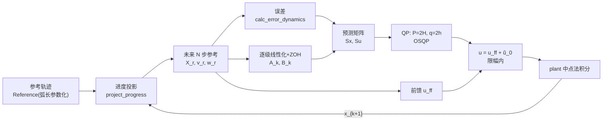
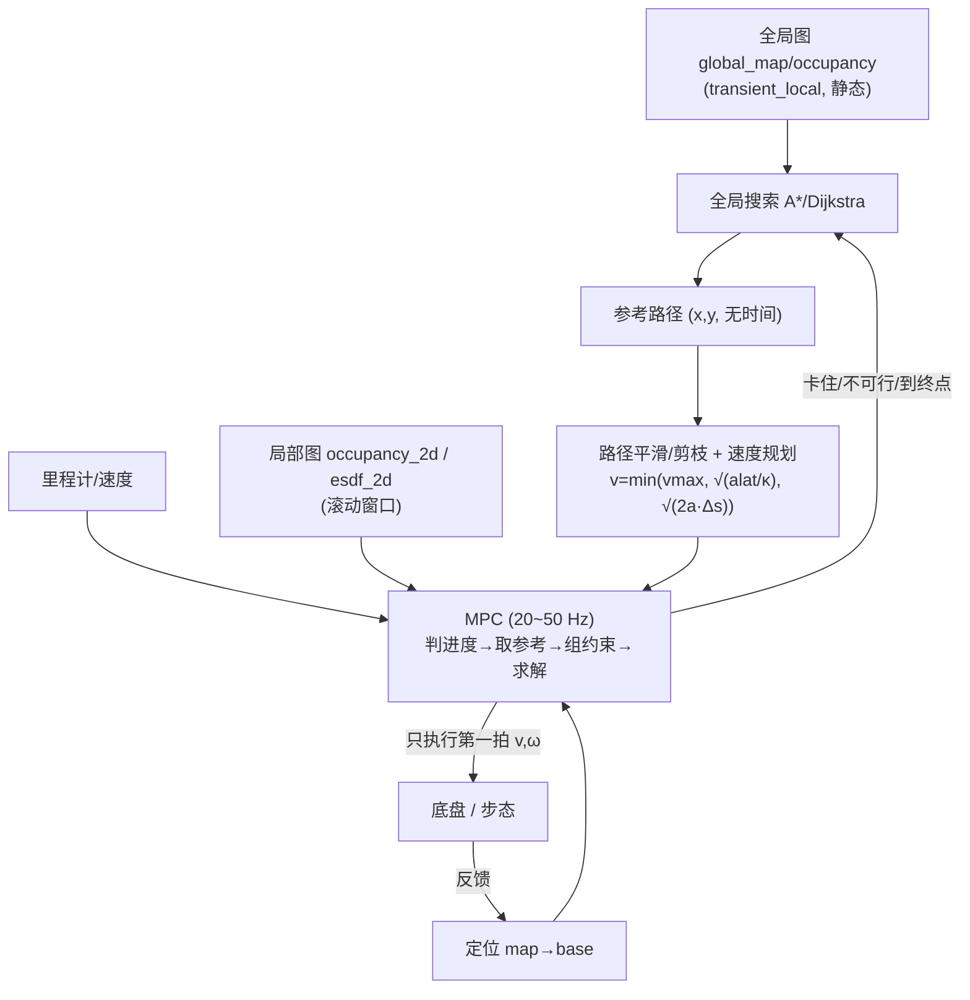

# MPC / NMPC 轨迹跟踪算法学习笔记

> 对照代码：`src/pnc_2d/scripts/mpc.py`（L-MPC + OSQP）、`nmpc.py`（NMPC + CasADi/IPOPT）、
> `traj_utils.py`（参考轨迹/进度投影/评价指标）。
> 文中所有实测数字都来自这两个脚本的默认配置（圆 r=3 m × 2 圈，$v_r=1.0$ m/s，$dt=0.05$ s）。

---

## 目录

1. [问题定义：什么叫"跟踪"](#1-问题定义什么叫跟踪)
2. [被控对象：差速机器人运动学与离散化](#2-被控对象差速机器人运动学与离散化)
3. [参考轨迹：两个容易被忽略的约定](#3-参考轨迹两个容易被忽略的约定)
4. [跟踪目标：时间索引 vs 最近点进度投影](#4-跟踪目标时间索引-vs-最近点进度投影)
5. [L-MPC：误差动力学线性化 + QP](#5-l-mpc误差动力学线性化--qp)
6. [NMPC：非线性模型 + NLP](#6-nmpc非线性模型--nlp)
7. [两者对比与选型](#7-两者对比与选型)
8. [评价指标（怎么判断"跟踪好不好"）](#8-评价指标怎么判断跟踪好不好)
9. [踩坑清单（附实测证据）](#9-踩坑清单附实测证据)
10. [调参指南](#10-调参指南)
11. [从 demo 到实车的迁移清单](#11-从-demo-到实车的迁移清单)
12. [代码地图与动手实验](#12-代码地图与动手实验)

---

## 1. 问题定义：什么叫"跟踪"

给定一条**参考轨迹**（每个时刻的期望位姿）或**参考路径**（只有几何形状 + 速度规划），
让机器人尽可能贴上去。这里有三层含义，混在一起就会出问题：

| 层次 | 含义 | 对应指标 |
|---|---|---|
| 几何 | 走出来的线是否压在参考线上 | **横向误差** cross-track |
| 航向 | 车头朝向是否顺着参考线的切线 | 航向误差 $\theta-\theta_{ref}$ |
| 时间 | 是否"按预定的时间表"到达每个点 | 纵向/进度误差 |

**关键认知：跟踪效果差，90% 的原因不在控制器内核，而在"输入的参考"和"误差的定义"。**
本仓库最初两个脚本横向误差 RMS 0.95 m（圆半径只有 3 m）就是这个原因，见第 9 节。

---

## 2. 被控对象：差速机器人运动学与离散化

### 2.1 连续模型

状态 $x=[x,y,\theta]^\top$，控制 $u=[v,\omega]^\top$（线速度、角速度）：

$$
\dot x = v\cos\theta,\qquad \dot y = v\sin\theta,\qquad \dot\theta = \omega
$$

这是**非完整约束**系统（不能横向平移），也是"路径跟踪"比"位置控制"更自然的原因：
车只能沿着车头方向前进，横向误差必须靠转头 + 前进来消除。

### 2.2 离散化：欧拉 vs 中点法（圆弧精确）

代码里 plant 的积分在 `traj_utils.integrate_plant()`：

```python
# 欧拉（原脚本用法）        # 中点法（现值，步内 v、ω 恒定时对圆弧精确）
x += v*dt*cos(θ)            th_mid = θ + 0.5*ω*dt
y += v*dt*sin(θ)            x += v*dt*cos(th_mid); y += v*dt*sin(th_mid)
θ += ω*dt                   θ += ω*dt
```

为什么必须在意：欧拉法每步沿**起始时刻的切线**走直线，等于把圆弧当成弦。
$dt=0.05$、$v=1$、$\omega=1/3$ 时，用纯前馈（$u=u_r$、不做任何反馈）跑 2 圈：

| 积分方式 | 横向 RMS | 横向 max |
|---|---|---|
| 显式欧拉 | 0.0186 m | 0.0353 m |
| 中点法 | 0.0000 m | 0.0001 m |

**教训**：仿真里"控制器很好但轨迹就是偏"时，先怀疑积分器和模型，别急着调 $Q/R$。

### 2.3 控制器内部模型可以是简化的

`nmpc.py` 里用 `MODEL = "midpoint"`。若故意用欧拉当预测模型、plant 用中点法，
就会因为**模型失配**留下一个稳态偏差：实测横向 RMS 0.0046 m（换成中点法后降到 0.0000）。
真实机器人的模型误差更大（轮子打滑、标定误差），所以工程上还要靠
**积分/扰动估计（offset-free MPC）**来消除稳态偏差。

---

## 3. 参考轨迹：两个容易被忽略的约定

### 3.1 采样间隔必须等于 $v_r\,dt$（弧长参数化）

参考轨迹要满足：**第 $k$ 个采样点 = 时刻 $k\,dt$ 处应该到达的位置**，即相邻采样点间距

$$
\Delta s = v_r\,dt
$$

原脚本用 `np.linspace(0, 4π, 400)` 按**角度**均匀采样，隐含速度

$$
\frac{\Delta s}{dt}=\frac{2\pi r\cdot 2/400}{0.05}=1.89\ \text{m/s}
$$

而 `V_MAX=1.2` —— **机器人物理上追不上参考点**，无论控制器多好都表现为"跟踪很差"。
正确的做法（`traj_utils.Reference.circle`）：

```python
ds  = vr * dt                       # 每步该走的弧长
num = round(2π r · laps / ds)       # 采样点数由"总弧长 / 每步弧长"决定
phi = s / r                         # 圆心角 = 弧长 / 半径
```

### 3.2 参考航向会超过 $\pi$（角度包裹！）

圆参考里 $\theta_{ref}=t+\pi/2$ 会一直涨到 $4\pi+\pi/2$（十几弧度），
而真实状态估计给出的 $\theta$ 一定包裹在 $[-\pi,\pi)$。

**如果代价函数里直接写 $(\theta-\theta_{ref})^2$，误差会凭空多出 $2\pi$ 的整数倍 → 代价爆炸、控制发散。**
正确写法（`nmpc.py` 的代价，以及 `traj_utils.wrap_angle`）：

```python
wrap(a) = atan2(sin(a), cos(a))                 # 归一化到 [-π, π)
dθ = ca.atan2(ca.sin(θ - θ_ref), ca.cos(θ - θ_ref))   # 在代价里就地包裹
```

### 3.3 参考不只是几何，还有速度

`Reference` 同时存 $v_r,\omega_r$，它们有两个用途：
1. 作为**前馈**（下一节的"偏差输入"）；
2. 作为线性化点（$A_c$ 依赖 $\omega_r$、$B_c$ 依赖 $v_r$）。

---

## 4. 跟踪目标：时间索引 vs 最近点进度投影

有了参考轨迹，还要决定"这一拍到底追哪个点"。

### 4.1 时间索引（`--mode time`）

$$
k_{ref} = \text{step}
$$

它隐含一个强假设：**机器人每一拍都恰好走完 $v_r\,dt$**。
一旦落后（起步慢、被挡、限速饱和），参考点就越跑越远。看误差动力学：

$$
\dot e_x = \omega e_y + v_r - v
$$

若 $v_r > V_{max}$，则 $v$ 饱和后 $e_x$ 就以 $v_r - V_{max}$ 匀速发散 —— **误差无界增长，永远回不来**。
这正是原脚本 99.5% 的指令都顶在限幅上、平均速度 1.19 m/s（全油门追一个跑掉的点）的原因。

### 4.2 最近点进度投影（`--mode progress`，推荐）

```python
def project_progress(x, y, ref, k_prog, back, fwd):
    offs = arange(-back, fwd+1)                       # 只在上次进度附近搜索
    i    = ref.idx(k_prog + offs)                     # 闭合路径自动取模
    j    = argmin( hypot(ref.xy[0,i]-x, ref.xy[1,i]-y) )
    return k_prog + offs[j], dist_j
```

三个设计点，每个都有理由：

| 设计 | 作用 |
|---|---|
| 只在 $[k_{prog}-b,\ k_{prog}+f]$ 窗口内搜索 | 路径自交时参考点不会跳到另一条分支（跳变被限制在 $b$ 步内） |
| 允许少量回退（$b$ 步，默认 10 = 0.5 m） | 机器人落后时参考点停在它附近，纵向滞后由控制器自然消除，而不是"参考跑掉" |
| $fwd \ge N$（默认 60 = 3 m） | 给预测时域留够前视距离 |

这样误差永远是**真实的路径误差**；参考速度不可达时也只是"进度走得慢"，不会失控。

实测对比（`VR=1.5`，故意让参考速度 > `V_MAX=1.2`，同样的圆 r=3 m）：

| 索引方式 | 横向 RMS | 横向 max | 限幅比例 | 平均速度 |
|---|---|---|---|---|
| `--mode progress` | **0.0207 m** | 0.0292 m | 55.7% | 1.157 m/s |
| `--mode time` | **0.5090 m** | 0.6335 m | **100%** | 1.198 m/s |

两者都会打 WARN「参考速度超出 v/w 限幅，前馈已限幅」（可行性保护生效），
但 time 模式的参考点持续往前跳，控制器只能切内弦去追 → 偏离路径 0.5 m、指令长期饱和；
progress 模式参考点停在机器人附近，几何跟踪依旧只有 2 cm 误差。
**实车必须用 progress。**

---

## 5. L-MPC：误差动力学线性化 + QP

文件：`mpc.py`（OSQP 求解，**0.96 ms/步**，单核占用 1.9%）。

### 5.1 误差定义（机体系）

令 $\Delta x = x_r - x,\ \Delta y = y_r - y$，投影到机器人坐标系：

$$
e_x = \Delta x\cos\theta + \Delta y\sin\theta,\quad
e_y = -\Delta x\sin\theta + \Delta y\cos\theta,\quad
e_\theta = \theta_r-\theta
$$

含义：$e_x>0$ = 参考点在**车头前方**（我落后了）；$e_y>0$ = 参考点在**左侧**。
代码：`calc_error_dynamics()`。

### 5.2 误差动力学（推导一次，终身受用）

对 $e_x$ 求导（用 $\dot\theta=\omega$，并注意差速车 $\dot x\cos\theta+\dot y\sin\theta=v$）：

$$
\dot e_x = \omega e_y + v_r\cos e_\theta - v
$$
$$
\dot e_y = -\omega e_x + v_r\sin e_\theta
$$
$$
\dot e_\theta = \omega_r - \omega
$$

在 $e\approx 0$ 处线性化（$\cos e_\theta\approx1$、$\sin e_\theta\approx e_\theta$），
并令 **$\tilde u = u - u_r$（偏差输入）**：

$$
\boxed{\ \dot e = A_c\,e + B_c\,\tilde u\ }, \quad
A_c=\begin{bmatrix}0&\omega_r&0\\-\omega_r&0&v_r\\0&0&0\end{bmatrix},\quad
B_c=\begin{bmatrix}-1&0\\0&0\\0&-1\end{bmatrix}
$$

**这里是最关键的一步**：因为 $B_c$ 的每一列都是 $\pm1$ 的稀疏结构，
$\tilde u = [v-v_r,\ \omega-\omega_r]$ —— 所以模型的正确形式是"对**偏差**输入"，
而不是"对绝对输入"。把 $u$ 当绝对量代入，等于丢掉常数前馈项 $[v_r,0,\omega_r]^\top$：

> **实例（决定性证据）**：当 $e=0$ 且参考速度为 $u_r=[1.0,\,0.333]$ 时
> - 丢掉前馈的写法解出 $u=[0.0,\ 0.0]$ —— **机器人原地不动**（因为 $q=0$，QP 退化为 $\min\tilde u^\top P\tilde u$）；
> - 正确写法解出 $u=u_r=[1.0,\ 0.333]$。

代码：`linearize_error_model()`。

### 5.3 离散化（Euler 或 ZOH 精确）

```python
A_c, B_c = ...
# Euler（原版）：A_d = I + A_c·dt,  B_d = B_c·dt
# ZOH 精确（现值）：expm([[A_c, B_c],[0,0]]·dt) 的前 3×3 / 3×2 块
M = zeros(5,5); M[:3,:3] = A_c; M[:3,3:] = B_c
E = expm(M*dt);  A_d, B_d = E[:3,:3], E[:3,3:]
```

`expm` 那两行是标准技巧：$\exp\left(\begin{bmatrix}A&B\\0&0\end{bmatrix}t\right)
=\begin{bmatrix}A_d&B_d\\0&I\end{bmatrix}$。
$dt=0.05$、$\omega_r=1/3$ 时 Euler 与 ZOH 差约 1%（次要修正），但它是"免费的对"，
所以直接用 ZOH。

### 5.4 预测方程（可控性矩阵的递推构造）

把 $N$ 步预测写成决策变量 $\tilde U=[\tilde u_0;\dots;\tilde u_{N-1}]$ 的线性函数：

$$
e_k = \underbrace{\Big(\prod_{j<k}A_j\Big)}_{S_{x,k}} e_0
    + \underbrace{\sum_{i<k}\Big(\prod_{j=i+1}^{k-1}A_j\Big)B_i}_{S_{u,k}}\ \tilde U
$$

代码用**递推**构造（比逐个 `matrix_power` 快，且天然支持 $A_k,B_k$ 随预测步变化）：

```python
Ak = I; Pk = 0
for k in 1..N:
    Ak = A_{k-1} @ Ak                 # 累积乘积
    Pk = A_{k-1} @ Pk                 # 已有列跟着传播
    Pk[:, (k-1)*NU:k*NU] = B_{k-1}    # 新增一列
    Sx[k-1] = Ak;  Su[k-1] = Pk       # 行块 k-1 对应 e_k
```

**注意次序**：第 $k$ 步的 $A,B$ 用的是参考轨迹第 $k-1$ 个点的 $v_r,\omega_r$
（原脚本只用第 0 拍的 $v_r,\omega_r$ 线性化一次、全程套用）。

### 5.5 代价函数

$$
J=\sum_{k=1}^{N-1}e_k^\top Q\,e_k
 +\underbrace{e_N^\top Q_f\,e_N}_{\text{终端}}
 +\sum_{k=0}^{N-1}\tilde u_k^\top R\,\tilde u_k
 +\sum_{k=0}^{N-1}\Delta u_k^\top R_\Delta\,\Delta u_k
$$

- $Q=\mathrm{diag}(20,20,8)$：横向/纵向权重相同、航向权重小一些（内环更稳）；
- $R$ 惩罚的是**偏离参考速度的量**（$R$ 小 = 允许大幅加减速去追误差）；
- $Q_f$ 只在最后一级用（**不要**在最后一级同时保留 $Q$ 再叠加 $Q_f$，那是重复加权）；
- $\Delta u$ 项抑制抖动，代价只是把差分写成矩阵形式（见 5.7）。

### 5.6 约束（随参考速度平移的盒式约束）

$$
u_{\min} \le u_{ff,k}+\tilde u_k \le u_{\max}
\ \Longrightarrow\
u_{\min}-u_{ff,k} \le \tilde u_k \le u_{\max}-u_{ff,k}
$$

```python
lo = tile([V_MIN, W_MIN], N) - u_ff
hi = tile([V_MAX, W_MAX], N) - u_ff
```

**可行性保护**：先把 $u_{ff}$ 限幅到盒内，保证 $\tilde u=0$（纯前馈）永远可行；
若参考速度本身超出限幅，打一条 WARN 告诉用户"机器人跟不上"（而不是让求解器返回一堆垃圾）。

### 5.7 QP 标准形与 OSQP 的因子 2

OSQP 求解的是

$$
\min_z\ \tfrac12 z^\top Pz + q^\top z
$$

而我们的代价（把 $e_k=S_{x,k}e_0+S_{u,k}z$ 代入）展开后是

$$
J = z^\top H z + 2 h^\top z + \text{const}
$$

所以必须写 $P=2H,\ q=2h$。**漏掉这个 2 不会改变最优解**（整体缩放不影响 argmin），
但会让 $R$ 相对 $Q$ **隐式放大 2 倍** —— 这是一种"调参怎么调都不对"的隐bug。

$\Delta u$ 项的矩阵形式：$\Delta u_k = u_k-u_{k-1} = Dz+c$，其中
$D$ 是分块差分矩阵（对角 $I$、次对角 $-I$），
$c$ 的第 0 块是 $u_{ff,0}-u_{prev}$（上一拍**实际下发值**），第 $k$ 块是 $u_{ff,k}-u_{ff,k-1}$。
于是 $J_\Delta=(Dz+c)^\top \bar R_\Delta (Dz+c)$，贡献 $H \mathrel{+}= D^\top\bar R_\Delta D$、
$h \mathrel{+}= D^\top\bar R_\Delta c$。代码：`_du_operator()`。

### 5.8 求解与执行

```python
res = prob.solve()
if res.info.status == "solved":
    return u_ff[:NU] + res.x[:NU], True     # 下发 u = 前馈 + 偏差
return u_prev, False                        # 失败：保持上一拍指令，并计数告警
```

**别用硬编码速度兜底**（原脚本失败时返回 `[1.0, 1/3]`，等于开环乱跑、还把问题掩盖掉）。

### 5.9 数据流



---

## 6. NMPC：非线性模型 + NLP

文件：`nmpc.py`（CasADi 建模 + IPOPT 求解，$N=20$ 时 **34~50 ms/步**，随机器负载波动）。
与 L-MPC 共享第 3、4 节（参考轨迹、进度投影、角度包裹）。

### 6.1 问题形式

$$
\min_{X,U}\ \sum_{k=1}^{N}\Big[\|p_k-p_k^{ref}\|^2_Q + w_\theta\,\mathrm{wrap}(\theta_k-\theta_k^{ref})^2\Big]
+\sum_{k=0}^{N-1}\Big[\|u_k-u_k^{ref}\|^2_R + \|\Delta u_k\|^2_{R_\Delta}\Big]
$$

$$
\text{s.t.}\quad x_{k+1}=f(x_k,u_k),\quad x_0=x_{now},\quad u_{\min}\le u_k\le u_{\max}
$$

区别只有两点，但都是本质的：
1. **不做线性化**，直接用非线性模型（连 $\cos/\sin$ 都是精确的）；
2. 代价里直接惩罚**世界系位置误差**（不需要机体系误差那个中间层）。

### 6.2 CasADi 建模要点

```python
X = opti.variable(NX, N+1)      # 状态轨迹作为决策变量（不是逐步仿真！）
U = opti.variable(NU, N)
opti.subject_to(X[:,0] == x_curr)
for k in range(N):
    dpos = X[0:2, k+1] - X_ref[0:2, k+1]
    dth  = ca.atan2(ca.sin(X[2,k+1]-X_ref[2,k+1]), ca.cos(X[2,k+1]-X_ref[2,k+1]))
    cost += Q[0,0]*dpos[0]**2 + Q[1,1]*dpos[1]**2 + Qw*dth**2
    cost += (U[:,k]-u_ff_k).T @ R @ (U[:,k]-u_ff_k)     # 前馈：围绕参考速度
    opti.subject_to(X[:,k+1] == f(X[:,k], U[:,k]))
opti.minimize(cost)
```

要点：
- **索引对齐**：$X[:,k]$ 对应参考块第 $k$ 个点（原版把 $X[:,N]$ 和第 $N-1$ 个参考点比，少了一拍）；
- $u-u^{ref}$ 里 $u^{ref}$ 就是前馈（作用与 5.2 的 $\tilde u$ 完全一样）；
- 约束可以写成向量形式 `opti.subject_to(U[0,:] >= V_MIN)`。

### 6.3 热启动（warm start）

把上一拍的解**整体平移一位**作为初值：

```python
Xw = np.hstack([warm[0][:,1:], warm[0][:,[-1]]])
Uw = np.hstack([warm[1][:,1:], warm[1][:,[-1]]])
```

对 SQP 类求解器（IPOPT）非常有效：减少迭代次数、降低求解失败率。
`nmpc.py` 里还设了 `ipopt.warm_start_init_point: yes`。

### 6.4 实时性问题

$N=20$、$dt=0.05$ → 预测 1 s，单次求解 **50 ms**（本机）。
若控制周期要 20 Hz（50 ms），这已经**没有余量**。工程上三选一：

| 方案 | 做法 |
|---|---|
| 减小规模 | $N$ 降到 10~15、或降低控制频率（10 Hz） |
| 实时迭代 | RTI：每拍只做 1~2 次 SQP 迭代（不等收敛） |
| 换凸化方法 | 用第 5 节的 L-MPC（0.96 ms/步，20~50 Hz 绰绰有余） |

**实践建议**：L-MPC 做内环（高频、可靠、约束好写），NMPC 用于需要精确非线性
（大航向误差、狭窄空间、需要考虑曲率约束）的场合。

---

## 7. 两者对比与选型

### 7.1 耗时口径（"X ms/步"到底怎么量）

"一步" = **一个控制周期算一次控制量**（`dt = 0.05 s`）。判能不能实时，就看
$\text{单步耗时}/dt$：

| 量法 | L-MPC 结果 | 说明 |
|---|---|---|
| ❌ 整个进程墙钟时间 ÷ 步数 | 2.5 s / 754 ≈ **3.3 ms** | 把 Python 启动、numpy/matplotlib 导入、指标统计、画图存盘都算进去了 |
| ✅ 只给控制循环计时（脚本现打这行） | 0.73 s / 754 = **0.96 ms** | 真正代表“算一次控制量要多久” |

```
# mpc.py  → 控制循环总耗时 0.73 s (0.96 ms/步)  | 单核占用 1.9%
# nmpc.py → 求解总耗时   26.0 s (34.45 ms/步) | 单核占用 68.9%     ← 空载
#          求解总耗时   37.9 s (50.30 ms/步) | 单核占用 100.6%    ← 与其它节点并行
```

⚠ L-MPC 的 Python 实现比 NMPC 稳定得多（0.96 ms 几乎不随负载变），
NMPC 的 IPOPT 对 CPU 竞争很敏感（同一台机器上能差 1.5 倍）——
**这一点在实车上很关键：算力被其它节点抢走时，NMPC 是第一个崩的。**

L-MPC 单步拆解（本机 Python 实现）：

| 环节 | 耗时 |
|---|---|
| OSQP `setup`（每步重建问题） | 0.28 ms |
| OSQP `solve`（30 维 QP） | **0.04 ms** |
| 预测矩阵 $S_x, S_u$ | 0.05 ms |
| 其余（误差/线性化/QP 组装/plant/日志） | 0.72 ms |

**结论：瓶颈不在求解器，而在每步重建矩阵的 Python/numpy 开销。**
真机用 C++ 实现、或复用 OSQP 实例（用 `update(P,q,lo,hi)` 替代 `setup`）能再快一个量级。

| 维度 | L-MPC（`mpc.py`） | NMPC（`nmpc.py`） |
|---|---|---|
| 模型 | 误差动力学在 $e=0$ 线性化（LTV） | 原始非线性模型 |
| 决策变量 | 偏差输入 $\tilde u$（$N\cdot N_u=15\times2=30$ 维） | 状态 + 输入（$3\times21+2\times20=103$ 维） |
| 代价 | 二次型（机体系误差） | 二次型（世界系位置 + 包裹航向） |
| 求解器 | OSQP（一阶 ADMM，凸 QP） | IPOPT（内点法，非凸 NLP） |
| 单步耗时 | **0.96 ms**（54 倍余量） | **34~50 ms**（20 Hz 下无余量） |
| 实测横向 RMS | 0.0000 m（max 0.0004） | 0.0000 m（max 0.0002） |
| 有效范围 | 误差小（参考点附近） | 误差大也能用 |
| 约束 | 只能写线性约束（盒式/线性化避障） | 任意光滑约束（曲率、$v$ 依赖 $\omega$ 等） |
| 求解失败 | 极少（凸问题，有解即最优） | 可能（非凸 + 迭代上限），必须写兜底 |
| 代码量 | 274 行（含 QP 组装） | 203 行（CasADi 自动微分，建模代码更短） |

---

## 8. 评价指标（怎么判断"跟踪好不好"）

`traj_utils.tracking_metrics()` 的口径，**不要**用"到参考索引点的距离"当横向误差
（那会把"索引落后"混进来，原脚本就是这样把 0.95 m 的几何误差和 1.85 m 的索引滞后混着看）：

| 指标 | 定义 | 备注 |
|---|---|---|
| 横向误差 | 到参考路径的**最小距离** | 与索引无关，才是真实几何误差 |
| 航向误差 | 机器人与**最近点处切线**之差（含包裹） | 用 `wrap_angle` |
| 实际路程 | 机器人自身轨迹累加 | 与参考长度比，看进度是否正常 |
| 限幅比例 | 指令触及 $u_{\min}/u_{\max}$ 的比例 | **>50% 说明系统在饱和，控制器已无调节余量** |
| 求解失败次数 | | 任何非 0 都要查 |

修好前后（同一套口径，圆 r=3 m × 2 圈）：

| 版本 | 横向 RMS | 横向 max | 航向 RMS | 限幅比例 |
|---|---|---|---|---|
| 修前 L-MPC | 0.945 m | 1.360 m | 0.083 rad | 99.5% |
| 修前 NMPC | 0.976 m | 1.310 m | 0.081 rad | 99.8% |
| 修后 L-MPC | **0.0000 m** | 0.0004 m | 0.0000 rad | 0% |
| 修后 NMPC | **0.0000 m** | 0.0002 m | 0.0000 rad | 0% |

---

## 9. 踩坑清单（附实测证据）

> 这一节的每一条都是"控制器写法没错、但跟踪就是差"的真实原因。

### 9.1 【最致命】误差动力学 MPC 丢了前馈

$\dot e=Ae+B(u-u_r)$ 写成 $\dot e=Ae+Bu$，丢掉的常数项就是前馈。
$e=0$ 时 $q=0$ → QP 变成 $\min \tilde u^\top P\tilde u$ → 输出 $[0,0]$ 原地不动。
**自检方法**：喂 $e=0$ + 参考速度 $[1.0,0.333]$，正确实现必须输出 $[1.0,0.333]$。

### 9.2 参考采样间隔 ≠ $v_r\,dt$

隐含速度 1.89 m/s > `V_MAX` 1.2 m/s → 物理上追不上（第 3.1 节）。

### 9.3 用循环计数索引参考点

参考点会跑掉、误差无界（第 4 节）。改用进度投影。

### 9.4 航向误差不做角度包裹

参考航向 $>\!\pi$、状态包裹在 $[-\pi,\pi)$ → 误差多出 $2\pi$ 整数倍（第 3.2 节）。

### 9.5 被控对象用欧拉积分

纯前馈基线就有 1.9 cm 横向 RMS（第 2.2 节），会被误判成控制器问题。

### 9.6 OSQP 目标函数漏因子 2

$P=H,\ q=h$ 会让 $R$ 相对 $Q$ 隐式放大 2 倍（第 5.7 节）。

### 9.7 终端权重重复加权

最后一级保留 $Q$ 又叠加 $Q_f$ ⇒ 等价 $Q+Q_f$。要么只在最后一级用 $Q_f$，
要么明确写"$Q$ 用于 $k=1..N-1$、$Q_f$ 用于 $k=N$"。

### 9.8 求解失败硬编码兜底

`return np.array([1.0, 1/3])` 会让错误静默传播。正确做法：保持上一拍指令 + 计数告警。

### 9.9 只用第 0 拍的 $v_r,\omega_r$ 线性化

参考速度随时间变化时，$A_d,B_d$ 应当逐级计算（第 5.4 节）。

---

## 10. 调参指南

| 参数 | 作用 | 调大 | 调小 |
|---|---|---|---|
| $Q$（轨迹误差） | 贴线强度 | 收敛快、易饱和/抖动 | 滞后大 |
| $R$（偏离参考速度） | 输入保守度 | 省电/平滑、收敛慢 | 允许猛加减速 |
| $R_\Delta$（$\Delta u$） | 平滑度 | 指令柔顺、响应慢 | 抖动、电机/舵机损耗大 |
| $Q_f$（终端） | 时域末端的稳定性 | 更"看得远"、可能过冲 | 短视，末端松 |
| $N$（预测步长） | 预见距离 = $N\,dt\,v$ | 更早动作、计算量↑ | 反应迟钝 |
| $dt$ | 控制周期 | 计算少、精度差 | 精度好、计算多 |

经验起点（$dt=0.05$、$N=15\sim20$、$v\le1.2$）：
$Q=\mathrm{diag}(20,20,8)$、$R=\mathrm{diag}(0.05,0.05)$、$R_\Delta=\mathrm{diag}(0.5,0.5)$、
$Q_f\approx2Q$。

**诊断口诀**：
- 限幅比例高 → 先别调权重，是参考/限速不匹配；
- 贴线好但抖 → 加 $R_\Delta$ 或减小 $Q$；
- 稳态有固定偏差 → 模型失配，需要积分/扰动估计；
- 转弯外侧甩 → $Q$ 的横向权重偏小或 $N$ 太短。

---

## 11. 从 demo 到实车的迁移清单

这两个脚本是"单文件闭环自测"（自己产生参考、自己积分 plant），上实车要补：

1. **参考来源换成规划器输出**：全局规划给**路径**（无时间戳），
   速度由速度规划给（或按曲率限速 $v\le\sqrt{a_{lat,max}/\kappa}$）。
   → 用第 4.2 节的进度投影直接吃路径点，天然适配。
2. **状态来源**：定位（本项目是 lightning）→ `map` 系位姿。
   注意位姿跳变（重定位）与时间戳对齐（用点云/里程计时间戳推当前位姿）。
3. **延迟补偿**：从测量到执行的延迟（估计 ~1 个周期 + 通信）按
   $x_{now}\leftarrow x_{now}+f(x,u_{prev})\cdot\tau$ 前推，否则高速下会系统性画外弧。
4. **控制量下发**：$[v,\omega]$ → 轮速逆运动学 $v_{l/r}=v\mp\omega b/2$
   → 轮速限幅 + 加速度限幅（$a_{max}$ 也要进 QP 约束，否则打滑）。
5. **障碍约束**：把 2D 局部图（`grid_map/occupancy_2d`）或 ESDF 作为约束加入
   MPC：对每个预瞄点取 $d(\text{cell})$，写成线性化约束
   $d_0 + \nabla d^\top (p_k-p_0) \ge d_{safe}$（一次近似即可）。
   全局图（`global_map/occupancy`）只用于全局规划的静态先验。
6. **不可行/失败兜底**：求解失败 → 降速并保持上一拍指令；连续失败 → 停车。
7. **$v_{\min}$ 与倒车**：现场若允许倒车，把 `V_MIN` 设为负值；
   不允许就用 progress 模式 + 原地转向。
8. **实时性**：L-MPC 0.96 ms/步，20~50 Hz 无压力；NMPC 50 ms/步需要减 $N$ 或 RTI。
9. **可观测性**：把第 8 节指标周期性打日志（横向/航向误差、限幅比例、求解失败、耗时），
   否则"跟踪变差了"只能靠眼睛看。

---

## 12. 代码地图与动手实验

### 12.1 函数地图

| 文件 | 函数/类 | 作用 |
|---|---|---|
| `traj_utils.py` | `wrap_angle` | 角度包裹到 $[-\pi,\pi)$ |
| | `integrate_plant(x,u,dt,exact)` | 差速运动学积分（中点法/欧拉） |
| | `class Reference` | 弧长参数化参考：`circle()`、`block(k0,n)`、`state(k)`、`idx(k)` |
| | `project_progress` | 最近点进度投影（窗口受限） |
| | `tracking_metrics` | 横向/航向误差、路程、限幅比例、失败次数 |
| | `plot_result` | 轨迹 / 误差-时间 / 指令-时间 三图 |
| `mpc.py` | `calc_error_dynamics` | 机体系误差 $e=[e_x,e_y,e_\theta]$ |
| | `linearize_error_model` | $A_c,B_c$ + Euler/ZOH 离散化 |
| | `build_prediction` | 递推构造 $S_x,S_u$ |
| | `_du_operator` | $\Delta u = Dz+c$ 的 $D$ |
| | `build_qp` | 组装 QP、盒式约束、OSQP 求解、返回 $u=u_{ff}+\tilde u_0$ |
| `nmpc.py` | `nmpc_solve` | CasADi 建 NLP、热启动、IPOPT 求解、失败兜底 |

### 12.2 动手实验（每个都能在终端直接看结果）

```bash
cd src/pnc_2d/scripts
V=../../.venv/bin/python3            # 注意：必须用 r41_ws 的 venv（有 osqp/casadi）

$V mpc.py                            # L-MPC：看指标 + 三张图
$V mpc.py --mode time                 # 换成时间索引，对比 progress
$V nmpc.py                            # NMPC
$V nmpc.py --save /tmp/nmpc.png       # 无界面环境保存图片
```

| 实验 | 改什么 | 观察什么 |
|---|---|---|
| 1 | `VR` 改成 1.5（> `V_MAX`=1.2） | 两种 `--mode` 的差异：实测 time 模式横向 RMS **0.509 m** + 100% 限幅；progress 模式 0.021 m（见 4.2 节表格） |
| 2 | `RADIUS` 改成 0.8 | 小半径需大 $\omega$，看限幅比例与横向误差 |
| 3 | `Q` 的横向项 20 → 5 | 贴线变松、限幅比例下降 |
| 4 | `R_DU = None` | 指令抖动（看图 3） |
| 5 | `MODEL = "euler"`（nmpc.py） | 残留约 4.6 mm 模型失配偏差 |
| 6 | 初始位姿改成 $[3.2,0.3,\pi/2]$ | 看两种控制器从大误差收敛的过程 |
| 7 | `N` 15 → 5 | 预见距离不足，转弯处开始切内圈 |

### 12.3 推荐阅读顺序

1. `traj_utils.Reference`（参考怎么来的）→ 2. `project_progress`（追哪个点）→
3. `calc_error_dynamics` + 第 5.2 节推导（误差动力学）→ 4. `build_prediction`（预测矩阵）→
5. `build_qp`（QP 组装）→ 6. `nmpc_solve`（对照看非线性的写法）→
7. 回到第 9 节，把每个坑在代码里对应的行找出来。

---

## 13. MPC 放进规划架构里的完整流程

> 前 12 节讲的是"给定一条参考，怎么把它跟好"。这一节讲"参考从哪来、避障怎么进去"——
> 也就是把 MPC 真正接进一个规划系统要做的事。

### 13.1 分工：MPC 不替代全局规划

| 层 | 职责 | 典型周期 | 输入 | 输出 |
|---|---|---|---|---|
| 全局规划 | 在**静态**全局图上找一条可行**路径**（不管动力学） | 0.5~2 Hz 或触发式 | `global_map/occupancy` | 稀疏路径点 |
| **局部规划 + 控制（MPC）** | 在**滚动时域**内同时做"避障 + 跟踪 + 动力学约束"，直接输出可执行指令 | **20~50 Hz** | 全局路径 + 局部图 + 定位 | $v,\omega$ |
| 底盘/步态 | 电机/腿足级闭环 | 200~1000 Hz | $v,\omega$ 或 Twist | 关节力矩 |

**关键认知**：MPC 是"局部规划器 + 跟踪控制器"的二合一。它靠**滚动优化**获得反馈能力，
代价是只有 $N\cdot dt$（典型 0.75~1 s）的预见距离 —— 所以它**不能**取代全局规划，
只能负责"沿着全局路径走、并且躲开新出现的东西"。

### 13.2 数据流



### 13.3 demo → 规划：五个必须补的环节

**① 参考换成"路径 + 速度规划"**
规划器给的是几何路径（无时间戳）。用第 4.2 节的进度投影直接吃路径点，
速度按曲率与制动距离给：

$$
v_{ref}(s)=\min\Big(v_{max},\ \sqrt{a_{lat,max}/\kappa(s)},\ \sqrt{2a_{brake}(s_{end}-s)}\Big)
$$

$\kappa(s)$ 由路径点航向差分得到。**不要**再生成等速圆轨迹那种"时间表"。

**② 障碍约束：ESDF 线性化 + 松弛（核心）**
把机器人当半径 $r_{safe}$ 的圆，要求 $d(p)\ge r_{safe}$。ESDF 是非线性的，
在参考点 $p_k^{ref}$ 处一阶展开成**半平面**约束（$d$ 与 $\nabla d$ 从 ESDF 查）：

$$
\underbrace{d(p_k^{ref}) + \nabla d(p_k^{ref})^\top\big(p_k-p_k^{ref}\big)}_{\text{对决策变量 }z\text{ 线性}}
\ +\ s_k\ \ge\ r_{safe},\qquad s_k\ge 0
$$

$s_k$ 是**松弛变量**，代价里加 $J \mathrel{+}= w_s\sum_k s_k$（$w_s$ 取 $Q$ 的 $10^3\!\sim\!10^5$ 倍）：

- **硬约束的 QP 一旦不可行就没有输出**（被障碍包住时必然发生），松弛 + 大惩罚让它
  "优先满足安全、实在不行给最小违反量"，并**返回违反量供上层判断要不要重规划**；
- 二阶细节：$p_k$ 与决策变量的关系里还有 $R(\theta_k)$（见 5.1），工程上直接用
  **上一拍的解** $\hat\theta_k$ 作为线性化点（固定点迭代），误差极小。

**③ 执行器约束**：把加速度限制加进 $\Delta u$ 的上下界（代码里 $Dz+c$ 已就绪）：

$$
-\alpha_{max}\,dt\ \le\ \Delta u_k\ \le\ \alpha_{max}\,dt
$$

**④ 延迟补偿与时间同步**：定位/通信延迟 $\tau$ 会让高速时系统性画外弧。
用上一拍指令把初始状态前推：$x_0 \leftarrow f(x_0,u_{prev},\tau)$；
并确认所有输入用的是**同一时间基准**（点云/位姿时间戳，别混 `now()`）。

**⑤ 状态机与兜底**（决定"能不能真的上车"）：

| 条件 | 动作 |
|---|---|
| 进度 $k_{prog}$ 在 $T_{stuck}$ 内推进 < $\epsilon$ | 判定卡住 → 触发全局重规划 |
| 松弛量之和 > 阈值（路径被新障碍堵死） | 触发重规划 / 局部绕行 |
| $s \ge s_{end}-\delta$ | 减速到 0，输出 $v=0$ |
| 求解失败连续 $N_{fail}$ 次，或指令超时未更新 | **减速停车**（看门狗），绝不用硬编码速度兜底 |
| 收到换图/重定位（`lightning/map_state`） | 清进度、清历史解、重新取路径 |

### 13.4 三条落地路线（按改动量排序）

| 路线 | 结构 | 优点 | 代价 | 适合 |
|---|---|---|---|---|
| **A｜MPC 即局部规划器** | 全局路径 → MPC（只吃路径 + 局部图软约束） | 链路最短、没有轨迹层要维护 | 避障全靠局部图，需要好的松弛与状态机 | 二维差速底盘，起步推荐 |
| **B｜轨迹 + MPC 跟踪** | 全局路径 → 走廊/SFC + 时间分配（如 EGO-Planner 的 B 样条）→ MPC 跟踪 | 轨迹已保证无碰撞，MPC 只管动力学与扰动 | 两层时间参数化要对齐（轨迹的 $v(t)$ 要满足 MPC 的限幅） | 已有 3D 规划栈（本仓库 `plan_env`+`bspline_opt`） |
| **C｜MPC 直接吃栅格** | 无路径层，MPC 自己做局部 A* | 反应最快 | 短视，容易局部极小；工程量大 | 研究/演示 |

**本仓库的建议**：先用 A（复用已改好的 `traj_utils` 进度投影），
把 `bspline_opt` 产出的轨迹当作"更平滑的路径"接进来就是 B。

### 13.5 工程红线（每条都有翻车案例）

1. **避障必须软约束**（否则一旦不可行就没有解）。
2. **膨胀半径 $\ge$ 机器人内切圆 + 定位/控制误差余量**，2D 图上用
   `occupancy_inflate_2d`（已含膨胀）而不是原始 `occupancy_2d`，避免自己再算一次。
3. **未知区域策略要一致**：全局图 `unknown_as_free: true`（可通行）、
   局部 ESDF `esdf_unknown_as_occupied: false`（乐观）。若一端保守一端乐观，
   会出现"全局规划走进去、局部把它当障碍"的死循环。
4. **参考速度必须可达**：$v_{ref} > v_{max}$ 会让误差无界增长（4.1 节）；
   限幅 + WARN 而不是硬吃。
5. **看门狗**：指令超时/求解连续失败 → 停车。通信断了最忌"保持上一拍指令"。
6. **可观测**：每拍记录 横向/航向误差、限幅比例、松弛量、求解耗时、失败次数；
   没有这些，"跟踪变差"只能靠肉眼。

### 13.6 分阶段实施清单

| 阶段 | 做什么 | 验证方式 |
|---|---|---|
| 0 | 离线：把一条固定路径喂给 MPC（无 ROS、无规划器） | 横向误差几 cm、约束不违反（改造现有脚本即可） |
| 1 | ROS 节点：订阅全局图 + 定位 → A* → MPC 只跟踪 | 沿全局路径走完，误差与仿真一致 |
| 2 | 接局部图：加 ESDF 软约束 + 膨胀半径 | 放一个箱子，能绕过去；被围住时能给"无解"信号不失控 |
| 3 | 工程件：延迟补偿、$\Delta u$ 限制、状态机、看门狗、日志 | 人为拔掉定位/堵住路，行为符合 13.3⑤ 的表 |
| 4 | 优化：C++ 化 / 复用 OSQP 实例 / 动态障碍预测（此时才需要 NMPC） | 20 Hz 下余量 > 50%；动态障碍下不撞 |

### 13.7 本仓库的接口清单

| 用途 | 话题 | 类型/备注 |
|---|---|---|
| 全局图 | `/global_map/occupancy` | `nav_msgs/OccupancyGrid`，latched，已把未知当空闲 |
| 全局规划触发/换图 | `/global_map/load_map`、`/lightning/map_state` | 换图后必须清进度与历史解 |
| 局部占据 | `/grid_map/occupancy_2d` | 100/0/-1，与全局图同分辨率（0.10 m） |
| 局部膨胀 | `/grid_map/occupancy_inflate_2d` | **避障优先用这个**（已含双圆柱膨胀） |
| 局部 ESDF | `/grid_map/esdf_2d` | `PointCloud2`，`intensity` = 距离(m)，`esdf_pub_step=2` 抽点 |
| 定位 | `/lightning/perception/pose` | `Odometry`，map → lidar_link |
| 指令 | 自己的话题（如 `/pnc_2d/cmd_vel`） | 2D 底盘用 Twist；四足经步态层 |

两条实现提示：
- 若 MPC 与感知在**同一进程**（都编在 `plan_env` 里），直接调 `getDistance2D(x,y)` 查询 ESDF，
  免去点云反解；此时必须把 `esdf2d_query_en: true`，否则无人订阅 ESDF 时会返回陈旧的 -1。
- 若 MPC 是**独立节点**，订阅 `esdf_2d` 点云重建 80×80 的 2D 距离数组即可（很便宜），
  但要注意点云是**抽点**的（`esdf_pub_step`），查询前要按 `resolution*step` 对齐。
