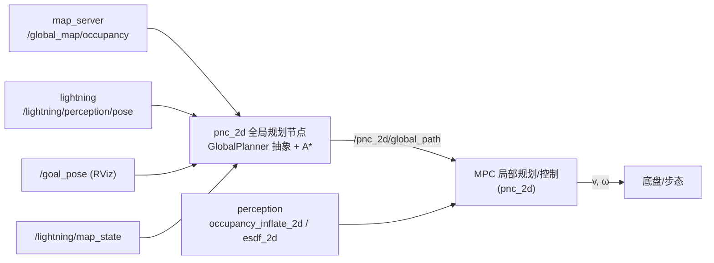

# pnc_2d 开发计划（二维规划与控制）

> 状态：**已评审冻结（2026-09-21）**，按本计划实施。
> 评审确认的 4 项决策：
> ① 规划触发 = **事件驱动**（收到目标 / 换图 / 重规划请求才规划，不做定时滚动重规划）；
> ② 本期范围 = **只做全局路径搜索 + 可视化**，P4 及之后延后；
> ③ 障碍判定 = **矩形车体轮廓（footprint）碰撞**，见 4.4；
> ④ 规划库 = **ROS-free**（节点侧用 `RosParamReader` 适配）。
> 参照工程：`~/SLAM-PNC/PNC`（ROS 1 二维 PNC 栈）的分层与踩坑记录。
> 关联文档：`doc/mpc_nmpc_guide.md`（MPC/NMPC 算法与「MPC 放进规划架构」的流程）。
> ⚠ **包级结构与节点拓扑以 `doc/pnc2d_restructure_plan.md`（2026-09-21 冻结）为准**：
> 本包要按 ROS 1 的"三类 + 状态机"整改（三节点：manager + global + local）。
> 本文 §7 的目录布局在 P1 搬移后需同步更新；本文其余内容（算法、参数、踩坑）仍然有效。

---

## 1. 定位与边界

**目标**：给 r41 平台做一套二维的「全局规划 → 局部规划 → 控制」链路，ROS 2 Humble，C++。

**已有可复用**：

| 模块 | 提供 |
|---|---|
| `map_server` | 全局静态 2D 图 `/global_map/occupancy`（`nav_msgs/OccupancyGrid`，latched，未知已当空闲） |
| `perception`(plan_env) | 局部 2D 图 `/grid_map/occupancy_2d`、膨胀图 `/grid_map/occupancy_inflate_2d`、ESDF `/grid_map/esdf_2d` |
| `lightning` | 定位位姿 `/lightning/perception/pose`（map→lidar_link）、换图信号 `/lightning/map_state` |
| `pnc_2d/scripts` | MPC/NMPC 参考实现（已验证横向误差 ~0.0000 m）+ `traj_utils`（进度投影、指标） |
| `pnc_3d/octomap_global_planner` | 3D A* 的工程化写法参照（但**无抽象接口**，故 2D 版重新设计） |

**不做（本期）**：三维规划（已有 `pnc_3d`）、足式步态/关节控制、地图构建、与 MPC 的闭环（P4）、重规划管理（P5）。

---

## 2. 总体架构

| 层 | 频率 | 输入 | 输出 | 落点 |
|---|---|---|---|---|
| 全局规划 | 事件驱动（收到新目标 / 换图 / 重规划请求） | 全局图 + 当前位姿 + 目标 | 几何路径 `nav_msgs/Path` | **本包（本期）** |
| 局部规划 + 控制 | 20~50 Hz | 路径 + 局部图/ESDF + 位姿 | `v,ω` | `pnc_2d`（MPC，P4 延后） |
| 底盘/步态 | 200~1000 Hz | `v,ω` | 关节/轮速 | 平台侧 |



**坐标系约定**：全链路 `map` 系；节点**不做 TF 变换**（与 `map_server`/`perception` 的现有做法一致），但对输入消息的 `frame_id` 做校验并在不一致时告警/拒用。

---

## 3. 阶段划分与验收标准

| 阶段 | 内容 | 交付物 | 验收方式 | 状态 |
|---|---|---|---|---|
| **P0** | 包骨架：`package.xml` / `CMakeLists.txt` / gtest 接入 | 可 `colcon build --packages-select pnc_2d` | 编译零错误、`colcon test` 可跑 | ✅ 已完成 |
| **P1** | 基础层：`CostMap2D`（栅格+几何转换）、`ParamReader`（参数读取抽象）、`GlobalPlanner`（**抽象基类** + 共享工具） | 头文件 + 实现 | 单测覆盖几何转换与代价模型 | ✅ 已完成 |
| **P2** | **A\* 前端**：硬阈值/软代价、八邻域（含斜穿保护）、**矩形 footprint 碰撞**（含扫掠检查）、搜索窗口+逐级扩大重试、路径后处理（视线剪枝、yaw 填充、重采样）、统计 | `AStarPlanner` + `FootprintCollision` + 15 项单测 | 合成地图单测：绕障、无解、软代价绕行、重试被触发、节点数下降、**窄通道/斜缝/擦角 footprint 用例** | ✅ 已完成 |
| **P3** | 规划节点：订阅地图/位姿/目标 → 规划 → 发 `nav_msgs/Path` + 起终点箭头 + 起点 footprint 可视化 | `global_planner_node` | 与 `map_server` 联跑，RViz 看路径；换 `planner.type` 可切换算法 | ✅ 已完成 |
| **P2.5**（延后） | 混合 A\*：(x,y,yaw) 搜索空间 + 前进/倒车运动原语 + Reeds-Shepp 收尾 | `HybridAStarPlanner` | **驱动用例：0.6 m 的 L 形窄通道**（P2 会报无解，P2.5 应能通过/倒车通过） | 不在本期 |
| **P4**（延后） | 与 MPC 闭环：路径 → 速度规划（曲率限速 + 制动距离）→ MPC（进度投影 + 局部图软约束） | MPC 节点 | 仿真里从 A 到 B 全程无碰撞、横向误差 < 10 cm | 不在本期 |
| **P5**（延后） | 事件驱动重规划：地图版本号 + episode/seq 隔离、卡住检测、失败兜底、状态机 | 重规划管理器 | 人为挡路/拔定位，行为符合降级表 | 不在本期 |
| **P6** | （可选）局部轨迹优化层：SFC + MINCO，输出带时间轨迹 | 轨迹优化节点 | 对比纯 MPC 的平滑度/通过性 | 待定 |

**阶段间依赖**：本期交付 P0→P3（库 + 节点 + 单测 + RViz 可视化）；P4 依赖 P3 与现有 MPC；P5 依赖 P4。

### 3.1 本期实测记录（2026-09-21）

**单测**：`colcon test --packages-select pnc_2d` → **16 项全通过，0 失败**（15 个 gtest
用例 + 1 个 ctest 包装）。关键用例与实测数据：

| 用例 | 验证点 | 实测 |
|---|---|---|
| `NarrowCorridorFits` | 0.60 m 门 + 0.70×0.40 车体 + 0.05 margin | 通过（独立暴力校验 0 碰撞） |
| `NarrowCorridorTooTight` | 0.45 m 门 → 无解 | `NO_PATH`，窗口尝试 4 次（10/30/100/整图） |
| `FootprintDisabledPassesTightCorridor` | 关 footprint 后同一门能过 | 通过（对照组成立） |
| `GoalYawMattersInNarrowCorridor` | 终点朝向参与碰撞 | yaw 0° 可解 / 90° → `GOAL_FOOTPRINT_COLLISION` |
| `NoDiagonalCornerCutting` | 斜穿保护 | 走直角三角形两直角边绕行 |
| `SoftCostAvoidance` | soft_cost_weight=0 直穿 / =200 绕开 8 m 长代价带 | 两条路径均符合预期（=0 时穿带，=200 时绕到 y≈8.03） |
| `FastPathReducesFullChecks` | 开阔图内双阈值快路径 | 扩展 341 节点、**完整 footprint 检查 0 次** |
| `SearchWindowRetrySucceeds` | 窗口不够时逐级扩大 | 2 次尝试 / 55 334 节点，与关窗口同解 |

**真实地图端到端**（`go2_sim_factory`，607×307 @ 0.05 m = 30.4×15.4 m）：

```text
规划请求：( 21.50, -5.67, 0.0°) → (-7.25, 7.18, 0.0°)，直线距离 31.49 m
规划成功：6 点 / 33.39 m | 耗时 33.1 ms | 扩展节点 51 319（发现 52 696，峰值开放集 5 169）
         | 窗口尝试 1 次 | 完整 footprint 检查 71 034 次
```

独立校验（**不用本包代码**，Python 直接读 `map.pgm` + 按段方向常数 yaw 采样矩形
2 cm 网格）：段内插值 **1 344 个位姿 0 碰撞**，弧长 33.39 m 与节点日志一致。

**运行期发现并修掉的两个缺陷**：

1. `common.*` 参数键名不生效：`loadCommonParams` 曾按 `<算法前缀>.*` 读取，导致
   yaml 里的 `common.hard_threshold/unknown_as_occupied/soft_cost_weight` 被静默忽略
   （一律回到代码默认值）。已改为固定读 `common.*`，与 `config/pnc_2d.yaml` 一致。
2. `map_server` 按 `republish_interval`（1 Hz）重发同一张图，节点曾每次重发都重建
   距离场并刷日志。**根治**（已改 map_server 本身，详见 `src/map_server/README.md`）：
   默认改成"载图/换图发一次 + 新订阅者出现时按需补发一次"，稳态零流量
   （实测同一 Volatile 订阅者 6 s 内 1 条 vs 旧行为 7 条）。
   本节点侧的 `info.map_load_time` 去重**保留作为防御**（换图、或有人打开
   `republish_interval` 兼容模式时仍然有用）。
   同时把路径/标记改为 **latched(transient_local)**，让后连接的订阅者（RViz 后开、
   控制器后启）也能拿到最近一次结果。

3. **⚠ 参数机制失效（影响最大）**：只开 `allow_undeclared_parameters(true)` 时，
   `get_parameter_or()` 对**未声明**参数**不会去查覆盖项**，会静默返回代码默认值 ——
   也就是说 `config/pnc_2d.yaml`（跨模式共用）+ `config/global_astar.yaml`（A* 私有）里的
   `footprint.*` / `common.*` / `astar.*`
   曾经**全部无效**（`planner.type` 之类节点自己 `declare_parameter` 过的键反倒是有效的，
   所以极难发现）。修法：
   - 节点侧加 `automatically_declare_parameters_from_overrides(true)`，让 yaml/命令行
     里的每个键都被声明（启动日志会列出"yaml/命令行参数 N 项"以便核对）；
   - 节点自身的 `planner.*` / `topics.*` 改用 `paramString()`：已声明就直接读，未声明
     才补默认声明（否则会抛 `ParameterAlreadyDeclaredException` —— 修上面那条时踩到并
     已修掉）；
   - `RosParamReader` 改为**宽松类型转换**（int/double/bool 互通、`parameter not
     declared` 不再抛异常）：yaml 里写 `soft_cost_weight: 5`（int）而代码读 double 时
     不会崩，必要时只 WARN 并回退默认值。

   验证：`-p footprint.length:=0.99 -p footprint.width:=0.55` → 日志 `0.99x0.55` ✓；
   临时改 yaml 为 `0.88x0.66` → 日志 `0.88x0.66`，并打印"yaml/命令行参数 30 项" ✓。

4. **位姿订阅 QoS 不兼容（静默收不到数据）**：定位端 `lightning/run_loc_online`
   以 **BEST_EFFORT** 发布 `/lightning/perception/pose`，而本节点原先用默认的
   **RELIABLE** 订阅 —— DDS 规则是 *offered 必须 ≥ requested*，于是**一条都收不到**，
   而且**没有任何报错**，只在点目标时报"还没收到位姿"（看起来像"定位没起"，极具误导性）。
   - 修法：位姿订阅改用 `rclcpp::SensorDataQoS()`（best_effort + keep_last(5) + volatile）
     —— 能匹配 BEST_EFFORT 发布端，也兼容 RELIABLE 发布端；启动日志现在会打印三路 QoS。
   - 报错也带上诊断：`count_publishers(topic_odom)` 区分"没发布者（定位没起）"与
     "有发布者（多半是 QoS/frame 问题）"。
   - ⚠ **教训**：`ros2 topic echo / hz` 会**自动降级 QoS**（检测到发布端不是全 RELIABLE
     就跟到 BEST_EFFORT，见 `ros2topic/verb/echo.py:choose_qos`），所以"CLI 能收到"
     **不能**证明"自己的节点能收到"；验证订阅必须用节点自己的 QoS，或
     `ros2 topic info -v` 逐端点核对。

   验证：用独立实例（换话题名，不干扰在跑的节点）订阅真实定位 → 成功规划
   `(3.05, 0.01, 0.4°) → (-7.25, 7.18)`，12.76 m / 7.8 ms ✓。

---

## 4. 可插拔设计（本期的核心）

### 4.1 三层抽象

```text
ParamReader        ← 参数来源抽象（ROS 参数 / 测试内存参数）
CostMap2D          ← 栅格地图与几何转换（ROS-free）
GlobalPlanner      ← 规划算法抽象（ROS-free）：configure / setCostMap / plan
  ├── AStarPlanner        （本期）
  ├── JpsPlanner          （后期，复用窗口重试与代价模型）
  ├── HybridAStarPlanner  （后期，需 (x,y,yaw) 搜索空间 + 运动原语 + Reeds-Shepp）
  └── RrtStarPlanner      （后期，采样类，不依赖栅格搜索）
```

**为什么把库做成 ROS-free**：单测不需要起 ROS（毫秒级、可复现），而且将来可以放进 MPC 节点内进程调用（免话题往返）。参数与几何转换这两件事一旦和 `rclcpp` 绑死，就很难再拆开。

### 4.2 接口契约

```cpp
class GlobalPlanner {
public:
  virtual std::string type() const = 0;                     // "astar" / "hybrid_astar" ...
  virtual bool configure(const ParamReader & p) = 0;        // 读 <prefix>.* 参数
  void setCostMap(std::shared_ptr<const CostMap2D> map);    // 非虚：地图是共享资源
  virtual PlanResult plan(const PlanRequest & req) = 0;     // 纯虚：算法本体
  virtual void reset() {}                                   // 清缓存（换图时调用）
  // 共享工具（基类实现，供所有算法复用）
  bool lineIsCollisionFree(const Pose2D & a, const Pose2D & b) const;
  bool isHardOccupied(double wx, double wy) const;
  SearchWindow makeSearchWindow(const PlanRequest &, double margin_m) const;
  const CostModel & costModel() const;
protected:
  bool loadCostParams(const ParamReader &, const std::string & prefix);  // 硬阈值/软代价/未知策略
  static void fillPathYaw(std::vector<Pose2D> & path, const Pose2D & start, const Pose2D & goal);
  static bool prunePathByLineOfSight(...);
};
```

**结果类型**（自带诊断，避免"失败但不知道为什么"）：

```cpp
enum class PlannerStatus {
  kSuccess, kNotInitialized, kInvalidInput,
  kStartOutOfMap, kGoalOutOfMap, kStartOccupied, kGoalOccupied,
  kNoPath, kTimeout, kMaxIterations
};
struct PlanResult {
  PlannerStatus status; std::string message;
  std::vector<Pose2D> path;          // 世界系，含 yaw
  PlannerStats stats;                // 耗时/扩展节点/窗口尝试次数/路径长度
};
```

### 4.3 新增一种算法只要三步

1. 新建 `include/pnc_2d/xxx_planner.hpp` + `src/xxx_planner.cpp`，继承 `GlobalPlanner`；
2. `configure()` 里读自己的参数（前缀如 `hybrid_astar.`），公共代价项调 `loadCostParams()`；
3. 在 `src/planner_factory.cpp` 的 `createPlanner()` 里加一行 `else if (type == "xxx")`。

**公共部分不用重写**：代价模型（硬阈值/软代价/未知策略）、搜索窗口与逐级扩大、视线碰撞检查、路径 yaw 填充/剪枝/重采样、统计与状态码。

**各算法的私有部分**：

| 算法 | 搜索空间 | 特有内容 |
|---|---|---|
| A* | 栅格 (x,y) | 八邻域 + 斜穿保护、欧氏启发 |
| JPS | 栅格 (x,y) | 跳点与强制邻居剪枝（窗口重试照用） |
| 混合 A* | (x,y,yaw) | 运动原语、Reeds-Shepp 解析连接、**车体轮廓碰撞** |
| RRT* | 连续 | 采样/邻域重布线，用 `lineIsCollisionFree()` |

### 4.4 矩形车体轮廓（footprint）碰撞

**参数**（与 `perception` 的命名对齐，换机器只改这一组）：

| 参数 | 默认 | 说明 |
|---|---|---|
| `footprint.enable` | true | 关闭则退化为"按点判定 + 靠地图膨胀" |
| `footprint.length` / `footprint.width` | 0.70 / 0.40 | 机体系 x（前后）/ y（左右），单位 m（← Go2） |
| `footprint.offset_x` / `footprint.offset_y` | 0.0 / 0.0 | 矩形中心相对参考点的机体系偏移（参考点不在几何中心时用） |
| `footprint.safe_margin` | 0.05 | 四边各外扩量（叠加到长/宽上），单位 m |

**语义（关键，易错）**：footprint 检查**只看致命格**（`raw ≥ hard_threshold`，或未知格当障碍时的未知格），
**不看膨胀梯度**。这与 Nav2 的 `FootprintCollisionChecker` 一致：

- **安全性**由 footprint 保证（车体不压致命障碍）；
- **舒适性**由软代价保证（路径倾向走通道中间，`soft_cost_weight` 控制）。

推论：**用 footprint 后，地图膨胀半径不再承担避碰职责**（它只塑造软代价的形状）。
本仓库的全局图来自 `map_server`（只有 0/100/-1、无膨胀层），正好匹配这套语义。

**朝向从哪来**：A* 是 (x, y) 栅格搜索，节点本身没有 yaw，所以：

1. 节点扩展时用**运动方向**（父节点 → 当前节点）作为假设朝向（差速/足式可原地转，沿运动方向对正是合理假设）；
2. 终点节点用**目标 yaw**（请求里给了就用，否则用进入方向）；
3. **8 邻域只有 8 个离散方向** → 按方向**预计算 footprint 覆盖的格子偏移集合**，
   之后每个节点的检查就是"查表 + 数组访问"，**没有任何三角函数**。
   这是让"矩形 footprint 进 A*"能跑得快的关键。

**边的扫掠检查**：只查两端节点会从尖角"擦"过去，所以每条边还要查：

- 两端各一次 footprint；
- **矩形四个角沿边移动的轨迹线**（4 条线段）；
- 中心线（复用 `lineIsCollisionFree`）。

这比"沿边采样若干次完整 footprint"（每个采样点都要遍历 footprint 格子）便宜得多，又能挡住擦角；
`footprint.check_edges=false` 可降为只查两端节点（更快、更保守需自行膨胀）。

**与搜索代价解耦**：footprint 只做"能否通过"的布尔判断，**不进入 A\* 的路径代价** ——
于是路径代价仍可加、启发式仍可允许（admissible），搜索的最优性论证不变。

**新增状态码**：起点/终点的 footprint 与致命障碍重叠时返回
`kStartFootprintCollision` / `kGoalFootprintCollision`（比"中心点在障碍里"更准确）。

**能力边界（窄通道，实测数据）**：以 Go2 的 0.70×0.40 m 车体为例，

| 动作 | 所需通道宽度 | 说明 |
|---|---|---|
| 沿通道直行（车身与通道对齐） | $W$ = 0.40 m + 2×margin | 只有这一项是通常理解的"车宽" |
| **45° 斜行** | $L\|\cos45\|+W\|\sin45\|$ = **0.78 m** | 车身斜置时沿墙法线的投影半宽从 0.20 涨到 0.39（1.95×） |
| **原地/拐弯旋转** | 外接直径 = $\sqrt{L^2+W^2}$ = **0.81 m** | 与"外接圆"要求相同，但**只在真正转弯的那一点**需要，直行段只需 0.40 m |

实测 `/home/gmd/rcs/maps/go2_sim_factory`（0.05 m 分辨率，障碍 6.5%）：

```
左下→右上: 瓶颈半宽 0.300 m (通道宽 0.60 m) → 矩形 可过 / 外接圆 过不去
左上→右下: 瓶颈半宽 0.178 m (通道宽 0.36 m) → 矩形 过不去 / 外接圆 过不去
```

结论：

1. **0.6 m 通道能直行通过**（矩形需半宽 0.20+margin≤0.05，通道半宽 0.30），而外接圆需要 0.906 m → **圆方案在这种环境不可用**；
2. **0.6 m 通道里不能有 45° 步子**（需 0.78 m）；代价函数不要偏好斜步，否则会出现"能过却报无解"的假失败；
3. **在 0.6 m 通道里转不了弯**（需 0.81 m）→ **0.6 m 通道 + 0.7 m 车长就是"矩形 A\*"的能力边界**：能直行、不能拐弯/掉头（后者需要转向 ≠ 运动方向，即混合 A\*）；
4. **参数与分辨率绑定**：0.6 m 通道 + `safe_margin` 0.05 → 中心可用带仅 0.10 m；在 0.05 m 图上 = 2 格，在 **0.1 m 图上 = 1 格（不可用）** → 走窄通道时全局图需 ≥ 0.05 m。

### 4.5 对标 nav2：footprint 在成熟栈里怎么用

先澄清两个容易混的点：

1. **nav2 的车体几何可以配成 `robot_radius`（圆）或 `footprint`（多边形顶点串）两种**，二选一（同时给出时会告警）；
2. **"配了 footprint" ≠ "规划器按矩形避障"** —— 要不要用真实轮廓，只取决于用哪个规划插件。

| 插件 | 怎么消费车体几何 | 障碍判据 | 会漏车角吗 |
|---|---|---|---|
| `NavfnPlanner`（nav2 默认） | 只经 **inflation layer**：用 footprint 算出的**内切半径**把障碍外扩为 `INSCRIBED_INFLATED_OBSTACLE(253)` 区域 | `cost ≥ 253` 不可通行 | **会**：0.7×0.4 的矩形内切半径只有 0.20 m，车角完全未被覆盖 |
| `SmacPlanner2D` | `GridCollisionChecker::inCollision()`，按**真实 footprint** 在位姿上查 | `cost ≥ 253` 判碰撞；`getTraversalCost()` 用膨胀梯度做偏好 | 不会 |
| `SmacPlannerHybrid` / `Lattice` | 同上，且状态空间含 θ：`num_angle_quantization` 个 bin，**预计算每个 bin 的 `oriented_footprints_`** | 同上 | 不会；θ 由搜索得到，可倒车（Reeds-Shepp） |

已核实的事实（本机 nav2 Humble）：

| 事实 | 位置 |
|---|---|
| `INSCRIBED_INFLATED_OBSTACLE = 253` | `nav2_costmap_2d/cost_values.hpp:44` |
| Smac 的碰撞阈值同为 `INSCRIBED = 253.0` | `nav2_smac_planner/constants.hpp:64` |
| 默认 `global_costmap.robot_radius: 0.22` + `inflation_radius: 0.55` + `cost_scaling_factor: 3.0` | `nav2_bringup/params/nav2_params.yaml:234` |
| `setFootprint(footprint, is_radius, possible_inscribed_cost)`、`inCollision(x, y, theta_bin, traverse_unknown)`、`oriented_footprints_` | `nav2_smac_planner/collision_checker.hpp` |
| `footprintCost / footprintCostAtPose / lineCost` → 沿 footprint **顶点折线**取最大代价 | `nav2_costmap_2d/footprint_collision_checker.hpp` |

两个可直接迁移的参数语义：`0.22` 是**必须不碰**（安全边界），`0.22~0.55` 是**代价梯度**（偏好远离）
—— 安全与舒适分离，正是本包"footprint 判碰撞 + 软代价做偏好"的两个旋钮。

**我们采纳 / 不采纳**：

| nav2 的做法 | 我们的决定 |
|---|---|
| footprint 管安全 + 膨胀代价管舒适 | ✅ 采纳（我们用地图原始值算软代价，不需要 inflation layer） |
| **内切半径快路径**（`possible_inscribed_cost`）：先判"离障碍足够远"直接放行 | ✅ 采纳：矩形检查前先做一次内切半径点查 —— **开阔区域 1 次查表就放行**，只有落在带内才做完整 ~40 格检查。这是把 footprint 开销压回接近点判定的关键 |
| 按离散朝向预计算（`oriented_footprints_` per angle bin） | ✅ 采纳并加强：我们预计算的是**格子偏移集合**（连多边形遍历都省掉） |
| 只查 footprint **轮廓线**（`lineCost`） | ❌ 不采纳：我们按"格与矩形相交"查内部，更严谨（代价 ~40 次查表，被上面两条抵消） |
| 全局规划允许倒车（Reeds-Shepp + `reverse_penalty`） | ⏳ 留给 P2.5 混合 A\*；本期矩形 A\* 在"需要倒车的窄弯"上**保守报无解** |

---

## 5. 关键设计决策（含从 `SLAM-PNC/PNC` 与 nav2 学到的教训）

| # | 决策 | 选择 | 理由 / 教训来源 |
|---|---|---|---|
| 1 | 障碍判定 | **硬阈值 + 软代价平方**：`v ≥ hard_threshold` 为硬障碍；`[0, hard_threshold)` 按 `(v/threshold)² × soft_weight` 加入路径代价 | 比 0/1 栅格好得多：路径主动远离膨胀区而非贴墙走（`SLAM-PNC` 前端做法；本包参数化） |
| 2 | 未知区域 | 由 `unknown_as_occupied` 控制，**默认 true（保守）** | 与 `map_server`(`unknown_as_free: true`) 语义**互补**：全局图已把未知转成空闲，规划端再保守一次；若将来把全局图改成保留未知，只需改这一个开关。⚠ 全链路必须一致，否则会出现"全局走进去、局部当障碍" |
| 3 | 硬障碍 vs 车体 | **矩形 footprint 碰撞检查**（见 4.4）：只看致命格、不看膨胀梯度；路径代价仍走中心点 | 教训：`SLAM-PNC` 声明了车体轮廓碰撞却没接入主搜索 → "未充分膨胀时不能保证无碰撞"。用 footprint 后膨胀半径不再承担避碰职责 |
| 4 | 斜穿对角 | **八邻域斜移要求两个正交邻格都空闲** | 否则会从两个对角障碍的缝隙里"钻"过去；这是 A* 的经典正确性细节 |
| 5 | 搜索范围 | 起终点包围盒外扩 `margin` 形成**搜索窗口**，失败后按 `[m1, m2, ∞]` **逐级扩大重试** | 大图上短路搜索省一个量级；重试覆盖"绕远路"的情况（详见 `doc/` 与代码注释） |
| 6 | 起点在障碍里 | **不偷偷改起点**，直接返回 `kStartOccupied` | 与 MPC 那轮的教训一致：掩盖问题比暴露问题代价大。若现场确实需要，由上层（清 footprint / 找最近空闲格）决定 |
| 7 | 路径后处理 | 视线剪枝（默认）+ `prune_mode=collinear` 可选；yaw 填充；可选按弧长重采样 | 剪枝减少下游负担；但**不做曲率平滑**（那是局部优化层的事，避免两层重复平滑） |
| 8 | 求解位置 | 本期在目标回调里**同步**求解；若耗时超预算再改异步 | 教训：`SLAM-PNC` 的 `trajopt` 在回调内同步跑优化并阻塞 10 Hz 主循环 |
| 9 | 失败兜底 | 返回明确状态码 + `message`；**不返回"最后一条路径"充数** | 教训：`SLAM-PNC` 前端超时也返回 `REACH_END`，可能发布空路径 |
| 10 | 版本隔离（P5） | `map_version`（地图内容哈希）+ `episode_id` + `seq` | 教训：`SLAM-PNC` 用这套隔离陈旧结果很有效，值得照搬 |
| 11 | 发布前后验（P5） | 路径碰撞复检 + 偏离校验 | 教训：`SLAM-PNC` 的优化器"到迭代上限也接受结果"，后来才补后验校验 |
| 12 | footprint 检查的**快路径** | 先用"内切半径点查"判"离障碍够远"直接放行，落在带内才做完整矩形检查（~40 格） | 来自 nav2 的 `possible_inscribed_cost`（4.5）。实测量级：开阔区域 footprint 开销 ≈ 点判定；只有靠近障碍的少数节点付全代价 |
| 13 | 与 nav2 的实现差异 | 按"格与矩形相交"查**内部**（nav2 `FootprintCollisionChecker` 只查**轮廓折线** `lineCost`） | 更严谨（不漏"完全落在 footprint 内部、不接触轮廓"的障碍）；代价被 12 与方向预计算抵消 |
| 14 | 不采用 nav2 的"只配车体几何"做法 | 我们不把安全交给 inflation layer（全局图无膨胀层），而是算法侧直接查 footprint | nav2 默认 `NavfnPlanner` 只用内切半径 253：0.7×0.4 车的内切半径只有 0.20 m，车角会撞（4.5） |

---

## 6. 参数（初版）

参数从 ROS 参数服务器读取，命名空间 `planner.*` 与 `<算法>.*`（`config/pnc_2d.yaml` + `config/global_astar.yaml`）：

| 参数 | 默认 | 说明 |
|---|---|---|
| `planner.type` | `astar` | 选择算法（`astar`） |
| `planner.frame_id` | `map` | 期望坐标系，用于校验输入 |
| `topics.map` / `topics.odom` / `topics.goal` / `topics.path` | `/global_map/occupancy` / `/lightning/perception/pose` / `/goal_pose` / `/pnc_2d/global_path` | 接口话题 |

> **参数生效机制（易坑，务必遵守）**：`common.*` / `footprint.*` / `<算法>.*` 这些
> "节点不认识、由规划库读取"的键，只有在节点开启
> `automatically_declare_parameters_from_overrides(true)` 时才会真正生效；仅开
> `allow_undeclared_parameters(true)` 会让它们**静默失效**（详见 §3.1 第 3 条）。
> 启动日志里的 `yaml/命令行参数 N 项：...` 就是用来核对这件事的。
| `common.hard_threshold` | 80 | ≥ 该值视为硬障碍 |
| `common.unknown_as_occupied` | true | 未知格是否当障碍 |
| `common.soft_cost_weight` | 5.0 | 软代价权重（0 = 关闭） |
| `astar.connectivity` | 8 | 4 或 8 邻域 |
| `astar.heuristic_weight` | 1.0 | 启发权重（>1 加速但可能次优） |
| `astar.use_search_window` | true | 是否限制搜索窗口 |
| `astar.search_window_margin` | 10.0 | 首次窗口余量 [m] |
| `astar.search_window_retry_margins` | `[30, 100, 1e9]` | 失败后的重试余量序列 [m]（`1e9` = 整图） |
| `astar.max_iterations` | 300000 | 扩展节点上限 |
| `astar.max_search_time_ms` | 2000 | 单次搜索时间上限 |
| `astar.path_prune_mode` | `line_of_sight` | `line_of_sight` / `collinear` / `none` |
| `astar.path_resample_spacing` | 0.0 | >0 时按弧长重采样 [m] |
| `astar.keep_start_yaw` | true | 首点保留当前朝向（供控制器原地对正） |
| `footprint.enable` | true | 矩形车体轮廓碰撞总开关 |
| `footprint.length` / `footprint.width` | 0.70 / 0.40 | 机体系 x / y [m] |
| `footprint.offset_x` / `footprint.offset_y` | 0.0 / 0.0 | 矩形中心相对参考点偏移 [m] |
| `footprint.safe_margin` | 0.05 | 四边各外扩 [m] |
| `footprint.check_edges` | true | 是否对每条边做扫掠（四角轨迹 + 中心线）检查 |
| `footprint.fast_path` | true | 内切半径快路径：先点查判"离障碍够远"直接放行（nav2 `possible_inscribed_cost` 同思路） |

---

## 7. 目录结构与文件职责

> **P1 已完成（2026-09-21）**：按 `pnc2d_restructure_plan.md` 的分层搬移，
> 行为零变化（同一目标重跑：6 点 / 33.39 m / 51319 扩展 / 71034 footprint 检查，
> 与搬移前逐项一致）。下面即搬移后的实际结构。

```text
src/pnc_2d/
├── CMakeLists.txt / package.xml
├── config/pnc_2d.yaml                # 总入口：公共参数 + 类型默认值（与本文第 6 节一致）
├── config/global_astar.yaml          # A* 片段：planner.type + astar.*
├── config/local_null.yaml            # 局部片段：local.type: none（P5 加 local_mpc.yaml）
├── launch/global_planner.launch.py   # 启动规划节点
├── include/pnc_2d/
│   ├── core/                         # 公共层：与具体算法无关
│   │   ├── types.hpp                 # Pose2D / 状态码 / 代价模型 / 统计
│   │   ├── param_reader.hpp          # 参数读取抽象 + 内存实现
│   │   ├── cost_map_2d.hpp           # 栅格地图 + 世界/栅格转换（支持 origin yaw）
│   │   ├── clearance_field.hpp       # 精确 EDT 距离场（快路径）
│   │   ├── footprint_collision.hpp   # 矩形车体碰撞（SAT / DDA 边扫掠）
│   │   ├── route_graph.hpp           # 路网数据结构（节点/边/属性 + yaml 读写）★P2
│   │   ├── global_planner.hpp        # 抽象基类：代价模型、窗口、视线、路径后处理
│   │   └── factory.hpp               # 类型字符串 → 算法实例（原 planner_factory）
│   ├── global/
│   │   ├── astar_planner.hpp         # A* 具体实现
│   │   └── route_network_planner.hpp # 路网路由（图上 Dijkstra）★P2
├── src/
│   ├── core/                         # 与 include/pnc_2d/core 一一对应
│   ├── global/astar_planner.cpp
│   └── nodes/                        # ROS 薄壳：只做 IO / 参数 / frame 校验
│       ├── global_planner_node.cpp   # 地图/位姿/目标 → 路径 + 可视化
│       └── ros_param_reader.hpp      # ParamReader 的 ROS 实现
├── test/test_astar_planner.cpp       # 合成地图单测（不依赖 ROS）
├── test/test_route_network.cpp       # 路网单测：解析/校验/投影/路由/单行/不切角 ★P2
├── scripts/                          # MPC/NMPC 参考实现（离线原型，非运行时代码）
│                                     # 路网画线器已随资产移到 map_server/scripts/route_editor.py
└── doc/                              # 本文件、MPC 指南、整改计划
```

**路网（route_network）怎么用**（P2，见 `pnc2d_restructure_plan.md` §6 P2）：

```bash
# 1) 在地图上画通道（鼠标：左键加点、右键结束；键盘 h 看帮助）
.venv/bin/python3 src/map_server/scripts/route_editor.py       # 画线器在 map_server（资产在家）

# 2) 用路网模式跑（其余接口不变，只换 planner.type）
ros2 run pnc_2d global_planner_node --ros-args \
  -p planner.type:=route_network \
  -p route_network.routes_file:=$HOME/rcs/maps/go2_sim_factory/routes.yaml
# 或：ros2 launch pnc_2d global_planner.launch.py planner_type:=route_network
```

路网的语义要点（细节见 §6 P2）：
- 通道 = 节点之间的**带几何折线 + 属性**：`one_way`（单行严格生效，逆向必须绕行）、
  `speed_limit`（参与路由代价）、`corridor_width`（允许横向偏离半宽；**0 = 严格贴线、遇障即停**）；
- **禁止视线剪枝**（只做共线合并）：通道是人为画的，切角会破坏原设计的绕行；
- 载入地图后逐条通道做 **footprint 可行性校验**，车体过不去的通道默认不参与路由并给出诊断；
- 目标只给坐标：`goal_mode: hybrid`（默认）= 沿路网走主通道、首尾段用 A* 在自由空间补；
  `strict` = 只走到离目标最近的通道投影点。

后续阶段（P2 局部规划抽象、P3 状态机）会新增 `core/local_planner.hpp`、
`core/recovery_behavior.hpp`、`local/`、`recovery/`、`sm/` 与
`nodes/{local_planner_node,pnc_manager_node}.cpp`，详见整改计划 §3。

---

## 8. 测试与验收

**单测（合成地图，不依赖 ROS，毫秒级）**

| 用例 | 断言 |
|---|---|
| 空地直线 | 成功；路径长度 ≈ 欧氏距离；yaw 指向终点 |
| 墙留洞 | 成功；路径全程 `lineIsCollisionFree`；路径穿过洞口 |
| 环形封闭 | `kNoPath`；且 `stats.windows_tried > 1`（证明重试被触发） |
| 软代价带 | `soft_weight>0` 时路径绕开软代价区；`=0` 时穿过去（对比路径代价） |
| 起点/终点在障碍 | `kStartOccupied` / `kGoalOccupied` |
| 越界 | `kStartOutOfMap` / `kGoalOutOfMap` |
| 对角贴角 | 不允许从两个对角障碍间斜穿 |
| 窗口有效性 | 大图短路：开窗口的扩展节点数 ≪ 全图格数；关窗口显著增加 |
| 参数化 | 换阈值/权重后行为随之改变（同一实现，可配置） |
| **窄通道可过** | 通道宽 = 车宽 + 0.3 m → 成功（路径从中间穿过） |
| **窄通道不可过** | 通道宽 = 车宽 − 0.05 m → `kNoPath`（按点判定会误判为可过） |
| **斜缝** | 45° 窄缝：中心点能过、矩形不能 → `kNoPath` |
| **擦角** | 两端 footprint 都不碰、但边的扫掠会碰 → 必须拒绝 |
| **终点朝向** | 同一窄通道：goal yaw=0° 可过、90° 不可过（证明目标 yaw 参与判定） |
| **footprint 开关对比** | 同一不可过场景，关掉 `footprint.enable` 后变为可过（证明机制真的生效） |

**联调（P3）**：`map_server` + 规划节点，RViz 用 2D Goal Pose 发目标，看 `/pnc_2d/global_path`；再与 `nav2` 的 `navfn`/`Smac` 对比路径质量与时耗（可选）。

**端到端（P4 后）**：仿真里从 A 到 B 全程无碰撞；横向误差 RMS < 10 cm；限幅比例 < 50%（说明速度规划合理）。

---

## 9. 风险与未决项

| 风险 | 影响 | 缓解 |
|---|---|---|
| 全局图分辨率 0.10 m 偏粗 | 窄通道（< 0.5 m）可能被膨胀封死 | 参数化 `inflation`；必要时全局图降到 0.05 m |
| 四足 footprint(0.7×0.4) 非圆 | 按点判定 + 膨胀可能过保守 | ✅ 已定用矩形 footprint（见 4.4）；**实测工厂图瓶颈 0.60 m：矩形可过、外接圆过不去** |
| **窄通道拐弯（0.6 m 通道 + 0.7 m 车长）** | 矩形 A\* 报无解（保守失败，不会撞） | 已列为能力边界（4.4）；P2.5 混合 A\* 的驱动用例（0.6 m 的 L 形通道） |
| 未知区策略不一致 | 规划走出去、局部当障碍 | 已在 P1 参数化并统一；P4 联调时专项检查 |
| 纯几何路径无时间信息 | MPC 需要自己速度规划 | 已有 `traj_utils` 的曲率限速公式；P6 可引入 MINCO 补时间参数 |
| 同步求解阻塞回调 | 大图 + 无解时卡住节点 | 已设 `max_search_time_ms`；超预算改异步（P5） |

**未决**：是否需要支持"多目标/巡回"（`SLAM-PNC` 有 `mission.yaml` 任务点图）；是否需要 JPS（地图大时提速明显）；是否引入 SFC+MINCO（复杂度高、收益取决于场景）。
