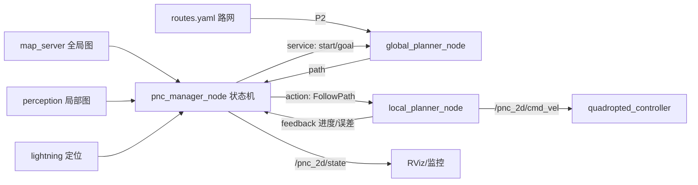

# pnc_2d 整改计划（冻结版）

> 状态：**已评审冻结（2026-09-21）**，按本计划实施。
> 范围：**只动 `src/pnc_2d`**。不碰 `nav2d`（那是官方 nav2 栈的位置）、不碰
> `perception` / `map_server` / `lightning`；`quadropted_controller`（步态/关节）只通过
> `/pnc_2d/cmd_vel` 交互。
> 相关文档：`pnc2d_dev_plan.md`（全局规划的算法细节）、`mpc_nmpc_guide.md`（MPC 原理与调参）、
> **`mpc_local_planner_plan.md`（P5 局部规划 = MPC 的详细方案）**。

---

## 0. 已定决策（本次评审）

| # | 问题 | 决策 |
|---|---|---|
| 1 | 节点拓扑 | **三节点**：`pnc_manager_node`（状态机）+ `global_planner_node` + `local_planner_node`，库层仍是一个 lib |
| 2 | 局部规划算法 | **本期不实现具体算法**，只交付抽象基类 + `NullLocalPlanner` + 工厂，保证链路可空跑 |
| 3 | MPC 形态 | **C++ 实现**（不用 rclpy 桥接 `scripts/mpc.py`；Python 那套保留作离线原型/基准） |
| 4 | 状态机风格 | **ROS 1 move_base 风格**：显式状态 + 转移表，纯库可单测 |
| 5 | 算法挂载 | **保持现状**：编译期工厂，通过 yaml（`planner.type` / `local.type`）切换；暂不上 pluginlib |
| 6 | 三节点 IPC（补充确认） | **manager→global 用 service**、**manager→local 用 action**、**local→底盘用话题**；详见 §4 |
| 7 | **新增需求：路网**（2026-09-21） | 路网作为**新 P2**；原 P2/P3/P4/P5 顺延为 P3/P4/P5/P6，详见 §6 P2 |
| 8 | 路网贴线严格度（2026-09-21） | **允许偏离**；`corridor_width: 0.0` 表示**严格贴线，遇障即停**（按通道逐条配置） |
| 9 | 路网画线工具（2026-09-21） | **Python 离线编辑器**（读 map.pgm 当底图 + 鼠标点选 → `routes.yaml`），不依赖 ROS |
| 10 | 路网目标输入（2026-09-21） | **只给坐标**（`/goal_pose`，自动投影到最近通道）；**站点**作为带语义的节点保留（type: station/charge/park，RViz 命名显示），不做“按站名下发目标”的话题；最后一段默认 **`hybrid`** |
| 11 | **局部规划算法**（2026-09-22） | **MPC（单套）+ 两套 profile（`route`/`free`）**。profile **数据驱动**：有走廊 ⇒ `route`，无 ⇒ `free`。求解器 **OSQP**（`ros-humble-osqp-vendor` 0.6.2，已装并验证） | 详 `mpc_local_planner_plan.md` §0 |
| 12 | 走廊严格度（2026-09-22） | **硬约束、不可违反**（方案 A）：路网模式遇障 ⇒ `BLOCKED` 停车；动态避障的自由度只在 `free` 模式 | 用户确认 |
| 13 | 避障能力（2026-09-22） | **v1 只做反应式**（当前帧距离场）；动态障碍速度/轨迹估计列为未来优化点（先“点云聚类 + CV-KF”） | 接口现在就预留 |
| 14 | 降级链（2026-09-22） | `MPC 成功 → 用` / `失败或超时 → 停车 + 报错`；**不做 pure_pursuit 兜底** | 停车比“凑合走”可预测 |
| 15 | 局部状态枚举与钩子（2026-09-22） | `LocalStatus` 用**独立枚举**；保留 `producesCmdVel()` | 用户确认 |
| 16 | 距离场来源（2026-09-22） | 软代价用 `grid_map/esdf_2d`（点云→栅格化+插值）；**硬碰撞一律用 `grid_map/occupancy_inflate_2d`**（esdf 抽点 0.20 m 且不含障碍本体）；自算 EDT 作兜底/一致性校验 | 详同文档 §3 |

**本期（整改）交付范围**：**P1 目录重排（✅）+ P2 路网（✅）+ P3 三类抽象齐备（✅）+ P4 状态机与三节点空跑（✅）—— 四阶段均已完成**。
局部规划算法已定案为 **MPC**（决策 11~16），详细方案与验收见 **`mpc_local_planner_plan.md`**；
恢复行为/重规划（P6）仍是之后的独立议题。

---

## 1. 现状问题清单（整改动因）

| # | 问题 | 证据 |
|---|---|---|
| P1 | 只有全局一条线，全局路径之后没有任何东西产生 `cmd_vel`（现靠 teleop 手控） | `src/global_planner_node.cpp` 只发 `/pnc_2d/global_path` + markers |
| P2 | 没有局部规划抽象：`planner_factory` 只管全局 | `include/pnc_2d/planner_factory.hpp` |
| P3 | 没有状态机：只有"收到 goal → 规划一次"的单动作 | 全包无 sm 相关代码 |
| P4 | 目录职责混放：节点壳、ROS 适配层（`src/ros_param_reader.hpp`）与算法实现同层；`scripts/`（离线原型）与 C++ 规划同层 | `find src/pnc_2d` |
| P5 | 包定位一眼看不出：配置只有 `global_planner.yaml`、launch 只有 `global_planner.launch.py` | `config/` `launch/` |
| P6 | 测试只够放全局，局部/状态机没有预留位置 | `test/test_astar_planner.cpp` |

---

## 2. 目标：对齐 ROS 1 的"三类 + 一个状态机"

| ROS 1 概念 | pnc_2d 抽象基类 | 实现 |
|---|---|---|
| `nav_core::BaseGlobalPlanner` | `core/global_planner.hpp`（**已有**） | `global/astar_planner`（已有）、**`global/route_network_planner`（P2 路网）**、`hybrid_astar`（后续议题） |
| `nav_core::BaseLocalPlanner` | `core/local_planner.hpp`（**新增**） | 本期只有 `local/null_local_planner`；算法见 §6 P5 |
| `nav_core::RecoveryBehavior` | `core/recovery_behavior.hpp`（**新增**） | 本期只留接口，不实现具体行为 |
| `move_base`（状态机） | `sm/manager_sm.hpp`（**新增**，纯库） | `nodes/pnc_manager_node`（薄壳） |

路网（P2）**不新增抽象**：`RouteNetworkPlanner` 就是 `GlobalPlanner` 的另一种实现，
通过现有 `planner.type: route_network` 切换。数据结构 `core/route_graph.hpp` 同时被
路网编辑器节点（P2）与将来的局部规划（贴线跟踪，P5）复用。

库层保持 **ROS-free**；ROS 只出现在 `src/nodes/` 的薄壳里（本包既定原则，见
`pnc2d_dev_plan.md` §4.1）。参数读取、地图转换、时间源等都以接口注入。

---

## 3. 目标目录树

```text
src/pnc_2d/
├── CMakeLists.txt                 # 1 个库(pnc_2d_planner) + 3 个可执行 + 测试
├── package.xml
├── msg/                          # ✅ 已落地
│   ├── PlannerStatus.msg         #   规划状态（失败上报，latched）
│   ├── LocalStatus.msg           # ★P4 局部状态（latched）
│   └── ManagerState.msg          # ★P4 状态机状态（latched）
├── srv/                          # ✅ 已落地
│   ├── SwitchPlanner.srv         #   运行时热切换算法（全局/局部公用）
│   └── PlanPath.srv              # ★P4 manager → global
├── action/                       # ★P4
│   └── FollowPath.action         #   manager → local（feedback + cancel）
├── include/pnc_2d/
│   ├── core/
│   │   ├── types.hpp  cost_map_2d.hpp  footprint_collision.hpp  clearance_field.hpp
│   │   ├── param_reader.hpp
│   │   ├── route_graph.hpp               # ★P2 路网数据结构（节点/边/属性 + yaml 读写）
│   │   ├── map_zones.hpp                 # ★P2 区域层（禁行/限速）
│   │   ├── local_distance_field.hpp      # ★P5 距离场适配（esdf 点云↔栅格 / 自算 EDT 兜底）
│   │   ├── global_planner.hpp            # 抽象类 A（已有）
│   │   ├── local_planner.hpp             # 抽象类 B ★P3 已交付
│   │   ├── recovery_behavior.hpp         # 抽象类 C ★P3 已交付
│   │   └── factory.hpp                   # 全局/局部/恢复 三套工厂 ★P3 已交付（合并原 planner_factory）
│   ├── global/
│   │   ├── astar_planner.hpp
│   │   └── route_network_planner.hpp     # ★P2 图上路由（Dijkstra + 折线拼接）
│   ├── local/
│   │   ├── null_local_planner.hpp        # ★P3 唯一“实现”：不做控制，只回报状态（已交付）
│   │   └── mpc_local_planner.hpp         # ★P5 MPC（差分模型 + OSQP 热启动 + 两套 profile）
│   ├── recovery/
│   │   └── recovery_interface_only.md    # 占位说明（接口在 core/）
│   ├── sm/
│   │   ├── events.hpp  states.hpp        # ★P4 已交付（事件集/状态集 + toString）
│   │   └── manager_sm.hpp                # 状态 + 转移表（无 ROS，可单测）★P4 已交付
├── src/
│   ├── core/  global/  local/  sm/       # 与 include 一一对应
│   └── nodes/                            # ★ROS 薄壳：只做 IO / 参数 / frame 校验
│       ├── global_planner_node.cpp       （已有，★P4 加 ~/plan_path 服务）
│       ├── local_planner_node.cpp        （★P4 已交付：action + 到达兜底）
│       ├── pnc_manager_node.cpp          （★P4 已交付）
│       └── ros_param_reader.hpp          （从 src/ 挪入）
├── config/
│   ├── pnc_2d.yaml                       # 总入口：话题/common/footprint/clear + 类型默认值 ★P3 已交付
│   ├── global_astar.yaml                 # 全局算法片段（已由 global_planner.yaml 改名）★P3 已交付
│   ├── route_network.yaml                # ★P2 路网参数（routes_file / goal_mode / reject_infeasible）
│   ├── local_null.yaml                   # 局部片段：local.type: none ★P3 已交付
│   └── local_mpc.yaml                    # ★P5 局部片段：MPC 权重/时域/距离场/超时
├── launch/
│   ├── pnc_2d.launch.py                  # ★P4 已交付：一键三节点（支持 ns / extra_config）
│   ├── global_planner.launch.py          # 保留：单跑调试 / 兼容现有 tmux 脚本
│   └── local_planner.launch.py           # ★P4 已交付
├── test/
│   ├── test_astar_planner.cpp            （现有，路径调整）
│   ├── test_route_network.cpp            # ★P2 路网：yaml 解析 / 单双向 / 断网无解 / 最短路
│   ├── test_clearance_field.cpp          # ★P3 EDT 距离场：暴力对拍 / 上下界 / 未知格策略 / 耗时
│   ├── test_factory.cpp                  # 三个工厂 + Null 实现 ★P3 已交付
│   └── test_state_machine.cpp            # 事件序列 → 状态断言（无 ROS）★P4 已交付（19 用例）
├── scripts/                              # 离线工具/原型（保留，非运行时代码）
│   └── mpc.py  nmpc.py  traj_utils.py  legacy/   # 算法离线原型
# 注：路网画线器 route_editor.py 随资产放在 map_server/scripts/（见其 README 操作手册）
└── doc/
    ├── pnc2d_restructure_plan.md         # 本文件
    ├── pnc2d_dev_plan.md                 # 全局规划细节（其 §7 布局在 P1 后需同步）
    └── mpc_nmpc_guide.md
```

**地图目录约定扩展**（与 `map_server` 同源，P2 新增第 4 个文件）：

```text
~/rcs/maps/<站点>/
├── map.yaml + map.pgm      # 2D 栅格（map_server）
├── global.pcd / 0.pcd      # 3D 点云（perception/lightning）
└── routes.yaml             # ★P2 路网（节点 + 带几何的通道）
```

---

## 4. 三节点之间的接口（三节点方案必须先定 IPC，这是新增决策点）

| 链路 | 建议机制 | 理由 |
|---|---|---|
| 外部目标 → manager | 订阅 `/goal_pose`（RViz 2D Goal Pose 直接可用） | 不改用户习惯 |
| manager → global | **service** `pnc_2d/plan_path`（`PlanPath.srv`：start/goal → status/path/stats） | 一次性、短时（实测 6~33 ms），同步返回最直观 |
| manager → local | **action** `pnc_2d/follow_path`（goal=path；feedback=progress/cross_track/status；可 cancel） | 长时任务，需要反馈与取消（状态机要用） |
| local → 底盘 | 话题 `/pnc_2d/cmd_vel` | 与 `quadropted_controller` 对接；**不是** `/robot1/cmd_vel`（留一层给安全/仲裁） |
| 各节点 → 监控 | 话题 `/pnc_2d/state`（状态机状态）、`/pnc_2d/local_status` | RViz/终端可看 |

✅ **已确认（2026-09-21）**：按下表实施。“服务 vs 动作”的选择己获用户确认。

---

## 5. 数据流（目标形态）



---

## 6. 阶段划分与验收

> 原则：每阶段**可编译、可验收、不夹带**；话题名全程保持 `/pnc_2d/*` 不变，外部脚本无需改。

### P1 纯目录搬移（零行为变化）✅ **已完成（2026-09-21）**
- 内容：`core/ global/ sm/(空) nodes/` 分层；`ros_param_reader.hpp` 归入 `nodes/`；CMake 路径同步。
  `planner_factory.hpp/.cpp` → `core/factory.hpp/.cpp`。
- 验收：`colcon build` 零错；`colcon test` **16/16**（0 失败）；同一目标重跑结果与搬移前
  **逐项一致**：6 点 / 33.39 m / 扩展 51319 / 发现 52696 / 峰值开放集 5169 /
  完整 footprint 检查 71034 / 窗口尝试 1（耗时 33.0→45.6 ms，机器负载波动，非行为差异）。
- 不做：不改任何算法逻辑、不改参数名、不改话题名。（均遵守）

### P2 路网（route network）：让机器沿预先画好的路线走 ← **新增需求（2026-09-21）** ✅ **核心已实现（2026-09-21）**

**目标**：在地图上引入"路网"（节点 + 带几何的通道），让机器可以沿人为画好的路线走。
本阶段交付 **几何与路由正确 + 可视化 + 可编辑**；"贴着线走"的控制属于 P5 局部规划。

**数据模型**（ROS-free，`core/route_graph.hpp`）：

```yaml
# ~/rcs/maps/<站点>/routes.yaml   ← 与 map.yaml 同目录（换图四件套同源）
frame_id: map
nodes:
  - {name: "A1", x: 1.00, y: 2.00, type: waypoint}   # waypoint|station|charge|park
  - {name: "C1", x: 8.20, y: 2.05, type: charge}
edges:
  - {from: "A1", to: "C1", one_way: false, speed_limit: 0.8, corridor_width: 0.6,
     polyline: [[1.0,2.0], [4.0,2.02], [8.2,2.05]]}    # 中间点用来画弧线/绕障
zones:                              # ★区域层（可选）
  - {name: "charging_hall", type: forbidden,
     polygon: [[10.0,-6.0], [12.0,-6.0], [12.0,-4.0], [10.0,-4.0]]}
  - {name: "door_north", type: speed_limit, value: 0.30, polygon: [...]}
```

**区域层（禁行 / 限速）—— 2026-09-21 已实现**：

| 类型 | 生效方式 | 谁消费 |
|---|---|---|
| `forbidden` | map_server 按**车体外接圆半径**膨胀后**烧进发布的全局图**（`max(地图, 覆盖层)`） | **全栈**：全局规划 / 路由 / 局部规划（P5）/ RViz / 将来 nav2 —— 不需要各自解析，不会漏 |
| `speed_limit` | 不烧入栅格（软约束）：解析 + 可视化 + `ZoneSet::inSpeedZone()` 查询 | 速度规划 / 局部规划（P5） |

- 为什么禁行区不“只给全局规划器”：局部规划如果不知道，就会出现“全局绕开了、局部冲进去”；
  统一注入到地图层是唯一不漏的做法。
- 开关：`zones.burn_into_map`（默认 true）/ `zones.inflate`（<0 = 自动用车体外接圆半径）。
- 实测：2×2 m 禁行区 + 0.472 m 膨胀 → 烧入 **3274 格**，发布的图占据从 12041 变 15315（一致）；
  禁行区压在通道上时，那条通道被判定“车体过不去”并 `WARN`（画错能早发现）。
- 画线器：`z` 进区域模式（左键加顶点 / 右键闭合），`t` 切 forbidden↔speed_limit，`-`/`=` 调限速值；
  编辑器自带的通行性检查**含禁行区膨胀**，与 map_server 同口径。

- 边 = **带几何的折线 + 属性**：`one_way`（单向）、`speed_limit`（m/s）、
  **`corridor_width`（允许横向偏离的半宽 [m]；`0.0` = 严格贴线，遇到障碍即停车）**。
  逐通道可调：宽通道可给 0.5~0.8，窄/危险段给 0.0。
- 节点分两类：拓扑连接点（waypoint）与**语义站点**（station/charge/park，可直接作目标或停靠点）。

**路由算法**（`global/route_network_planner.{hpp,cpp}`，实现现有 `GlobalPlanner` 抽象）：
1. 起点/终点 → 投影到最近的路网边（也支持直接用站点名作目标）；
2. 图上 **Dijkstra**，边代价 = 弧长 / `speed_limit`（可选 `turn_penalty` 惩罚急转弯）；
3. 拼接折线 → 输出 `PlanResult.path`，yaw 取折线切向。
- ⚠ **不做视线剪枝**：通道是人为画的，剪枝会切角、破坏原本设计的绕行；
  路网模式下 `path_prune_mode` 强制为 `collinear`（只合并共线点）。
- **可行性校验**：加载时逐边用现有 footprint 碰撞检查验证"这条通道真的能过"
  （0.70×0.40 + margin），不可行的边报警并标记，避免"画得漂亮却过不去"。

**到目标的最后一段**（`route_network.goal_mode`）：
- `strict`：只走到离目标最近的路网点（默认，先做）；
- `hybrid`：先沿路网到最近点，再用现有 A* 走完最后一段自由空间（可配开关，后做）。

**依赖**：yaml 解析用系统 `yaml-cpp`（与 `map_server` 同款，库仍然 ROS-free）。
⚠ 沿用 `map_server` 的教训：`as<bool>()` 对 `0/1` 会抛异常，`one_way` 这类字段
必须写**宽松解析**（0/1/true/false/yes/no 都收）。

**交付物与验收**：

| 交付 | 位置 | 验收 |
|---|---|---|
| 路网数据结构 + yaml 读写/校验 | `core/route_graph.{hpp,cpp}` | 单测：正常解析、坏文件报错、非法边（悬空节点 / 空折线）报错 |
| 路由规划器 + 工厂注册 | `global/route_network_planner.*`、`core/factory.cpp` | 单测：最短路正确、单向边反向无解、断网无解、站点名目标 |
| 参数 | `config/route_network.yaml` | 改 yaml `planner.type: route_network` 即切换（与现有机制一致） |
| 可视化 | 现有节点发 MarkerArray：全网节点球 + 边线 + 方向箭头 + 当前通路高亮 | RViz 一眼看清 |
| **画线编辑器** | `src/map_server/scripts/route_editor.py`（Python + matplotlib，**不依赖 ROS**） | 用现有地图画 3 条通道 → 保存 → 重开能加载回放；叠加地图位置正确 |
| 站点目标 | 路网里的 `type: station/charge/park` 节点 | 发坐标目标即可 |
| 换图联动 | 站点目录里的 `routes.yaml` 随地图一起切 | ✅ **已实现**（map_server 在 `load_map` 时一并重载路网，并清掉旧站点标记） |
| 资产归属 | 路网由 map_server 加载/校验/可视化 | ✅ **已实现**：`publish_routes` / `routes_file` / `topic_routes`（默认 `global_map/routes`）；**没有 routes.yaml 时只打 INFO，不报错**；
全网可视化在 map_server，当前通路高亮在 pnc_2d |

**不做（P2 边界）**：不做贴线控制（P5）；不做交叉口让行/优先级/多车调度（P6）；
不做 RViz 拖拽式图形编辑（用点选录制代替，拖拽交互成本高）。

**画线方式**（按落地顺序）：
1. **Python 离线编辑器（本期主推，已实现）**：`src/map_server/scripts/route_editor.py`
   —— 用 matplotlib 把
   `map.pgm` 当底图显示，鼠标左键点选画通道、右键结束一条，键盘完成/撑销/删除，
   `s` 保存成 `routes.yaml`；保存前用车体矩形沿每条通道扫一遍，把"过不去"的标红。
   优点：不依赖 ROS、改完即见、与此前 Python 侧碰撞校验的口径一致（已与 C++ 对齐验证过）。
   依赖：`.venv` 已有 matplotlib/numpy；yaml 写出需 `pyyaml`（没有就装，或手写 dump）。
2. 手写 / 脚本生成 yaml —— 批量或程序化生成时用。
3. 从已录制轨迹批处理提取（`data/traj.txt`、rosbag）→ 脚本转 yaml。
4. （以后）RViz 点选录制节点 / 拖拽编辑 / 栅格图骨架化自动提取。

**目标表达 / 最后一段（已定稿 2026-09-21）**：

| 项 | 结论 |
|---|---|
| 目标怎么给 | **只给坐标**（RViz 2D Goal Pose 直接点）→ 自动投影到最近通道；不需要“按站名下发目标”的话题 |
| 站点（station/charge/park） | **保留为语义节点**：存在路网里、RViz 用不同颜色 + 名字标签显示；将来（P6 任务调度）可用作命名目标 |
| 目标不在路网上（最后一段） | 默认 **`hybrid`**：沿路网走完主通道，最后一段用现有自由空间 A* 补到目标；
`strict`（只到最近通道上的投影点）作为可配项 |

> **换图联动：已实现**（2026-09-21）——原本计划推到 P4，但 map_server 本来就有
“按目录/服务换图”的入口，顺带把 `<地图目录>/routes.yaml` 一起载入更自然，
于是直接做了：换站点时路网一起换，且**没有 routes.yaml 时只提示不报错**。

**P2 实测记录（2026-09-21）**：

| 项 | 结果 |
|---|---|
| 单测 | `test_route_network` **11/11 通过**（解析/坏文件/端点吸附/投影插值/存取往返/不切角/单行绕行/不连通/严格vs混合/不可行拒绝/未载入） |
| 全包回归 | `colcon test` **0 失败**（26 个 gtest 用例 + 2 个 ctest 包装） |
| 不切角 | 起点 (3,1) → 终点 (9,3)：路径 **8.00 m**（若允许切角只要 6.32 m），转角点 B(9,1) 保留 |
| 单行绕行 | 同一通道上逆行：(7,1)→(3,1) 双向 **4.00 m**；把该通道改为单向 A→B 后 **28.00 m**（绕一整圈） |
| 严格 vs 混合 | 目标离通道 2 m 时：`strict` **2.00 m**（停在投影点）/ `hybrid` **4.00 m**（补到目标） |
| 不可行通道 | 通道中间横一道墙 → 可行 3 / 不可行 1；`reject_infeasible=true` 时报 `NO_PATH` 并说明“唯一通路经过 1 条车体过不去的通道” |
| 真实地图端到端 | 607×307 工厂地图：路网 3 节点 / 2 通道（单向 1，总长 30.71 m）→ 规划 **6 点 / 30.71 m / 0.0 ms / 仅 5 个图节点**（同图 A* 要 33 ms、5 万格）；逆向因单行返回 `NO_PATH` |
| RViz 可视化 | `route_nodes 3 / route_edges 2 / route_oneway 1 / route_active 2`（当前通路高亮，失败时发 `DELETE` 清掉残留） |
| Python 画线器 | 地图加载、可行性标红、节点按坐标复用（两条通道共享交点不会生成重复节点）、连通性/重复通道告警、属性（单向/限速/走廊）持久化与重载均验证通过 |

实现过程中修掉的两个自己引入的问题：
1. 画线器最初只按“点击时吸附”复用节点 → 程序化/回放场景下同一交点会生成两个同坐标节点、把路网断开；现改为结束通道时**按坐标兜底复用**，并在保存时做**连通性检查**。
2. 规划失败后 RViz 里上一次的通路高亮不消失（MarkerArray 不会自动删缺席标记）→ 对多出来的 id 显式发 `DELETE`。

**尚未做（不阻塞使用）**：站点语义在画线器里已支持（`k` 键切换 waypoint/station/charge/park），但还没做“按站名下发目标”的话题；换图联动（见上）；真实站点的路网需要你在 GUI 里画（我无法操作鼠标）。

### P3 抽象补齐（原 P2）✅ **已完成（2026-09-22）**
- 内容：`LocalPlanner` / `RecoveryBehavior` 接口；`NullLocalPlanner`；`factory.hpp`（三套工厂）；
  `config/pnc_2d.yaml`（含 `local.type: none`）；`test/test_factory.cpp`。
- 验收：新单测全绿；`local.type: none` 时全局规划行为与 P1 **完全一致**。
- 不做：不写任何真实局部算法。

**P3 实测记录（2026-09-22）**

| 项 | 结果 |
|---|---|
| 新增单测 | `test_factory.cpp` **15 用例全绿**（三套工厂 + Null 契约 + 基类多态使用 + `LocalStatus` 全值有名字） |
| 单测总量 | 5 个可执行文件 / **54 用例**，`colcon test-result` **0 failures**（含 EDT `test_clearance_field` 5 用例） |
| 新增 E2E | `test_launch_config.py` **17 项全绿**（见下） |
| E2E 回归 | `run_all.sh` 四组全绿：11+11 / 6 / 14 / 17 项 |
| 编译 | `-DCMAKE_BUILD_TYPE=Release` 通过，无新增 warning |

**交付的抽象（`include/pnc_2d/core/`）**

| 文件 | 内容 | 关键约定 |
|---|---|---|
| `local_planner.hpp` | `Twist2D` / `LocalStats` / `LocalPlanResult` / 抽象类 `LocalPlanner` | **模式由数据决定**：`setCorridor(nullptr)`=free，非空=route（`mode()`）；`producesCmdVel()` 声明"我会不会真的发速度"；`setDistanceField(LocalDistanceField*)` 只前向声明，P5 才实现 |
| `recovery_behavior.hpp` | `RecoveryContext`（清图/请求重规划/小幅移动/上次规划时长四个 `std::function` 注入）/ `RecoveryResult` / 抽象类 | 行为不直接碰 ROS，单测可用假函数断言"到底被调了什么" |
| `types.hpp` | 新增 `LocalStatus`（**独立于 `PlannerStatus`**）/ `RouteCorridor` / `DynamicObstacle` | 局部状态与全局失败语义不同，混用会让状态机写不清 |
| `factory.hpp` | `createPlanner` / `createLocalPlanner` / `createRecoveryBehavior` + 三个 `available*()` | 未知类型**返回 nullptr**，不静默回退；`availableRecoveries()` 本期**故意为空** |

**配置拆分（这次最容易出错的地方，已单独测）**

| 顺序 | 文件 | 内容 |
|---|---|---|
| 1 | `config/pnc_2d.yaml` | 总入口：话题/坐标系/`common.*`/`footprint.*`/`clear.*` + 类型默认值 |
| 2 | `config/local_<局部>.yaml` | 局部片段（现有 `local_null.yaml`） |
| 3 | `config/global_<算法>.yaml` | 算法片段，**自述 `planner.type`**（`global_planner.yaml` 已 `git mv` → `global_astar.yaml`） |
| 4 | `extra_config:=<路径>` | 追加片段，优先级最高 |
| 5 | `planner_type` / `local_type` | launch 参数，最终强制覆盖 |

**开发中踩到并已修/已记的 3 个坑**

1. **局部片段名不能按类型名拼**：`local.type: none` 对应的文件叫 `local_null.yaml`（yaml 写 `none` 更自然，实现类叫 `NullLocalPlanner`），拼字符串会去找 `local_none.yaml` → 已改成显式映射表 `LOCAL_FRAGMENT_BY_TYPE`。
2. **`install/` 只拷不删**：`install(DIRECTORY config ...)` 不会删掉改名前的 `global_planner.yaml`，残留副本会留在 `share/pnc_2d/config/` 里误导排查 → 已手工清理，并写进 README 的排查提示。
3. **同名节点连着起停时 DDS 有服务残影**：上一个用例的 `/global_planner` 刚被杀，`wait_for_service` 会立刻成功但异步调用石沉大海，看起来像"节点没起来"（实际日志显示它正常起来了）→ E2E-4 改成**重试 + 每轮重建客户端**，并在用例之间等 3 s。

### P4 状态机 + 三节点可空跑（原 P3）✅ **已完成（2026-09-22）**
- 内容：`sm/manager_sm`（ROS1 风格显式状态表）；
  `pnc_manager_node`（订阅 odom/map/goal → 调全局 service → 调局部 action → 发布状态）；
  `local_planner_node`（只跑 Null 实现，`/pnc_2d/cmd_vel` 输出恒为 0）；
  `launch/pnc_2d.launch.py`；`test/test_state_machine.cpp`；IPC 接口（§4）。
- 状态集（初版）：
  `Idle → Planning → Following → GoalReached`，异常分支 `Planning 失败 → Failed`、
  `Following 卡住/连续失败 → Recovering →（成功回 Following / 超限 → Failed）`。
  事件集：`GoalReceived / PlanOk / PlanFail / Blocked / Stuck / RecoveryDone / Cancel / OdomJump`。
- 验收：状态机单测全绿；仿真里点目标 → 日志与 `/pnc_2d/state` 出现
  `Idle→Planning→Following→GoalReached`；**不发任何速度指令**（Null 局部）。
- 不做：不做恢复行为的具体实现；不做重规划。

**P4 实测记录（2026-09-22）**

| 项 | 结果 |
|---|---|
| 新增单测 | `test_state_machine.cpp` **19 用例全绿**，其中一条**穷举 6 状态 × 11 事件 = 66 组**，断言"要么有条规则、要么明确拒绝且状态不变" |
| 单测总量 | 6 个可执行文件 / **73 用例**，`colcon test-result` **0 failures** |
| 新增 E2E | `test_three_node_smoke.py` **15 项全绿**：起三节点 → 点目标 → `IDLE→PLANNING→FOLLOWING→GOAL_REACHED`；地图外目标 → `FAILED` + 原因；`~/cancel` → `IDLE`；**`/pnc_2d/cmd_vel` 上零发布者** |
| E2E 回归 | `run_all.sh` 五组全绿：11+11 / 6 / 14 / 17 / 15 项 |
| 真机栈冒烟 | 根命名空间 `pnc_2d.launch.py planner_type:=route_network`：全局节点收到真实 latched 地图（607×307）+ 路网（10 节点/1 通道），三节点参数全部就位 |

**交付的接口（新增 msg/srv/action）**

| 接口 | 类型 | 用途 | 关键约定 |
|---|---|---|---|
| `msg/LocalStatus.msg` | 话题（latched） | 局部状态 + 命令 + 诊断 | `produces_cmd_vel` 一并报出去："cmd=0"到底是"停车"还是"我不管" |
| `msg/ManagerState.msg` | 话题（latched） | 状态机状态 + 目标 + 路径概况 + 统计 | 监控/"为什么车不动"的第一现场 |
| `srv/PlanPath.srv` | manager → global | 同步规划 | 响应与 `PlannerStatus` 同构，便于透传；`publish_result` 控制要不要发 latched 话题 |
| `action/FollowPath.action` | manager → local | 跟路径 | 四选一结束原因 `goal_reached / blocked / failed / canceled`；BLOCKED 要**连续超时**才结束 |

**P4 期间踩到并修掉的 6 个问题（都是"只有跑起来才暴露"的）**

1. **`ns:=` 会让按节点名写的 yaml 段落全部失效**（FQN 变 `/e2e/global_planner`，不再匹配 `global_planner:`，且**无任何报错**）。实测：同一文件根命名空间下生效 4 项参数，加 `ns` 后只剩 `/**` 那 2 项 → 配置段落统一改 `/**`（同文件只能有一个：YAML 顶层重复键互相覆盖）。
2. **测试里 `pkill -f <节点名>` 会杀掉用户正在跑的节点**（经查 `run_loc_online` 一直在后台发布 `/lightning/perception/pose`）→ 测试改为 `ns` + `extra_config` 隔离，只 `killpg` 自己的 launch。
3. **两个定位源交替喂位姿 → "跳变"刷屏 → 重规划风暴**（1 秒几百条 WARN）→ 加 `sm.odom_jump_cooldown`（默认 2 s）。
4. **`NullLocalPlanner` 永远不报"到达"** → action 永不结束、状态机永远停在 FOLLOWING → 到位判定改在**节点层**兜底（`remaining() ≤ local.goal_tolerance`），不依赖算法自报（任何算法忘了报，任务都会永远不结束）。
5. **`ServerGoalHandle::canceled()` 只在 `is_canceling()` 时合法**（否则抛 `UnawareGoalHandleError`）→ 服务端强制停止（`~/stop`、被新目标顶掉）只能走 `abort()`，但 `result.canceled=true` 标清"不是失败"；manager 判结果时**先看语义标志再看 action code**。
6. **`local.type` 原本写在 `global_planner:` 段下**（P3 遗留）→ 三节点拆分时移到局部段；用 `/**` 之后这类"放错段落静默失效"从根上不可能了。

**已知缺口（显式留给 P5）**

- **走廊没有端到端打通**：`PlanPath.srv` 的响应里还没有 `corridor_width[]` / `strict` 字段，manager 因此一律按自由空间模式下发 `FollowPath`。路径本身仍是路网算出来的（沿通道），缺的只是 MPC 用的"贴线"硬约束。P5 要加：`PlanResult` 加走廊信息 → `PlanPath.srv` 响应透出 → manager 填进 action goal。
- `local_mpc.*` 算法参数、距离场栅格化、`local.type` 热切换实测，都属于 P5。

### P5 局部规划算法 = **MPC**（2026-09-22 定案；详细方案见 `mpc_local_planner_plan.md`）

> **参考实现（2026-09-22 修订）**：以 **`/home/gmd/SLAM-PNC/PNC` 的 `MpcController`** 为准
> （阿克曼 + `(a,δ)` + 稀疏 OSQP），按差速底盘映射成 `(a,ω)`；
> 本仓库 `scripts/mpc.py` **不再作参考**（仅保留原型）。
> **P5.0 工具链 ✅ / P5.1 库层 + 单测 ✅（2026-09-22，实测见 `mpc_local_planner_plan.md` §5.1）**，
> P5.3 节点接线 / P5.4 仿真 E2E 待做。

- **算法**：单套 **MPC**（差分驱动、`N=15 @ dt=0.1 s`、控制 `[v, ω]`），求解器 **OSQP**（已装 0.6.2 + 热启动）。
- **两套 profile，数据驱动切换**：`setCorridor()` 非空 ⇒ `route`（走廊横向偏差**硬约束**，`corridor_width=0` 即严格贴线，遇障 `BLOCKED` 停车）；否则 `free`（跟踪全局路径 + 距离场软代价避障）。
- **距离场**：软代价用 `grid_map/esdf_2d`（点云 → 栅格化 + 双线性插值）；**硬碰撞判定一律用 `grid_map/occupancy_inflate_2d`**（esdf 抽点 0.20 m 且不含障碍本体）；自算 EDT（复用 `core/clearance_field.hpp`）作兜底/一致性校验。
- **降级**：`MPC 成功 → 用`；`失败/超时 → 停车 + 报错`；**不做 pure_pursuit 兜底**。
- **分步**：P5.1 库层 + 单测（走廊越界 1000 组 = 0 次、P99 < 20 ms）→ P5.2 与 `scripts/mpc.py` 逐指标对比（≤5%）→ P5.3 节点接线 + `local.type` 热切换 → P5.4 仿真 E2E（A→B 无碰撞、到点停车 ≤0.15 m、横向误差 < 10 cm、路网贴线 < 5 cm）。
- **不做**：动态障碍速度/轨迹估计（v1 反应式，接口先预留）、pure_pursuit 兜底、MINCO/SFC。
- 备注：`scripts/mpc.py` / `nmpc.py` 继续作**离线基准**，用于验证 C++ 实现数值一致。

### P6（可选）重规划管理器 / 恢复行为 / pluginlib（原 P5）
- 地图版本号 + episode/seq 隔离、卡住检测、失败兜底、恢复行为具体实现；
- 算法多了再考虑 pluginlib 动态挂载。

---

## 7. 风险与回退

| 风险 | 应对 |
|---|---|
| 搬移影响正在跑的 tmux 启动脚本（`go2_sim_bringup.json` 现跑 `ros2 launch pnc_2d global_planner.launch.py`） | P1 保留同名 launch；P4 完成后再切换成 `pnc_2d.launch.py` 并同步改 json |
| 三节点引入 IPC 复杂度（超时/取消/竞态） | 状态机集中管理超时与取消；IPC 用 service（短、同步）+ action（长、可取消） |
| 路网画得与地图不符（通道被障碍堵住 / 车体过不去） | 加载时逐边做 footprint 可行性校验并报警；RViz 叠加显示不可行边 |
| 路网与自由空间不一致（目标不在路网上） | `goal_mode: strict` 先只到路网点；需要时开 `hybrid` 用 A* 收尾 |
| 状态机与库层耦合 ROS | 状态机放 `sm/`（无 ROS），节点只做事件适配；用 `test_state_machine.cpp` 纯库验证 |
| 大改动期间功能不可用 | 每阶段独立提交；P1 为纯 `git mv`，可整体回退 |

---

## 8. 与其它包的边界

- `nav2d`：官方 nav2 栈（配置/启动），与本包**互不依赖、不共享代码**。
- `perception`：发动态局部图；本包只订阅，不改其接口。
- `map_server`：发静态全局图；本包只订阅。
- `quadropted_controller`：步态/关节控制器，订阅 `/pnc_2d/cmd_vel`（P5 起）。
- `pnc_3d`：3D 规划栈；建议其内部目录也采用同样的 `core/ + 算法目录 + nodes/` 约定（非本次范围）。
