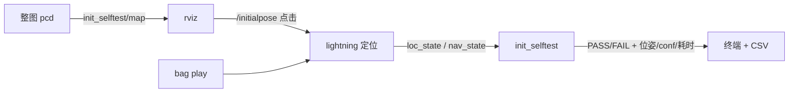

# lightning-lm 初始化定位自测工具

> 2026-09-07。用于验证“运行中从 rviz 下发初始位姿 → 定位是否正确初始化”的功能（与 `SearchAndInit` / 运行时重定位接口配套）。

## 1. 背景与目的
初始化定位的完整闭环发生在 lightning 在线定位节点内部：收到 `/initialpose` → `SetInitPose`（base→IMU 归算）→ `SearchAndInit`（NDT + xy/yaw 搜索 + 分数校验）→ 成功后置 `loc_state=GOOD`。为了不靠肉眼判断，自测程序扮演“裁判/看板”：

- 加载整张 pcd 地图发布给 rviz（便于看清场景、精准点击）；
- 检测 rviz 的 2D Pose Estimate 点击（`/initialpose`）开始计时；
- 订阅 `/lightning/loc_state` 与 `/lightning/nav_state`，自动给出 **PASS / FAIL**。

## 2. 角色分工
| 组件 | 角色 |
| --- | --- |
| `r41_online_loc.launch.py`（lightning 定位） | **被测对象**：加载地图、消费数据、执行初始化搜索、输出状态 |
| `ros2 bag play` | 输入（雷达/IMU 数据），另开终端手动放 |
| rviz | 人机接口：点 2D Pose Estimate 下发初值；显示整图/当前扫描 |
| `init_selftest` | 裁判/看板：加载整图、计时、判定、写 CSV |



## 3. 自测节点（init_selftest）
文件：
- 代码：`src/app/init_selftest.cc`
- 构建：`src/app/CMakeLists.txt`（新增 target `init_selftest`）
- 启动：`launch/init_selftest.launch.py`

### 参数（均可 launch/命令行覆盖）
| 参数 | 默认 | 说明 |
| --- | --- | --- |
| `map_pcd` | `""` | 整图 pcd 路径；空则不发布（改用 lightning 的 `/lightning/global_map`） |
| `loc_state_topic` | `/lightning/loc_state` | 定位状态 |
| `nav_state_topic` | `/lightning/nav_state` | 定位位姿/置信度 |
| `initial_pose_topic` | `/initialpose` | 检测 rviz 点击 |
| `current_scan_topic` | `/lightning/current_scan` | 当前扫描（frame=map，转发到 `init_selftest/scan`） |
| `timeout` | `5.0` | 判定超时(s) |
| `confirm_frames` | `3` | `GOOD` 需连续帧数（防抖动） |
| `csv` | `./data/init_selftest_result.csv` | 结果文件（空=仅终端） |

> ⚠️ **`/lightning/global_map` 现在默认是「增量」语义**（`system.global_map_pub_mode: incremental`）：
> 每次只发新出现的关键帧，靠 rviz 自己累积。所以**不能**再直接拿它当整图用。
> 需要完整点云时把 `global_map_pub_mode` 临时改成 `"full"`，或者直接用建图时存下来的
> `<map_root>/<map_id>/global.pcd`（`srv/save_map` 产出的那个）。

### 判定逻辑
点击（`/initialpose`）→ 记 t₀ → 观测：
- **PASS**：`loc_state==GOOD` 连续 `confirm_frames` 帧，输出收敛位姿(map/base_link)与 `confidence`、耗时；
- **FAIL**：超过 `timeout` 仍停在 `INITIALIZING/FAIL`（位姿错/超窗/分数不足）；或收到 `FAIL` 状态；
- 每次点击只判一次，可反复点击不同位置分别测试。

### 运行步骤
```bash
# 1) 终端1：启动定位（被测对象）
ros2 launch lightning r41_online_loc.launch.py

# 2) 终端2：回放数据
ros2 bag play <bag 路径>

# 3) 终端3：启动自测（整图 pcd）
ros2 run lightning init_selftest --ros-args -p map_pcd:=/home/gmd/r41_ws/data/r41iws0904_2d/global.pcd
#   或： ros2 launch lightning init_selftest.launch.py map_pcd:=<路径>

# 4) rviz：Fixed Frame=map，添加两个 PointCloud2：
#      /init_selftest/map    （整图，白色/灰）
#      /init_selftest/scan   （当前扫描，点亮色）或直接订阅 /lightning/current_scan
#    点 “2D Pose Estimate”，在正确位置发一个初值 → 观察 selftest 输出 PASS，且 scan 与整图贴合；
#    故意给偏 → 应 FAIL(timeout)，scan 与整图错开
```

## 4. scan 是否发布 / 对齐确认
- **scan 由 lightning 定位节点发布**（`/lightning/current_scan`，frame=`map`），条件是配置 `enable_lidar_loc_rviz: true` 且 `pub_tf: true`（r41 均已开）。自测节点只是把它**转发**到 `init_selftest/scan` 方便与整图叠看。
- 定位成功后（外部初值路径会把 LO 对齐到地图），scan 应与整图**严格对齐**——这是最直观的 PASS 判据；不对齐即说明初始化实际没锁对。
- **数值化校验**：自测节点加载整图时会建 kd-tree，PASS 时把当前 scan（0.2m 降采样）逐点到整图做最近邻，统计落在 0.5m 邻域内的比例，打印 `scan-map 对齐检查: …= xx%`（一般应 >90%，随场景/盲区浮动）。

## 5. 判定口径（与 SearchAndInit 的关系）
- 定位侧接受初值的门槛 = NDT `confidence ≥ min_init_confidence_`（r41=0.8，越大越严），并支持 3×3(xy) × 360°/10°(yaw) 粗搜 + `init_search_stop_conf_` 提前退出；
- 因此自测的 `GOOD` 即“初始化被确认”的信号；`INITIALIZING` 持续表示仍在搜索/未达标。
- **PASS 不代表一定在人眼点击处**，而是“搜索到地图中 conf 最高的可靠位姿”；若想同时核对“纠正后 vs 你点的位置”，可看日志里的输入位姿与 PASS 的输出位姿差多少。

## 6. 结果解读与调参
| 现象 | 含义 | 处理 |
| --- | --- | --- |
| 正确点位快速 PASS | 正常 | — |
| 正确点位被拒/超时 FAIL | 接受阈值过高或窗口不足 | 调低 `min_init_confidence_`；调大 `init_search_*` 窗口 |
| 错位/错 yaw 也给 PASS | 阈值过低/锁错 | 调高 `min_init_confidence_`、调高 `init_search_stop_conf_` |
| 一直 INITIALIZING | 没到 GOOD | 看 loc 日志 “manual init REJECTED, best conf=…” |

日志关键字：`[SELFTEST] 结果: PASS/FAIL …`、定位侧 `manual init accepted/rejected, best conf=…`。

## 7. 相关文件速查
- 运行时初值接口：`loc_system.cc`（`/initialpose` 订阅、`lightning/set_initpose` service、`/lightning/loc_state` 发布）
- 初始化搜索：`lidar_loc.h/.cc`（`SearchAndInit`/`RunNdt`/`FinishInit`）
- 配置：`config/r41_rk_slam.yaml`（`system.*`、`lidar_loc.init_*`）
