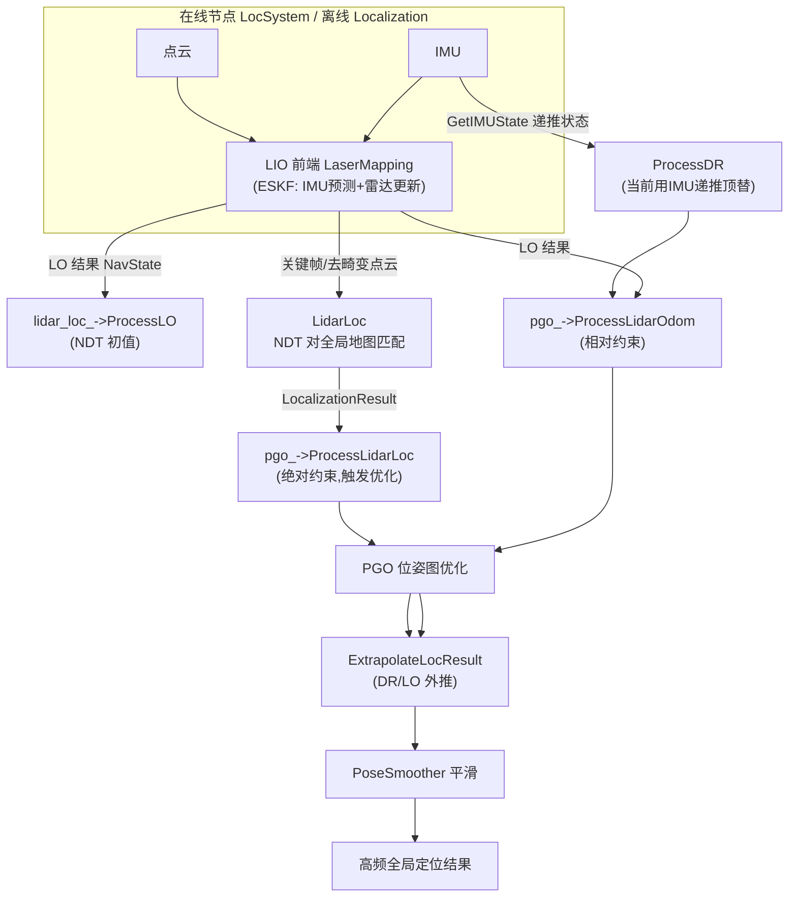
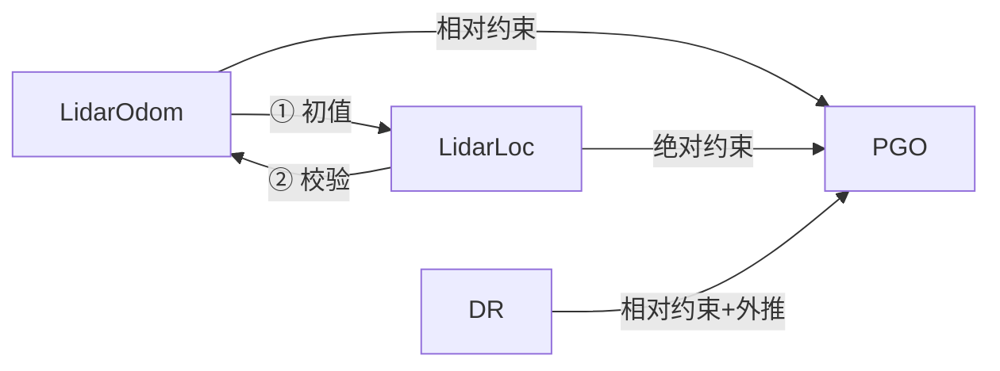
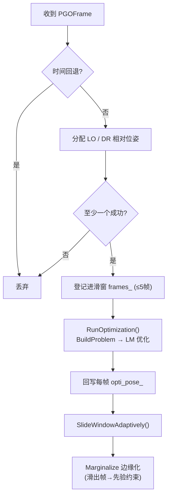

# lightning-lm 定位模块技术总结

> 本文档总结 lightning-lm（LiDAR-Inertial Odometry + 多源融合定位）的**定位模块**架构与核心概念，并梳理与"速度/里程计（DR）输入融合"相关的现状与开发计划。
> 定位模块代码位于 `src/core/localization/`，与建图模块（`src/core/system/slam.cc`）共用同一套 LIO 前端。

---

## 1 模块概述

### 1.1 定位模块的定位

lightning-lm 定位模块的目标：**在已知全局点云地图（TiledMap）上，实时输出高频、连续、全局一致的机器人位姿**。它融合三类异构信息源：

| 信息源 | 性质 | 频率 | 角色 |
| --- | --- | --- | --- |
| **LidarOdom（LO）** | 帧间**相对**位姿 | 高（每帧点云） | 连续递推 + 给 LidarLoc 提供初值 |
| **LidarLoc** | 对全局地图的**绝对**位姿 | 低（跳帧/关键帧） | 全局修正 + 触发 PGO |
| **DR** | 航迹推算**相对**位姿 | 高（IMU 频率） | 高频外推兜底 |

### 1.2 输入 / 输出

- **输入**：IMU（`sensor_msgs/Imu`）、点云（`PointCloud2` / `livox CustomMsg`）、（可选）外部初始化位姿、速度/odom（**当前休眠，见 §7**）
- **输出**：
  - 高频全局定位位姿（经 `PoseSmoother` 平滑后通过回调发布，与 IMU 同频）
  - TF（`map → odom → base`，由 `LocSystem` 的 `tf_broadcaster_` 发布）
  - 定位状态、失效告警（`localization_unusual_tag_`、`imu_interruption_tag_`）

---

## 2 模块组成与架构

### 2.1 目录结构

```
src/core/localization/
├── localization.h / .cc        # Localization：实时定位总控（编排 LIO/LidarLoc/PGO）
├── localization_result.h       # LocalizationResult：定位结果结构（LO/LidarLoc 共用）
├── lidar_loc/
│   ├── lidar_loc.h / .cc       # LidarLoc：NDT 对全局地图匹配 → 绝对位姿
└── pose_graph/
    ├── pgo.h / pgo.cc          # PGO：位姿图优化（对外门面，Pimpl）
    ├── pgo_impl.h / pgo_impl.cc# PGOImpl：滑窗优化、边缘化、队列
    ├── pose_extrapolator.h/.cc # PoseExtrapolator：位姿外推器
    └── smoother.h              # PoseSmoother：输出位姿平滑
```

依赖的前端与系统层：

```
src/core/lio/laser_mapping.h/.cc   # LIO 前端（LidarOdom 来源，ESKF + 帧-局部地图匹配）
src/core/system/loc_system.h/.cc   # LocSystem：在线 ROS2 节点（订阅 IMU/点云，发布 TF）
src/core/system/async_message_process.h  # 异步消息处理（激光里程计/定位两条流水线）
```

### 2.2 总体数据流



### 2.3 组件职责表

| 组件 | 类型 | 职责 |
| --- | --- | --- |
| `Localization` | 总控类 | 组装 LIO / LidarLoc / PGO；分配两条异步流水线（LO、LidarLoc） |
| `LaserMapping` | LIO 前端 | ESKF 前端，产出 LidarOdom（帧间相对位姿）与去畸变点云 |
| `LidarLoc` | NDT 定位 | 用 LO 做初值，NDT（OMP 并行）对全局地图 `TiledMap` 匹配，得绝对位姿与置信度 |
| `PGO` | 图优化 | 滑窗位姿图，融合 LO/DR 相对约束 + LidarLoc 绝对约束 + 边缘化先验 |
| `PoseExtrapolator` | 外推器 | 用 DR/LO 队列把结果外推到最新时刻 |
| `PoseSmoother` | 平滑器 | 对外输出位姿做低通平滑（带运动预测与跳变保护） |
| `MessageSync` | 同步器 | scan/imu/odom 按时间戳同步进 `MeasureGroup`（供 SLAM 前端用） |

---

## 3 核心概念：LidarOdom / LidarLoc / DR

### 3.1 三者本质区别

| | **LidarOdom (LO)** | **LidarLoc** | **DR** |
| --- | --- | --- | --- |
| 中文 | 激光里程计 | 激光定位 | 航迹推算 |
| 回答 | "相对上一帧走了多少" | "在全局地图哪里" | "相对上一时刻递推多少" |
| 性质 | 相对 / 增量 / 自系 | 绝对 / map 系 | 相对 / 增量 |
| 漂移 | 会累积漂移 | 无（相对地图） | 会累积漂移 |
| 频率 | 高（每帧） | 低（跳帧/关键帧） | 高（IMU 频率） |
| 来源 | LIO 前端 `LaserMapping` | `LidarLoc` NDT 全局匹配 | 当前 = **IMU 递推状态**（`lio_->GetIMUState()`） |
| 数据 | `NavState` | `LocalizationResult` | `NavState` |
| PGO 角色 | 帧间相对约束 | 绝对约束 + 触发优化 | 帧间相对约束 + 外推 |

类比：
- **LO** = 走路时"这一步迈了多远" —— 连续、会偏；
- **LidarLoc** = 抬头看路标确认位置 —— 准、但偶尔看错、频率低；
- **DR** = 闭眼按感觉估的步幅 —— 高频、但纯靠推算。

### 3.2 三者协作与互相校验



1. **① LO 给 LidarLoc 提供初值**：NDT 是迭代优化，用 LO 位姿作初始猜测，避免匹配到错误局部极值（`lidar_loc_->ProcessLO(lo_state)`）。
2. **② LidarLoc 校验 LO**：`lidar_loc_odom_delta_` 记录同刻两帧位姿差，超过 `lidar_loc_odom_th_ = 0.3m` 则 `lidar_loc_odom_error_normal_ = false`，认为 LO 异常；PGO 据此维护 `lidar_odom_valid_`。
3. **PGO 融合**：LidarLoc 绝对约束（定住全局）、LO/DR 相对约束（保持连续），图优化输出。

---

## 4 PGO —— 位姿图优化

### 4.1 定位与职责

`PGO`（`pose_graph/pgo.cc`）是定位模块的**融合核心**：用**滑窗位姿图 + 图优化**把多源信息揉成一份稳定结果。对外是门面类（Pimpl 模式，实现在 `PGOImpl`），所有接口加 `data_mutex_` 锁，多线程安全、内部单线程。

### 4.2 输入 / 输出

| 方法 | 数据 | 作用 |
| --- | --- | --- |
| `ProcessDR(NavState)` | DR 相对位姿 | 压入 `dr_pose_queue_`，触发 `PubResult` |
| `ProcessLidarOdom(NavState)` | LO 相对位姿 | 压入 `lidar_odom_pose_queue_`，维护 LO-DR 冲突检测 |
| `ProcessLidarLoc(LocalizationResult)` | 绝对位姿 | **触发一次 PGO 优化**；透传停车模式 |
| `SetGlobal/HighFrequency...Handle` | 回调 | 注册低频/高频输出回调 |

### 4.3 滑窗优化（`PGOImpl::AddPGOFrame`）



- **顶点**：每帧一个 SE3（`miao` 优化器，Levenberg-Marquardt）
- **边（约束）**：
  | 边 | 类型 | 性质 |
  | --- | --- | --- |
  | LidarLoc | `EdgeSE3Prior` | 绝对约束 |
  | LO / DR | `EdgeSE3` | 帧间相对约束 |
  | 边缘化先验 | `EdgeSE3Prior` | 绝对约束（信息保持） |

### 4.4 PGOFrame —— 一次优化的最小单元

保存该帧的全部观测：LidarLoc（绝对位姿、置信度、归一化权重、chi2、退化标志）、LidarOdom（相对位姿、权重）、DR（相对位姿、车体系速度 `dr_vel_b_`）、边缘化先验（pose+cov）。RTK 相关字段已注释停用。

### 4.5 高频输出链路 `PubResult()`

1. **定位异常检测**：`confidence_` 连续多次低于阈值 → `localization_unusual_tag_ = true`；
2. **外推 `ExtrapolateLocResult`**：以 LidarLoc 结果为基础，用 DR/LO 队列插值外推到最新时刻（同时检测 IMU 断流 → `imu_interruption_tag_`）；
3. **平滑**：`PoseSmoother` 平滑后经高频回调发出。

---

## 5 PoseSmoother —— 输出位姿平滑器

创建于 PGO 构造函数：`PoseSmoother(pgo::pgo_smooth_factor)`（factor = 0.01）。

```cpp
if (!impl_->dr_pose_queue_.empty())
    smoother_->PushDRPose(impl_->dr_pose_queue_.back().GetPose());  // 喂 DR 运动
smoother_->PushPose(result.pose_);      // 喂融合位姿
result.pose_ = smoother_->GetPose();    // 取平滑结果 → 对外发布
```

- **原理**：用 DR 帧间增量估计运动 `motion = DR[n-2]⁻¹·DR[n-1]`，预测 `pred = prev_output · motion`，再与测量加权混合（平移线性、姿态球面插值），factor 越小越平滑、越滞后。
- **自适应**：输出与输入差 >5m 直接跳变重置；>2m factor 调 0.2 快速收敛；正常回落 0.01。
- **DR 保护**：DR 跳变 >0.3m 清空 DR 队列、直通输出，防止被异常 DR 带偏。
- **代价**：滞后；只作用于对外输出，PGO 内部 `opti_pose_` 不过平滑器。

---

## 6 在线运行方式

- **在线节点**：`LocSystem`（`loc_system.cc`）创建 ROS2 节点，订阅 `imu_topic_` / `cloud_topic_` / `livox_topic_`，转调 `Localization::ProcessIMUMsg / ProcessLidarMsg / ProcessLivoxLidarMsg`，并发布 TF。
- **初始化**：`Localization::Init(yaml, global_map_path)` 依次创建 LIO（`LaserMapping`，`is_in_slam_mode_ = false`）、`LidarLoc`（NDT + 全局地图）、`PGO`，并注册高频输出回调。
- **两条异步流水线**（`async_message_process`）：
  - `LidarOdomProcCloud`：点云 → LIO → LO 状态 → 送 LidarLoc（初值）+ PGO（相对约束）；
  - `LidarLocProcCloud`：去畸变点云 → NDT → `LocalizationResult` → PGO（触发优化）。
- **手动重定位**：`SetExternalPose(q, t)` 支持外部设置初始位姿。

---

## 7 速度 / odom 输入现状与融合开发计划

### 7.1 现状（休眠的脚手架 + 临时替代）

| 环节 | 状态 |
| --- | --- |
| 内部结构 `Odom`、`MessageSync::ProcessOdom`、`MeasureGroup::odom_` | 已有，但 `ProcessOdom` 无人调用 |
| ESKF `ObsType::WHEEL_SPEED` + `wheelspeed_obs_func_` | 已有钩子，但从未赋值 |
| ROS2 odom 订阅（在线节点） | **缺失**（只订阅 IMU + 点云） |
| 离线 `AddOdomHandle`（bag 回放） | 被注释 |
| **DR 数据来源** | 当前用 **IMU 递推状态**顶替（`lio_->GetIMUState()` = `kf_imu_.GetX()`），真正的 odom DR（`ProcessOdomMsg`）被注释 |

> 即：真正的 DR（里程计/轮速推算）通路未启用，PGO 里的 DR 目前是"雷达修正过地基 + IMU 高频预测"的 ESKF 状态。

### 7.2 开发计划（摘要）

**目标**：接入标准 ROS2 速度消息（`nav_msgs/Odometry.twist` 或 `geometry_msgs/TwistStamped`），在 ESKF 中作为速度观测参与融合，并恢复真正的 DR 通路。

**Phase 0 确认输入**：消息类型 / 话题与坐标系（body vs world）/ 轮式平面还是足式三维。
**Phase 1 数据通路**：在线节点加 odom 订阅 → 转内部 `Odom` → `ProcessOdom` → `MeasureGroup::odom_`；恢复 `AddOdomHandle`。
**Phase 2 ESKF 观测泛化**：`CustomObservationModel` 的 `HTH_/HTr_` 由固定 6 维位姿推广到动态维度（速度观测 3 维作用于速度块），雷达 6 维分支保留。
**Phase 3 速度观测模型**：实现 `wheelspeed_obs_func_`，残差 $r = v_b^{meas} - R_{wb}^T v_w$，雅可比 $H = [0,\ -[R^T v_w]_\times,\ -R^T,\ 0]$；噪声矩阵化、野值门限。
**Phase 4 配置**：`vel_topic` / `vel_msg_type` / `vel_obs_dim` / `vel_noise` / `vel_outlier_th`。
**Phase 5 联调**：bag 回归对比、退化场景验证、断流测试、在线/离线一致性。
**Phase 6 可选**：角速度融合、高频融合、DR 走真正里程计。

---

## 8 与建图 / 回环的关系

| | **建图（SLAM）** | **定位（Loc）** | **回环（LoopClosing）** |
| --- | --- | --- | --- |
| 目标 | 建全局地图 | 在已知地图上定位 | 修正地图全局一致性 |
| 前端 | 同一 LIO | 同一 LIO | 关键帧 + NDT 回环匹配 |
| 后端 | 回环位姿图优化 | PGO 滑窗融合 | 位姿图优化 |
| 绝对修正来源 | 回环检测 | LidarLoc（全局地图匹配） | 历史帧匹配 |

- 定位阶段：`LaserMapping` 以 `is_in_slam_mode_ = false` 运行，只出 LO 不做建图后端；
- 回环在建图阶段修正地图，LidarLoc 在定位阶段利用（已修正的）地图做绝对匹配。

---

## 9 关键文件索引

| 文件 | 说明 |
| --- | --- |
| `src/core/localization/localization.h/.cc` | 定位总控、流水线编排 |
| `src/core/localization/localization_result.h` | 定位结果结构（含 LO/LidarLoc 校验字段） |
| `src/core/localization/lidar_loc/lidar_loc.h/.cc` | NDT 全局定位 |
| `src/core/localization/pose_graph/pgo.h/.cc` | PGO 门面 |
| `src/core/localization/pose_graph/pgo_impl.h/.cc` | PGO 实现（滑窗/边缘化/因子） |
| `src/core/localization/pose_graph/smoother.h` | 输出平滑器 |
| `src/core/localization/pose_graph/pose_extrapolator.h/.cc` | 外推器 |
| `src/core/lio/laser_mapping.h/.cc` | LIO 前端（LO 来源，ESKF） |
| `src/core/lio/eskf.h/.cc` | ESKF（预测/更新，含 WHEEL_SPEED 钩子） |
| `src/core/system/loc_system.h/.cc` | 在线 ROS2 定位节点 |
| `src/core/loop_closing/loop_closing.h/.cc` | 回环检测与优化（建图阶段） |
