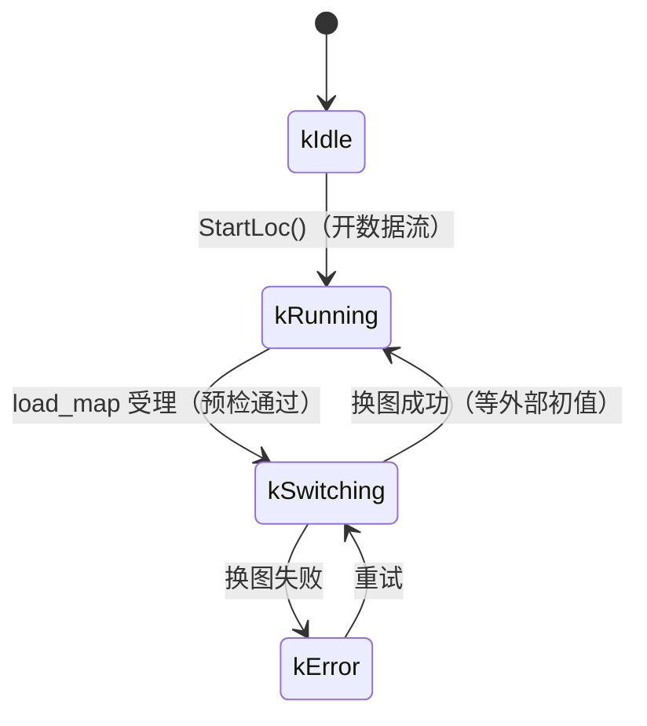

# 地图路径与运行时换图

本文说明定位（lightning loc）侧的两项能力：启动时指定地图、运行时切换地图。

---

## 1. 两个不同概念，不要混

| 概念 | 配置项 | 语义 | 谁来写 |
|---|---|---|---|
| **建图保存根目录** | `system.map_root` | 地图保存到 `<map_root>/<map_id>/` | SLAM 侧（`slam.cc::SaveMap`） |
| **定位加载目录** | `system.map_path` | 指向**某一张具体地图**（含 `index.txt` + `<id>.pcd`） | LOC 侧（`LocSystem::Init`） |

两者**都不是 ROS 参数**——代码用 `YAML_IO` / `YAML::LoadFile` 直接读文件，所以 `--ros-args -p` 无效。覆盖只能靠 launch 参数。

```yaml
system:
  # 建图保存根目录：留空 = $HOME/rcs/maps；支持 "~/" 前缀
  map_root: ""
  # 定位加载目录：用 "~/" 开头，避免写死 /home/<user>/... （多机共用同一份配置）
  # ⚠️ YAML 里必须加引号，否则 ~ 会被解析成 null
  map_path: "~/r41iws0916_factory"
```

**优先级**：
- `map_root`：launch `map_root:=` > yaml > `$HOME/rcs/maps` > `./data`
- `map_path`：launch `map_path:=` > yaml

`~` 展开由 `src/common/path_utils.h` 的 `path_utils::ResolveDir()` 统一处理。

---

## 2. 启动时指定地图

```bash
# 建图：默认存到 $HOME/rcs/maps/<map_id>/
ros2 launch lightning r41_online_slam.launch.py
ros2 launch lightning r41_online_slam.launch.py map_root:=/data/maps

# 定位：yaml 里已是 "~/r41iws0916_factory"
ros2 launch lightning r41_online_loc.launch.py
ros2 launch lightning r41_online_loc.launch.py map_path:=~/rcs/maps/factory_0917
ros2 launch lightning r41_online_loc.launch.py map_path:=/data/maps/factory_0917
```

启动前会做**目录级预检**：不存在/不可解析会直接报错退出，不再半初始化。

---

## 3. 运行时换图

### 3.1 状态机



| 值 | 名称 | 含义 |
|---|---|---|
| 0 | `kIdle` | `StartLoc()` 之前（很短） |
| 1 | `kRunning` | 数据流已开；定位是否就绪看 `loc_state` |
| 2 | `kSwitching` | 换图中：丢弃输入、拒绝 `initialpose` |
| 3 | `kError` | 地图不可用，需人工介入 |

**与 `lightning/loc_state` 的区别**（两个不同的话题，不要混）：

| 话题 | 类型 | 语义 |
|---|---|---|
| `lightning/loc_state` | `Int32`, Reliable | **定位算法**的状态：0=IDLE 1=INITIALIZING 2=GOOD 3=FOLLOWING_DR 4=FAIL |
| `lightning/map_state` | `Int32`, **latched** | **系统生命周期**的状态：见上表 |

`map_state` 用 `rclcpp::QoS(1).reliable().transient_local()` 发布（latched），所以后启动的订阅者（例如感知节点）也能立刻拿到当前值。

### 3.2 服务接口

```bash
ros2 service call /lightning/load_map lightning/srv/LoadMap \
  "{map_path: '/home/gmd/rcs/maps/factory_0917'}"
```

```
# LoadMap.srv
string map_path        # 目标地图目录；空 = 用 yaml 的 system.map_path
---
bool accepted          # 是否受理（受理≠完成；完成看 map_state）
string message
```

**`accepted=true` 只表示请求被受理**，此时换图才开始。完成与否看 `lightning/map_state`。

### 3.3 调用时序

```
上层                                     lightning loc 节点
 │
 ├─ ① /lightning/load_map ─────────────► [executor 线程] HandleLoadMap()
 │     map_path: "..."                     ├─ 已在换图？ → accepted=false
 │                                         ├─ 与当前地图相同？ → accepted=true（幂等）
 │                                         ├─ 预检（只读文件系统，不碰任何状态）
 │                                         │    ✗ → accepted=false，旧地图完全不受影响
 │                                         ├─ PublishMapState(kSwitching)   ← 关闸
 │                                         └─ 启动换图线程，立即返回
 │  ◄──── accepted=true, message ──────────┘
 │
 │                                        [换图线程] LoadMapThread()
 │                                         ├─ DrainInFlight()      ← 排空在途回调
 │                                         ├─ loc_->Init(yaml, dir) ← Finish 旧图 + 建新图 + 加载
 │                                         ├─ ResetRuntimeStateAfterMapSwitch()
 │                                         └─ PublishMapState(kRunning 或 kError)
 │
 ├─ ② 订阅 /lightning/map_state（latched）
 │
 ├─ ③ rviz2「2D Pose Estimate」或 /lightning/set_initpose
 │
 └─ ④ loc_state: INITIALIZING → GOOD
```

### 3.4 预检（必须在关闸之前）

```cpp
MapPrecheck PrecheckMapDir(const std::string &dir) const;
// ① index.txt 存在且可读
// ② 能解析出 ≥ 1 个区块
// ③ 每个 <id>.pcd 存在且非空
```

**不检查功能点（FP）**——本项目不使用 FP 初始化（`init_with_fp: false`）。

**为什么必须放在关闸之前**：如果预检不通过，请求直接返回，旧地图原封不动继续用。

### 3.5 并发设计：gate & drain

三个线程会碰 `loc_`：

| 线程 | 做什么 |
|---|---|
| executor（单线程） | `ProcessLidar` / `ProcessIMU` / 所有 service 回调 |
| 换图线程 | `loc_->Init()` 重建内部模块 |
| `AsyncMessageProcess` 线程 ×2 | LIO Run / GICP 定位 |

`LocSystem::Spin()` 用的是 `rclcpp::spin(node)` = **SingleThreadedExecutor**，所以 executor 上的回调彼此串行。真正的并发点是 **executor 线程 × 换图线程**。

```cpp
// 读者侧（ProcessLidar / ProcessIMU）
ProcessingScope scope(*this);
if (!scope.active()) return;         // 第一道判断不取锁：换图时微秒级返回
                                     // 第二道判断在取锁后：关闸与取锁之间可能已有窗口
loc_->ProcessLidarMsg(cloud);
PublishDebugAndRviz(cloud->header.stamp);   // ← 也在临界区内！

// 写者侧（换图线程）
phase_ = kSwitching;                 // ① 关闸：新读者全部走早退分支
{ std::lock_guard lk(mtx_processing_); }   // ② 排空在途读者，随即释放
loc_->Init(...);                     // ③ 慢操作，不持锁
phase_ = kRunning;                   // ④ 开闸
```

**两个关键点**：

1. **`PublishDebugAndRviz` 必须在临界区内**。它会访问 `loc_->GetLIO()` / `GetLidarLoc()` / `GetMap()`，这些成员在换图时会被重建；`std::shared_ptr` 的并发读写是数据竞争，可能拿到撕裂指针。

2. **换图必须异步**（独立线程）。若在 service 回调里同步换图，executor 会被占住几百毫秒到数秒，雷达/IMU 回调全停，DDS reader 队列堆积会**反过来把雷达驱动压降频**（10Hz→5Hz）——这正是 `doc/mapping_threading_refactor.md` 里踩过的坑。异步化之后：

   - executor 始终在转 → 雷达回调能进来 → `ProcessingScope` 早退（微秒级）→ 不反压驱动
   - 换图线程重建 `loc_` 内部时，临界区必然为空

**锁序**：`mtx_processing_` → `Localization::global_mutex_`（反向获取会死锁）

---

## 4. 换图后必须重新初始化

这是**刻意设计**的，不自动恢复：

```cpp
// Localization::Init 内部
lidar_loc_ = std::make_shared<LidarLoc>(lidar_loc_options);   // 全新对象
// → loc_inited_ = false、initial_pose_set_ = false（默认值）
// → init_with_fp_ = false
// → 自然停在“等外部位姿”
```

**不能沿用旧位姿**：旧位姿是旧地图坐标系下的，换图后没有意义。

给初值的两条路（都走同一个 `LocSystem::SetInitPose`）：

| 入口 | 说明 |
|---|---|
| rviz2「2D Pose Estimate」 | 发布到 `/initialpose`；z 自动取参考高度（`GetReferenceZ()`） |
| `/lightning/set_initpose` | Web 接口：`{x, y, z, yaw, z_valid}` |

**信号**：换图后下一帧点云会让 `LidarLoc` 走 `if (!loc_inited_)` 分支 → `SetInitRltState()` → **`loc_state` 从 `GOOD(2)` 变成 `INITIALIZING(1)`**。这就是"换图完成，请给初值"。

**`kSwitching` 期间 `SetInitPose` 会被拒绝**（打 WARN 并直接返回）：此时 `lidar_loc_` 正在被重建，初值落到旧实例还是新实例是不确定的。

> 注：`StartLoc()` 并**不**做初始化，只是把数据流闸门打开，让 LIO 先从第一帧跑起来，用户点 rviz 时温启动无延迟。

---

## 5. 感知侧联动

换图后 `map` 系定义变了，GridMap 里旧地图下累积的体素**全部失效**，必须清空，否则会出现"幽灵障碍"。

`perception_node` 订阅 `lightning/map_state`（latched），在 `kSwitching` / `kError` 时调用 `GridMap::resetMap()`：

```cpp
void GridMap::resetMap() {
  resetAllMapData();              // 清空 occupancy / inflate / 命中计数 / 标记位
  md_.has_ray_pose_ = false;      // ← 关键：旧 ray_pos_ 在新地图坐标系里无意义
  md_.has_cloud_ = false;
  md_.proj_points_cnt = 0;
  md_.ray_pos_.setZero();
  md_.ray_q_ = Eigen::Quaterniond::Identity();
  mp_.map_origin_idx_ = mp_.map_bound_min_idx_ + mp_.map_voxel_num_ / 2;
  updateMapBoundaryFromIndex();
}
```

复位 `has_ray_pose_` 后，`cloudCallback` 会重新等待一个 `sensor_pose` 才继续更新——这正是期望行为（复用 GridMap 原有的门控，不需要额外加状态）。

---

## 6. 实测数据

### 6.1 启动参数与 `~` 展开

| 输入 | 结果 |
|---|---|
| yaml `map_path: "~/r41iws0916_factory"` | → `/home/gmd/r41iws0916_factory`，`loaded chunks: 8` |
| `map_path:=~/r41iws0916_factory` | 同上 |
| `map_root` 默认（`HOME=/tmp/fakeuser`） | → `/tmp/fakeuser/rcs/maps` |
| `map_path:=~/other_map`（`HOME=/tmp/fakeuser`） | → `/tmp/fakeuser/other_map` |

### 6.2 预检拒绝（旧地图不受影响）

```
map_path := /tmp/does_not_exist
  → accepted=False, 'precheck failed: index.txt not found: /tmp/does_not_exist/index.txt'
  → map_state 仍为 1 (kRunning)

map_path := /tmp/fakeuser/other_map   (只有 index.txt，没有 .pcd)
  → accepted=False, 'precheck failed: missing chunk pcd: /tmp/fakeuser/other_map/7.pcd'
  → map_state 仍为 1 (kRunning)
```

### 6.3 成功换图

```
load_map accepted: /home/gmd/r41_ws/data/new_map (1 chunks verified)
load_map: switching to /home/gmd/r41_ws/data/new_map
loaded chunks: 1, fps: 1
runtime state reset after map switch (path / cached map pose / pending tf)
load_map: done in 53 ms -> ...; waiting for external init pose
```

**耗时 53 ms**，0 错误、0 崩溃。

### 6.4 感知栅格清空（模拟定位输出，12s 测试）

```
[t=5.0]  换图前 occupancy width = 7136
>>> publish map_state = 2 (kSwitching)
          [perception] loc: map switching -> clearing occupancy grid
          [GridMap] occupancy grid reset (map switched); waiting for a fresh sensor_pose
[t=7.0]  resetMap 后 occupancy width = 0
>>> publish map_state = 1 (kRunning)
[t=11.0] 重建后 occupancy width = 7136
```

---

## 7. 已知限制与后续

| 项 | 说明 |
|---|---|
| **换图失败不可回滚** | `Localization::Init` 会先 `Finish()` 旧图再建新图，所以中途失败就进 `kError`（无地图）。预检挡住了绝大多数情况（路径错、文件缺失）；"构建到临时对象再 swap" 可以做到真回滚，但工作量大，暂不做 |
| **`kSwitching` 期间调 `save_path`** | 仍可调用（只是导出轨迹），但轨迹已在 `ResetRuntimeStateAfterMapSwitch()` 中清空 |
| **换图期间的服务响应** | `HandleLoadMap` 只做预检 + 启线程（毫秒级），executor 不再被长时间占用 |
| **地图目录改名/搬动** | 安全。`index.txt` 里的 `path` 字段会被代码忽略，实际路径按 `<map_path>/<id>.pcd` 重算 |
| **FP（功能点）** | 本项目不使用（`init_with_fp: false`）；预检也不检查 FP |

### 相关的静默失败修复（同期完成）

| 位置 | 原问题 | 修复 |
|---|---|---|
| `MapChunk::LoadCloud()` | 丢弃 `pcl::io::loadPCDFile` 返回值并无条件 `loaded_=true` | 检查返回值，失败打 ERROR 且 `loaded_=false` |
| `TiledMap::LoadMapIndex()` | `static_chunks_` 为空也 `return true` | 空索引/全部区块不可用均返回 false |
| `LidarLoc::Init` / `Localization::Init` | 都忽略 `LoadMapIndex()` 的返回值 | 逐层向上传递，失败则初始化失败 |
| `Localization::Finish()` | 未判空 `lidar_loc_` | 加判空（失败后析构不再崩） |
| `PublishDebugAndRviz` | 未判空 `GetLIO()` / `GetLidarLoc()` / `GetMap()` | 加判空，半初始化状态不再段错误 |

---

## 附：相关文件

| 文件 | 改动 |
|---|---|
| `src/common/path_utils.h` | 新增：`ExpandUser` / `StripTrailingSlash` / `ResolveDir` |
| `src/core/system/loc_system.h/.cc` | `LocPhase` 状态机、`ProcessingScope` / `DrainInFlight`、`map_state` 发布、`HandleLoadMap` / `LoadMapThread` / `PrecheckMapDir` |
| `src/core/system/slam.h/.cc` | `ResolveMapRoot`、`map_root_`、`SaveMap` 改用 `map_root_` |
| `src/core/localization/localization.h/.cc` | `Init` 检查 `lidar_loc_->Init` 返回值；`Finish(save_dyn)` |
| `src/core/localization/lidar_loc/lidar_loc.h/.cc` | `Finish(save_dyn)`；`Init` 检查 `LoadMapIndex` 返回值 |
| `src/core/maps/tiled_map.cc` / `tiled_map_chunk.cc` | 静默失败修复 |
| `src/core/system/async_message_process.h` | `Quit()` 竞态修复（M0） |
| `srv/LoadMap.srv` | 新增 |
| `launch/r41_online_loc.launch.py` | 新增 `map_path` 参数 |
| `launch/r41_online_slam.launch.py` | 新增 `map_root` 参数 |
| `src/app/run_loc_online.cc` | 新增 `map_path` 参数；Init 失败即退出 |
| `src/app/run_slam_online.cc` | 新增 `map_root` 参数 |
| `src/pnc/perception/src/perception_node.cpp` | 订阅 `map_state`，换图时 `resetMap()` |
| `src/pnc/perception/src/grid_map.cpp` + `include/plan_env/grid_map.h` | 新增 `resetMap()` |
