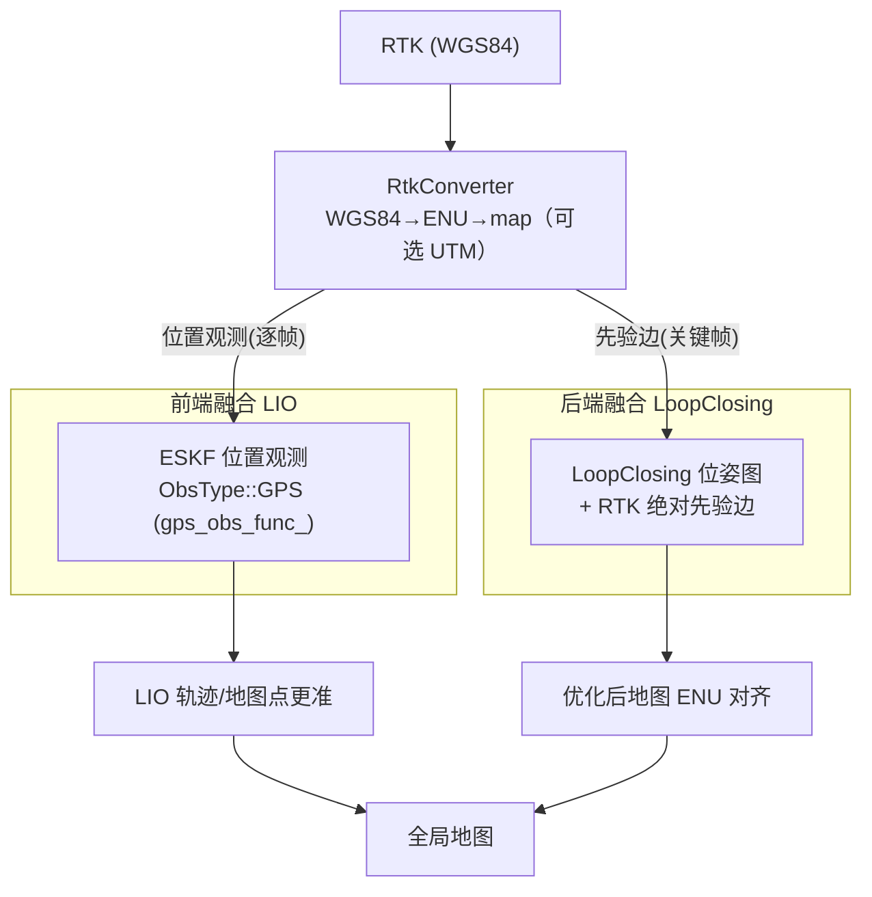

# lightning-lm 建图端 RTK 融合方案

> 文档编号：LIGHTNING-LOC-MAPPING-RTK-001
> 适用：建图（SLAM）阶段，`src/core/system/slam.cc` + `src/core/loop_closing/` + LIO 前端 `src/core/lio/`
> 关联：《multi_source_fusion_plan.md》（定位端多源融合总方案）、《localization_module_summary.md》
> 目标：在建图阶段融入 RTK，产出**全局一致且对齐到绝对地理坐标系（默认 ENU，可选 UTM）**的地图，并为定位端 RTK 融合提供坐标系标定。

---

## 1 目标与价值

### 1.1 为什么建图端要融 RTK

1. **地图质量 = 定位上限**：定位在已建地图上进行，建图时轨迹漂移 → 地图漂移 → 定位端无论怎么融合都继承误差；
2. **坐标系统一**：建图时融 RTK → 地图直接落在绝对地理坐标系（默认 ENU）→ 定位端 RTK 融合**免标定**（否则需 map↔绝对系 平移+朝向标定，标定误差会成为定位的系统性偏置）；
3. **不依赖回环**：大范围户外回环稀疏/失败时，RTK 是保证地图全局一致的关键手段。

### 1.2 本方案产出

| 产物 | 说明 |
| --- | --- |
| 全局一致的建图轨迹（含 RTK 绝对约束） | 抑制 LIO 长距离漂移 |
| **绝对地理对齐的全局地图** | 地图坐标系 = 绝对地理坐标系（默认 ENU，可选 UTM） |
| **坐标系标定文件** | `map_origin_enu`（map 原点经纬高）+ `map_enu_yaw`（map↔ENU 朝向），供定位端使用 |

---

## 2 总体架构：前端 + 后端两条路



| 路径 | 作用 | 适合 |
| --- | --- | --- |
| **前端（ESKF）** | 逐帧 RTK 位置观测，直接抑制 LIO 漂移，去畸变/地图点更准 | 简单、见效快 |
| **后端（LoopClosing）** | 关键帧 RTK 绝对先验边，优化后地图全局一致 + ENU 对齐（可选 UTM） | 与回环一起保证最终地图 |

> 建议**两者都做**：前端先压住轨迹漂移（建图轨迹更平顺），后端保证最终地图落到 ENU 系（供定位端）。

---

## 3 坐标系统一（核心）

### 3.1 流程

```
建图启动时：记录 map 原点经纬高（ENU 原点）与 map↔ENU 朝向 map_enu_yaw
RTK 每一帧：WGS84(lat,lon,h) → ENU(x,y,z)（原点处局部切平面）→ 旋转+平移 → map 系
地图输出时：地图即处于 map 系（= 绝对地理对齐，默认 ENU）
定位端：RTK → 用同一标定 → map 系，直接可用
```

> **坐标系选择：ENU（默认）/ UTM（可选）**
> 真实需求是"带已知原点的局部度量绝对系"：ENU 以 map 原点为 ENU 原点、无分区、无投影畸变、转换公式标准，故作为默认；仅当需与外部 UTM 系系统（车队/GIS）对接时才加 UTM↔ENU 转换层。

### 3.2 标定获取方式

| 方式 | 说明 |
| --- | --- |
| 建图起点固定 | 机器人静止在建图起点，取首帧 RTK fixed 解作为 ENU 原点（经纬高），建图初始朝向为 `map_enu_yaw` 基准 |
| 多点标定 | 采集 ≥2 个已知点的 RTK 与地图坐标，最小二乘解出平移+朝向（更准） |
| 已有标定文件 | 复用历史标定（同场地） |

### 3.3 高度处理

RTK 为椭球高，地图为相对高 → 高度通常**单独处理**：z 不参与融合或单独用相对高度约束；仅用 RTK 的平面（x,y）约束（推荐 `with_height=false` 时只用 2D）。

---

## 4 前端融合：ESKF GPS 位置观测

### 4.1 现状

`ESKF` 已有 `ObsType::GPS` + `gps_obs_func_` 钩子 + `Update(GPS)` 分发，但 `gps_obs_func_` 从未赋值（同轮速）。

### 4.2 观测模型（比轮速简单，无需泛化维度）

RTK 只约束**位置**，位置属于现有 6 维位姿观测空间（`pos+rot`），因此**直接用现有 `CustomObservationModel` 即可**：

- 残差：$r = p_{rtk}^{map} - p$
- 雅可比（对误差状态 $dx=[\delta p,\delta\theta,\delta v,\delta b_g]$）：$H = [\,I_3,\ 0_{3\times3},\ 0_{3\times3},\ 0_{3\times3}\,]$
- 填充（6 维位姿观测空间）：
  $$
  HTH = \begin{bmatrix} R_{xy}^{-1} & 0 \\ 0 & 0_{3\times3} \end{bmatrix},\qquad
  HTr = \begin{bmatrix} R_{xy}^{-1}\, r \\ 0_{3\times1} \end{bmatrix}
  $$
  其中 $R_{xy}$ 为 RTK 平面位置噪声（按解状态分档），调用 `kf_.Update(ObsType::GPS, 1.0)`（噪声已嵌进 HTH）。

### 4.3 改动点

- `laser_mapping.cc Init()`：注册 `eskf_options.gps_obs_func_ = [this](...){ GpsObsModel(s, obs); }`；
- 新增 `LaserMapping::GpsObsModel(...)`（参考 `ObsModel` 结构，改为位置残差）；
- 新增 `ProcessRtk(...)` 入口：`RtkConverter` 转换 → 写入最近 RTK 观测（带时间戳 + 解状态）；
- 在每次 `kf_.Update(LIDAR)` 前/后，若 RTK 新鲜（时间窗内 + fixed/float）→ `kf_.Update(ObsType::GPS, 1.0)`。

---

## 5 后端融合：LoopClosing 图加 RTK 绝对先验边

### 5.1 现状

`LoopClosing` 位姿图（`miao::Optimizer`，增量模式）现有：顶点（关键帧 SE3）+ 运动边（`info_motion_`）+ 回环边（`info_loops_`），无绝对约束。

### 5.2 改动点

1. **新增 RTK 输入**：`SlamSystem` 订阅 RTK → `RtkConverter` → 维护 RTK 队列（`LoopClosing` 或 `SlamSystem` 持有）；
2. **为关键帧匹配 RTK**：`HandleKF` 时按时间戳在 RTK 队列中插值/取最近帧（容差内），valid 则记录到该关键帧；
3. **`PoseOptimization()` 增加 RTK 先验边**：对每个有 RTK 的关键帧顶点加 `EdgeSE3Prior`（复用 `core/types/edge_se3_prior.h`），信息矩阵按解状态分档：
   - Fix：`info = diag(1/σ_fix², ..., 0, 0, 0)`（只约束位置）
   - Float：降权 `σ_float > σ_fix`
   - 单点：不加边
4. **野值**：与回环边一致，对 RTK 边做 chi2 判定（超阈值判 outlier，不加权/剔除）。

```cpp
// PoseOptimization() 中，伪代码
for (auto& kf : all_keyframes_) {
    auto v = kf_vert_[...];                     // 该关键帧顶点
    if (kf->HasRtk() && kf->RtkStatus() >= FIXED) {
        auto e = std::make_shared<miao::EdgeSE3Prior>();
        e->SetVertex(0, v);
        e->SetInformation(rtk_info_);           // 按解状态
        e->SetMeasurement(SE3(rtk_pose_map_));  // 位置先验
        optimizer_->AddEdge(e);
    }
}
```

---

## 6 数据通路与配置

### 6.1 数据通路

```
RTK 话题 → SlamSystem 订阅 → RtkConverter (WGS84→ENU→map)
         ├─ 前端：LaserMapping::ProcessRtk → ESKF GPS 观测
         └─ 后端：LoopClosing RTK 队列 → 关键帧先验边
```

### 6.2 配置（config yaml 新增）

```yaml
common:
  rtk_topic: "/gps_rtk_fix"        # RTK 话题

mapping_rtk:
  enable: true
  use_frontend: true               # 前端 ESKF GPS 观测
  use_backend: true                # 后端 LoopClosing RTK 边
  with_height: false               # 是否用 RTK 高度（默认只平面）
  map_origin_enu: [0.0, 0.0, 0.0]   # map 原点经纬高（或从首帧 RTK 自动记录）
  map_enu_yaw: 0.0                 # map↔ENU 朝向（度）
  fix_noise_xy: [0.02, 0.02]       # 固定解平面噪声 m
  float_noise_xy: [0.20, 0.20]     # 浮点解平面噪声 m
  rtk_time_tolerance: 0.5          # RTK 与关键帧时间容差 s
  rtk_outlier_chi2_th: 10.0        # RTK 边野值阈值
```

---

## 7 里程碑

| 里程碑 | 内容 | 预估 |
| --- | --- | --- |
| R1 | `RtkConverter`（WGS84→ENU→map + 标定读取） | 1 天 |
| R2 | 前端：ESKF GPS 观测（`GpsObsModel` + 注册 + 配置） | 1 天 |
| R3 | 后端：`LoopClosing` RTK 队列 + 先验边 + 野值 | 1.5 天 |
| R4 | 坐标系标定落地（map_origin_enu/yaw 自动记录 + 标定文件输出） | 1 天 |
| R5 | 建图回归 + ENU 对齐验证 + 定位端衔接验证 | 2 天 |

---

## 8 验证

| 场景 | 验证点 |
| --- | --- |
| 大范围直线 | LIO 轨迹漂移被 RTK 抑制（与真值对比） |
| 无回环区域 | 地图仍全局一致（RTK 兜底） |
| 地图 ENU 对齐 | 地图角点 ENU 坐标与真值偏差 ≤ 分米级 |
| 定位端衔接 | 用同一标定，定位端 RTK 直接可用、无偏置 |
| RTK 断流/单点 | 自动降级（前端不加观测、后端不加边），无跳变 |
| 回环 + RTK 联合 | 地图平滑一致，无明显褶皱 |

---

## 9 风险清单

| 风险 | 影响 | 对策 |
| --- | --- | --- |
| map↔ENU 标定不准 | 地图系统性偏置 | 多点标定 + 首帧 fixed 自动记录 |
| RTK 多路径/遮挡 | 先验边拉偏 | chi2 野值 + 解状态分档 + 时间容差 |
| 前端 RTK 与回环后端冲突 | 轨迹被两头拉扯 | 前端用较小权重（长时趋势），后端负责最终一致 |
| 高度基准不一致 | z 方向偏置 | `with_height=false` 只用平面 |
| 无 RTK 场地 | 退化 | 开关 `enable: false`，回归原流程 |

---

## 10 与定位端方案的衔接

建图端 RTK 融合的**关键产物**（ENU 对齐地图 + 标定文件）直接服务于定位端多源融合：

```
建图端（本方案）                         定位端（multi_source_fusion_plan.md）
RTK + LIO + 回环 → ENU 对齐地图  ──▶  LidarLoc + LO + 轮速DR + RTK
坐标系标定文件 (map_origin_enu/yaw) ──▶ RTK 免标定、无系统偏置
```

> 两方案共用同一个 `RtkConverter` 与坐标系标定，建议作为公共模块（`src/common/` 或 `src/io/`）抽取，避免两处重复实现。
