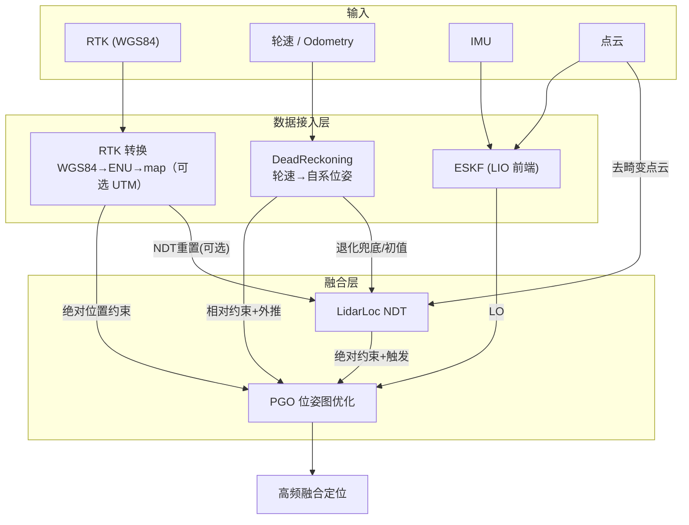
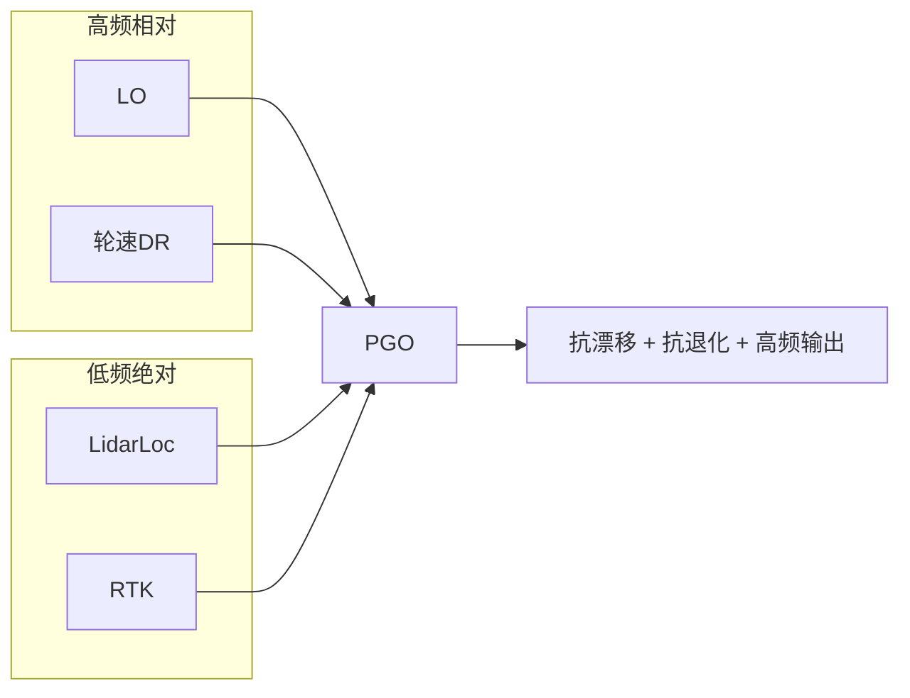

# lightning-lm 定位多源融合方案（轮速 DR + RTK + LO + LidarLoc）

> 文档编号：LIGHTNING-LOC-MULTISOURCE-001
> 关联文档：
> - 《localization_module_summary.md》— 定位模块整体
> - 《wheel_speed_dr_fusion_plan.md》— 轮速 DR 详细方案（本方案引用其细节）
> 目标：在定位端实现**四源融合**，最大化定位在退化/遮挡场景下的鲁棒性。

---

## 1 目标与总体架构

### 1.1 目标

把**轮速计（DR）**与 **RTK** 同时接入定位端，与现有的 **LidarLoc**、**LidarOdom（LO）** 一起，形成"两相对 + 两绝对"的四源融合定位：

| 信息源 | 性质 | 频率 | 角色 |
| --- | --- | --- | --- |
| **LidarLoc** | 绝对（map 系） | 低 | 绝对约束 + 触发 PGO |
| **LO（LidarOdom）** | 相对 | 高 | 帧间约束 + 连续递推 |
| **轮速 DR**（新增） | 相对 | 高 | 帧间约束 + 高频外推（打滑/退化兜底） |
| **RTK**（新增） | 绝对（ENU→map，可选 UTM） | 低 | 绝对位置约束 + 抗漂移/重定位 |

### 1.2 总体架构



### 1.3 分工逻辑



- **高频**（LO + 轮速 DR）：负责连续外推与帧间约束；
- **低频绝对**（LidarLoc + RTK）：负责把整体位姿"锚定"在全局，抑制漂移；
- 失效互补：LidarLoc 退化 → RTK 顶位置；LO/DR 断流 → 另一个顶高频。

---

## 2 分层设计

### 2.1 数据接入层（新增/恢复）

| 项 | 内容 | 状态 |
| --- | --- | --- |
| 轮速订阅 | `LocSystem` 订阅 `nav_msgs/Odometry` / `TwistStamped` | 新增 |
| RTK 订阅 | 订阅 RTK 消息（如 `gps_rtk_fix` / `navsatfix`） | 新增 |
| `ProcessOdomMsg` | 恢复 `Localization` 中被注释的入口 | 恢复 |
| `ProcessRtkMsg` | 新增 RTK 入口（含解状态/时间戳） | 新增 |

### 2.2 中间层

| 模块 | 职责 | 参考 |
| --- | --- | --- |
| `DeadReckoning` | 轮速→自系位姿积分（含打滑/断流/停车保护） | 《wheel_speed_dr_fusion_plan.md》 |
| `RtkConverter`（新增） | WGS84→ENU→map 坐标转换 + 解状态分档 | §3.2 |
| 组合 DR（可选） | 轮速平移 + IMU 姿态 | 同轮速方案 |

### 2.3 融合层（恢复 PGO 脚手架）

- **恢复** `PGOFrame` 的 RTK 字段（`rtk_set_/valid_/inlier_/pose_/chi2_`）；
- **恢复** `PGOImpl` 的 `gps_queue_` + `gps_edges_`（`EdgeSE3Prior`）+ chi2 野值判定 + `FOLLOWING_GNSS` 状态；
- 噪声用现成 `rtk_fix_noise_` / `rtk_other_noise_`（按解状态分档）；
- 轮速 DR 走现有 `ProcessDR`（PGO 无需改，只换输入源）。

### 2.4 前端（可选，建图质量优化）

- 轮速 → ESKF 速度观测（`ObsType::WHEEL_SPEED`）；
- RTK → ESKF 位置观测（`ObsType::GPS`）。
- 收益主要在**建图阶段**（抑制 LIO 轨迹漂移 → 地图更准）。

---

## 3 关键技术点

### 3.1 轮速 DR（摘要）

积分模型、打滑/断流/停车保护、组合 DR（IMU 姿态）详见《wheel_speed_dr_fusion_plan.md》。

### 3.2 RTK 坐标转换（最大难点）

> 坐标系默认用 **ENU**（map 原点即 ENU 原点，无分区、无投影畸变、公式标准）；仅需对接外部 UTM 系系统时才加 UTM↔ENU 转换。

```
WGS84(lat,lon,h) ──▶ ENU(x,y,z) ──(平移+旋转)──▶ map 系
```

- 需要：**map 原点经纬高（ENU 原点）** + **map↔ENU 的 yaw 标定**（建图时记录/标定）；
- 高度：RTK 椭球高 vs 地图相对高，通常 z 单独处理或置 0；
- 外参：代码中 `gps2lidar_/lidar2gps_` 注释"未启用"正是此类标定，可复用思路；
- 建议用 GeographicLib/PROJ 做经纬度↔ENU 转换（或手写标准公式）；仅当对接外部 UTM 系系统时再加 UTM↔ENU 转换层。

### 3.3 解状态分档与野值

| 解类型 | 精度 | 处理 |
| --- | --- | --- |
| Fix | 厘米级 | 正常使用（`rtk_fix_noise_`） |
| Float | 分米级 | 降权（`rtk_other_noise_`） |
| 单点 | 米级 | 不用或仅作重定位粗值 |

- 野值：恢复 chi2 检验（`rtk_outlier_th`）+ 跳变检测；
- 时延：RTK 低频 + 接收机时延 → 时间同步/插值（`rtk_interp_time_error` 字段已有）。

### 3.4 时间同步

复用 `MessageSync` 思路：各信息源按时间戳缓冲、与扫描/IMU 对齐（max_time_diff 容差）；轮速、RTK 都进 `Localization` 各自的队列。

---

## 4 统一开发计划（里程碑）

| 里程碑 | 内容 | 预估 |
| --- | --- | --- |
| **M1** | 数据接入：轮速 + RTK 订阅、`ProcessOdomMsg`/`ProcessRtkMsg` | 1 天 |
| **M2** | `DeadReckoning`（轮速→DR）+ 配置 + 停车判定 | 1 天 |
| **M3** | RTK 转换（`RtkConverter` + map 原点标定） | 1.5 天 |
| **M4** | 恢复 PGO RTK 边 + chi2 野值 + `FOLLOWING_GNSS` | 1.5 天 |
| **M5** | 组合 DR + LidarLoc 重置/退化兜底（轮速 & RTK） | 1 天 |
| **M6** | 鲁棒（打滑/遮挡/断流）+ 调参 + 回归验证 | 2~3 天 |

> 各里程碑可独立交付：先 M1+M2（轮速 DR 生效），再 M3+M4（RTK 生效），最后 M5+M6 增强。

---

## 5 验证方案

| 场景 | 验证点 |
| --- | --- |
| 正常室外 | 开/关轮速&RTK 轨迹一致（回归） |
| 长廊/空旷（LidarLoc 退化） | RTK 顶位置，漂移显著减小 |
| 打滑 | 轮速 DR 跳变被抑制 |
| 遮挡/多路径（RTK 跳变） | chi2 野值剔除，不污染融合 |
| RTK 断流（隧道） | 回退 LO+轮速 DR，无跳变 |
| 重定位 | 开局用 RTK 快速初始化 |
| 在线/离线一致 | bag 回放 vs 在线 |

---

## 6 风险清单

| 风险 | 影响 | 对策 |
| --- | --- | --- |
| map↔ENU 标定不准 | RTK 绝对约束偏置 | 建图时记录原点 + 多基准点标定 |
| 四源同时异常 | 定位失效 | 分级状态（`FOLLOWING_*`）+ 失效告警 |
| 双份 DR 冲突 | 队列不一致 | 轮速 DR 与 IMU DR 严格互斥（§轮速方案） |
| RTK 与 LidarLoc 分歧 | 优化被拉偏 | 各自 chi2/权重，PGO 统一判定 inlier |
| 足式无轮速 | 方案不适用 | 腿式里程计/body 速度替代，接口复用 |
