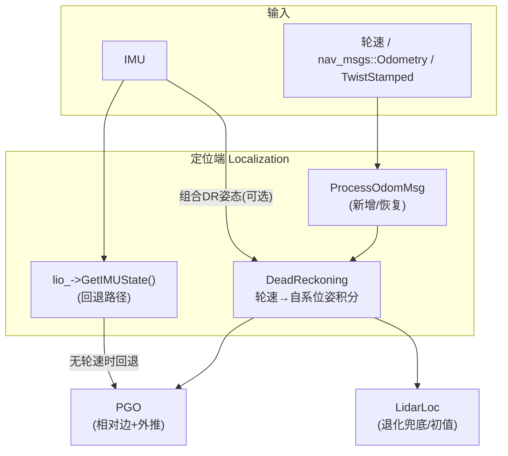

# 定位端轮速融合（轮速 → 真·DR）可落地方案

> 文档编号：LIGHTNING-LOC-WHEELDR-001
> 适用：lightning-lm 定位模块（`src/core/localization/`）
> 关联：《localization_module_summary.md》、ESKF 速度观测开发计划

---

## 0 目标与范围

### 0.1 目标

在**定位端**接入标准 ROS2 轮速/里程计消息，把当前"用 IMU 递推状态顶替的 DR"替换为**真正的轮速航迹推算（Dead Reckoning）**，让 PGO 的相对约束与高频外推更可靠，提升退化场景（LidarLoc 失效、长廊/空旷地）下的盲走精度。

### 0.2 范围

- ✅ 新增 `DeadReckoning` 模块（轮速 → 自系位姿积分器）
- ✅ 打通 ROS2 订阅 → `Localization::ProcessOdomMsg` → `ProcessDR` 数据通路
- ✅ 配置项、停车判定、打滑/断流鲁棒
- ✅ 组合 DR（轮速平移 + IMU 姿态）作为推荐增强
- ⛔ 不含 ESKF 前端速度观测（那是另一条计划，见关联文档）
- ⛔ 不含 PGO 图内速度因子（位姿图不需要直接消费速度）

---

## 1 总体架构



### 1.1 核心思路

| 信息源 | 平移 | 姿态 | 结论 |
| --- | --- | --- | --- |
| 纯轮速 DR | ✅ 稳（不二次积分） | ❌ 只有 yaw | 平移好、姿态差 |
| 纯 IMU 递推（现状） | ❌ 漂（加速度二重积分） | ✅ 好 | 姿态好、平移漂 |
| **组合 DR（推荐）** | ✅ 轮速 | ✅ IMU | 两者互补 |

---

## 2 DeadReckoning 类设计

### 2.1 新增文件

```
src/core/localization/dr/
├── dead_reckoning.h   # 类声明
└── dead_reckoning.cc  # 实现
```

### 2.2 类骨架（dead_reckoning.h）

```cpp
#pragma once
#include "common/nav_state.h"
#include "common/odom.h"

namespace lightning::loc {

/// 轮速航迹推算：输入 body 系速度，输出自系连续位姿
class DeadReckoning {
   public:
    struct Options {
        double wheel_base_ = 0.42;     // 轮距 m（标定）
        double wheel_radius_ = 0.10;   // 轮半径 m
        double pose_scale_ = 1.0;      // 里程比例因子（标定）
        double park_vel_th_ = 0.05;    // 停车线速度阈值 m/s
        double park_omega_th_ = 0.05;  // 停车角速度阈值 rad/s
        double slip_delta_th_ = 0.30;  // 单步平移跳变阈值（打滑检测）m
        double max_dt_ = 0.5;          // 允许最大积分步长 s（断流保护）
    };

    explicit DeadReckoning(Options options = {});

    /// 更新：输入 body 系线速度/角速度，返回是否成功
    bool Update(double timestamp, const Vec3d& linear, const Vec3d& angular);

    /// 获取当前自系位姿（pos/rot/vel + timestamp）
    NavState GetState() const;

    bool IsParking() const { return is_parking_; }
    void Reset();

   private:
    Options options_;
    double last_stamp_ = 0;
    bool inited_ = false;
    bool is_parking_ = false;
    NavState state_;  // 自系位姿
};

}  // namespace lightning::loc
```

### 2.3 积分模型（dead_reckoning.cc）

差速底盘：轮速只给出 body 系 $v_x$ 与 $\omega_z$，按平面运动积分：

$$
\Delta\theta = \omega_z\, dt,\qquad
\Delta p_b = [\,v_x\, dt,\ 0,\ 0\,],\qquad
R \leftarrow R \cdot \mathrm{Exp}([0,0,\Delta\theta]),\qquad
p \leftarrow p + R\, \Delta p_b
$$

```cpp
bool DeadReckoning::Update(double t, const Vec3d& linear, const Vec3d& angular) {
    if (!inited_) {
        last_stamp_ = t;
        state_.timestamp_ = t;
        state_.SetVel(linear);
        inited_ = true;
        return true;
    }

    const double dt = t - last_stamp_;
    if (dt <= 0) return false;
    if (dt > options_.max_dt_) {  // 断流保护：跳过积分
        last_stamp_ = t;
        return false;
    }
    last_stamp_ = t;

    const double vx = linear.x();
    const double wz = angular.z();

    // 打滑/跳变保护
    if (std::fabs(vx * dt) > options_.slip_delta_th_) {
        LOG(WARNING) << "DR slip detected, skip step, vx*dt=" << vx * dt;
        return false;
    }

    const Vec3d delta_p_body(vx * dt, 0.0, 0.0);
    state_.rot_ = state_.rot_ * SO3::exp(Vec3d(0, 0, wz * dt));
    state_.pos_ += state_.rot_ * delta_p_body;
    state_.timestamp_ = t;
    state_.SetVel(linear);

    // 停车判定
    is_parking_ = linear.norm() < options_.park_vel_th_ &&
                  angular.norm() < options_.park_omega_th_;
    return true;
}
```

> 说明：DR 位姿为**自系**（相对累积），与 LO 一样由 PGO 做帧间相对化，因此无需绝对初值。

---

## 3 数据通路接线

### 3.1 在线节点订阅（`loc_system.h/.cc`）

在 `LocSystem` 增加：

```cpp
std::string odom_topic_;
rclcpp::Subscription<nav_msgs::msg::Odometry>::SharedPtr odom_sub_ = nullptr;
// （如用 TwistStamped 则对应类型）
```

订阅回调转调 `loc_->ProcessOdomMsg(msg)`（QoS 用传感器数据 QoS，`best_effort` 视发布端而定）。

### 3.2 定位总控恢复 `ProcessOdomMsg`（`localization.h/.cc`）

新增成员：`std::shared_ptr<DeadReckoning> dr_;` 与 `bool enable_dr_`、`bool use_imu_rot_`。

```cpp
void Localization::ProcessOdomMsg(const nav_msgs::msg::Odometry::SharedPtr odom_msg) {
    UL lock(global_mutex_);
    if (!enable_dr_ || dr_ == nullptr) return;

    const double t = ToSec(odom_msg->header.stamp);
    if (last_odom_time_ > 0 && t < last_odom_time_) {
        LOG(WARNING) << "odom 时间回退: " << t - last_odom_time_;
        return;
    }
    last_odom_time_ = t;

    Vec3d linear(odom_msg->twist.twist.linear.x,
                 odom_msg->twist.twist.linear.y,
                 odom_msg->twist.twist.linear.z);
    Vec3d angular(odom_msg->twist.twist.angular.x,
                  odom_msg->twist.twist.angular.y,
                  odom_msg->twist.twist.angular.z);

    if (!dr_->Update(t, linear, angular)) return;
    auto dr_state = dr_->GetState();

    // 组合 DR（可选）：平移用轮速，姿态用 IMU 递推
    if (use_imu_rot_) {
        auto imu_state = lio_->GetIMUState();
        dr_state.SetPose(SE3(imu_state.rot_, dr_state.pos_));
    }

    lidar_loc_->ProcessDR(dr_state);
    pgo_->ProcessDR(dr_state);
}
```

### 3.3 与 `ProcessIMUMsg` 的切换逻辑

`ProcessIMUMsg` 中把 DR 喂入改为**条件化**——有轮速则跳过 IMU 顶替（避免双份 DR 冲突）：

```cpp
// 原：auto dr_state = lio_->GetIMUState(); ... ProcessDR(dr_state);
// 改：
if (!enable_dr_ || dr_state_odom_fresh == false) {
    auto dr_state = lio_->GetIMUState();
    if (dr_state.pose_is_ok_) {
        lidar_loc_->ProcessDR(dr_state);
        pgo_->ProcessDR(dr_state);
    }
}
```

其中 `dr_state_odom_fresh` 表示最近一次轮速 DR 是否在 `max_dt_` 内更新过（断流回退）。

### 3.4 停车判定透传

`DeadReckoning::IsParking()` → 写入 `dr_state.is_parking_`，PGO 已有 `is_parking_` 透传（停车时不优化、透传结果）。

---

## 4 配置项（config yaml 新增 `dr:` 段）

```yaml
common:
  imu_topic: "/livox/imu"
  livox_lidar_topic: "/livox/lidar"
  odom_topic: "/odom"            # 新增：轮速/里程计话题
  odom_msg_type: "odometry"      # odometry | twist_stamped

dr:
  enable: true                   # 总开关
  use_imu_rot: true              # 组合DR：IMU姿态 + 轮速平移
  wheel_base: 0.42               # 轮距 m（标定）
  wheel_radius: 0.10             # 轮半径 m
  pose_scale: 1.0                # 里程比例因子（标定）
  park_vel_th: 0.05              # 停车判定阈值
  park_omega_th: 0.05
  slip_delta_th: 0.30            # 打滑单步跳变阈值
  max_dt: 0.5                    # 断流回退阈值
```

`Localization::LoadParams` / `LocSystem::Init` 解析并写入 `DeadReckoning::Options` 与 `Localization::Options`。

---

## 5 鲁棒性设计

| 场景 | 检测 | 处理 |
| --- | --- | --- |
| 打滑/悬空 | 单步 `|v_x·dt| > slip_delta_th_` | 跳过该步积分；PGO 端 `dr_pose_inc_th`、Smoother 0.3m 跳变保护兜底 |
| 轮速断流 | `dt > max_dt_` | 回退 IMU 递推 DR；`imu_interruption_tag_` 逻辑保持 |
| 时间回退 | `t < last_odom_time_` | 丢弃该帧并告警 |
| 轮速含噪 | v/ω 噪声配置 | 组合 DR 时姿态由 IMU 提供，轮速只贡献平移，天然降噪 |
| 标定不准 | 直线往返比对 | `pose_scale_` 标定；预留 `wheel_base_/wheel_radius_` 在线可调 |

---

## 6 与 PGO / LidarLoc 的衔接

- **PGO**：无需改代码，只换 DR 输入源。可顺带把 `PGOImpl::Options` 中 `dr_pos_noise` / `dr_ang_noise` 调小（轮速 DR 比 IMU 递推可信），并把 `PGOFrame::dr_vel_b_` 用作速度一致性校验（可选增强）。
- **LidarLoc**：`ProcessDR` 已有 `dr_pose_queue_` 与 `AssignDRPose`，喂入轮速 DR 后，NDT 初值/退化兜底（`FOLLOWING_DR`）直接受益。

---

## 7 测试与验证

### 7.1 单元测试（`test/`）
- 直线积分：恒定 v_x → 位置线性增长，yaw 不变
- 圆弧积分：恒定 v_x + ω_z → 圆形轨迹，半径 = v_x/ω_z
- 标定：pose_scale 对总里程的影响
- 打滑：单步跳变被跳过
- 断流：超过 max_dt 后状态不跳变

### 7.2 集成验证（bag 回放）
1. 同一 bag，开/关轮速 DR 各跑一遍，对比轨迹：
   - 正常场景应基本一致（回归）
   - 长廊/空旷退化场景，轮速 DR 盲走误差应显著减小
2. 断流测试：模拟轮速断流，确认回退 IMU 递推、无跳变
3. 停车测试：静止时 `is_parking_` 生效、位姿稳定

### 7.3 在线/离线一致性
- `LocSystem` 在线跑与 bag 回放结果一致

---

## 8 里程碑

| 里程碑 | 内容 | 预估 |
| --- | --- | --- |
| M1 | 数据通路：订阅 → `ProcessOdomMsg` → `ProcessDR` | 1 天 |
| M2 | `DeadReckoning` 积分器 + 配置 + 停车判定 | 1 天 |
| M3 | 组合 DR（IMU 姿态 + 轮速平移） | 0.5 天 |
| M4 | 打滑/断流鲁棒 + 参数调优 | 1 天 |
| M5 | 回归验证 + 退化场景对比 | 1~2 天 |

---

## 9 风险清单

| 风险 | 影响 | 对策 |
| --- | --- | --- |
| 轮速标定不准 | DR 平移比例误差 | `pose_scale_` 标定；直线往返校准 |
| 打滑误判/漏判 | 单帧位姿跳变 | 跳变阈值 + PGO/Smoother 双重保护 |
| 轮速与激光时基不同步 | 相对边误差 | max_dt 容差 + 时间戳对齐（参考 `MessageSync`） |
| 双份 DR 冲突（IMU+轮速同时喂） | PGO 队列混入不一致数据 | §3.3 切换逻辑严格互斥 |
| 足式机器人无轮速 | 方案不适用 | 改用腿式里程计/body 速度估计，接口复用 |
